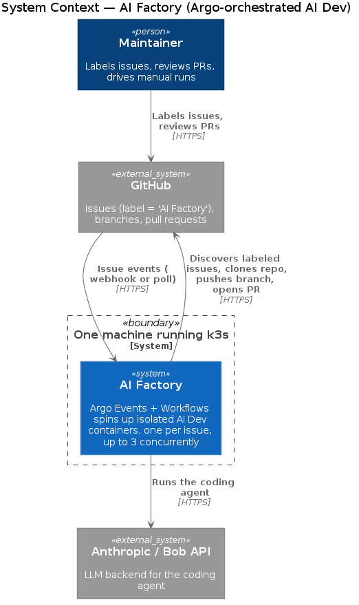
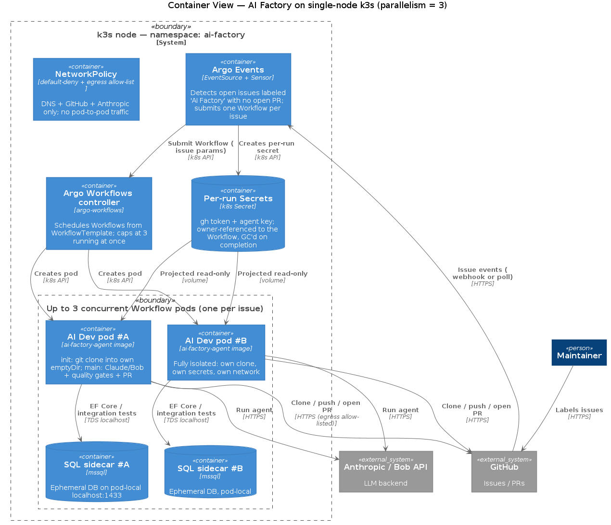
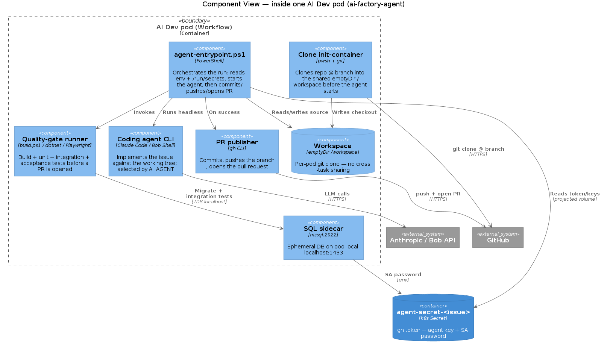
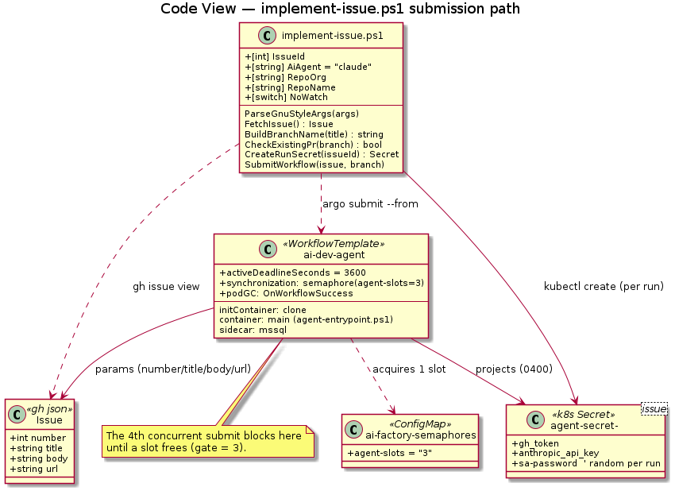
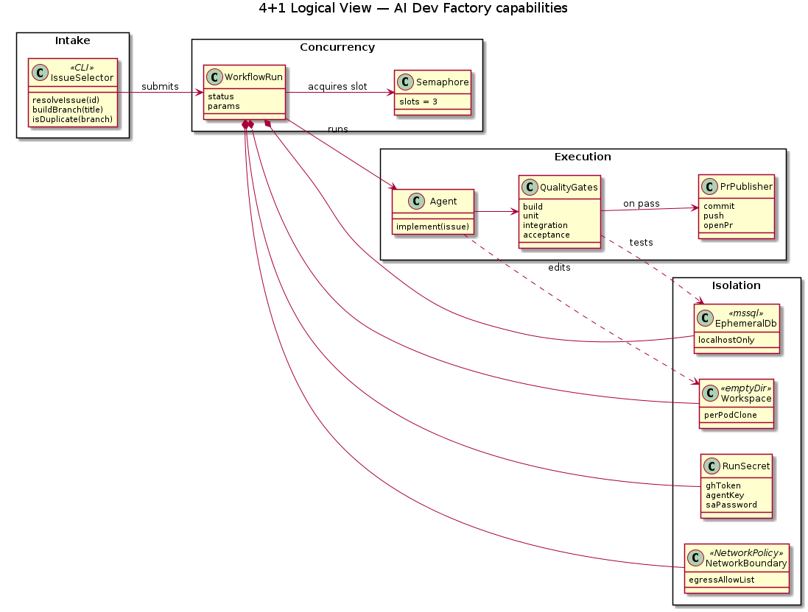
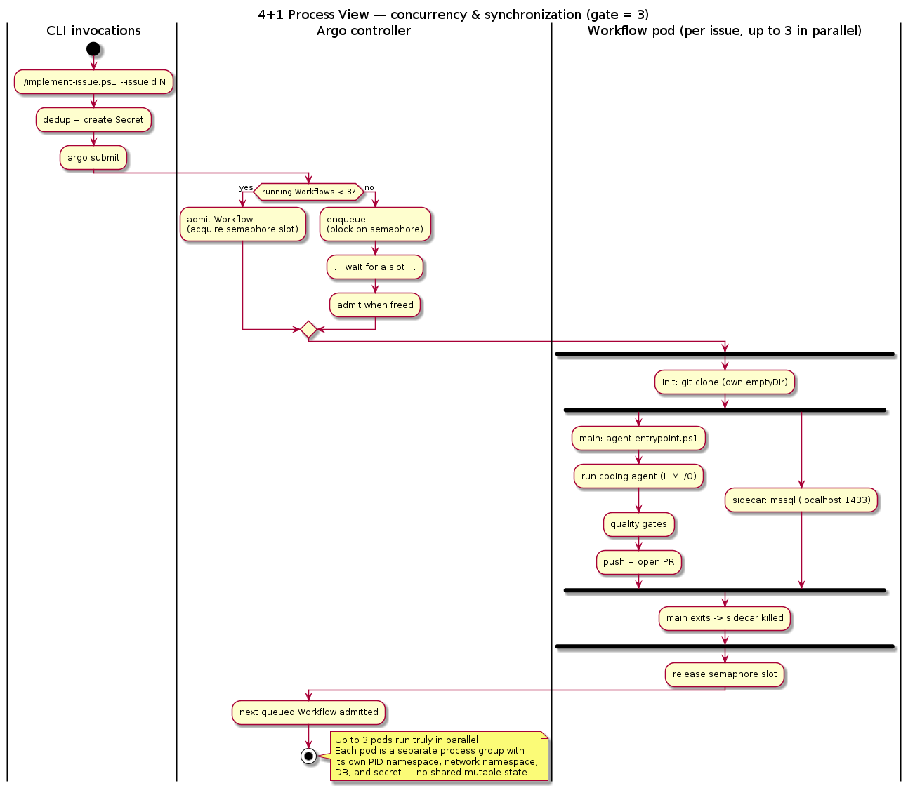
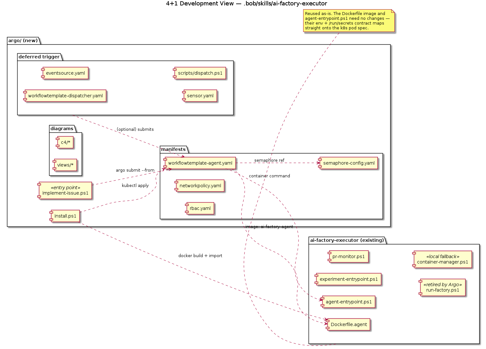
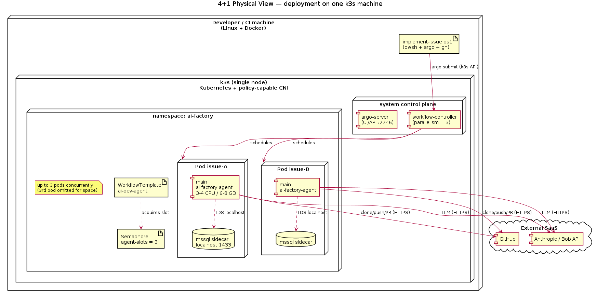
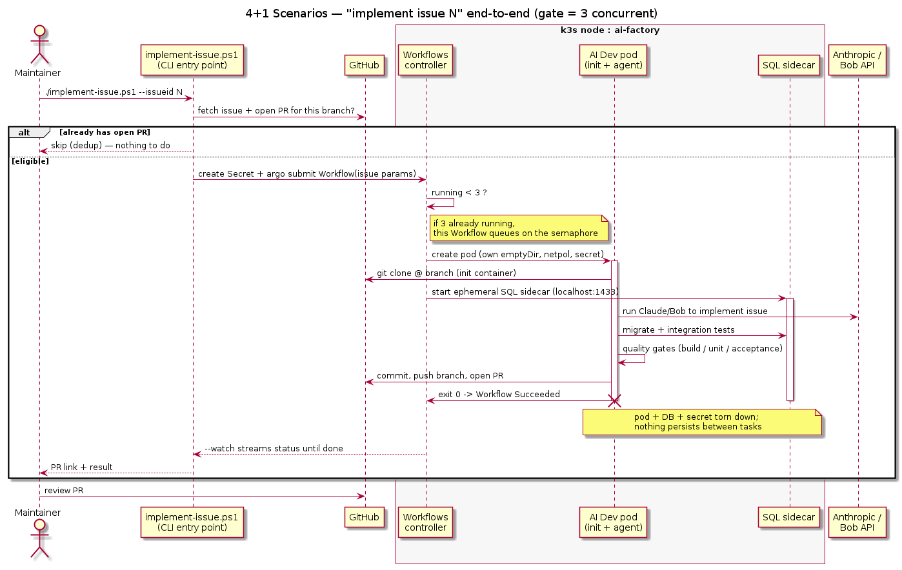

# AI Dev Factory on Argo (single-node k3s)

Runs up to **3 concurrent, fully isolated AI Dev containers** — one Argo Workflow
per GitHub issue labeled `AI Factory`. Replaces the sequential
`run-factory.ps1` loop. Design + rationale: `../ARGO-ORCHESTRATION-PLAN.md`.

## Entry point
```powershell
./implement-issue.ps1 --issueid 6970                 # implement one issue, watch to completion
./implement-issue.ps1 --issueid 6970 --agent bob     # use Bob instead of Claude
./implement-issue.ps1 --issueid 6970 --no-watch      # fire-and-forget (queues if 3 already running)
```
Run it once per issue; up to 3 run concurrently, the rest queue on the semaphore.

## Layout
| File | Purpose |
|------|---------|
| **`implement-issue.ps1`** | **Entry point — submit one isolated Workflow for an issue** |
| `install.ps1` | k3s + Argo Workflows/Events install, image import, apply core manifests |
| `workflowtemplate-agent.yaml` | Per-issue pod: init(clone) + agent + ephemeral SQL sidecar |
| `semaphore-config.yaml` | 3-slot concurrency gate |
| `networkpolicy.yaml` | Default-deny + egress allow-list (DNS/HTTPS only) |
| `rbac.yaml` | ServiceAccounts + Role |
| `diagrams/` | C4 PlantUML (context / container / runtime) + PNGs |
| _Deferred trigger automation_ | `workflowtemplate-dispatcher.yaml`, `scripts/dispatch.ps1`, `eventsource.yaml`, `sensor.yaml` |

## Architecture diagrams
Full set (source + re-render command) in [`diagrams/`](diagrams/README.md).

### C4 model
| C1 — Context | C2 — Container |
|---|---|
|  |  |

| C3 — Component | C4 — Code |
|---|---|
|  |  |

### 4+1 views
| Logical | Process |
|---|---|
|  |  |

| Development | Physical |
|---|---|
|  |  |

**Scenarios (+1)**



## Deferred
The GitHub-webhook and 5-minute polling trigger are **tabled** in favor of the CLI
entry point. The dispatcher/eventsource/sensor manifests remain in the repo but are
**not** applied by `install.ps1` (uncomment the marked block to enable polling later).

## Isolation guarantees (per task)
- **Repo** — own `emptyDir` clone (no shared host bind-mount).
- **DB** — own ephemeral `mssql` sidecar on pod-local `localhost:1433`; dies with the pod.
- **Secrets** — per-run `agent-secret-<issue>` (gh token + agent key + SA password), GC'd on completion.
- **Network** — default-deny; only DNS + outbound HTTPS; no pod-to-pod.
- **Compute** — 3–4 CPU / 6–8 GB per pod; 3-at-a-time gate.

## Run
```powershell
./install.ps1                        # one-time; NEW INFRA — get approval first
./implement-issue.ps1 --issueid 7042 # implement an issue
argo list -n ai-factory              # watch runs
```

## Caveats
- k3s default flannel does **not** enforce NetworkPolicy — install a policy-capable CNI (see `install.ps1` / `networkpolicy.yaml`).
- Pin all versions before real use.
- New infra/tooling — per `CLAUDE.md`, needs explicit approval before standing up.
