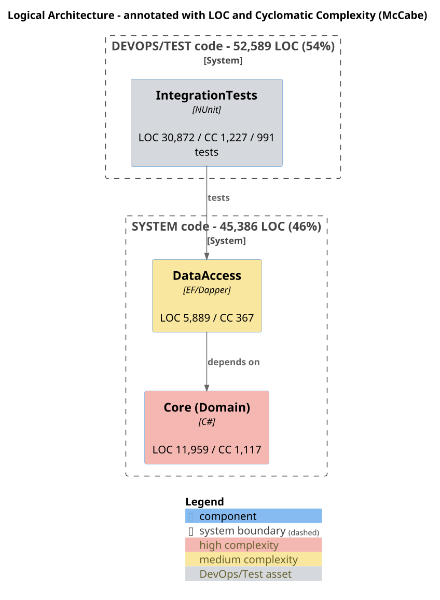

# Module 10 — C4 Architecture Diagrams (PlantUML) + Rendering

Produce a **set of PlantUML diagrams** that capture the system from five
complementary viewpoints, render them to PNG, and *inspect the rendered image*
for legibility before accepting it. Diagrams are derived from evidence gathered
in the architecture map (Modules 2–3), the dependency graph, and the metrics
(Module 9) — never invented.

## 10.1 The five required views

1. **Logical (C4 Component)** — the domain/application/infrastructure components
   and their responsibilities and relationships. This is the diagram that gets
   **annotated with LOC + cyclomatic complexity** (see 10.4).
2. **Runtime (C4 Container / dynamic)** — the processes/containers that actually
   run (web app, API, worker/job, desktop client, database, message broker,
   blob storage, external SaaS) and the calls between them at run time.
3. **Dependencies** — the build-time dependency graph between
   modules/projects/packages, with arrow direction. This is where you visualize
   onion/clean violations (an arrow pointing the wrong way) and any cycles.
4. **Testing** — test projects/suites mapped to what they exercise, labelled by
   layer (unit / integration / full-system) and count; shows the pyramid shape.
5. **Build / DevOps / Deploy** — source → CI pipeline → artifacts → environments,
   including registries, IaC, and deployment targets discovered from
   pipeline/compose/IaC files.

**Use the C4-PlantUML template library by default** for visual quality. Recent
PlantUML ships it in the bundled stdlib, so `!include <C4/C4_Container>` (and
`<C4/C4_Component>`, `<C4/C4_Deployment>`) renders **fully offline** with Graphviz
— no internet needed. Use the C4 macros (`System_Boundary`, `Container`,
`ContainerDb`, `ContainerQueue`, `Component`, `System_Ext`, `Rel`,
`Deployment_Node`), `AddElementTag`/`AddRelTag` for color-coding, and
`SHOW_LEGEND()`. Map the views: logical → `C4_Component`, runtime → `C4_Container`,
dependencies → `C4_Component`, deploy → `C4_Deployment`. Only if the bundled
stdlib is unavailable, fall back to plain PlantUML rather than produce nothing.

**Encoding:** write labels in ASCII — use `-` not `—`/`–` and `>` not `→`;
non-ASCII punctuation renders as mojibake (`â€"`) in PlantUML output.

**Reflect the two code categories (Module 9.3b) in every diagram.** Put System
components in one `System_Boundary` and DevOps/Test components (tests, build/
deploy scripts, tooling) in another, each with a distinct `AddElementTag` color,
and label each boundary with its LOC/FP subtotal. The category split should be
visible at a glance in the logical, dependency, testing, and deploy views.

## 10.2 Authoring conventions (for legibility)

- One view per `.puml` file under `diagrams/`; name them
  `01-logical.puml … 05-deploy.puml`.
- `left to right direction` for wide dependency/runtime graphs; top-down for
  layered logical views.
- Group with `package "Ring/Layer" { … }` so the dependency direction reads
  visually (domain core innermost/leftmost).
- Keep labels short; put detail in `note` blocks, not node names.
- Use `skinparam dpi 150` (or `-DPLANTUML_LIMIT_SIZE`/`-Sdpi`) so PNGs are crisp
  but not enormous. Add `skinparam wrapWidth 200` to wrap long labels.
- Color the domain core distinctly from infrastructure so onion violations pop.

## 10.3 Rendering + the mandatory legibility inspection

```bash
java -jar plantuml.jar -tpng -o ../report/images diagrams/*.puml   # PNG
java -jar plantuml.jar -tsvg -o ../report/images diagrams/*.puml   # optional SVG
```

**Inspect every rendered PNG — this step is not optional.** A `.puml` that
"compiles" can still be unreadable. After rendering, **Read each PNG image** and
check:
- Nothing is clipped at the canvas edge; the whole graph is inside the frame.
- No overlapping boxes or label-over-arrow collisions; text is readable.
- Arrow directions match the intended dependency direction.
- The annotations (LOC/complexity) are present and legible.
- Reasonable aspect ratio (not a 10:1 sliver); size is sane.

If a diagram fails inspection, fix the source (change direction, split a
package, shorten labels, raise/lower dpi, add `hidden` layout edges) and
re-render. Iterate until it reads cleanly. Record in the report that each image
was visually verified.

Common fixes: too wide → `top to bottom direction` or split into two diagrams;
overlap → `skinparam nodesep`/`ranksep`; clipped → lower dpi or wrap labels;
tangled arrows → group into packages and use `[A] --> [B]` sparingly.

## 10.4 Annotating the logical diagram with metrics

Take the per-component rollup from Module 9.4 and embed **LOC** and **total
cyclomatic complexity** into each component's box label so the diagram doubles
as a heat map. Example (C4-PlantUML, ASCII labels, two category boundaries):



- Show LOC and Cyclomatic on separate lines; optionally density and the single
  worst file. Consider a color ramp (green→red) keyed to complexity density so
  the hotspot is obvious at a glance.
- Keep numbers formatted (thousands separators) and consistent across boxes.
- This annotated diagram is a *distinct* file from the plain logical view; keep
  both (`01-logical.puml` and `01-logical-annotated.puml`).

**Inspection prompt**
> From the architecture map, dependency graph, and Module 9 metrics, author five
> PlantUML diagrams (logical, runtime, dependencies, testing, deploy) under
> `diagrams/`, plus an annotated logical diagram whose component boxes carry LOC
> and cyclomatic complexity. Render all to PNG with plantuml.jar. Then Read each
> PNG and verify legibility (no clipping/overlap, correct arrow direction,
> annotations readable); fix the source and re-render any that fail. Embed the
> verified PNGs in the report README.
