```mermaid
flowchart TB
    subgraph upstream["Dependants (8)"]
        P2["<b>📦&nbsp;UnitTests.csproj</b><br/><small>net9.0</small>"]
        P5["<b>📦&nbsp;DataAccess.csproj</b><br/><small>net9.0</small>"]
        P6["<b>📦&nbsp;UI.Server.csproj</b><br/><small>net9.0</small>"]
        P7["<b>📦&nbsp;UI.Client.csproj</b><br/><small>net9.0</small>"]
        P8["<b>📦&nbsp;UI.Api.csproj</b><br/><small>net9.0</small>"]
        P9["<b>📦&nbsp;AcceptanceTests.csproj</b><br/><small>net9.0</small>"]
        P10["<b>📦&nbsp;UI.Shared.csproj</b><br/><small>net9.0</small>"]
        P11["<b>📦&nbsp;LlmGateway.csproj</b><br/><small>net9.0</small>"]
        click P2 "#unittestsunittestscsproj"
        click P5 "#dataaccessdataaccesscsproj"
        click P6 "#uiserveruiservercsproj"
        click P7 "#uiclientuiclientcsproj"
        click P8 "#uiapiuiapicsproj"
        click P9 "#acceptancetestsacceptancetestscsproj"
        click P10 "#uishareduisharedcsproj"
        click P11 "#llmgatewayllmgatewaycsproj"
    end
    subgraph current["Core.csproj"]
        MAIN["<b>📦&nbsp;Core.csproj</b><br/><small>net9.0</small>"]
        click MAIN "#corecorecsproj"
    end
    P2 --> MAIN
    P5 --> MAIN
    P6 --> MAIN
    P7 --> MAIN
    P8 --> MAIN
    P9 --> MAIN
    P10 --> MAIN
    P11 --> MAIN

```

```mermaid
flowchart TB
    subgraph upstream["Dependants (1)"]
        P6["<b>📦&nbsp;UI.Server.csproj</b><br/><small>net9.0</small>"]
        click P6 "#uiserveruiservercsproj"
    end
    subgraph current["DataAccess.csproj"]
        MAIN["<b>📦&nbsp;DataAccess.csproj</b><br/><small>net9.0</small>"]
        click MAIN "#dataaccessdataaccesscsproj"
    end
    subgraph downstream["Dependencies (1"]
        P1["<b>📦&nbsp;Core.csproj</b><br/><small>net9.0</small>"]
        click P1 "#corecorecsproj"
    end
    P6 --> MAIN
    MAIN --> P1

```

```mermaid
flowchart TB
    subgraph upstream["Dependants (2)"]
        P6["<b>📦&nbsp;UI.Server.csproj</b><br/><small>net9.0</small>"]
        P10["<b>📦&nbsp;UI.Shared.csproj</b><br/><small>net9.0</small>"]
        click P6 "#uiserveruiservercsproj"
        click P10 "#uishareduisharedcsproj"
    end
    subgraph current["LlmGateway.csproj"]
        MAIN["<b>📦&nbsp;LlmGateway.csproj</b><br/><small>net9.0</small>"]
        click MAIN "#llmgatewayllmgatewaycsproj"
    end
    subgraph downstream["Dependencies (1"]
        P1["<b>📦&nbsp;Core.csproj</b><br/><small>net9.0</small>"]
        click P1 "#corecorecsproj"
    end
    P6 --> MAIN
    P10 --> MAIN
    MAIN --> P1

```

```mermaid
flowchart TB
    subgraph upstream["Dependants (2)"]
        P2["<b>📦&nbsp;UnitTests.csproj</b><br/><small>net9.0</small>"]
        P7["<b>📦&nbsp;UI.Client.csproj</b><br/><small>net9.0</small>"]
        click P2 "#unittestsunittestscsproj"
        click P7 "#uiclientuiclientcsproj"
    end
    subgraph current["UI.Shared.csproj"]
        MAIN["<b>📦&nbsp;UI.Shared.csproj</b><br/><small>net9.0</small>"]
        click MAIN "#uishareduisharedcsproj"
    end
    subgraph downstream["Dependencies (2"]
        P1["<b>📦&nbsp;Core.csproj</b><br/><small>net9.0</small>"]
        P11["<b>📦&nbsp;LlmGateway.csproj</b><br/><small>net9.0</small>"]
        click P1 "#corecorecsproj"
        click P11 "#llmgatewayllmgatewaycsproj"
    end
    P2 --> MAIN
    P7 --> MAIN
    MAIN --> P1
    MAIN --> P11

```

```mermaid
flowchart TB
    subgraph upstream["Dependants (2)"]
        P2["<b>📦&nbsp;UnitTests.csproj</b><br/><small>net9.0</small>"]
        P6["<b>📦&nbsp;UI.Server.csproj</b><br/><small>net9.0</small>"]
        click P2 "#unittestsunittestscsproj"
        click P6 "#uiserveruiservercsproj"
    end
    subgraph current["UI.Api.csproj"]
        MAIN["<b>📦&nbsp;UI.Api.csproj</b><br/><small>net9.0</small>"]
        click MAIN "#uiapiuiapicsproj"
    end
    subgraph downstream["Dependencies (1"]
        P1["<b>📦&nbsp;Core.csproj</b><br/><small>net9.0</small>"]
        click P1 "#corecorecsproj"
    end
    P2 --> MAIN
    P6 --> MAIN
    MAIN --> P1

```

```mermaid
flowchart TB
    subgraph upstream["Dependants (2)"]
        P2["<b>📦&nbsp;UnitTests.csproj</b><br/><small>net9.0</small>"]
        P6["<b>📦&nbsp;UI.Server.csproj</b><br/><small>net9.0</small>"]
        click P2 "#unittestsunittestscsproj"
        click P6 "#uiserveruiservercsproj"
    end
    subgraph current["UI.Client.csproj"]
        MAIN["<b>📦&nbsp;UI.Client.csproj</b><br/><small>net9.0</small>"]
        click MAIN "#uiclientuiclientcsproj"
    end
    subgraph downstream["Dependencies (2"]
        P10["<b>📦&nbsp;UI.Shared.csproj</b><br/><small>net9.0</small>"]
        P1["<b>📦&nbsp;Core.csproj</b><br/><small>net9.0</small>"]
        click P10 "#uishareduisharedcsproj"
        click P1 "#corecorecsproj"
    end
    P2 --> MAIN
    P6 --> MAIN
    MAIN --> P10
    MAIN --> P1

```

```mermaid
flowchart TB
    subgraph upstream["Dependants (2)"]
        P2["<b>📦&nbsp;UnitTests.csproj</b><br/><small>net9.0</small>"]
        P4["<b>📦&nbsp;IntegrationTests.csproj</b><br/><small>net9.0</small>"]
        click P2 "#unittestsunittestscsproj"
        click P4 "#integrationtestsintegrationtestscsproj"
    end
    subgraph current["UI.Server.csproj"]
        MAIN["<b>📦&nbsp;UI.Server.csproj</b><br/><small>net9.0</small>"]
        click MAIN "#uiserveruiservercsproj"
    end
    subgraph downstream["Dependencies (5"]
        P5["<b>📦&nbsp;DataAccess.csproj</b><br/><small>net9.0</small>"]
        P11["<b>📦&nbsp;LlmGateway.csproj</b><br/><small>net9.0</small>"]
        P8["<b>📦&nbsp;UI.Api.csproj</b><br/><small>net9.0</small>"]
        P7["<b>📦&nbsp;UI.Client.csproj</b><br/><small>net9.0</small>"]
        P1["<b>📦&nbsp;Core.csproj</b><br/><small>net9.0</small>"]
        click P5 "#dataaccessdataaccesscsproj"
        click P11 "#llmgatewayllmgatewaycsproj"
        click P8 "#uiapiuiapicsproj"
        click P7 "#uiclientuiclientcsproj"
        click P1 "#corecorecsproj"
    end
    P2 --> MAIN
    P4 --> MAIN
    MAIN --> P5
    MAIN --> P11
    MAIN --> P8
    MAIN --> P7
    MAIN --> P1

```

```mermaid
flowchart TB
    subgraph upstream["Dependants (1)"]
        P4["<b>📦&nbsp;IntegrationTests.csproj</b><br/><small>net9.0</small>"]
        click P4 "#integrationtestsintegrationtestscsproj"
    end
    subgraph current["UnitTests.csproj"]
        MAIN["<b>📦&nbsp;UnitTests.csproj</b><br/><small>net9.0</small>"]
        click MAIN "#unittestsunittestscsproj"
    end
    subgraph downstream["Dependencies (5"]
        P10["<b>📦&nbsp;UI.Shared.csproj</b><br/><small>net9.0</small>"]
        P6["<b>📦&nbsp;UI.Server.csproj</b><br/><small>net9.0</small>"]
        P7["<b>📦&nbsp;UI.Client.csproj</b><br/><small>net9.0</small>"]
        P1["<b>📦&nbsp;Core.csproj</b><br/><small>net9.0</small>"]
        P8["<b>📦&nbsp;UI.Api.csproj</b><br/><small>net9.0</small>"]
        click P10 "#uishareduisharedcsproj"
        click P6 "#uiserveruiservercsproj"
        click P7 "#uiclientuiclientcsproj"
        click P1 "#corecorecsproj"
        click P8 "#uiapiuiapicsproj"
    end
    P4 --> MAIN
    MAIN --> P10
    MAIN --> P6
    MAIN --> P7
    MAIN --> P1
    MAIN --> P8

```

# Projects and dependencies analysis

This document provides a comprehensive overview of the projects and their dependencies in the context of upgrading to .NET 9.0.

## Table of Contents

- [Projects Relationship Graph](#projects-relationship-graph)
- [Project Details](#project-details)

  - [AcceptanceTests\AcceptanceTests.csproj](#acceptancetestsacceptancetestscsproj)
  - [Core\Core.csproj](#corecorecsproj)
  - [DataAccess\DataAccess.csproj](#dataaccessdataaccesscsproj)
  - [IntegrationTests\IntegrationTests.csproj](#integrationtestsintegrationtestscsproj)
  - [LlmGateway\LlmGateway.csproj](#llmgatewayllmgatewaycsproj)
  - [UI.Shared\UI.Shared.csproj](#uishareduisharedcsproj)
  - [UI\Api\UI.Api.csproj](#uiapiuiapicsproj)
  - [UI\Client\UI.Client.csproj](#uiclientuiclientcsproj)
  - [UI\Server\UI.Server.csproj](#uiserveruiservercsproj)
  - [UnitTests\UnitTests.csproj](#unittestsunittestscsproj)
- [Aggregate NuGet packages details](#aggregate-nuget-packages-details)

## Projects Relationship Graph

Legend:
📦 SDK-style project
⚙️ Classic project

## Project Details

### AcceptanceTests\AcceptanceTests.csproj

#### Project Info

- **Current Target Framework:** net9.0
- **Proposed Target Framework:** net10.0
- **SDK-style**: True
- **Project Kind:** DotNetCoreApp
- **Dependencies**: 2
- **Dependants**: 0
- **Number of Files**: 18
- **Lines of Code**: 1451

#### Dependency Graph

Legend:
📦 SDK-style project
⚙️ Classic project

#### Project Package References

| Package | Type | Current Version | Suggested Version | Description |
| :--- | :---: | :---: | :---: | :--- |
| coverlet.collector | Explicit | 6.0.4 |  | ✅Compatible |
| coverlet.msbuild | Explicit | 6.0.4 |  | ✅Compatible |
| Microsoft.Extensions.Hosting | Explicit | 9.0.7 | 10.0.0 | NuGet package upgrade is recommended |
| Microsoft.NET.Test.Sdk | Explicit | 17.14.1 |  | ✅Compatible |
| microsoft.playwright.nunit | Explicit | 1.54.0 |  | ✅Compatible |
| NUnit | Explicit | 4.3.2 |  | ✅Compatible |
| NUnit.Analyzers | Explicit | 4.9.2 |  | ✅Compatible |
| NUnit3TestAdapter | Explicit | 5.0.0 |  | ✅Compatible |

### Core\Core.csproj

#### Project Info

- **Current Target Framework:** net9.0
- **Proposed Target Framework:** net10.0
- **SDK-style**: True
- **Project Kind:** ClassLibrary
- **Dependencies**: 0
- **Dependants**: 8
- **Number of Files**: 35
- **Lines of Code**: 883

#### Dependency Graph

Legend:
📦 SDK-style project
⚙️ Classic project

#### Project Package References

| Package | Type | Current Version | Suggested Version | Description |
| :--- | :---: | :---: | :---: | :--- |
| MediatR.Contracts | Explicit | 2.0.1 |  | ✅Compatible |
| Microsoft.Extensions.Diagnostics.HealthChecks.Abstractions | Explicit | 9.0.7 | 10.0.0 | NuGet package upgrade is recommended |
| Microsoft.Extensions.Logging.Abstractions | Explicit | 9.0.7 | 10.0.0 | NuGet package upgrade is recommended |

### DataAccess\DataAccess.csproj

#### Project Info

- **Current Target Framework:** net9.0
- **Proposed Target Framework:** net10.0
- **SDK-style**: True
- **Project Kind:** ClassLibrary
- **Dependencies**: 1
- **Dependants**: 1
- **Number of Files**: 14
- **Lines of Code**: 430

#### Dependency Graph

Legend:
📦 SDK-style project
⚙️ Classic project

#### Project Package References

| Package | Type | Current Version | Suggested Version | Description |
| :--- | :---: | :---: | :---: | :--- |
| MediatR | Explicit | 12.4.1 |  | ✅Compatible |
| Microsoft.EntityFrameworkCore | Explicit | 9.0.7 | 10.0.0 | NuGet package upgrade is recommended |
| Microsoft.EntityFrameworkCore.SqlServer | Explicit | 9.0.7 | 10.0.0 | NuGet package upgrade is recommended |
| Microsoft.Extensions.Diagnostics.HealthChecks.Abstractions | Explicit | 9.0.7 | 10.0.0 | NuGet package upgrade is recommended |
| Microsoft.Extensions.Logging.Abstractions | Explicit | 9.0.7 | 10.0.0 | NuGet package upgrade is recommended |

### IntegrationTests\IntegrationTests.csproj

#### Project Info

- **Current Target Framework:** net9.0
- **Proposed Target Framework:** net10.0
- **SDK-style**: True
- **Project Kind:** DotNetCoreApp
- **Dependencies**: 2
- **Dependants**: 1
- **Number of Files**: 24
- **Lines of Code**: 1902

#### Dependency Graph

Legend:
📦 SDK-style project
⚙️ Classic project

#### Project Package References

| Package | Type | Current Version | Suggested Version | Description |
| :--- | :---: | :---: | :---: | :--- |
| coverlet.collector | Explicit | 6.0.4 |  | ✅Compatible |
| coverlet.msbuild | Explicit | 6.0.4 |  | ✅Compatible |
| Microsoft.EntityFrameworkCore | Explicit | 9.0.7 | 10.0.0 | NuGet package upgrade is recommended |
| Microsoft.Extensions.Hosting | Explicit | 9.0.7 | 10.0.0 | NuGet package upgrade is recommended |
| Microsoft.NET.Test.Sdk | Explicit | 17.14.1 |  | ✅Compatible |
| NUnit | Explicit | 4.3.2 |  | ✅Compatible |
| NUnit.Analyzers | Explicit | 4.9.2 |  | ✅Compatible |
| NUnit3TestAdapter | Explicit | 5.0.0 |  | ✅Compatible |
| Shouldly | Explicit | 4.3.0 |  | ✅Compatible |

### LlmGateway\LlmGateway.csproj

#### Project Info

- **Current Target Framework:** net9.0
- **Proposed Target Framework:** net10.0
- **SDK-style**: True
- **Project Kind:** ClassLibrary
- **Dependencies**: 1
- **Dependants**: 2
- **Number of Files**: 7
- **Lines of Code**: 150

#### Dependency Graph

Legend:
📦 SDK-style project
⚙️ Classic project

#### Project Package References

| Package | Type | Current Version | Suggested Version | Description |
| :--- | :---: | :---: | :---: | :--- |
| Azure.AI.OpenAI | Explicit | 2.1.0 |  | ✅Compatible |
| Azure.Core | Explicit | 1.46.1 |  | ✅Compatible |
| MediatR | Explicit | 12.4.1 |  | ✅Compatible |
| Microsoft.Extensions.AI | Explicit | 9.7.0 |  | ✅Compatible |
| Microsoft.Extensions.AI.Abstractions | Explicit | 9.7.1 |  | ✅Compatible |
| Microsoft.Extensions.AI.Ollama | Explicit | 9.7.0-preview.1.25356.2 |  | ✅Compatible |
| Microsoft.Extensions.AI.OpenAI | Explicit | 9.7.1-preview.1.25365.4 |  | ✅Compatible |
| Microsoft.Extensions.Diagnostics.HealthChecks | Explicit | 9.0.7 | 10.0.0 | NuGet package upgrade is recommended |
| Microsoft.Extensions.Logging.Console | Explicit | 9.0.7 | 10.0.0 | NuGet package upgrade is recommended |
| OllamaSharp | Explicit | 5.2.10 |  | ✅Compatible |

### UI.Shared\UI.Shared.csproj

#### Project Info

- **Current Target Framework:** net9.0
- **Proposed Target Framework:** net10.0
- **SDK-style**: True
- **Project Kind:** ClassLibrary
- **Dependencies**: 2
- **Dependants**: 2
- **Number of Files**: 32
- **Lines of Code**: 581

#### Dependency Graph

Legend:
📦 SDK-style project
⚙️ Classic project

#### Project Package References

| Package | Type | Current Version | Suggested Version | Description |
| :--- | :---: | :---: | :---: | :--- |
| BlazorApplicationInsights | Explicit | 3.2.1 |  | ✅Compatible |
| BlazorMvc | Explicit | 2.1.1 |  | ✅Compatible |
| MediatR | Explicit | 12.4.1 |  | ✅Compatible |
| Microsoft.ApplicationInsights | Explicit | 2.23.0 |  | ✅Compatible |
| Microsoft.AspNetCore.Components.Authorization | Explicit | 9.0.7 | 10.0.0 | NuGet package upgrade is recommended |
| Microsoft.AspNetCore.Components.Web | Explicit | 9.0.7 | 10.0.0 | NuGet package upgrade is recommended |

### UI\Api\UI.Api.csproj

#### Project Info

- **Current Target Framework:** net9.0
- **Proposed Target Framework:** net10.0
- **SDK-style**: True
- **Project Kind:** AspNetCore
- **Dependencies**: 1
- **Dependants**: 2
- **Number of Files**: 7
- **Lines of Code**: 149

#### Dependency Graph

Legend:
📦 SDK-style project
⚙️ Classic project

#### Project Package References

| Package | Type | Current Version | Suggested Version | Description |
| :--- | :---: | :---: | :---: | :--- |
| Lamar.Microsoft.DependencyInjection | Explicit | 15.0.1 |  | ✅Compatible |

### UI\Client\UI.Client.csproj

#### Project Info

- **Current Target Framework:** net9.0
- **Proposed Target Framework:** net10.0
- **SDK-style**: True
- **Project Kind:** AspNetCore
- **Dependencies**: 2
- **Dependants**: 2
- **Number of Files**: 29
- **Lines of Code**: 275

#### Dependency Graph

Legend:
📦 SDK-style project
⚙️ Classic project

#### Project Package References

| Package | Type | Current Version | Suggested Version | Description |
| :--- | :---: | :---: | :---: | :--- |
| BlazorApplicationInsights | Explicit | 3.2.1 |  | ✅Compatible |
| BlazorMvc | Explicit | 2.1.1 |  | ✅Compatible |
| Lamar.Microsoft.DependencyInjection | Explicit | 15.0.1 |  | ✅Compatible |
| MediatR | Explicit | 12.4.1 |  | ✅Compatible |
| Microsoft.AspNetCore.Components.Authorization | Explicit | 9.0.7 | 10.0.0 | NuGet package upgrade is recommended |
| Microsoft.AspNetCore.Components.WebAssembly | Explicit | 9.0.7 | 10.0.0 | NuGet package upgrade is recommended |
| Microsoft.AspNetCore.Components.WebAssembly.DevServer | Explicit | 9.0.7 | 10.0.0 | NuGet package upgrade is recommended |
| Microsoft.Extensions.Diagnostics.HealthChecks | Explicit | 9.0.7 | 10.0.0 | NuGet package upgrade is recommended |

### UI\Server\UI.Server.csproj

#### Project Info

- **Current Target Framework:** net9.0
- **Proposed Target Framework:** net10.0
- **SDK-style**: True
- **Project Kind:** AspNetCore
- **Dependencies**: 5
- **Dependants**: 2
- **Number of Files**: 12
- **Lines of Code**: 395

#### Dependency Graph

Legend:
📦 SDK-style project
⚙️ Classic project

#### Project Package References

| Package | Type | Current Version | Suggested Version | Description |
| :--- | :---: | :---: | :---: | :--- |
| Azure.Monitor.OpenTelemetry.AspNetCore | Explicit | 1.3.0 |  | ✅Compatible |
| Lamar.Microsoft.DependencyInjection | Explicit | 15.0.1 |  | ✅Compatible |
| Microsoft.ApplicationInsights.AspNetCore | Explicit | 2.23.0 |  | ✅Compatible |
| Microsoft.AspNetCore.Components.WebAssembly.Server | Explicit | 9.0.7 | 10.0.0 | NuGet package upgrade is recommended |
| OpenTelemetry | Explicit | 1.12.0 |  | ✅Compatible |
| OpenTelemetry.Instrumentation.AspNetCore | Explicit | 1.12.0 |  | ✅Compatible |
| OpenTelemetry.Instrumentation.Http | Explicit | 1.12.0 |  | ✅Compatible |
| OpenTelemetry.Instrumentation.Runtime | Explicit | 1.12.0 |  | ✅Compatible |

### UnitTests\UnitTests.csproj

#### Project Info

- **Current Target Framework:** net9.0
- **Proposed Target Framework:** net10.0
- **SDK-style**: True
- **Project Kind:** DotNetCoreApp
- **Dependencies**: 5
- **Dependants**: 1
- **Number of Files**: 29
- **Lines of Code**: 2198

#### Dependency Graph

Legend:
📦 SDK-style project
⚙️ Classic project

#### Project Package References

| Package | Type | Current Version | Suggested Version | Description |
| :--- | :---: | :---: | :---: | :--- |
| AutoBogus.Conventions | Explicit | 2.13.1 |  | ✅Compatible |
| bunit | Explicit | 1.40.0 |  | ✅Compatible |
| coverlet.collector | Explicit | 6.0.4 |  | ✅Compatible |
| coverlet.msbuild | Explicit | 6.0.4 |  | ✅Compatible |
| MediatR | Explicit | 12.4.1 |  | ✅Compatible |
| Microsoft.AspNetCore.Components.Authorization | Explicit | 9.0.7 | 10.0.0 | NuGet package upgrade is recommended |
| Microsoft.NET.Test.Sdk | Explicit | 17.14.1 |  | ✅Compatible |
| NUnit | Explicit | 4.3.2 |  | ✅Compatible |
| NUnit.Analyzers | Explicit | 4.9.2 |  | ✅Compatible |
| NUnit3TestAdapter | Explicit | 5.0.0 |  | ✅Compatible |
| Shouldly | Explicit | 4.3.0 |  | ✅Compatible |

## Aggregate NuGet packages details

| Package | Current Version | Suggested Version | Projects | Description |
| :--- | :---: | :---: | :--- | :--- |
| AutoBogus.Conventions | 2.13.1 |  | [UnitTests.csproj](#unittestscsproj) | ✅Compatible |
| Azure.AI.OpenAI | 2.1.0 |  | [LlmGateway.csproj](#llmgatewaycsproj) | ✅Compatible |
| Azure.Core | 1.46.1 |  | [LlmGateway.csproj](#llmgatewaycsproj) | ✅Compatible |
| Azure.Monitor.OpenTelemetry.AspNetCore | 1.3.0 |  | [UI.Server.csproj](#uiservercsproj) | ✅Compatible |
| BlazorApplicationInsights | 3.2.1 |  | [UI.Shared.csproj](#uisharedcsproj) [UI.Client.csproj](#uiclientcsproj) | ✅Compatible |
| BlazorMvc | 2.1.1 |  | [UI.Shared.csproj](#uisharedcsproj) [UI.Client.csproj](#uiclientcsproj) | ✅Compatible |
| bunit | 1.40.0 |  | [UnitTests.csproj](#unittestscsproj) | ✅Compatible |
| coverlet.collector | 6.0.4 |  | [AcceptanceTests.csproj](#acceptancetestscsproj) [IntegrationTests.csproj](#integrationtestscsproj) [UnitTests.csproj](#unittestscsproj) | ✅Compatible |
| coverlet.msbuild | 6.0.4 |  | [AcceptanceTests.csproj](#acceptancetestscsproj) [IntegrationTests.csproj](#integrationtestscsproj) [UnitTests.csproj](#unittestscsproj) | ✅Compatible |
| Lamar.Microsoft.DependencyInjection | 15.0.1 |  | [UI.Api.csproj](#uiapicsproj) [UI.Client.csproj](#uiclientcsproj) [UI.Server.csproj](#uiservercsproj) | ✅Compatible |
| MediatR | 12.4.1 |  | [DataAccess.csproj](#dataaccesscsproj) [LlmGateway.csproj](#llmgatewaycsproj) [UI.Shared.csproj](#uisharedcsproj) [UI.Client.csproj](#uiclientcsproj) [UnitTests.csproj](#unittestscsproj) | ✅Compatible |
| MediatR.Contracts | 2.0.1 |  | [Core.csproj](#corecsproj) | ✅Compatible |
| Microsoft.ApplicationInsights | 2.23.0 |  | [UI.Shared.csproj](#uisharedcsproj) | ✅Compatible |
| Microsoft.ApplicationInsights.AspNetCore | 2.23.0 |  | [UI.Server.csproj](#uiservercsproj) | ✅Compatible |
| Microsoft.AspNetCore.Components.Authorization | 9.0.7 | 10.0.0 | [UI.Shared.csproj](#uisharedcsproj) [UI.Client.csproj](#uiclientcsproj) [UnitTests.csproj](#unittestscsproj) | NuGet package upgrade is recommended |
| Microsoft.AspNetCore.Components.Web | 9.0.7 | 10.0.0 | [UI.Shared.csproj](#uisharedcsproj) | NuGet package upgrade is recommended |
| Microsoft.AspNetCore.Components.WebAssembly | 9.0.7 | 10.0.0 | [UI.Client.csproj](#uiclientcsproj) | NuGet package upgrade is recommended |
| Microsoft.AspNetCore.Components.WebAssembly.DevServer | 9.0.7 | 10.0.0 | [UI.Client.csproj](#uiclientcsproj) | NuGet package upgrade is recommended |
| Microsoft.AspNetCore.Components.WebAssembly.Server | 9.0.7 | 10.0.0 | [UI.Server.csproj](#uiservercsproj) | NuGet package upgrade is recommended |
| Microsoft.EntityFrameworkCore | 9.0.7 | 10.0.0 | [DataAccess.csproj](#dataaccesscsproj) [IntegrationTests.csproj](#integrationtestscsproj) | NuGet package upgrade is recommended |
| Microsoft.EntityFrameworkCore.SqlServer | 9.0.7 | 10.0.0 | [DataAccess.csproj](#dataaccesscsproj) | NuGet package upgrade is recommended |
| Microsoft.Extensions.AI | 9.7.0 |  | [LlmGateway.csproj](#llmgatewaycsproj) | ✅Compatible |
| Microsoft.Extensions.AI.Abstractions | 9.7.1 |  | [LlmGateway.csproj](#llmgatewaycsproj) | ✅Compatible |
| Microsoft.Extensions.AI.Ollama | 9.7.0-preview.1.25356.2 |  | [LlmGateway.csproj](#llmgatewaycsproj) | ✅Compatible |
| Microsoft.Extensions.AI.OpenAI | 9.7.1-preview.1.25365.4 |  | [LlmGateway.csproj](#llmgatewaycsproj) | ✅Compatible |
| Microsoft.Extensions.Diagnostics.HealthChecks | 9.0.7 | 10.0.0 | [LlmGateway.csproj](#llmgatewaycsproj) [UI.Client.csproj](#uiclientcsproj) | NuGet package upgrade is recommended |
| Microsoft.Extensions.Diagnostics.HealthChecks.Abstractions | 9.0.7 | 10.0.0 | [Core.csproj](#corecsproj) [DataAccess.csproj](#dataaccesscsproj) | NuGet package upgrade is recommended |
| Microsoft.Extensions.Hosting | 9.0.7 | 10.0.0 | [AcceptanceTests.csproj](#acceptancetestscsproj) [IntegrationTests.csproj](#integrationtestscsproj) | NuGet package upgrade is recommended |
| Microsoft.Extensions.Logging.Abstractions | 9.0.7 | 10.0.0 | [Core.csproj](#corecsproj) [DataAccess.csproj](#dataaccesscsproj) | NuGet package upgrade is recommended |
| Microsoft.Extensions.Logging.Console | 9.0.7 | 10.0.0 | [LlmGateway.csproj](#llmgatewaycsproj) | NuGet package upgrade is recommended |
| Microsoft.NET.Test.Sdk | 17.14.1 |  | [AcceptanceTests.csproj](#acceptancetestscsproj) [IntegrationTests.csproj](#integrationtestscsproj) [UnitTests.csproj](#unittestscsproj) | ✅Compatible |
| microsoft.playwright.nunit | 1.54.0 |  | [AcceptanceTests.csproj](#acceptancetestscsproj) | ✅Compatible |
| NUnit | 4.3.2 |  | [AcceptanceTests.csproj](#acceptancetestscsproj) [IntegrationTests.csproj](#integrationtestscsproj) [UnitTests.csproj](#unittestscsproj) | ✅Compatible |
| NUnit.Analyzers | 4.9.2 |  | [AcceptanceTests.csproj](#acceptancetestscsproj) [IntegrationTests.csproj](#integrationtestscsproj) [UnitTests.csproj](#unittestscsproj) | ✅Compatible |
| NUnit3TestAdapter | 5.0.0 |  | [AcceptanceTests.csproj](#acceptancetestscsproj) [IntegrationTests.csproj](#integrationtestscsproj) [UnitTests.csproj](#unittestscsproj) | ✅Compatible |
| OllamaSharp | 5.2.10 |  | [LlmGateway.csproj](#llmgatewaycsproj) | ✅Compatible |
| OpenTelemetry | 1.12.0 |  | [UI.Server.csproj](#uiservercsproj) | ✅Compatible |
| OpenTelemetry.Instrumentation.AspNetCore | 1.12.0 |  | [UI.Server.csproj](#uiservercsproj) | ✅Compatible |
| OpenTelemetry.Instrumentation.Http | 1.12.0 |  | [UI.Server.csproj](#uiservercsproj) | ✅Compatible |
| OpenTelemetry.Instrumentation.Runtime | 1.12.0 |  | [UI.Server.csproj](#uiservercsproj) | ✅Compatible |
| Shouldly | 4.3.0 |  | [IntegrationTests.csproj](#integrationtestscsproj) [UnitTests.csproj](#unittestscsproj) | ✅Compatible |

