# Architecture diagrams

Mermaid C4 diagrams in this folder use **icons from [icones.js.org](https://icones.js.org/)** (Iconify). The icon pack used is **[Tabler](https://icones.js.org/collection/tabler)**.

## Rendering with icons

To render the diagrams with icons, register the Tabler icon pack as described in [Mermaid: Registering icon pack](https://mermaid.js.org/config/icons.html).

**Example (JavaScript):**

```javascript
import mermaid from 'mermaid';

mermaid.registerIconPacks([
  {
    name: 'tabler',
    loader: () =>
      fetch('https://unpkg.com/@iconify-json/tabler@1/icons.json').then((res) => res.json()),
  },
]);
```

**Example (mermaid-cli):**

```bash
mmdc -i arch-c4-system.md -o arch-c4-system.svg --iconPacks '@iconify-json/tabler'
```

Icons are specified in C4 elements via the optional `sprite` parameter (e.g. `"tabler:user"`, `"tabler:database"`). If the renderer does not support sprites or icon packs are not registered, the diagrams still render without icons.

## Rendering PlantUML diagrams

PlantUML sources are located in this folder (files with the .puml extension). To render the PlantUML diagrams into PNG and SVG images, use the helper script included in this folder:

PowerShell (preferred on Windows/macOS):

```powershell
pwsh arch/render-diagrams.ps1
```

The script prefers Docker (plantuml/plantuml image) and will fall back to a local plantuml.jar if you have placed it in ./.tools/plantuml.jar and have a suitable Java runtime (>= 11).

If you prefer to render one file with Docker directly (no script):

```bash
# PNG
docker run --rm -i plantuml/plantuml -tpng -pipe < arch/arch-c4-system.puml > arch/arch-c4-system.png
# SVG
docker run --rm -i plantuml/plantuml -tsvg -pipe < arch/arch-c4-system.puml > arch/arch-c4-system.svg
```

## Pinning remote includes

Several PlantUML files include remote C4 library snippets via `!includeurl`. To avoid unexpected breakage if the upstream repository changes, the diagrams in this repo pin those includes to the `release/1-0` tag. When updating PlantUML includes, prefer using a stable tag or commit hash rather than the `master` branch.

## Diagram files

| Source | PNG output | Diagram type | Description |
|------|------|--------------|-------------|
| `arch-c4-system.puml` | `arch-c4-system.png` | C4Context | Church Bulletin system context |
| `arch-c4-container-deployment.puml` | `arch-c4-container-deployment.png` | C4Container | Containers (DB, app, UI) |
| `arch-c4-component-project-dependencies.puml` | `arch-c4-component-project-dependencies.png` | C4Component | Solution/project structure |
| `arch-c4-class-domain-model.puml` | `arch-c4-class-domain-model.png` | C4Class | Work order domain model class view |
| `arch-class-domain-model-domain.puml` | `arch-class-domain-model-domain.png` | Class | Domain model detail |
| `arch-class-domain-model-commands.puml` | `arch-class-domain-model-commands.png` | Class | State command model detail |
| `arch-state-workorder.puml` | `arch-state-workorder.png` | State | Work order state transitions |
| `arch-devops-pipeline.puml` | `arch-devops-pipeline.png` | DevOps | CI/CD pipeline view |
| `arch-llm-mcp-sequence.puml` | `arch-llm-mcp-sequence.png` | Sequence | MCP/LLM interaction flow |
| `arch-logging-observability.puml` | `arch-logging-observability.png` | Logging | Observability pipeline |
| `WorkflowForDraftToAssignedCommand.puml` | `WorkflowForDraftToAssignedCommand.png` | Sequence | Draft → Assigned command workflow |
| `WorkflowForAssignedToInProgressCommand.puml` | `WorkflowForAssignedToInProgressCommand.png` | Sequence | Assigned → InProgress command workflow |
| `WorkflowForInProgressToCompleteCommand.puml` | `WorkflowForInProgressToCompleteCommand.png` | Sequence | InProgress → Complete command workflow |
| `WorkflowForSaveDraftCommand.puml` | `WorkflowForSaveDraftCommand.png` | Sequence | Save draft command workflow |

## Rendered PNG previews

### C4 and structural views

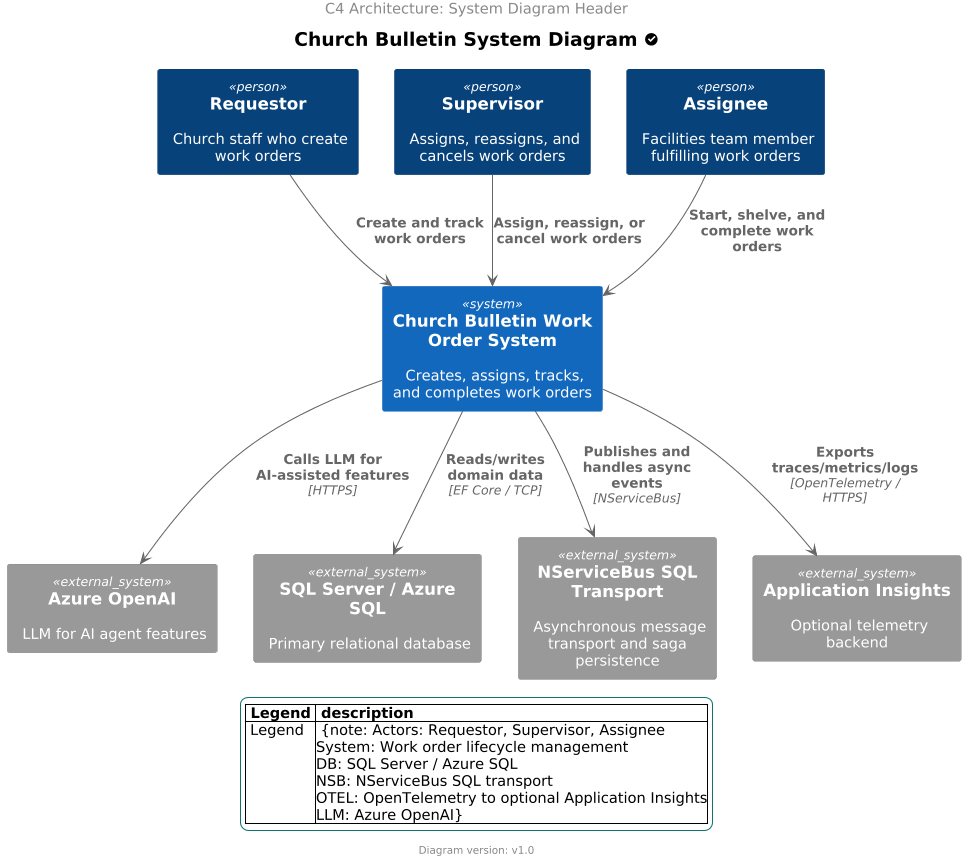
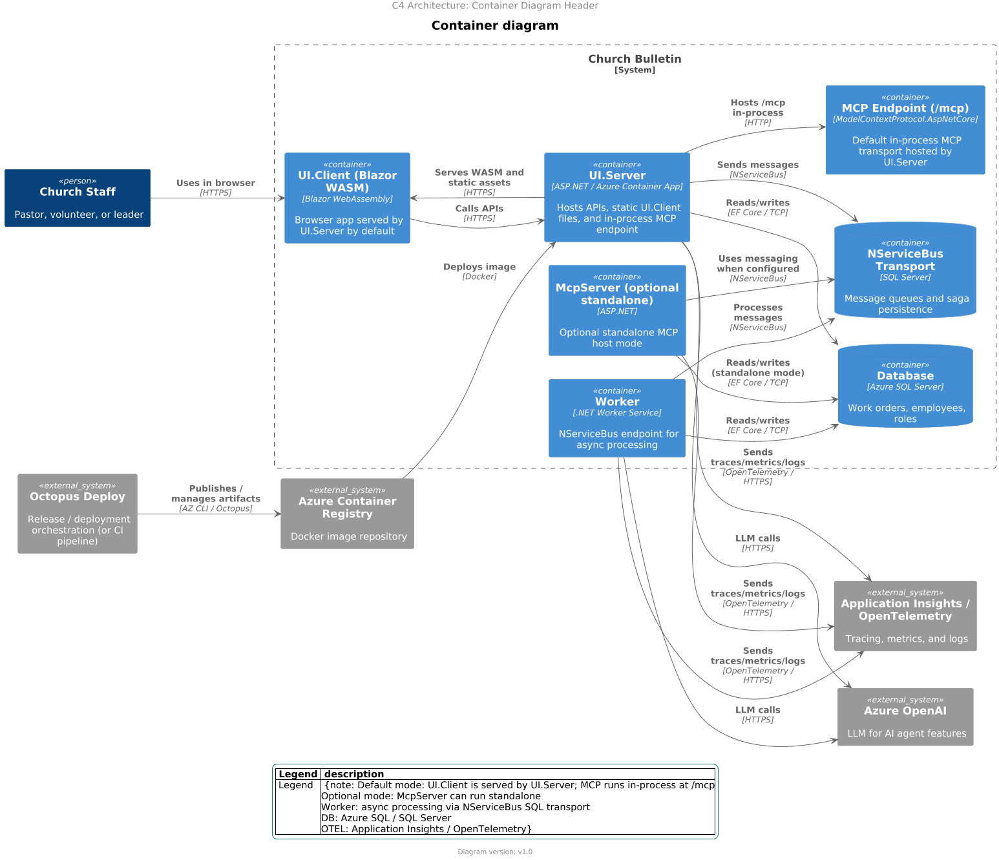
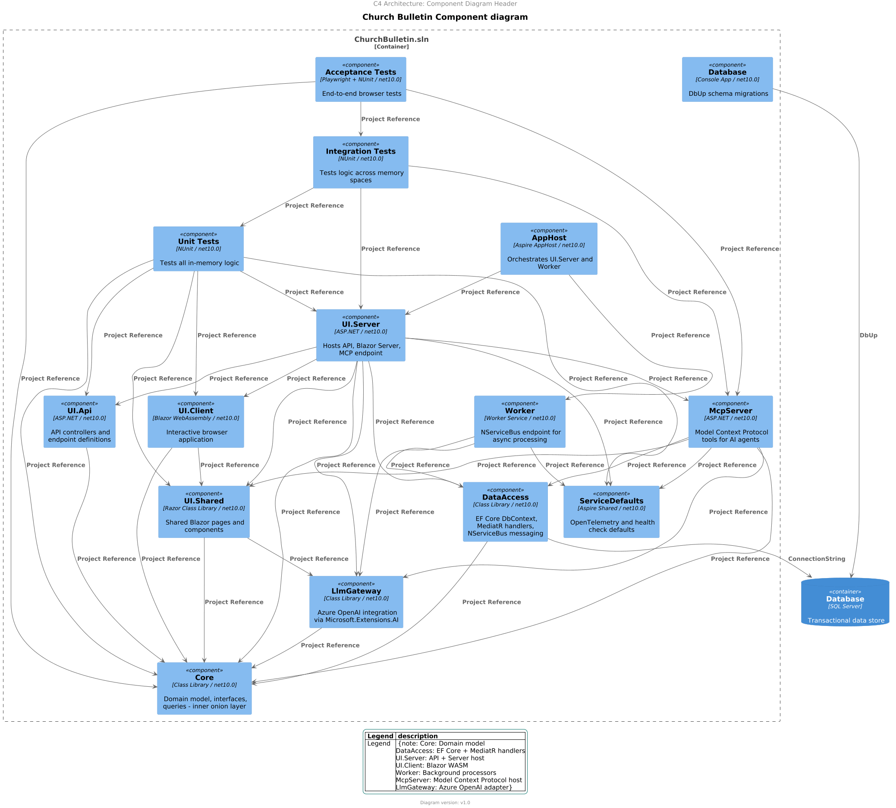
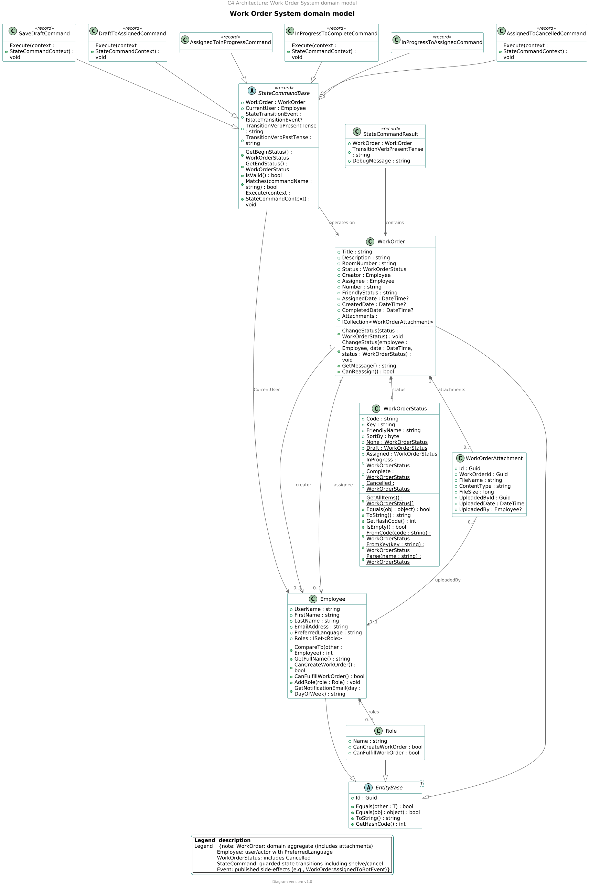

### Domain and runtime views

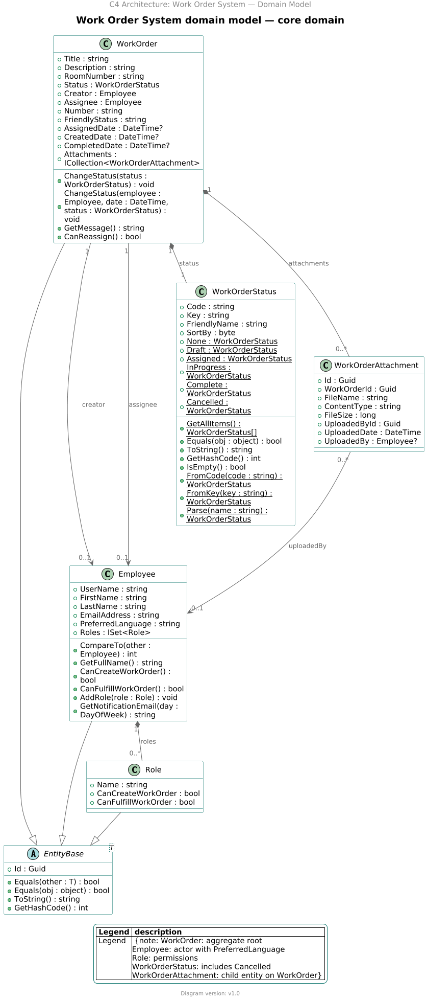
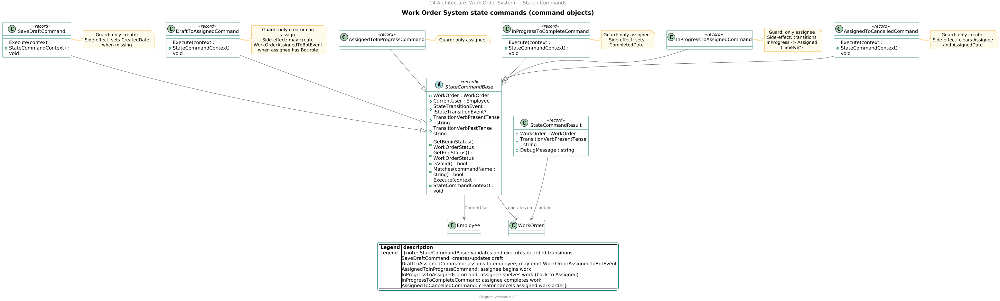
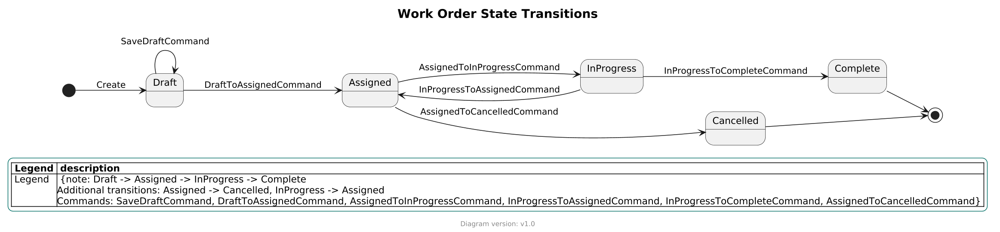
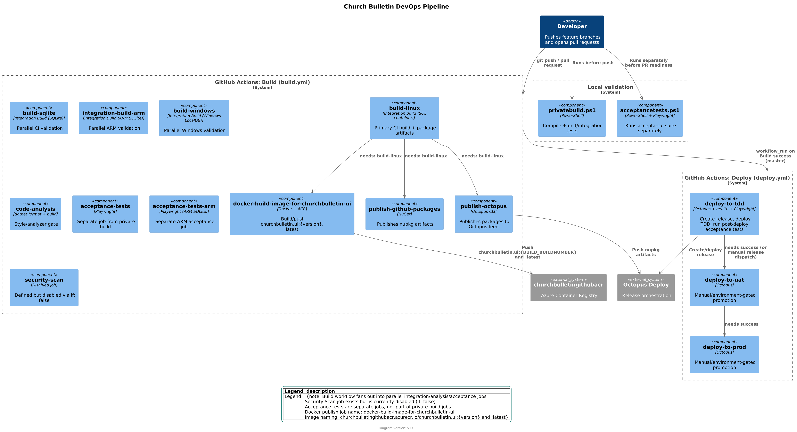
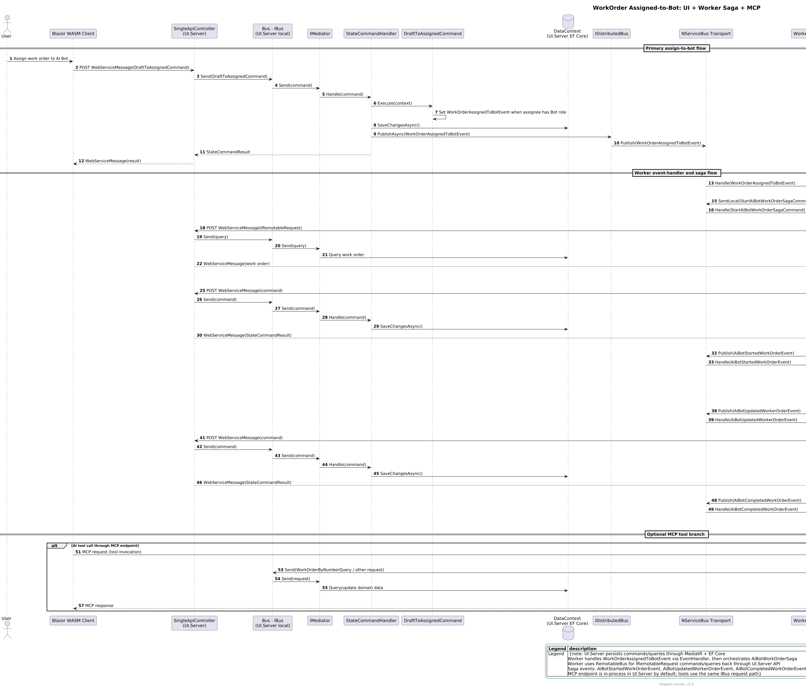
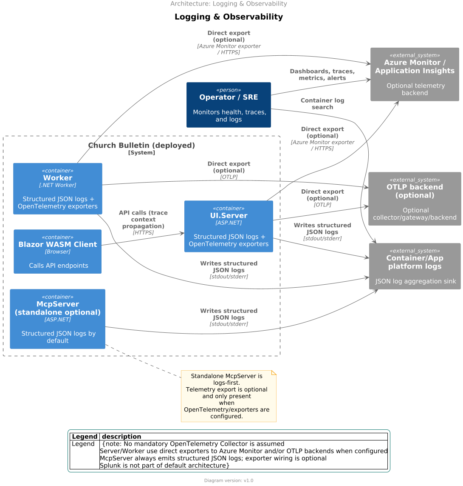

### Workflow command sequences

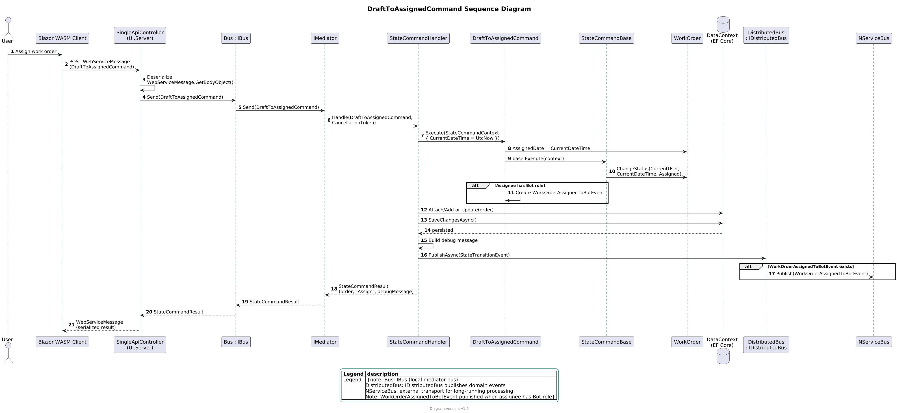
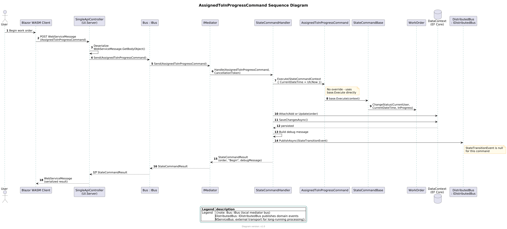
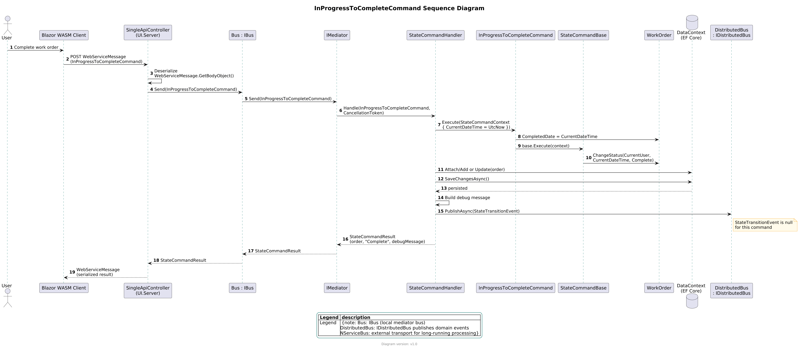
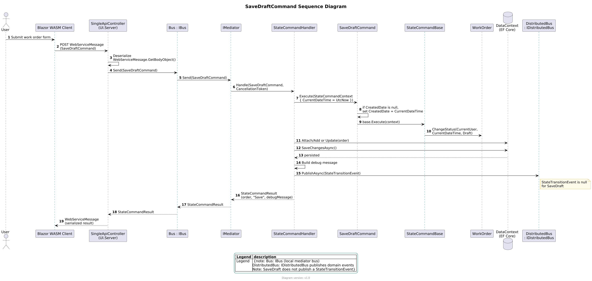
