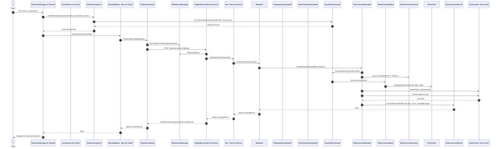

# SaveDraftCommand Sequence Diagram

```mermaid
sequenceDiagram
autonumber

actor user as "User"
participant manage as "WorkOrderManage (UI.Shared)"
participant session as "UserSession (UI.Client)"
participant stateList as "StateCommandList"
participant cBus as "RemotableBus : IBus (UI.Client)"
participant gateway as "PublisherGateway"
participant message as "WebServiceMessage"
participant api as "SingleApiController (UI.Server)"
participant sBus as "Bus : IBus (UI.Server)"
participant mediator as "IMediator"
participant empHandler as "EmployeeQueryHandler"
participant woHandler as "WorkOrderQueryHandler"
participant cmd as "SaveDraftCommand"
participant cmdHandler as "StateCommandHandler"
participant cmdBase as "StateCommandBase"
participant cmdContext as "StateCommandContext"
participant order as "WorkOrder"
participant result as "StateCommandResult"
participant db as "DataContext / SQL Server"

user->>manage: Click "Save" submit button

manage->>stateList: GetMatchingCommand(workOrder, currentUser, "Save")
stateList->>cmd: new SaveDraftCommand(workOrder, currentUser)
cmd-->>stateList: IStateCommand
stateList-->>manage: matchingCommand

manage->>cBus: Send(SaveDraftCommand)
cBus->>gateway: Publish(IRemotableRequest)
gateway->>message: new WebServiceMessage(command)
gateway->>api: POST api/blazor-wasm-single-api
api->>message: GetBodyObject()
api->>sBus: Send(SaveDraftCommand)
sBus->>mediator: Send(SaveDraftCommand)
mediator->>cmdHandler: Handle(StateCommandBase request)
cmdHandler->>cmd: Execute(StateCommandContext)
cmdHandler->>cmdContext: new { CurrentDateTime = UtcNow }
cmd->>cmdBase: base.Execute(context)
cmdBase->>order: ChangeStatus(CurrentUser, date, Draft)
cmdHandler->>db: Attach/Add or Update(order)
cmdHandler->>db: SaveChangesAsync()
db-->>cmdHandler: persisted
cmdHandler->>result: new StateCommandResult(order, "Save", debugMessage)
result-->>mediator: return
mediator-->>sBus: StateCommandResult
sBus-->>api: StateCommandResult
api-->>gateway: WebServiceMessage(StateCommandResult)
gateway-->>cBus: StateCommandResult
cBus-->>manage: result
manage-->>user: NavigateTo("/workorder/search")
```
