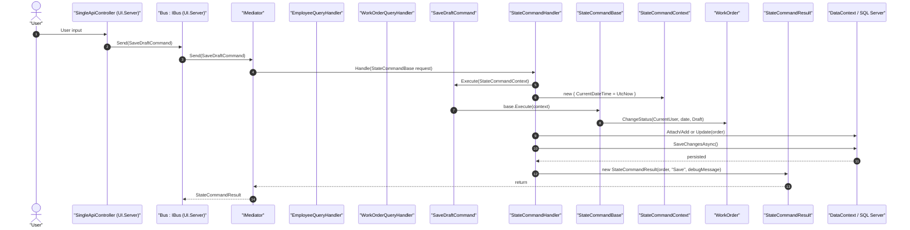

# SaveDraftCommand Sequence Diagram

```mermaid
sequenceDiagram
autonumber

actor user as "User"
participant api as "SingleApiController (UI.Server)"
participant sBus as "Bus : IBus (UI.Server)"
participant mediator as "IMediator"
participant empHandler as "EmployeeQueryHandler"
participant woHandler as "WorkOrderQueryHandler"
participant cmd as "SaveDraftCommand"
participant cmdHandler as "StateCommandHandler"
participant cmdBase as "StateCommandBase"
participant cmdContext as "StateCommandContext"
participant order as "WorkOrder"
participant result as "StateCommandResult"
participant db as "DataContext / SQL Server"

user->>api: User input
api->>sBus: Send(SaveDraftCommand)
sBus->>mediator: Send(SaveDraftCommand)
mediator->>cmdHandler: Handle(StateCommandBase request)
cmdHandler->>cmd: Execute(StateCommandContext)
cmdHandler->>cmdContext: new { CurrentDateTime = UtcNow }
cmd->>cmdBase: base.Execute(context)
cmdBase->>order: ChangeStatus(CurrentUser, date, Draft)
cmdHandler->>db: Attach/Add or Update(order)
cmdHandler->>db: SaveChangesAsync()
db-->>cmdHandler: persisted
cmdHandler->>result: new StateCommandResult(order, "Save", debugMessage)
result-->>mediator: return
mediator-->>sBus: StateCommandResult
```
