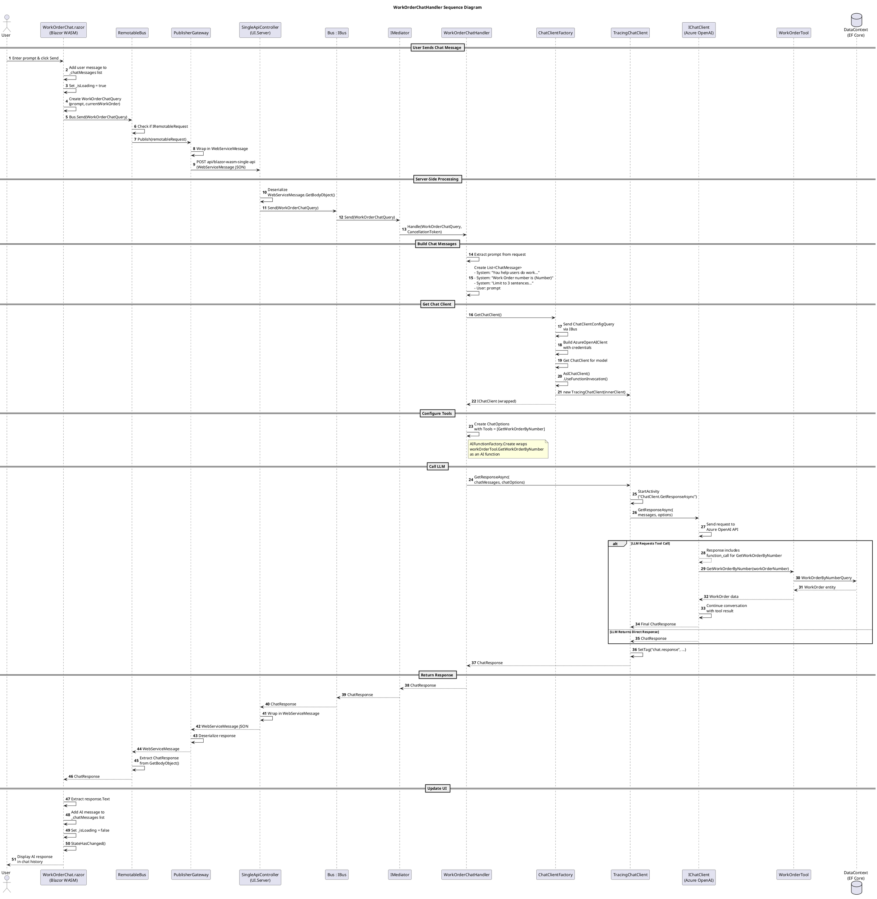

# WorkOrderChatHandler Sequence Diagram

This diagram shows the complete flow of a user chat interaction with the AI assistant on a Work Order, from the Blazor WASM client through the server-side `WorkOrderChatHandler` to Azure OpenAI and back.

## Key Components

| Component | Description |
|-----------|-------------|
| **WorkOrderChat.razor** | Blazor component providing the chat UI for work order AI assistance |
| **RemotableBus** | Client-side bus that routes `IRemotableRequest` messages to the server |
| **PublisherGateway** | HTTP client that serializes and sends requests to `SingleApiController` |
| **SingleApiController** | Server-side API endpoint that deserializes and dispatches messages |
| **WorkOrderChatHandler** | MediatR handler that orchestrates the LLM conversation |
| **ChatClientFactory** | Factory that creates and configures the Azure OpenAI chat client |
| **TracingChatClient** | Decorator that adds distributed tracing to chat operations |
| **WorkOrderTool** | AI function tool that allows the LLM to query work order data |

## Flow Overview

1. **User Input**: User types a prompt in the chat input and clicks Send
2. **Client Transport**: `WorkOrderChatQuery` is wrapped in `WebServiceMessage` and sent via HTTP POST
3. **Server Dispatch**: `SingleApiController` deserializes and routes to `WorkOrderChatHandler` via MediatR
4. **LLM Setup**: Handler builds system prompts with work order context and configures AI function tools
5. **LLM Call**: Request sent to Azure OpenAI with function calling enabled
6. **Tool Invocation**: If LLM needs work order details, it calls `GetWorkOrderByNumber` tool
7. **Response Return**: Final response flows back through the same pipeline to the UI

## PlantUML Diagram

## Related Files

- `src/UI.Shared/Components/WorkOrderChat.razor` - Chat UI component
- `src/LlmGateway/WorkOrderChatHandler.cs` - MediatR request handler
- `src/LlmGateway/WorkOrderChatQuery.cs` - Request/query record
- `src/LlmGateway/WorkOrderTool.cs` - AI function tool for work order queries
- `src/LlmGateway/ChatClientFactory.cs` - Azure OpenAI client factory
- `src/LlmGateway/TracingChatClient.cs` - Tracing decorator for chat client
- `src/UI/Client/RemotableBus.cs` - Client-side remotable bus
- `src/UI/Client/PublisherGateway.cs` - HTTP transport for remotable messages
- `src/UI/Server/Controllers/SingleApiController.cs` - Server-side API endpoint
