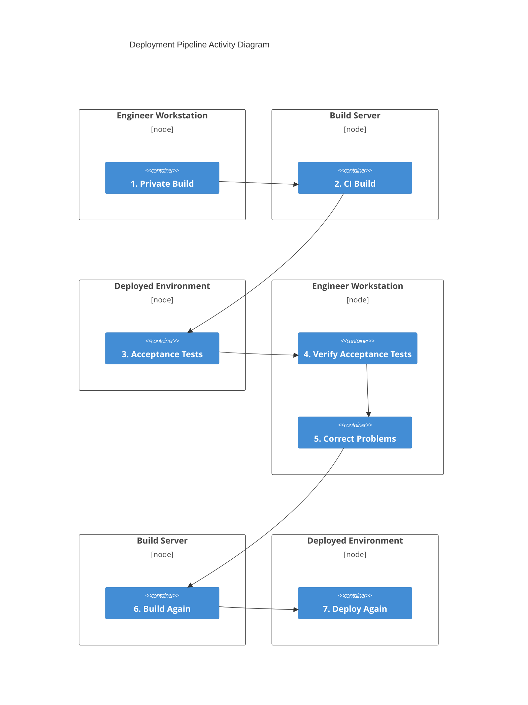

# Deployment Pipeline Activity Diagram

Shows which environment each pipeline step executes in.

```mermaid
C4Deployment
  title Deployment Pipeline Activity Diagram

  Deployment_Node(eng1, "Engineer Workstation") {
    Container(A, "1. Private Build")
  }

  Deployment_Node(build1, "Build Server") {
    Container(B, "2. CI Build")
  }

  Deployment_Node(deploy1, "Deployed Environment") {
    Container(C, "3. Acceptance Tests")
  }

  Deployment_Node(eng2, "Engineer Workstation") {
    Container(D, "4. Verify Acceptance Tests")
    Container(E, "5. Correct Problems")
  }

  Deployment_Node(build2, "Build Server") {
    Container(F, "6. Build Again")
  }

  Deployment_Node(deploy2, "Deployed Environment") {
    Container(G, "7. Deploy Again")
  }

  Rel(A, B, "")
  Rel(B, C, "")
  Rel(C, D, "")
  Rel(D, E, "")
  Rel(E, F, "")
  Rel(F, G, "")
```
