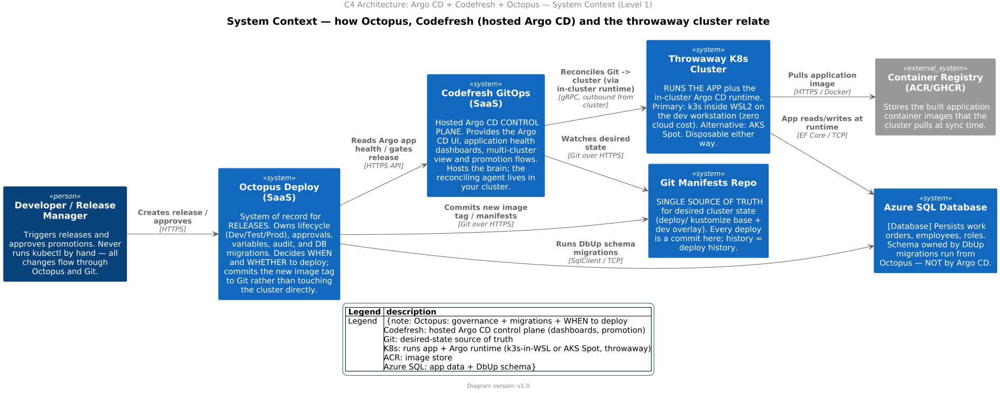
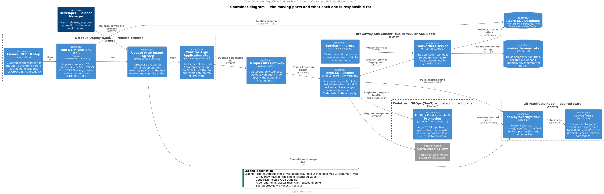
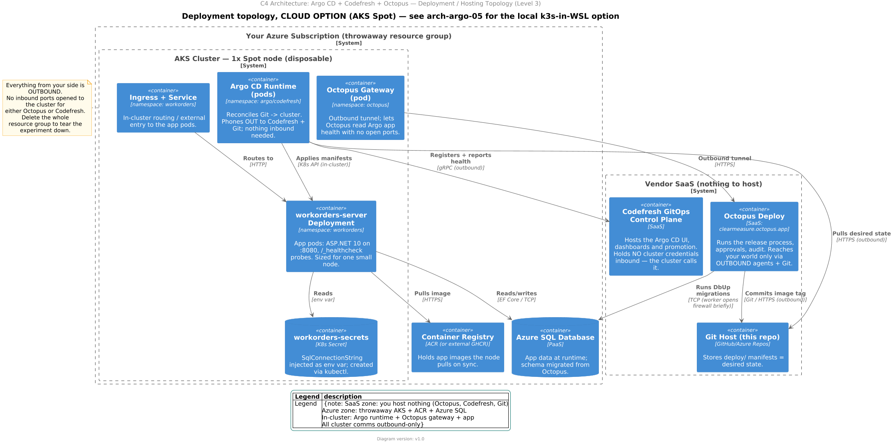
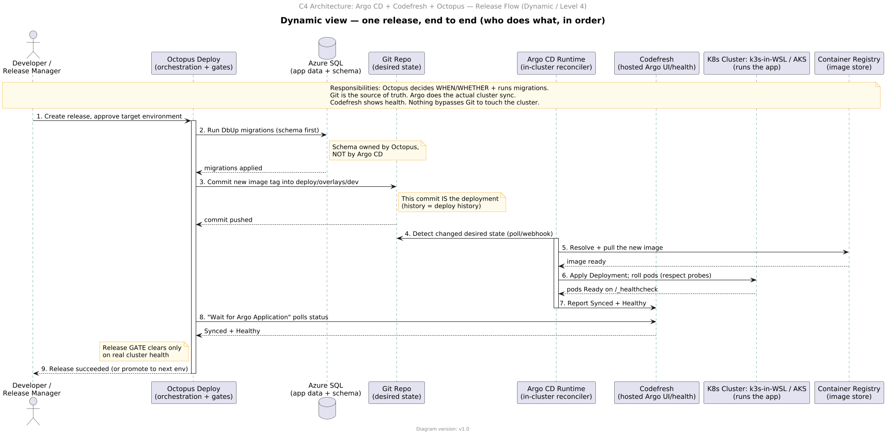
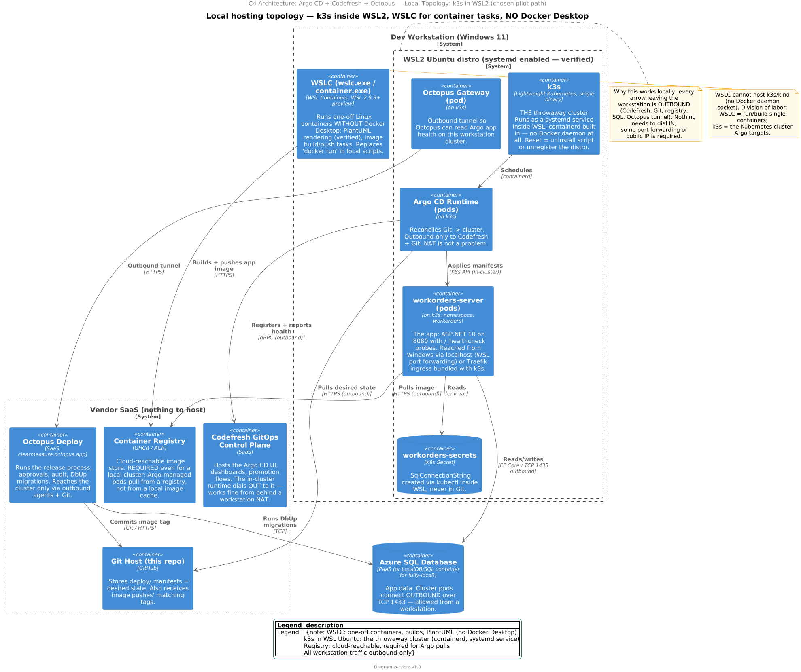

# Argo CD + Codefresh + Octopus — architecture views

Diagrams for the exploration of running this app under **GitOps (Argo CD)** with a
**Codefresh-hosted Argo CD control plane**, orchestrated by the existing **Octopus Deploy**
release process, on a **throwaway Kubernetes cluster** (k3s in WSL2 locally — the chosen pilot
path — or AKS Spot in the cloud). These describe the *exploration target* only —
production stays on Azure Container Apps (`.octopus/deployment_process.ocl`) until proven.

Sources are `arch/arch-argo-0*.puml`; PNG/SVG are rendered from them (see `arch/DIAGRAMS.md`).
The three C4 diagrams use `!pragma layout smetana` so they render without a local Graphviz `dot`.

## The one-sentence model

**Octopus** decides *when/whether* to deploy and runs DB migrations → it **commits an image tag to Git** →
**Argo CD** (in-cluster) reconciles Git onto the cluster → **Codefresh** hosts the Argo UI/health →
Octopus's *Wait for Argo* step gates the release on real cluster health.

## Views

### 1. System Context (Level 1) — `arch-argo-01-context.puml`
Who the actors and systems are and how they relate at the highest level.

### 2. Container / Building Blocks (Level 2) — `arch-argo-02-container.puml`
The moving parts inside each system: Octopus's four process steps, the Git base+overlay,
the Codefresh control plane, and the in-cluster Argo runtime / gateway / app / secret.

### 3. Deployment / Hosting Topology (Level 3) — `arch-argo-03-deployment.puml`
*Where* everything runs — the SaaS zone (you host nothing) vs your Azure throwaway
resource group — and the outbound-only "hosted control plane vs in-cluster runtime" split.
This is the CLOUD (AKS Spot) alternative.

### 4. Release Flow (Dynamic / Level 4) — `arch-argo-04-release-flow.puml`
One release, step by step, showing the hand-offs between Octopus, Git, Argo, Codefresh,
the cluster, the registry and the database.

### 5. Local Topology — k3s in WSL2 (chosen pilot path) — `arch-argo-05-local-k3s-topology.puml`
Local hosting: a k3s cluster in the Ubuntu WSL distro, WSLC for one-off containers/builds,
all traffic outbound-only, no Docker Desktop.

## What stays vs what changes (vs today's ACA process)

| Octopus step | Today (ACA) | Under Argo/Codefresh |
|---|---|---|
| Ensure .NET 10 | keep | keep (unchanged) |
| Run DB migrations (DbUp) | keep | keep (unchanged — Argo never touches the DB) |
| App rollout | `az containerapp update` | **replaced** by *Update Argo Image Tag* (Git commit) |
| Health gate | implicit | **added** *Wait for Argo Application* (Synced + Healthy) |
