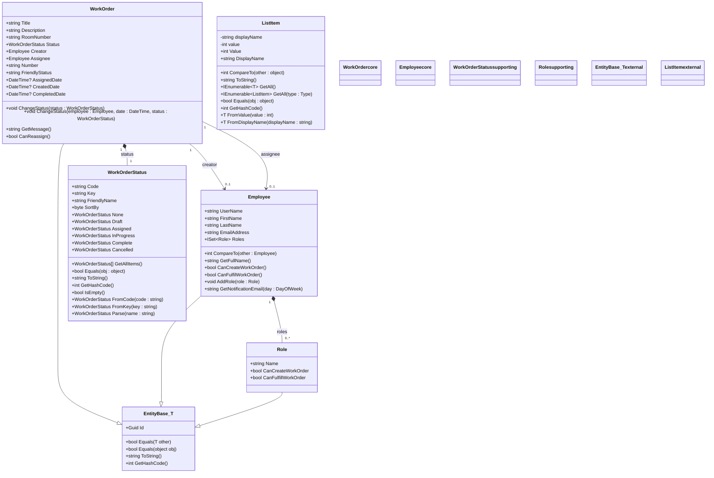

# C4 Architecture: Work Order System domain model

```mermaid
classDiagram

class EntityBase_T {
  +Guid Id
  +bool Equals(T other)
  +bool Equals(object obj)
  +string ToString()
  +int GetHashCode()
}

class WorkOrder {
  +string Title
  +string Description
  +string RoomNumber
  +WorkOrderStatus Status
  +Employee Creator
  +Employee Assignee
  +string Number
  +string FriendlyStatus
  +DateTime? AssignedDate
  +DateTime? CreatedDate
  +DateTime? CompletedDate
  +void ChangeStatus(status : WorkOrderStatus)
  +void ChangeStatus(employee : Employee, date : DateTime, status : WorkOrderStatus)
  +string GetMessage()
  +bool CanReassign()
}

class Employee {
  +string UserName
  +string FirstName
  +string LastName
  +string EmailAddress
  +ISet~Role~ Roles
  +int CompareTo(other : Employee)
  +string GetFullName()
  +bool CanCreateWorkOrder()
  +bool CanFulfilWorkOrder()
  +void AddRole(role : Role)
  +string GetNotificationEmail(day : DayOfWeek)
}

class WorkOrderStatus {
  +string Code
  +string Key
  +string FriendlyName
  +byte SortBy
  +WorkOrderStatus None
  +WorkOrderStatus Draft
  +WorkOrderStatus Assigned
  +WorkOrderStatus InProgress
  +WorkOrderStatus Complete
  +WorkOrderStatus Cancelled
  +WorkOrderStatus[] GetAllItems()
  +bool Equals(obj : object)
  +string ToString()
  +int GetHashCode()
  +bool IsEmpty()
  +WorkOrderStatus FromCode(code : string)
  +WorkOrderStatus FromKey(key : string)
  +WorkOrderStatus Parse(name : string)
}

class Role {
  +string Name
  +bool CanCreateWorkOrder
  +bool CanFulfillWorkOrder
}

class ListItem {
  -string displayName
  -int value
  +int Value
  +string DisplayName
  +int CompareTo(other : object)
  +string ToString()
  +IEnumerable~T~ GetAll()
  +IEnumerable~ListItem~ GetAll(type : Type)
  +bool Equals(obj : object)
  +int GetHashCode()
  +T FromValue(value : int)
  +T FromDisplayName(displayName : string)
}

WorkOrder --|> EntityBase_T
Employee --|> EntityBase_T
Role --|> EntityBase_T

WorkOrder "1" *-- "1" WorkOrderStatus : status
WorkOrder "1" --> "0..1" Employee : creator
WorkOrder "1" --> "0..1" Employee : assignee
Employee "1" *-- "0..*" Role : roles

class WorkOrder core
class Employee core
class WorkOrderStatus supporting
class Role supporting
class EntityBase_T external
class ListItem external
```
