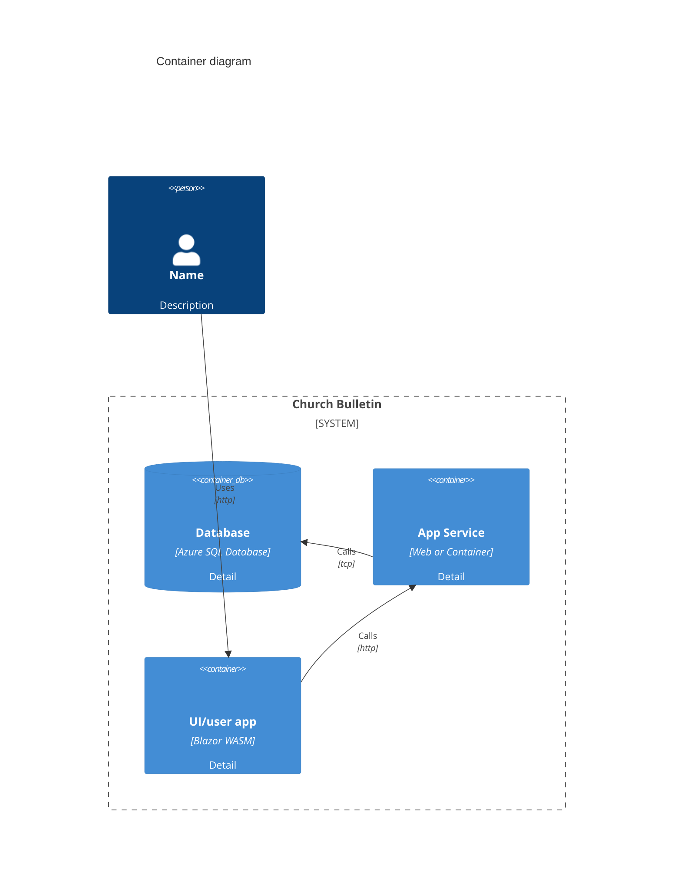

# C4 Architecture: Container Diagram

Icons: [Tabler](https://icones.js.org/collection/tabler) via [icones.js.org](https://icones.js.org/). [Register icon pack](https://mermaid.js.org/config/icons.html) to render (e.g. `@iconify-json/tabler`, name `tabler`).

