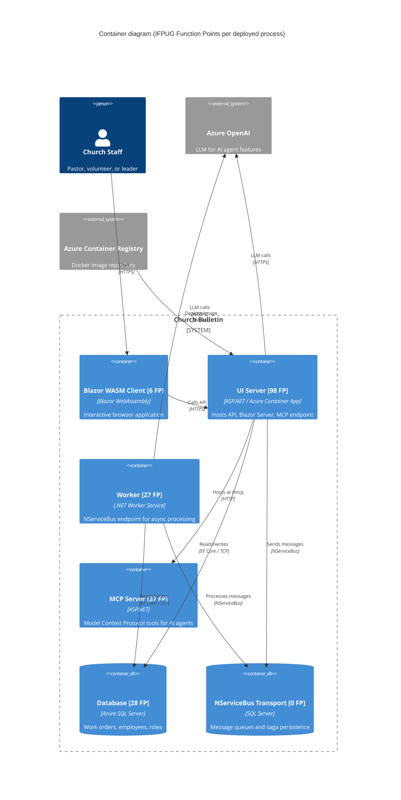

# C4 Architecture: Container Diagram

Icons: [Tabler](https://icones.js.org/collection/tabler) via [icones.js.org](https://icones.js.org/). [Register icon pack](https://mermaid.js.org/config/icons.html) to render (e.g. `@iconify-json/tabler`, name `tabler`).

**IFPUG Function Point count per deployed process** (CPM 4.3.1 / Capers Jones). Totals: **196 UFP** — Data 35 FP (5 ILF), Transactional 161 FP (15 EI, 22 EQ, 6 EO). Per process: UI Server **98**, MCP Server **37**, Worker **27**, Database **28**, Blazor WASM Client **6**, NServiceBus Transport **0**. See [`arch-function-point-analysis.md`](arch-function-point-analysis.md) for the full count.

```mermaid
C4Container
  title Container diagram (IFPUG Function Points per deployed process)

  Person(user, "Church Staff", "Pastor, volunteer, or leader", "tabler:user")

  System_Boundary(system, "Church Bulletin") {
    Container(ui, "Blazor WASM Client [6 FP]", "Blazor WebAssembly", "Interactive browser application", "tabler:app-window")
    Container(server, "UI Server [98 FP]", "ASP.NET / Azure Container App", "Hosts API, Blazor Server, MCP endpoint", "tabler:server")
    Container(worker, "Worker [27 FP]", ".NET Worker Service", "NServiceBus endpoint for async processing", "tabler:settings-automation")
    Container(mcpServer, "MCP Server [37 FP]", "ASP.NET", "Model Context Protocol tools for AI agents", "tabler:robot")
    ContainerDb(db, "Database [28 FP]", "Azure SQL Server", "Work orders, employees, roles", "tabler:database")
    ContainerDb(nsbTransport, "NServiceBus Transport [0 FP]", "SQL Server", "Message queues and saga persistence", "tabler:mail-forward")
  }

  System_Ext(azureOpenAI, "Azure OpenAI", "LLM for AI agent features", "tabler:brain")
  System_Ext(acr, "Azure Container Registry", "Docker image repository", "tabler:box")

  Rel(user, ui, "Uses", "HTTPS")
  Rel(ui, server, "Calls API", "HTTPS")
  Rel(server, db, "Reads/writes", "EF Core / TCP")
  Rel(server, nsbTransport, "Sends messages", "NServiceBus")
  Rel(worker, nsbTransport, "Processes messages", "NServiceBus")
  Rel(worker, db, "Reads/writes", "EF Core / TCP")
  Rel(server, mcpServer, "Hosts at /mcp", "HTTP")
  Rel(server, azureOpenAI, "LLM calls", "HTTPS")
  Rel(worker, azureOpenAI, "LLM calls", "HTTPS")
  Rel(acr, server, "Deploys image", "Docker")
```
