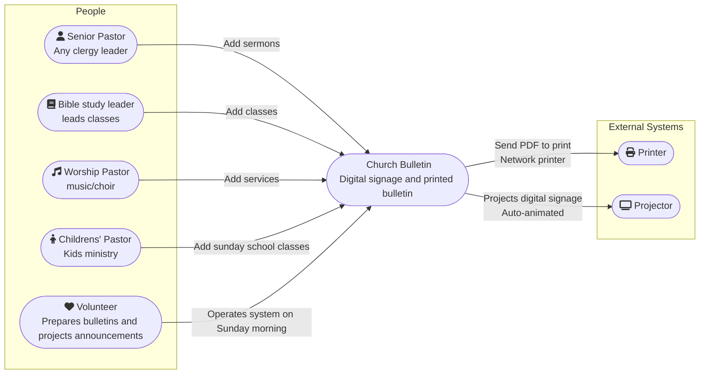

# Church Bulletin System Diagram

```mermaid
flowchart LR
  subgraph Users[People]
    direction TB
    pastor([fa:fa-user Senior Pastor<br/>Any clergy leader])
    biblestudyleader([fa:fa-book Bible study leader<br/>leads classes])
    worshipleader([fa:fa-music Worship Pastor<br/>music/choir])
    childrenspastor([fa:fa-child Childrens' Pastor<br/>Kids ministry])
    volunteer([fa:fa-heart Volunteer<br/>Prepares bulletins and projects announcements])
  end

  churchbulletin([fa:fa-newspaper-o Church Bulletin<br/>Digital signage and printed bulletin])

  subgraph External[External Systems]
    direction TB
    printer([fa:fa-print Printer])
    projector([fa:fa-television Projector])
  end

  pastor -->|Add sermons| churchbulletin
  biblestudyleader -->|Add classes| churchbulletin
  worshipleader -->|Add services| churchbulletin
  childrenspastor -->|Add sunday school classes| churchbulletin
  volunteer -->|Operates system on Sunday morning| churchbulletin

  churchbulletin -->|Send PDF to print<br/>Network printer| printer
  churchbulletin -->|Projects digital signage<br/>Auto-animated| projector

  class pastor,biblestudyleader,worshipleader,childrenspastor,volunteer person;
  class churchbulletin system;
  class printer,projector external;
  class Users,External boundary;
```
