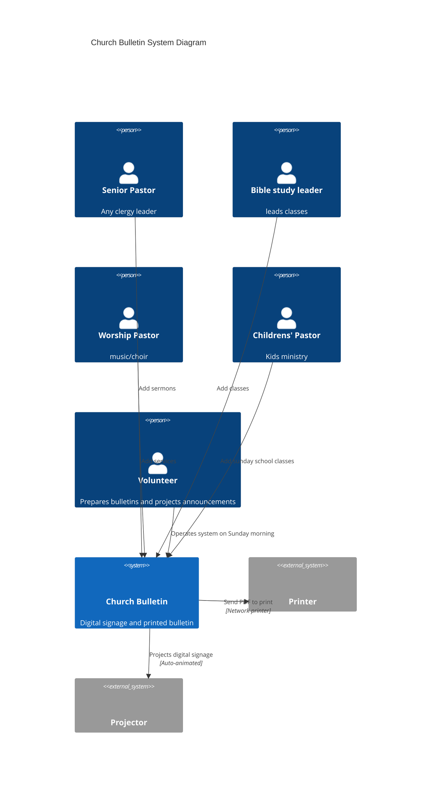

# Church Bulletin System Diagram

Icons use the [Tabler](https://icones.js.org/collection/tabler) pack from [icones.js.org](https://icones.js.org/). To render with icons, [register the icon pack](https://mermaid.js.org/config/icons.html) (e.g. `@iconify-json/tabler`, name `tabler`).

