---

# Architecture Diagrams

> Auto-generated Mermaid C4 and supplementary diagrams describing every layer of the Work Order Management System.

---

## 1. System Context (C4 Level 1)

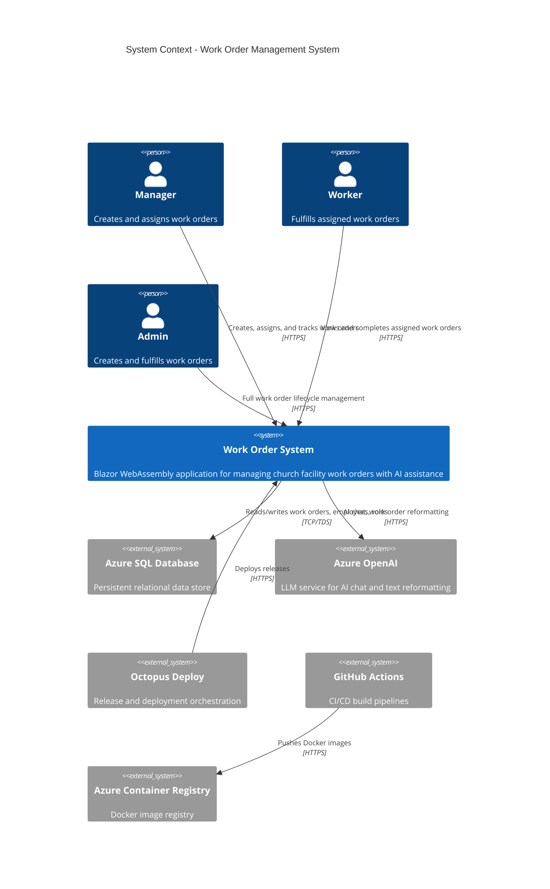
```mermaid
C4Context
    title System Context - Work Order Management System

    Person(manager, "Manager", "Creates and assigns work orders")
    Person(worker, "Worker", "Fulfills assigned work orders")
    Person(admin, "Admin", "Creates and fulfills work orders")

    System(workOrderSystem, "Work Order System", "Blazor WebAssembly application for managing church facility work orders with AI assistance")

    System_Ext(azureSql, "Azure SQL Database", "Persistent relational data store")
    System_Ext(azureOpenAI, "Azure OpenAI", "LLM service for AI chat and text reformatting")
    System_Ext(octopusDeploy, "Octopus Deploy", "Release and deployment orchestration")
    System_Ext(gitHub, "GitHub Actions", "CI/CD build pipelines")
    System_Ext(acr, "Azure Container Registry", "Docker image registry")

    Rel(manager, workOrderSystem, "Creates, assigns, and tracks work orders", "HTTPS")
    Rel(worker, workOrderSystem, "Views and completes assigned work orders", "HTTPS")
    Rel(admin, workOrderSystem, "Full work order lifecycle management", "HTTPS")
    Rel(workOrderSystem, azureSql, "Reads/writes work orders, employees, roles", "TCP/TDS")
    Rel(workOrderSystem, azureOpenAI, "AI chat, work order reformatting", "HTTPS")
    Rel(gitHub, acr, "Pushes Docker images", "HTTPS")
    Rel(octopusDeploy, workOrderSystem, "Deploys releases", "HTTPS")
```

---

## 2. Container Diagrams (C4 Level 2)

### 2.1 UI.Server — Primary Application Host

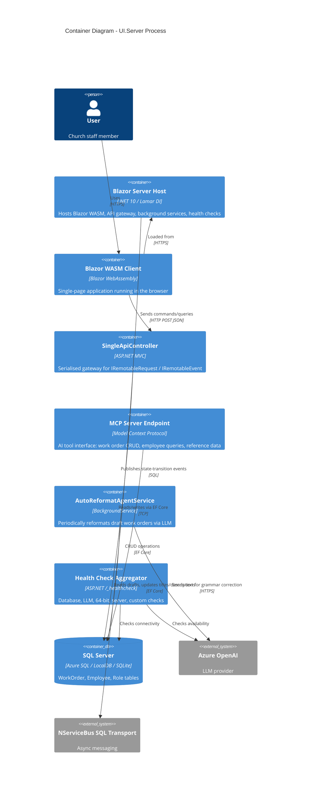
```mermaid
C4Container
    title Container Diagram - UI.Server Process

    Person(user, "User", "Church staff member")

    Container(blazorServer, "Blazor Server Host", ".NET 10 / Lamar DI", "Hosts Blazor WASM, API gateway, background services, health checks")
    Container(blazorWasm, "Blazor WASM Client", "Blazor WebAssembly", "Single-page application running in the browser")
    Container(singleApi, "SingleApiController", "ASP.NET MVC", "Serialised gateway for IRemotableRequest / IRemotableEvent")
    Container(mcpEndpoint, "MCP Server Endpoint", "Model Context Protocol", "AI tool interface: work order CRUD, employee queries, reference data")
    Container(reformatAgent, "AutoReformatAgentService", "BackgroundService", "Periodically reformats draft work orders via LLM")
    Container(healthAgg, "Health Check Aggregator", "ASP.NET /_healthcheck", "Database, LLM, 64-bit, server, custom checks")

    ContainerDb(sqlDb, "SQL Server", "Azure SQL / LocalDB / SQLite", "WorkOrder, Employee, Role tables")
    System_Ext(aiService, "Azure OpenAI", "LLM provider")
    System_Ext(nsbTransport, "NServiceBus SQL Transport", "Async messaging")

    Rel(user, blazorWasm, "Uses", "HTTPS")
    Rel(blazorWasm, blazorServer, "Loaded from", "HTTPS")
    Rel(blazorWasm, singleApi, "Sends commands/queries", "HTTP POST JSON")
    Rel(singleApi, sqlDb, "Reads/writes via EF Core", "TCP")
    Rel(reformatAgent, aiService, "Sends text for grammar correction", "HTTPS")
    Rel(reformatAgent, sqlDb, "Reads drafts, updates titles/descriptions", "EF Core")
    Rel(mcpEndpoint, sqlDb, "CRUD operations", "EF Core")
    Rel(blazorServer, nsbTransport, "Publishes state-transition events", "SQL")
    Rel(healthAgg, sqlDb, "Checks connectivity")
    Rel(healthAgg, aiService, "Checks availability")
```

### 2.2 Worker — Background Message Processing

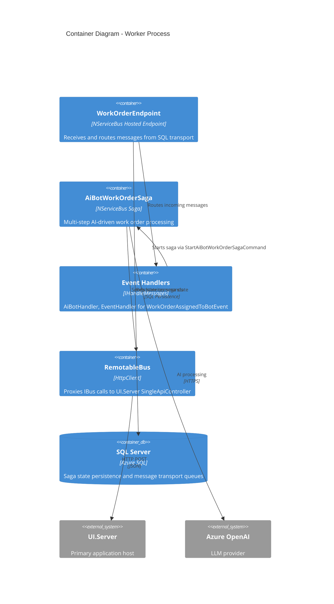
```mermaid
C4Container
    title Container Diagram - Worker Process

    Container(endpoint, "WorkOrderEndpoint", "NServiceBus Hosted Endpoint", "Receives and routes messages from SQL transport")
    Container(saga, "AiBotWorkOrderSaga", "NServiceBus Saga", "Multi-step AI-driven work order processing")
    Container(handlers, "Event Handlers", "IHandleMessages", "AiBotHandler, EventHandler for WorkOrderAssignedToBotEvent")
    Container(remoteBus, "RemotableBus", "HttpClient", "Proxies IBus calls to UI.Server SingleApiController")

    ContainerDb(sqlDb, "SQL Server", "Azure SQL", "Saga state persistence and message transport queues")
    System_Ext(uiServer, "UI.Server", "Primary application host")
    System_Ext(aiService, "Azure OpenAI", "LLM provider")

    Rel(endpoint, handlers, "Routes incoming messages")
    Rel(handlers, saga, "Starts saga via StartAiBotWorkOrderSagaCommand")
    Rel(saga, aiService, "AI processing", "HTTPS")
    Rel(saga, remoteBus, "Sends state commands")
    Rel(remoteBus, uiServer, "HTTP POST", "JSON")
    Rel(endpoint, sqlDb, "Reads/writes saga state", "SQL Persistence")
```

### 2.3 IntegrationTests — Multi-Layer Test Host

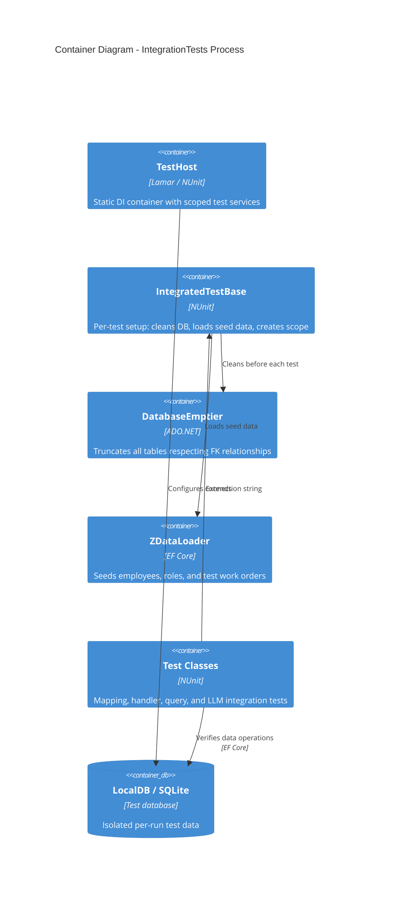
```mermaid
C4Container
    title Container Diagram - IntegrationTests Process

    Container(testHost, "TestHost", "Lamar / NUnit", "Static DI container with scoped test services")
    Container(testBase, "IntegratedTestBase", "NUnit", "Per-test setup: cleans DB, loads seed data, creates scope")
    Container(dbEmptier, "DatabaseEmptier", "ADO.NET", "Truncates all tables respecting FK relationships")
    Container(dataLoader, "ZDataLoader", "EF Core", "Seeds employees, roles, and test work orders")
    Container(testClasses, "Test Classes", "NUnit", "Mapping, handler, query, and LLM integration tests")

    ContainerDb(testDb, "LocalDB / SQLite", "Test database", "Isolated per-run test data")

    Rel(testHost, testDb, "Configures connection string")
    Rel(testBase, dbEmptier, "Cleans before each test")
    Rel(testBase, dataLoader, "Loads seed data")
    Rel(testClasses, testBase, "Extends")
    Rel(testClasses, testDb, "Verifies data operations", "EF Core")
```

### 2.4 AcceptanceTests — End-to-End Browser Tests

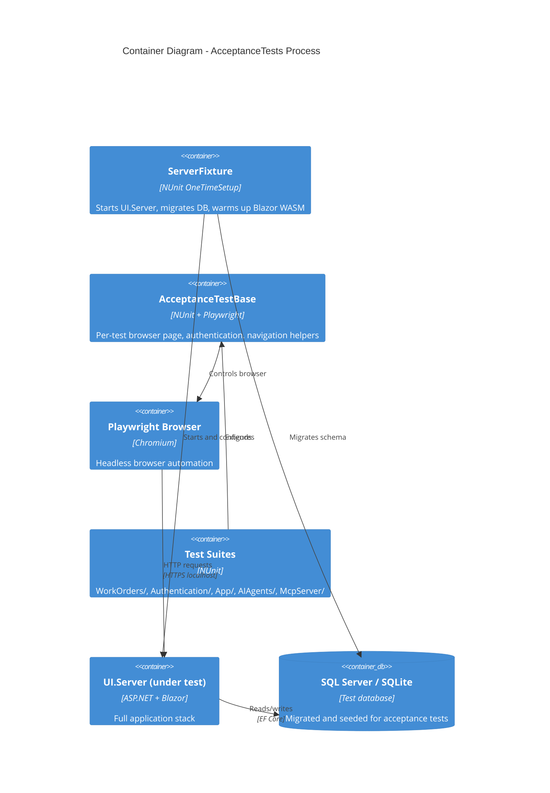
```mermaid
C4Container
    title Container Diagram - AcceptanceTests Process

    Container(serverFixture, "ServerFixture", "NUnit OneTimeSetup", "Starts UI.Server, migrates DB, warms up Blazor WASM")
    Container(testBase, "AcceptanceTestBase", "NUnit + Playwright", "Per-test browser page, authentication, navigation helpers")
    Container(playwright, "Playwright Browser", "Chromium", "Headless browser automation")
    Container(testClasses, "Test Suites", "NUnit", "WorkOrders/, Authentication/, App/, AIAgents/, McpServer/")

    Container(uiServer, "UI.Server (under test)", "ASP.NET + Blazor", "Full application stack")
    ContainerDb(testDb, "SQL Server / SQLite", "Test database", "Migrated and seeded for acceptance tests")

    Rel(serverFixture, uiServer, "Starts and configures")
    Rel(serverFixture, testDb, "Migrates schema")
    Rel(testClasses, testBase, "Extends")
    Rel(testBase, playwright, "Controls browser")
    Rel(playwright, uiServer, "HTTP requests", "HTTPS localhost")
    Rel(uiServer, testDb, "Reads/writes", "EF Core")
```

---

## 3. Component Diagrams (C4 Level 3)

### 3.1 Core — Domain Layer (No External Dependencies)

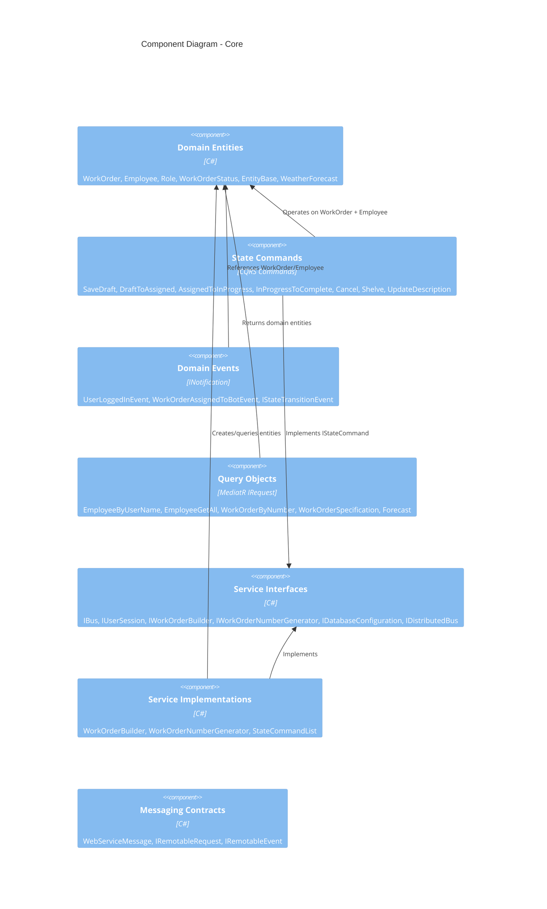
```mermaid
C4Component
    title Component Diagram - Core

    Component(domainEntities, "Domain Entities", "C#", "WorkOrder, Employee, Role, WorkOrderStatus, EntityBase, WeatherForecast")
    Component(stateCommands, "State Commands", "CQRS Commands", "SaveDraft, DraftToAssigned, AssignedToInProgress, InProgressToComplete, Cancel, Shelve, UpdateDescription")
    Component(domainEvents, "Domain Events", "INotification", "UserLoggedInEvent, WorkOrderAssignedToBotEvent, IStateTransitionEvent")
    Component(queries, "Query Objects", "MediatR IRequest", "EmployeeByUserName, EmployeeGetAll, WorkOrderByNumber, WorkOrderSpecification, Forecast")
    Component(serviceInterfaces, "Service Interfaces", "C#", "IBus, IUserSession, IWorkOrderBuilder, IWorkOrderNumberGenerator, IDatabaseConfiguration, IDistributedBus")
    Component(serviceImpl, "Service Implementations", "C#", "WorkOrderBuilder, WorkOrderNumberGenerator, StateCommandList")
    Component(messaging, "Messaging Contracts", "C#", "WebServiceMessage, IRemotableRequest, IRemotableEvent")

    Rel(stateCommands, domainEntities, "Operates on WorkOrder + Employee")
    Rel(stateCommands, serviceInterfaces, "Implements IStateCommand")
    Rel(queries, domainEntities, "Returns domain entities")
    Rel(serviceImpl, serviceInterfaces, "Implements")
    Rel(serviceImpl, domainEntities, "Creates/queries entities")
    Rel(domainEvents, domainEntities, "References WorkOrder/Employee")
```

### 3.2 DataAccess — EF Core + MediatR Handlers

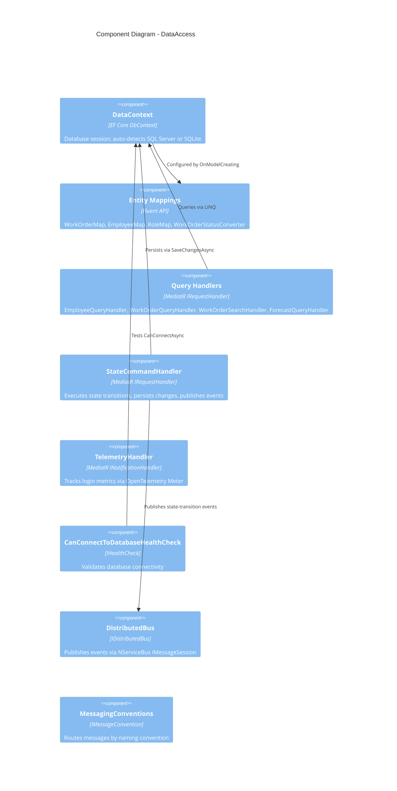
```mermaid
C4Component
    title Component Diagram - DataAccess

    Component(dataContext, "DataContext", "EF Core DbContext", "Database session; auto-detects SQL Server or SQLite")
    Component(mappings, "Entity Mappings", "Fluent API", "WorkOrderMap, EmployeeMap, RoleMap, WorkOrderStatusConverter")
    Component(queryHandlers, "Query Handlers", "MediatR IRequestHandler", "EmployeeQueryHandler, WorkOrderQueryHandler, WorkOrderSearchHandler, ForecastQueryHandler")
    Component(stateHandler, "StateCommandHandler", "MediatR IRequestHandler", "Executes state transitions, persists changes, publishes events")
    Component(telemetry, "TelemetryHandler", "MediatR INotificationHandler", "Tracks login metrics via OpenTelemetry Meter")
    Component(healthCheck, "CanConnectToDatabaseHealthCheck", "IHealthCheck", "Validates database connectivity")
    Component(distBus, "DistributedBus", "IDistributedBus", "Publishes events via NServiceBus IMessageSession")
    Component(conventions, "MessagingConventions", "IMessageConvention", "Routes messages by naming convention")

    Rel(queryHandlers, dataContext, "Queries via LINQ")
    Rel(stateHandler, dataContext, "Persists via SaveChangesAsync")
    Rel(stateHandler, distBus, "Publishes state-transition events")
    Rel(dataContext, mappings, "Configured by OnModelCreating")
    Rel(healthCheck, dataContext, "Tests CanConnectAsync")
```

### 3.3 Database — Migration Tool

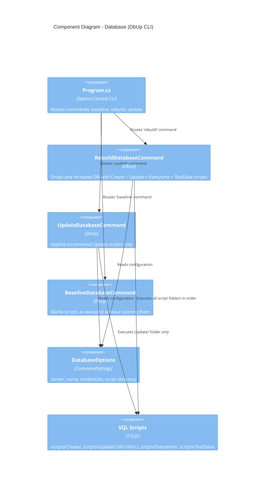
```mermaid
C4Component
    title Component Diagram - Database (DbUp CLI)

    Component(cli, "Program.cs", "Spectre.Console CLI", "Routes commands: baseline, rebuild, update")
    Component(rebuild, "RebuildDatabaseCommand", "DbUp", "Drops and recreates DB with Create + Update + Everytime + TestData scripts")
    Component(update, "UpdateDatabaseCommand", "DbUp", "Applies incremental Update scripts only")
    Component(baseline, "BaselineDatabaseCommand", "DbUp", "Marks scripts as executed without running them")
    Component(options, "DatabaseOptions", "CommandSettings", "Server, name, credentials, script directory")
    Component(scripts, "SQL Scripts", "T-SQL", "scripts/Create/, scripts/Update/ (001-005+), scripts/Everytime/, scripts/TestData/")

    Rel(cli, rebuild, "Routes 'rebuild' command")
    Rel(cli, update, "Routes 'update' command")
    Rel(cli, baseline, "Routes 'baseline' command")
    Rel(rebuild, scripts, "Executes all script folders in order")
    Rel(update, scripts, "Executes Update/ folder only")
    Rel(rebuild, options, "Reads configuration")
    Rel(update, options, "Reads configuration")
```

### 3.4 UI.Server — Application Host

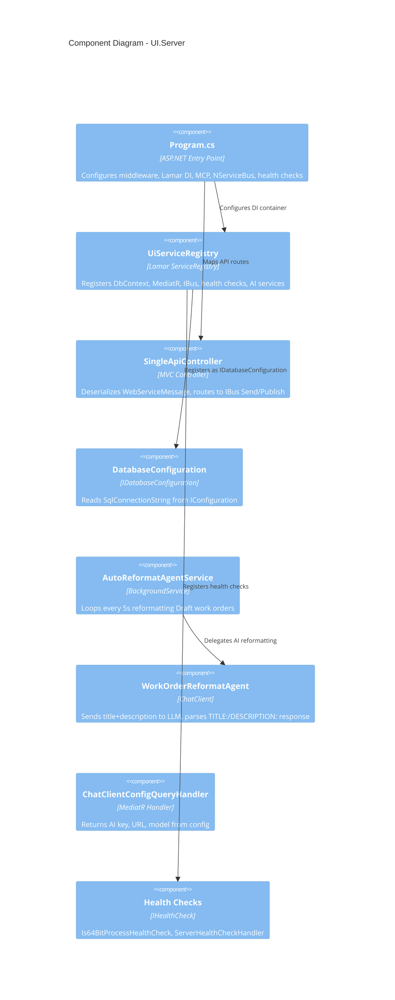
```mermaid
C4Component
    title Component Diagram - UI.Server

    Component(program, "Program.cs", "ASP.NET Entry Point", "Configures middleware, Lamar DI, MCP, NServiceBus, health checks")
    Component(registry, "UiServiceRegistry", "Lamar ServiceRegistry", "Registers DbContext, MediatR, IBus, health checks, AI services")
    Component(singleApi, "SingleApiController", "MVC Controller", "Deserializes WebServiceMessage, routes to IBus Send/Publish")
    Component(dbConfig, "DatabaseConfiguration", "IDatabaseConfiguration", "Reads SqlConnectionString from IConfiguration")
    Component(reformatAgent, "AutoReformatAgentService", "BackgroundService", "Loops every 5s reformatting Draft work orders")
    Component(reformatWorker, "WorkOrderReformatAgent", "ChatClient", "Sends title+description to LLM, parses TITLE:/DESCRIPTION: response")
    Component(chatConfigHandler, "ChatClientConfigQueryHandler", "MediatR Handler", "Returns AI key, URL, model from config")
    Component(healthChecks, "Health Checks", "IHealthCheck", "Is64BitProcessHealthCheck, ServerHealthCheckHandler")

    Rel(program, registry, "Configures DI container")
    Rel(program, singleApi, "Maps API routes")
    Rel(reformatAgent, reformatWorker, "Delegates AI reformatting")
    Rel(registry, dbConfig, "Registers as IDatabaseConfiguration")
    Rel(registry, healthChecks, "Registers health checks")
```

### 3.5 UI.Client — Blazor WebAssembly

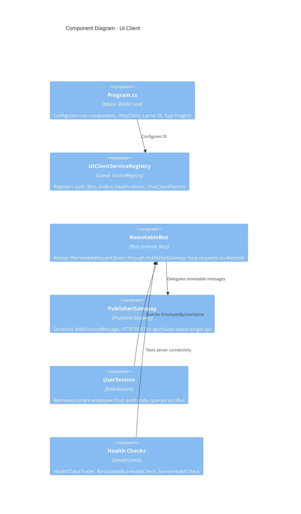
```mermaid
C4Component
    title Component Diagram - UI.Client

    Component(program, "Program.cs", "Blazor WASM Host", "Configures root components, HttpClient, Lamar DI, App Insights")
    Component(registry, "UIClientServiceRegistry", "Lamar ServiceRegistry", "Registers auth, IBus, IUiBus, health checks, ChatClientFactory")
    Component(remotableBus, "RemotableBus", "IBus (extends Bus)", "Routes IRemotableRequest/Event through PublisherGateway; local requests via MediatR")
    Component(gateway, "PublisherGateway", "IPublisherGateway", "Serializes WebServiceMessage, HTTP POST to api/blazor-wasm-single-api")
    Component(userSession, "UserSession", "IUserSession", "Retrieves current employee from auth state, queries via IBus")
    Component(healthChecks, "Health Checks", "IHealthCheck", "HealthCheckTracer, RemotableBusHealthCheck, ServerHealthCheck")

    Rel(program, registry, "Configures DI")
    Rel(remotableBus, gateway, "Delegates remotable messages")
    Rel(userSession, remotableBus, "Queries EmployeeByUserName")
    Rel(healthChecks, remotableBus, "Tests server connectivity")
```

### 3.6 UI.Api — Web API Endpoints

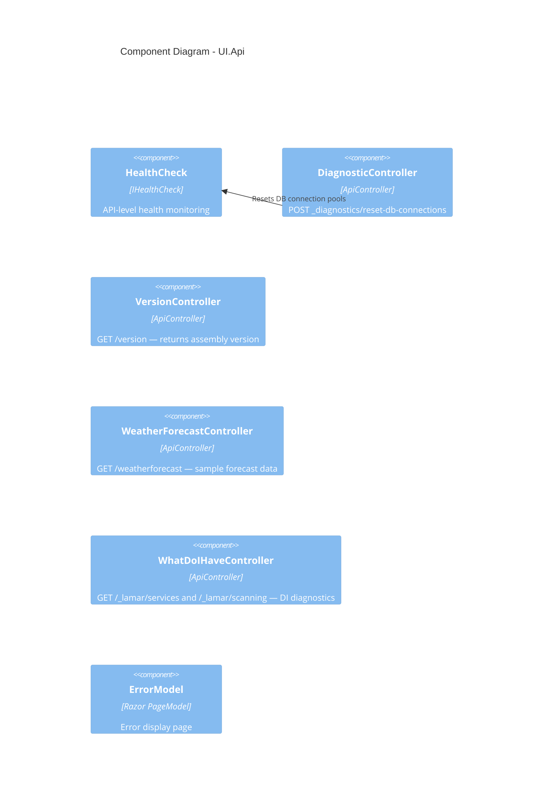
```mermaid
C4Component
    title Component Diagram - UI.Api

    Component(healthCheck, "HealthCheck", "IHealthCheck", "API-level health monitoring")
    Component(diagnosticCtrl, "DiagnosticController", "ApiController", "POST _diagnostics/reset-db-connections")
    Component(versionCtrl, "VersionController", "ApiController", "GET /version — returns assembly version")
    Component(weatherCtrl, "WeatherForecastController", "ApiController", "GET /weatherforecast — sample forecast data")
    Component(lamarCtrl, "WhatDoIHaveController", "ApiController", "GET /_lamar/services and /_lamar/scanning — DI diagnostics")
    Component(errorPage, "ErrorModel", "Razor PageModel", "Error display page")

    Rel(diagnosticCtrl, healthCheck, "Resets DB connection pools")
```

### 3.7 UI.Shared — Shared Blazor Components

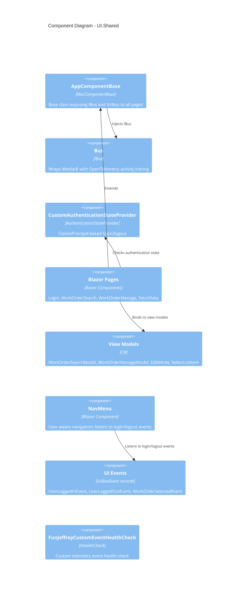
```mermaid
C4Component
    title Component Diagram - UI.Shared

    Component(appBase, "AppComponentBase", "MvcComponentBase", "Base class exposing IBus and IUiBus to all pages")
    Component(bus, "Bus", "IBus", "Wraps MediatR with OpenTelemetry activity tracing")
    Component(authProvider, "CustomAuthenticationStateProvider", "AuthenticationStateProvider", "ClaimsPrincipal-based login/logout")
    Component(pages, "Blazor Pages", "Razor Components", "Login, WorkOrderSearch, WorkOrderManage, FetchData")
    Component(models, "View Models", "C#", "WorkOrderSearchModel, WorkOrderManageModel, EditMode, SelectListItem")
    Component(navMenu, "NavMenu", "Blazor Component", "User-aware navigation; listens to login/logout events")
    Component(uiEvents, "UI Events", "IUiBusEvent records", "UserLoggedInEvent, UserLoggedOutEvent, WorkOrderSelectedEvent")
    Component(funHealth, "FunJeffreyCustomEventHealthCheck", "IHealthCheck", "Custom telemetry event health check")

    Rel(pages, appBase, "Extends")
    Rel(appBase, bus, "Injects IBus")
    Rel(pages, models, "Binds to view models")
    Rel(pages, authProvider, "Checks authentication state")
    Rel(navMenu, uiEvents, "Listens to login/logout events")
```

### 3.8 LlmGateway — AI / LLM Integration

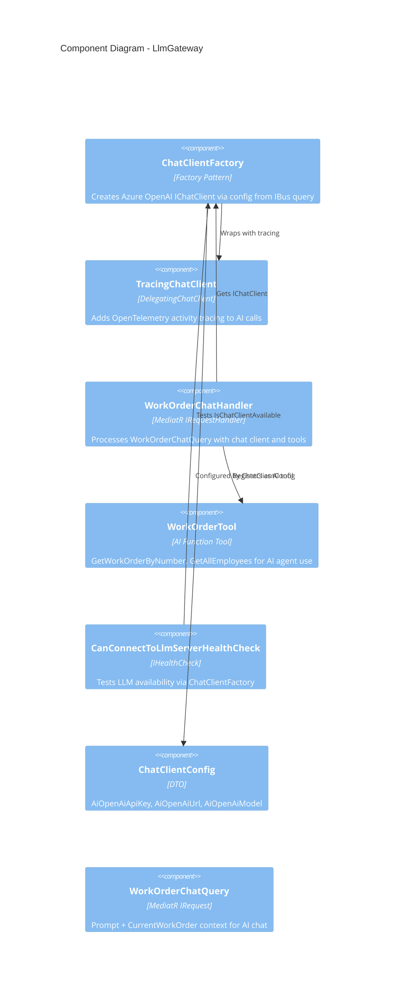
```mermaid
C4Component
    title Component Diagram - LlmGateway

    Component(chatFactory, "ChatClientFactory", "Factory Pattern", "Creates Azure OpenAI IChatClient via config from IBus query")
    Component(tracingClient, "TracingChatClient", "DelegatingChatClient", "Adds OpenTelemetry activity tracing to AI calls")
    Component(chatHandler, "WorkOrderChatHandler", "MediatR IRequestHandler", "Processes WorkOrderChatQuery with chat client and tools")
    Component(workOrderTool, "WorkOrderTool", "AI Function Tool", "GetWorkOrderByNumber, GetAllEmployees for AI agent use")
    Component(healthCheck, "CanConnectToLlmServerHealthCheck", "IHealthCheck", "Tests LLM availability via ChatClientFactory")
    Component(config, "ChatClientConfig", "DTO", "AiOpenAiApiKey, AiOpenAiUrl, AiOpenAiModel")
    Component(chatQuery, "WorkOrderChatQuery", "MediatR IRequest", "Prompt + CurrentWorkOrder context for AI chat")

    Rel(chatHandler, chatFactory, "Gets IChatClient")
    Rel(chatFactory, tracingClient, "Wraps with tracing")
    Rel(chatHandler, workOrderTool, "Registers as AI tool")
    Rel(healthCheck, chatFactory, "Tests IsChatClientAvailable")
    Rel(chatFactory, config, "Configured by ChatClientConfig")
```

### 3.9 Worker — NServiceBus Hosted Endpoint

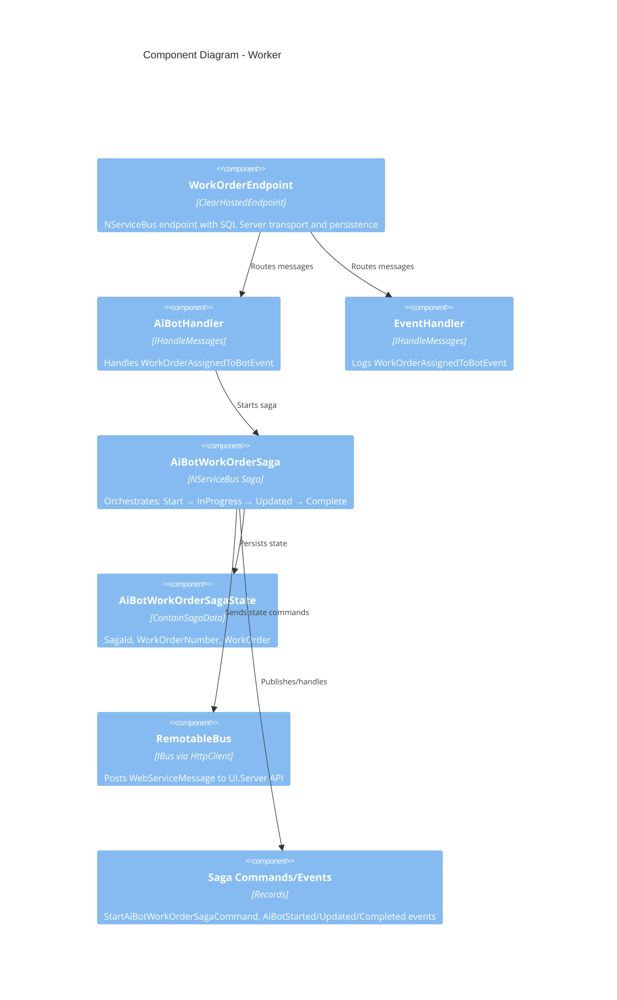
```mermaid
C4Component
    title Component Diagram - Worker

    Component(endpoint, "WorkOrderEndpoint", "ClearHostedEndpoint", "NServiceBus endpoint with SQL Server transport and persistence")
    Component(aiBotHandler, "AiBotHandler", "IHandleMessages", "Handles WorkOrderAssignedToBotEvent")
    Component(eventHandler, "EventHandler", "IHandleMessages", "Logs WorkOrderAssignedToBotEvent")
    Component(saga, "AiBotWorkOrderSaga", "NServiceBus Saga", "Orchestrates: Start → InProgress → Updated → Complete")
    Component(sagaState, "AiBotWorkOrderSagaState", "ContainSagaData", "SagaId, WorkOrderNumber, WorkOrder")
    Component(remoteBus, "RemotableBus", "IBus via HttpClient", "Posts WebServiceMessage to UI.Server API")
    Component(sagaMessages, "Saga Commands/Events", "Records", "StartAiBotWorkOrderSagaCommand, AiBotStarted/Updated/Completed events")

    Rel(endpoint, aiBotHandler, "Routes messages")
    Rel(endpoint, eventHandler, "Routes messages")
    Rel(aiBotHandler, saga, "Starts saga")
    Rel(saga, sagaState, "Persists state")
    Rel(saga, remoteBus, "Sends state commands")
    Rel(saga, sagaMessages, "Publishes/handles")
```

### 3.10 McpServer — Model Context Protocol Server

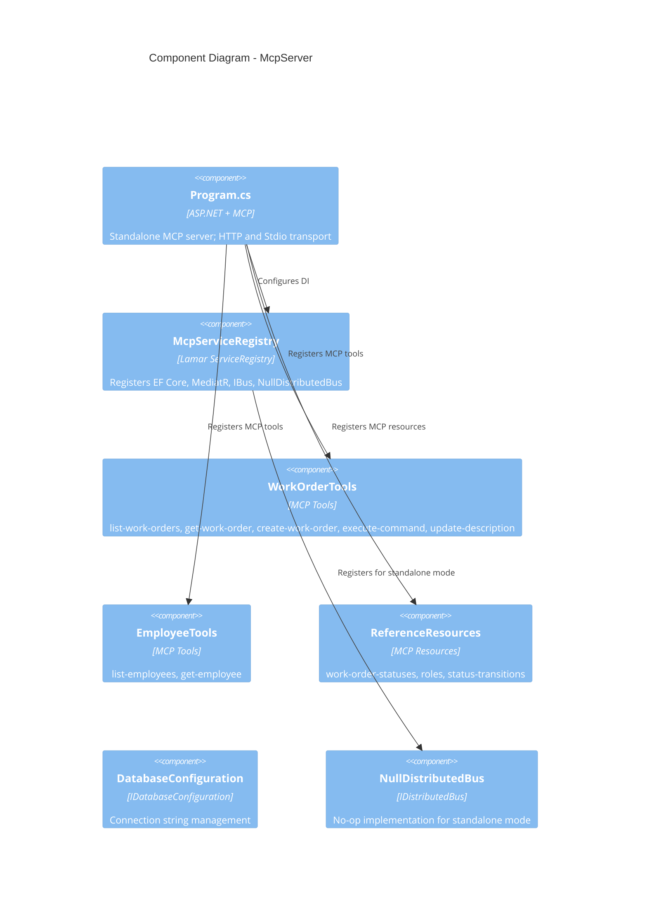
```mermaid
C4Component
    title Component Diagram - McpServer

    Component(program, "Program.cs", "ASP.NET + MCP", "Standalone MCP server; HTTP and Stdio transport")
    Component(registry, "McpServiceRegistry", "Lamar ServiceRegistry", "Registers EF Core, MediatR, IBus, NullDistributedBus")
    Component(workOrderTools, "WorkOrderTools", "MCP Tools", "list-work-orders, get-work-order, create-work-order, execute-command, update-description")
    Component(employeeTools, "EmployeeTools", "MCP Tools", "list-employees, get-employee")
    Component(resources, "ReferenceResources", "MCP Resources", "work-order-statuses, roles, status-transitions")
    Component(dbConfig, "DatabaseConfiguration", "IDatabaseConfiguration", "Connection string management")
    Component(nullBus, "NullDistributedBus", "IDistributedBus", "No-op implementation for standalone mode")

    Rel(program, registry, "Configures DI")
    Rel(program, workOrderTools, "Registers MCP tools")
    Rel(program, employeeTools, "Registers MCP tools")
    Rel(program, resources, "Registers MCP resources")
    Rel(registry, nullBus, "Registers for standalone mode")
```

### 3.11 ChurchBulletin.AppHost — .NET Aspire Orchestrator

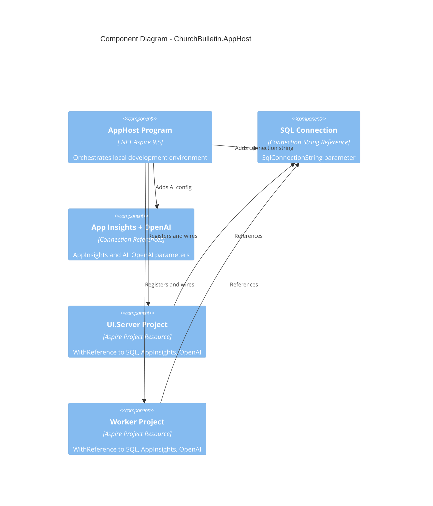
```mermaid
C4Component
    title Component Diagram - ChurchBulletin.AppHost

    Component(appHost, "AppHost Program", ".NET Aspire 9.5", "Orchestrates local development environment")
    Component(sqlRef, "SQL Connection", "Connection String Reference", "SqlConnectionString parameter")
    Component(aiRef, "App Insights + OpenAI", "Connection References", "AppInsights and AI_OpenAI parameters")
    Component(uiProject, "UI.Server Project", "Aspire Project Resource", "WithReference to SQL, AppInsights, OpenAI")
    Component(workerProject, "Worker Project", "Aspire Project Resource", "WithReference to SQL, AppInsights, OpenAI")

    Rel(appHost, sqlRef, "Adds connection string")
    Rel(appHost, aiRef, "Adds AI config")
    Rel(appHost, uiProject, "Registers and wires")
    Rel(appHost, workerProject, "Registers and wires")
    Rel(uiProject, sqlRef, "References")
    Rel(workerProject, sqlRef, "References")
```

### 3.12 ChurchBulletin.ServiceDefaults — Aspire Shared Defaults

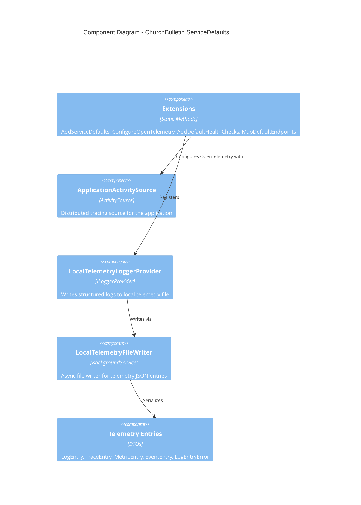
```mermaid
C4Component
    title Component Diagram - ChurchBulletin.ServiceDefaults

    Component(extensions, "Extensions", "Static Methods", "AddServiceDefaults, ConfigureOpenTelemetry, AddDefaultHealthChecks, MapDefaultEndpoints")
    Component(activitySource, "ApplicationActivitySource", "ActivitySource", "Distributed tracing source for the application")
    Component(telemetryProvider, "LocalTelemetryLoggerProvider", "ILoggerProvider", "Writes structured logs to local telemetry file")
    Component(fileWriter, "LocalTelemetryFileWriter", "BackgroundService", "Async file writer for telemetry JSON entries")
    Component(entries, "Telemetry Entries", "DTOs", "LogEntry, TraceEntry, MetricEntry, EventEntry, LogEntryError")

    Rel(extensions, activitySource, "Configures OpenTelemetry with")
    Rel(extensions, telemetryProvider, "Registers")
    Rel(telemetryProvider, fileWriter, "Writes via")
    Rel(fileWriter, entries, "Serializes")
```

### 3.13 UnitTests

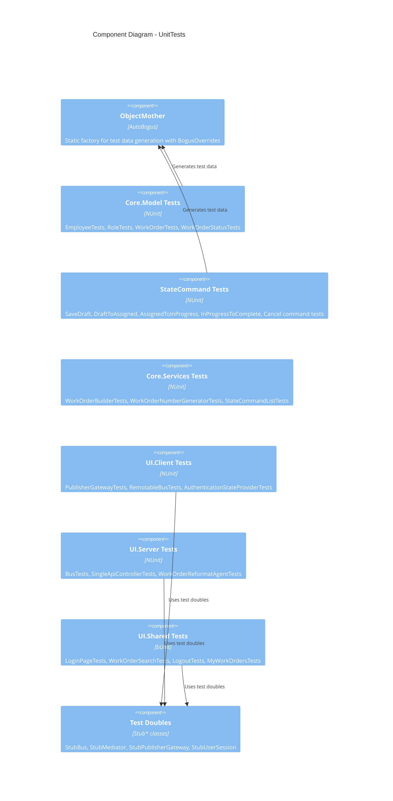
```mermaid
C4Component
    title Component Diagram - UnitTests

    Component(objectMother, "ObjectMother", "AutoBogus", "Static factory for test data generation with BogusOverrides")
    Component(coreModelTests, "Core.Model Tests", "NUnit", "EmployeeTests, RoleTests, WorkOrderTests, WorkOrderStatusTests")
    Component(stateCommandTests, "StateCommand Tests", "NUnit", "SaveDraft, DraftToAssigned, AssignedToInProgress, InProgressToComplete, Cancel command tests")
    Component(serviceTests, "Core.Services Tests", "NUnit", "WorkOrderBuilderTests, WorkOrderNumberGeneratorTests, StateCommandListTests")
    Component(uiClientTests, "UI.Client Tests", "NUnit", "PublisherGatewayTests, RemotableBusTests, AuthenticationStateProviderTests")
    Component(uiServerTests, "UI.Server Tests", "NUnit", "BusTests, SingleApiControllerTests, WorkOrderReformatAgentTests")
    Component(uiSharedTests, "UI.Shared Tests", "bUnit", "LoginPageTests, WorkOrderSearchTests, LogoutTests, MyWorkOrdersTests")
    Component(stubs, "Test Doubles", "Stub* classes", "StubBus, StubMediator, StubPublisherGateway, StubUserSession")

    Rel(coreModelTests, objectMother, "Generates test data")
    Rel(stateCommandTests, objectMother, "Generates test data")
    Rel(uiClientTests, stubs, "Uses test doubles")
    Rel(uiServerTests, stubs, "Uses test doubles")
    Rel(uiSharedTests, stubs, "Uses test doubles")
```

### 3.14 IntegrationTests

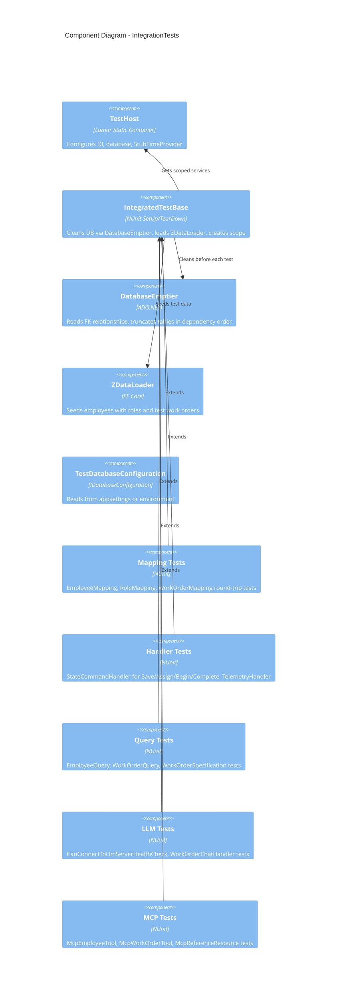
```mermaid
C4Component
    title Component Diagram - IntegrationTests

    Component(testHost, "TestHost", "Lamar Static Container", "Configures DI, database, StubTimeProvider")
    Component(testBase, "IntegratedTestBase", "NUnit SetUp/TearDown", "Cleans DB via DatabaseEmptier, loads ZDataLoader, creates scope")
    Component(dbEmptier, "DatabaseEmptier", "ADO.NET", "Reads FK relationships, truncates tables in dependency order")
    Component(dataLoader, "ZDataLoader", "EF Core", "Seeds employees with roles and test work orders")
    Component(dbConfig, "TestDatabaseConfiguration", "IDatabaseConfiguration", "Reads from appsettings or environment")
    Component(mappingTests, "Mapping Tests", "NUnit", "EmployeeMapping, RoleMapping, WorkOrderMapping round-trip tests")
    Component(handlerTests, "Handler Tests", "NUnit", "StateCommandHandler for Save/Assign/Begin/Complete, TelemetryHandler")
    Component(queryTests, "Query Tests", "NUnit", "EmployeeQuery, WorkOrderQuery, WorkOrderSpecification tests")
    Component(llmTests, "LLM Tests", "NUnit", "CanConnectToLlmServerHealthCheck, WorkOrderChatHandler tests")
    Component(mcpTests, "MCP Tests", "NUnit", "McpEmployeeTool, McpWorkOrderTool, McpReferenceResource tests")

    Rel(testBase, dbEmptier, "Cleans before each test")
    Rel(testBase, dataLoader, "Seeds test data")
    Rel(testBase, testHost, "Gets scoped services")
    Rel(mappingTests, testBase, "Extends")
    Rel(handlerTests, testBase, "Extends")
    Rel(queryTests, testBase, "Extends")
    Rel(llmTests, testBase, "Extends")
    Rel(mcpTests, testBase, "Extends")
```

### 3.15 AcceptanceTests

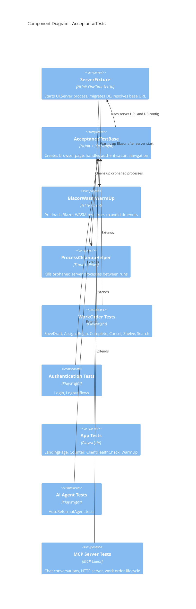
```mermaid
C4Component
    title Component Diagram - AcceptanceTests

    Component(serverFixture, "ServerFixture", "NUnit OneTimeSetUp", "Starts UI.Server process, migrates DB, resolves base URL")
    Component(testBase, "AcceptanceTestBase", "NUnit + Playwright", "Creates browser page, handles authentication, navigation")
    Component(warmUp, "BlazorWasmWarmUp", "HTTP Client", "Pre-loads Blazor WASM resources to avoid timeouts")
    Component(cleanup, "ProcessCleanupHelper", "Static Utilities", "Kills orphaned server processes between runs")
    Component(workOrderTests, "WorkOrder Tests", "Playwright", "SaveDraft, Assign, Begin, Complete, Cancel, Shelve, Search")
    Component(authTests, "Authentication Tests", "Playwright", "Login, Logout flows")
    Component(appTests, "App Tests", "Playwright", "LandingPage, Counter, ClientHealthCheck, WarmUp")
    Component(aiTests, "AI Agent Tests", "Playwright", "AutoReformatAgent tests")
    Component(mcpTests, "MCP Server Tests", "MCP Client", "Chat conversations, HTTP server, work order lifecycle")

    Rel(workOrderTests, testBase, "Extends")
    Rel(authTests, testBase, "Extends")
    Rel(appTests, testBase, "Extends")
    Rel(aiTests, testBase, "Extends")
    Rel(mcpTests, testBase, "Extends")
    Rel(testBase, serverFixture, "Uses server URL and DB config")
    Rel(serverFixture, warmUp, "Warms up Blazor after server start")
    Rel(serverFixture, cleanup, "Cleans up orphaned processes")
```

---

## 4. Class Diagrams (by Namespace)

### 4.1 ClearMeasure.Bootcamp.Core

```mermaid
classDiagram
    class IBus {
        <<interface>>
        +Send~TResponse~(IRequest~TResponse~ request) Task~TResponse~
        +Send(object request) Task~object~
        +Publish(INotification notification) Task
    }
    class IDatabaseConfiguration {
        <<interface>>
        +GetConnectionString() string
        +ResetConnectionPool() void
    }
    class IDistributedBus {
        <<interface>>
        +PublishAsync~TEvent~(TEvent event, CancellationToken ct) Task
    }
    class IRemotableRequest {
        <<interface>>
    }
    class IRemotableEvent {
        <<interface>>
    }
    class ConfigurationModel {
        +AppInsightsConnectionString string
    }
    class HealthCheckRemotableRequest {
        <<record>>
        +Status HealthStatus
    }
    HealthCheckRemotableRequest ..|> IRemotableRequest
    IRemotableEvent --|> INotification
```

### 4.2 ClearMeasure.Bootcamp.Core.Messaging

```mermaid
classDiagram
    class WebServiceMessage {
        +Body string
        +TypeName string
        +WebServiceMessage()
        +WebServiceMessage(object request)
        +GetBody(object request) string
        +GetJson() string
        +GetBodyObject() object
    }
```

### 4.3 ClearMeasure.Bootcamp.Core.Model

```mermaid
classDiagram
    class EntityBase~T~ {
        <<abstract>>
        +Id Guid
        +Equals(T other) bool
        +GetHashCode() int
        +ToString() string
    }
    class Employee {
        +Id Guid
        +UserName string
        +FirstName string
        +LastName string
        +EmailAddress string
        +Roles ISet~Role~
        +GetFullName() string
        +CanCreateWorkOrder() bool
        +CanFulfilWorkOrder() bool
        +AddRole(Role role) void
        +GetNotificationEmail(DayOfWeek day) string
        +CompareTo(Employee other) int
    }
    class Role {
        +Id Guid
        +Name string
        +CanCreateWorkOrder bool
        +CanFulfillWorkOrder bool
    }
    class WorkOrder {
        +Id Guid
        +Title string
        +Description string
        +RoomNumber string
        +Status WorkOrderStatus
        +Creator Employee
        +Assignee Employee
        +Number string
        +FriendlyStatus string
        +AssignedDate DateTime
        +CreatedDate DateTime
        +CompletedDate DateTime
        +ChangeStatus(WorkOrderStatus status) void
        +ChangeStatus(Employee employee, DateTime date, WorkOrderStatus status) void
        +GetMessage() string
        +CanReassign() bool
    }
    class WorkOrderStatus {
        +Code string
        +Key string
        +FriendlyName string
        +SortBy byte
        +GetAllItems()$ WorkOrderStatus[]
        +FromCode(string code)$ WorkOrderStatus
        +FromKey(string key)$ WorkOrderStatus
        +Parse(string name)$ WorkOrderStatus
        +IsEmpty() bool
    }
    class WeatherForecast {
        <<record>>
        +Date DateTime
        +TemperatureC int
        +TemperatureF int
        +Summary string
        +Id int
    }

    EntityBase~T~ <|-- Employee
    EntityBase~T~ <|-- Role
    EntityBase~T~ <|-- WorkOrder
    WorkOrder --> "1" WorkOrderStatus : Status
    WorkOrder --> "1" Employee : Creator
    WorkOrder --> "0..1" Employee : Assignee
    Employee --> "*" Role : Roles
```

### 4.4 ClearMeasure.Bootcamp.Core.Model.Events

```mermaid
classDiagram
    class IStateTransitionEvent {
        <<interface>>
    }
    class UserLoggedInEvent {
        <<record>>
        +UserName string
    }
    class WorkOrderAssignedToBotEvent {
        <<record>>
        +WorkOrderNumber string
        +BotUserId Guid
    }
    UserLoggedInEvent ..|> IRemotableEvent
    WorkOrderAssignedToBotEvent ..|> IStateTransitionEvent
```

### 4.5 ClearMeasure.Bootcamp.Core.Model.StateCommands

```mermaid
classDiagram
    class StateCommandBase {
        <<abstract record>>
        +WorkOrder WorkOrder
        +CurrentUser Employee
        +StateTransitionEvent IStateTransitionEvent
        +GetBeginStatus()* WorkOrderStatus
        +GetEndStatus()* WorkOrderStatus
        +UserCanExecute(Employee currentUser)* bool
        +TransitionVerbPresentTense* string
        +TransitionVerbPastTense* string
        +IsValid() bool
        +Matches(string commandName) bool
        +Execute(StateCommandContext context) void
    }
    class StateCommandResult {
        <<record>>
        +WorkOrder WorkOrder
        +TransitionVerbPresentTense string
        +DebugMessage string
    }
    class SaveDraftCommand {
        <<record>>
        +Name$ = "Save"
    }
    class DraftToAssignedCommand {
        <<record>>
        +Name$ = "Assign"
    }
    class AssignedToInProgressCommand {
        <<record>>
        +Name$ = "Begin"
    }
    class InProgressToCompleteCommand {
        <<record>>
        +Name$ = "Complete"
    }
    class AssignedToCancelledCommand {
        <<record>>
        +Name$ = "Cancel"
    }
    class InProgressToCancelledCommand {
        <<record>>
        +Name$ = "Cancel"
    }
    class InProgressToAssigned {
        <<record>>
        +Name$ = "Shelve"
    }
    class UpdateDescriptionCommand {
        <<record>>
        +Name$ = "Save"
    }

    StateCommandBase <|-- SaveDraftCommand
    StateCommandBase <|-- DraftToAssignedCommand
    StateCommandBase <|-- AssignedToInProgressCommand
    StateCommandBase <|-- InProgressToCompleteCommand
    StateCommandBase <|-- AssignedToCancelledCommand
    StateCommandBase <|-- InProgressToCancelledCommand
    StateCommandBase <|-- InProgressToAssigned
    StateCommandBase <|-- UpdateDescriptionCommand
```

### 4.6 ClearMeasure.Bootcamp.Core.Queries

```mermaid
classDiagram
    class EmployeeByUserNameQuery {
        <<record>>
        +Username string
    }
    class EmployeeGetAllQuery {
        <<record>>
    }
    class ForecastQuery {
        <<record>>
    }
    class WorkOrderByNumberQuery {
        <<record>>
        +Number string
    }
    class WorkOrderSpecificationQuery {
        <<record>>
        +StatusKey string
        +Assignee Employee
        +Creator Employee
        +Status WorkOrderStatus
        +MatchStatus(WorkOrderStatus status) void
        +MatchAssignee(Employee assignee) void
        +MatchCreator(Employee creator) void
    }

    EmployeeByUserNameQuery ..|> IRemotableRequest
    EmployeeGetAllQuery ..|> IRemotableRequest
    ForecastQuery ..|> IRemotableRequest
    WorkOrderByNumberQuery ..|> IRemotableRequest
    WorkOrderSpecificationQuery ..|> IRemotableRequest
```

### 4.7 ClearMeasure.Bootcamp.Core.Services

```mermaid
classDiagram
    class IStateCommand {
        <<interface>>
        +IsValid() bool
        +TransitionVerbPresentTense string
        +Matches(string commandName) bool
        +GetBeginStatus() WorkOrderStatus
        +Execute(StateCommandContext context) void
    }
    class IUserSession {
        <<interface>>
        +GetCurrentUserAsync() Task~Employee~
    }
    class IWorkOrderBuilder {
        <<interface>>
        +CreateNewWorkOrder(Employee creator) WorkOrder
    }
    class IWorkOrderNumberGenerator {
        <<interface>>
        +GenerateNumber() string
    }
    class StateCommandContext {
        +CurrentDateTime DateTime
    }
    class EmployeeSpecification {
        +All$ EmployeeSpecification
        +CanFulfill bool
    }
    class WorkOrderSearchSpecification {
        +Status WorkOrderStatus
        +Assignee Employee
        +Creator Employee
        +MatchStatus(WorkOrderStatus status) void
        +MatchAssignee(Employee assignee) void
        +MatchCreator(Employee creator) void
    }
```

### 4.8 ClearMeasure.Bootcamp.Core.Services.Impl

```mermaid
classDiagram
    class WorkOrderBuilder {
        -numberGenerator IWorkOrderNumberGenerator
        +CreateNewWorkOrder(Employee creator) WorkOrder
    }
    class WorkOrderNumberGenerator {
        +GenerateNumber() string
    }
    class StateCommandList {
        +GetValidStateCommands(WorkOrder wo, Employee user) IStateCommand[]
        +GetAllStateCommands(WorkOrder wo, Employee user) IStateCommand[]
        +GetMatchingCommand(WorkOrder wo, Employee user, string name) IStateCommand
    }

    WorkOrderBuilder ..|> IWorkOrderBuilder
    WorkOrderNumberGenerator ..|> IWorkOrderNumberGenerator
```

### 4.9 ClearMeasure.Bootcamp.DataAccess

```mermaid
classDiagram
    class CanConnectToDatabaseHealthCheck {
        -logger ILogger
        -context DataContext
        +CheckHealthAsync(HealthCheckContext ctx, CancellationToken ct) Task~HealthCheckResult~
    }
    class HealthCheckRemotableRequestHandler {
        +Handle(HealthCheckRemotableRequest request, CancellationToken ct) Task~HealthStatus~
    }
    CanConnectToDatabaseHealthCheck ..|> IHealthCheck
```

### 4.10 ClearMeasure.Bootcamp.DataAccess.Handlers

```mermaid
classDiagram
    class StateCommandHandler {
        -dbContext DbContext
        -time TimeProvider
        -distributedBus IDistributedBus
        -logger ILogger
        +Handle(StateCommandBase request, CancellationToken ct) Task~StateCommandResult~
    }
    class EmployeeQueryHandler {
        -context DataContext
        +Handle(EmployeeByUserNameQuery request, CancellationToken ct) Task~Employee~
        +Handle(EmployeeGetAllQuery request, CancellationToken ct) Task~Employee[]~
    }
    class WorkOrderQueryHandler {
        -context DataContext
        +Handle(WorkOrderByNumberQuery request, CancellationToken ct) Task~WorkOrder~
    }
    class WorkOrderSearchHandler {
        -context DataContext
        +Handle(WorkOrderSpecificationQuery spec, CancellationToken ct) Task~WorkOrder[]~
    }
    class ForecastQueryHandler {
        +Handle(ForecastQuery request, CancellationToken ct) Task~WeatherForecast[]~
    }
    class TelemetryHandler {
        -logger ILogger
        +Handle(UserLoggedInEvent request, CancellationToken ct) Task
    }
```

### 4.11 ClearMeasure.Bootcamp.DataAccess.Mappings

```mermaid
classDiagram
    class IEntityFrameworkMapping {
        <<interface>>
        +Map(ModelBuilder builder) void
    }
    class DataContext {
        -config IDatabaseConfiguration
        #OnConfiguring(DbContextOptionsBuilder optionsBuilder) void
        #OnModelCreating(ModelBuilder modelBuilder) void
    }
    class EntityMapBase~T~ {
        <<abstract>>
        +Map(ModelBuilder modelBuilder) void
        #MapMembers(EntityTypeBuilder~T~ entity)* void
    }
    class WorkOrderMap {
        +Map(ModelBuilder modelBuilder) void
    }
    class EmployeeMap {
        +Map(ModelBuilder modelBuilder) void
    }
    class RoleMap {
        +Map(ModelBuilder modelBuilder) void
    }
    class WorkOrderStatusConverter {
        +WorkOrderStatusConverter()
    }

    DataContext --|> DbContext
    EntityMapBase~T~ ..|> IEntityFrameworkMapping
    WorkOrderMap ..|> IEntityFrameworkMapping
    EmployeeMap ..|> IEntityFrameworkMapping
    RoleMap ..|> IEntityFrameworkMapping
    WorkOrderStatusConverter --|> ValueConverter
```

### 4.12 ClearMeasure.Bootcamp.DataAccess.Messaging

```mermaid
classDiagram
    class DistributedBus {
        -messageSession IMessageSession
        +PublishAsync~TEvent~(TEvent event, CancellationToken ct) Task
    }
    class MessagingConventions {
        +Name string
        +IsEventType(Type type) bool
        +IsCommandType(Type type) bool
        +IsMessageType(Type type) bool
    }
    DistributedBus ..|> IDistributedBus
    MessagingConventions ..|> IMessageConvention
```

### 4.13 ClearMeasure.Bootcamp.UI.Server

```mermaid
classDiagram
    class UiServiceRegistry {
        +UiServiceRegistry()
    }
    class DatabaseConfiguration {
        -configuration IConfiguration
        +GetConnectionString() string
        +ResetConnectionPool() void
    }
    class AutoReformatAgentService {
        -serviceScope IServiceScope
        -logger ILogger
        -configuration IConfiguration
        -timeProvider TimeProvider
        #ExecuteAsync(CancellationToken ct) Task
        -ReformatWorkOrdersAsync() Task
        -ApplyReformatAsync(WorkOrder wo, ReformatResult result) Task
    }
    class WorkOrderReformatAgent {
        -chatClientFactory ChatClientFactory
        -logger ILogger
        +ReformatWorkOrderAsync(WorkOrder wo) Task~ReformatResult~
        +ParseResponse(string text, WorkOrder wo)$ ReformatResult
    }
    class ReformatResult {
        <<record>>
        +Title string
        +Description string
    }
    class ChatClientConfigQueryHandler {
        +Handle(ChatClientConfigQuery request, CancellationToken ct) Task~ChatClientConfig~
    }
    class Is64BitProcessHealthCheck {
        +CheckHealthAsync(HealthCheckContext ctx, CancellationToken ct) Task~HealthCheckResult~
    }

    UiServiceRegistry --|> ServiceRegistry
    DatabaseConfiguration ..|> IDatabaseConfiguration
    AutoReformatAgentService --|> BackgroundService
    AutoReformatAgentService --> WorkOrderReformatAgent
    Is64BitProcessHealthCheck ..|> IHealthCheck
```

### 4.14 ClearMeasure.Bootcamp.UI.Server.Controllers

```mermaid
classDiagram
    class SingleApiController {
        -bus IBus
        -logger ILogger
        +Post(WebServiceMessage message) Task~string~
    }
    SingleApiController --|> ControllerBase
```

### 4.15 ClearMeasure.Bootcamp.UI.Server.Handlers

```mermaid
classDiagram
    class ServerHealthCheckHandler {
        -healthCheckService HealthCheckService
        +Handle(ServerHealthCheckQuery request, CancellationToken ct) Task~HealthStatus~
    }
```

### 4.16 ClearMeasure.Bootcamp.UI.Client

```mermaid
classDiagram
    class IPublisherGateway {
        <<interface>>
        +Publish(IRemotableRequest request) Task~WebServiceMessage~
        +Publish(IRemotableEvent event) Task
    }
    class PublisherGateway {
        -httpClient HttpClient
        +ApiRelativeUrl$ string
        +Publish(IRemotableRequest request) Task~WebServiceMessage~
        +Publish(IRemotableEvent event) Task
        -SendToTopic(WebServiceMessage msg) Task~WebServiceMessage~
    }
    class RemotableBus {
        -gateway IPublisherGateway
        +Send~TResponse~(IRequest~TResponse~ request) Task~TResponse~
        +Publish(INotification notification) Task
    }
    class UIClientServiceRegistry {
        +UIClientServiceRegistry()
    }
    class UserSession {
        -bus IBus
        -authProvider CustomAuthenticationStateProvider
        -navigationManager NavigationManager
        +GetCurrentUserAsync() Task~Employee~
        +LogOut() void
    }

    PublisherGateway ..|> IPublisherGateway
    RemotableBus --|> Bus
    UIClientServiceRegistry --|> ServiceRegistry
    UserSession ..|> IUserSession
```

### 4.17 ClearMeasure.Bootcamp.UI.Client.HealthChecks

```mermaid
classDiagram
    class HealthCheckTracer {
        -logger ILogger
        +CheckHealthAsync(HealthCheckContext ctx, CancellationToken ct) Task~HealthCheckResult~
    }
    class RemotableBusHealthCheck {
        -bus IBus
        -logger ILogger
        +CheckHealthAsync(HealthCheckContext ctx, CancellationToken ct) Task~HealthCheckResult~
    }
    class ServerHealthCheck {
        -bus IBus
        -logger ILogger
        +CheckHealthAsync(HealthCheckContext ctx, CancellationToken ct) Task~HealthCheckResult~
    }
    class ServerHealthCheckQuery {
        <<record>>
    }

    HealthCheckTracer ..|> IHealthCheck
    RemotableBusHealthCheck ..|> IHealthCheck
    ServerHealthCheck ..|> IHealthCheck
    ServerHealthCheckQuery ..|> IRemotableRequest
```

### 4.18 ClearMeasure.Bootcamp.UI.Api

```mermaid
classDiagram
    class HealthCheck {
        -logger ILogger
        +CheckHealthAsync(HealthCheckContext ctx, CancellationToken ct) Task~HealthCheckResult~
    }
    HealthCheck ..|> IHealthCheck
```

### 4.19 ClearMeasure.Bootcamp.UI.Api.Controllers

```mermaid
classDiagram
    class DiagnosticController {
        -databaseConfiguration IDatabaseConfiguration
        +ResetDbConnections() IActionResult
    }
    class VersionController {
        +Get() string
    }
    class WeatherForecastController {
        -logger ILogger
        +Get() IEnumerable~WeatherForecast~
    }
    class WhatDoIHaveController {
        +Services(IContainer container) string
        +Scanning(IContainer container) string
    }

    DiagnosticController --|> ControllerBase
    VersionController --|> ControllerBase
    WeatherForecastController --|> ControllerBase
    WhatDoIHaveController --|> ControllerBase
```

### 4.20 ClearMeasure.Bootcamp.UI.Shared

```mermaid
classDiagram
    class AppComponentBase {
        +EventBus IUiBus
        +Bus IBus
    }
    class Bus {
        -_mediator IMediator
        +Send~TResponse~(IRequest~TResponse~ request) Task~TResponse~
        +Send(object request) Task~object~
        +Publish(INotification notification) Task
    }
    class FunJeffreyCustomEventHealthCheck {
        -telemetry TelemetryClient
        -time TimeProvider
        -logger ILogger
        +CheckHealthAsync(HealthCheckContext ctx, CancellationToken ct) Task~HealthCheckResult~
    }
    class WorkOrderSelectedEvent {
        <<record>>
        +CurrentWorkOrder WorkOrder
    }

    AppComponentBase --|> MvcComponentBase
    Bus ..|> IBus
    FunJeffreyCustomEventHealthCheck ..|> IHealthCheck
```

### 4.21 ClearMeasure.Bootcamp.UI.Shared.Authentication

```mermaid
classDiagram
    class CustomAuthenticationStateProvider {
        -_currentUser ClaimsPrincipal
        +GetAuthenticationStateAsync() Task~AuthenticationState~
        +Login(string username) void
        +Logout() void
        +IsAuthenticated() bool
        +GetUsername() string
    }
    CustomAuthenticationStateProvider --|> AuthenticationStateProvider
```

### 4.22 ClearMeasure.Bootcamp.UI.Shared.Models

```mermaid
classDiagram
    class UserLoggedInEvent {
        <<record>>
        +LoginModelUsername string
    }
    class UserLoggedOutEvent {
        <<record>>
        +Username string
    }
    class EditMode {
        <<enumeration>>
        New
        Edit
    }
    class WorkOrderSearchModel {
        +Filters SearchFilters
        +Results WorkOrder[]
    }
    class SearchFilters {
        +Creator string
        +Assignee string
        +Status string
    }
    class WorkOrderManageModel {
        +WorkOrder WorkOrder
        +Mode EditMode
        +WorkOrderNumber string
        +Status string
        +CreatorFullName string
        +AssignedToUserName string
        +Title string
        +Description string
        +IsReadOnly bool
        +AssignedDate string
        +CompletedDate string
        +CreatedDate string
        +RoomNumber string
    }

    WorkOrderSearchModel --> SearchFilters
    WorkOrderManageModel --> EditMode
```

### 4.23 ClearMeasure.Bootcamp.UI.Shared.Pages

```mermaid
classDiagram
    class Login {
        -loginModel LoginModel
        -errorMessage string
        -employees Employee[]
        #OnInitializedAsync() Task
        -HandleLogin() Task
    }
    class WorkOrderSearch {
        +Creator string
        +Assignee string
        +Status string
        +Model WorkOrderSearchModel
        #OnParametersSetAsync() Task
        -SearchWorkOrders() Task
    }
    class WorkOrderManage {
        +Id string
        +Mode string
        +Model WorkOrderManageModel
        +ValidCommands IEnumerable~IStateCommand~
        +SelectedCommand string
        #OnInitializedAsync() Task
        -LoadWorkOrder() Task
        -HandleSubmit() Task
    }
    class FetchData {
        +Model WeatherForecast[]
        #OnInitializedAsync() Task
    }
    class SelectListItem {
        +Value string
        +Text string
    }

    Login --|> AppComponentBase
    WorkOrderSearch --|> AppComponentBase
    WorkOrderManage --|> AppComponentBase
    FetchData --|> AppComponentBase
```

### 4.24 ClearMeasure.Bootcamp.LlmGateway

```mermaid
classDiagram
    class ChatClientFactory {
        -bus IBus
        +IsChatClientAvailable() Task~ChatClientAvailabilityResult~
        +GetChatClient() Task~IChatClient~
        -BuildAzureOpenAiChatClient(ChatClientConfig config, string apiKey)$ IChatClient
    }
    class ChatClientAvailabilityResult {
        +IsAvailable bool
        +Message string
    }
    class ChatClientConfig {
        +AiOpenAiApiKey string
        +AiOpenAiUrl string
        +AiOpenAiModel string
    }
    class ChatClientConfigQuery {
        <<record>>
    }
    class TracingChatClient {
        -ActivitySource$ ActivitySource
        +GetResponseAsync(IEnumerable messages, ChatOptions options, CancellationToken ct) Task~ChatResponse~
        +GetStreamingResponseAsync(IEnumerable messages, ChatOptions options, CancellationToken ct) IAsyncEnumerable
    }
    class WorkOrderChatHandler {
        -factory ChatClientFactory
        -workOrderTool WorkOrderTool
        -_chatOptions ChatOptions
        +Handle(WorkOrderChatQuery request, CancellationToken ct) Task~ChatResponse~
    }
    class WorkOrderChatQuery {
        <<record>>
        +Prompt string
        +CurrentWorkOrder WorkOrder
    }
    class WorkOrderTool {
        -bus IBus
        +GetWorkOrderByNumber(string number) Task~WorkOrder~
        +GetAllEmployees() Task~Employee[]~
    }
    class CanConnectToLlmServerHealthCheck {
        -chatClientFactory ChatClientFactory
        -logger ILogger
        +CheckHealthAsync(HealthCheckContext ctx, CancellationToken ct) Task~HealthCheckResult~
    }

    TracingChatClient --|> DelegatingChatClient
    ChatClientFactory --> ChatClientConfig
    ChatClientFactory --> TracingChatClient : wraps client with
    WorkOrderChatHandler --> ChatClientFactory
    WorkOrderChatHandler --> WorkOrderTool
    CanConnectToLlmServerHealthCheck --> ChatClientFactory
    ChatClientConfigQuery ..|> IRemotableRequest
    WorkOrderChatQuery ..|> IRemotableRequest
    CanConnectToLlmServerHealthCheck ..|> IHealthCheck
```

### 4.25 Worker (root namespace)

```mermaid
classDiagram
    class WorkOrderEndpoint {
        -configuration IConfiguration
        +EndpointOptions EndpointOptions
        +SqlPersistenceOptions SqlPersistenceOptions
        #ConfigureTransport(EndpointConfiguration config) void
        #RegisterDependencyInjection(IServiceCollection services) void
    }
    WorkOrderEndpoint --|> ClearHostedEndpoint
```

### 4.26 Worker.Handlers

```mermaid
classDiagram
    class AiBotHandler {
        +Handle(WorkOrderAssignedToBotEvent message, IMessageHandlerContext ctx) Task
    }
    class EventHandler {
        +Handle(WorkOrderAssignedToBotEvent event, IMessageHandlerContext ctx) Task
    }
    AiBotHandler ..|> IHandleMessages~WorkOrderAssignedToBotEvent~
    EventHandler ..|> IHandleMessages~WorkOrderAssignedToBotEvent~
```

### 4.27 Worker.Messaging

```mermaid
classDiagram
    class RemotableBus {
        -httpClient HttpClient
        -apiUrl string
        +Send~TResponse~(IRequest~TResponse~ request) Task~TResponse~
        +Send(object request) Task~object~
        +Publish(INotification notification) Task
        -PostMessage(object payload) Task~WebServiceMessage~
    }
    RemotableBus ..|> IBus
```

### 4.28 Worker.Sagas.AiBotWorkerOrder

```mermaid
classDiagram
    class AiBotWorkOrderSaga {
        -bus IBus
        -chatClientFactory ChatClientFactory
        #ConfigureHowToFindSaga(SagaPropertyMapper mapper) void
        +Handle(StartAiBotWorkOrderSagaCommand msg, IMessageHandlerContext ctx) Task
        +Handle(AiBotStartedWorkOrderEvent event, IMessageHandlerContext ctx) Task
        +Handle(AiBotUpdatedWorkerOrderEvent event, IMessageHandlerContext ctx) Task
        +Handle(AiBotCompletedWorkOrderEvent event, IMessageHandlerContext ctx) Task
    }
    class AiBotWorkOrderSagaState {
        +SagaId Guid
        +WorkOrderNumber string
        +WorkOrder WorkOrder
    }
    class StartAiBotWorkOrderSagaCommand {
        <<record>>
        +SagaId Guid
        +WorkOrderNumber string
    }
    class AiBotStartedWorkOrderEvent {
        <<record>>
        +SagaId Guid
    }
    class AiBotUpdatedWorkerOrderEvent {
        <<record>>
        +SagaId Guid
    }
    class AiBotCompletedWorkOrderEvent {
        <<record>>
        +SagaId Guid
    }

    AiBotWorkOrderSaga --|> Saga~AiBotWorkOrderSagaState~
    AiBotWorkOrderSagaState --|> ContainSagaData
    AiBotWorkOrderSaga --> StartAiBotWorkOrderSagaCommand : started by
    AiBotWorkOrderSaga --> AiBotStartedWorkOrderEvent : handles
    AiBotWorkOrderSaga --> AiBotUpdatedWorkerOrderEvent : handles
    AiBotWorkOrderSaga --> AiBotCompletedWorkOrderEvent : handles
```

### 4.29 ClearMeasure.Bootcamp.Database.Console

```mermaid
classDiagram
    class AbstractDatabaseCommand {
        <<abstract>>
        #Action string
        +Execute(CommandContext ctx, DatabaseOptions options, CancellationToken ct) int
        #ExecuteInternal(CommandContext ctx, DatabaseOptions options, CancellationToken ct)* int
        #GetConnectionString(DatabaseOptions options)$ string
        #GetScriptDirectory(DatabaseOptions options)$ string
        #Fail(string message, int code)$ int
    }
    class RebuildDatabaseCommand {
        #ExecuteInternal(CommandContext ctx, DatabaseOptions options, CancellationToken ct) int
    }
    class UpdateDatabaseCommand {
        #ExecuteInternal(CommandContext ctx, DatabaseOptions options, CancellationToken ct) int
    }
    class BaselineDatabaseCommand {
        #ExecuteInternal(CommandContext ctx, DatabaseOptions options, CancellationToken ct) int
        -MarkScriptsAsExecuted(string conn, string path, string type) int
    }
    class DatabaseOptions {
        +DatabaseServer string
        +DatabaseName string
        +ScriptDir string
        +DatabaseUser string
        +DatabasePassword string
        +Validate() ValidationResult
    }

    AbstractDatabaseCommand <|-- RebuildDatabaseCommand
    AbstractDatabaseCommand <|-- UpdateDatabaseCommand
    AbstractDatabaseCommand <|-- BaselineDatabaseCommand
    AbstractDatabaseCommand --> DatabaseOptions
    DatabaseOptions --|> CommandSettings
```

### 4.30 ClearMeasure.Bootcamp.McpServer

```mermaid
classDiagram
    class McpServiceRegistry {
        +McpServiceRegistry()
    }
    class DatabaseConfiguration {
        -configuration IConfiguration
        +GetConnectionString() string
        +ResetConnectionPool() void
    }
    class NullDistributedBus {
        +PublishAsync~TEvent~(TEvent event, CancellationToken ct) Task
    }

    McpServiceRegistry --|> ServiceRegistry
    DatabaseConfiguration ..|> IDatabaseConfiguration
    NullDistributedBus ..|> IDistributedBus
```

### 4.31 ClearMeasure.Bootcamp.McpServer.Tools

```mermaid
classDiagram
    class WorkOrderTools {
        +ListWorkOrders(IBus bus, string status)$ Task~string~
        +GetWorkOrder(IBus bus, string workOrderNumber)$ Task~string~
        +CreateWorkOrder(IBus bus, IWorkOrderNumberGenerator gen, string title, string desc, string creator, string room)$ Task~string~
        +ExecuteWorkOrderCommand(IBus bus, string number, string command, string user, string assignee)$ Task~string~
        +UpdateWorkOrderDescription(IBus bus, string number, string desc, string user)$ Task~string~
    }
    class EmployeeTools {
        +ListEmployees(IBus bus)$ Task~string~
        +GetEmployee(IBus bus, string username)$ Task~string~
    }
```

### 4.32 ClearMeasure.Bootcamp.McpServer.Resources

```mermaid
classDiagram
    class ReferenceResources {
        +GetWorkOrderStatuses()$ string
        +GetRoles()$ string
        +GetStatusTransitions()$ string
    }
```

### 4.33 Microsoft.Extensions.Hosting (ServiceDefaults)

```mermaid
classDiagram
    class Extensions {
        <<static>>
        +AddServiceDefaults(IHostApplicationBuilder builder)$ IHostApplicationBuilder
        +ConfigureOpenTelemetry(IHostApplicationBuilder builder)$ IHostApplicationBuilder
        +AddDefaultHealthChecks(IHostApplicationBuilder builder)$ IHostApplicationBuilder
        +MapDefaultEndpoints(WebApplication app)$ WebApplication
    }
    class ApplicationActivitySource {
        +Source$ ActivitySource
    }
    class LocalTelemetryLoggerProvider {
        +CreateLogger(string categoryName) ILogger
        +SetScopeProvider(IExternalScopeProvider provider) void
    }
    class LocalTelemetryFileWriter {
        #ExecuteAsync(CancellationToken ct) Task
    }
    class LogEntry {
        +Timestamp string
        +Category string
        +Level string
        +Message string
        +Error LogEntryError
    }
    class TraceEntry {
        +TraceId string
        +SpanId string
        +OperationName string
        +Duration string
    }
    class MetricEntry {
        +Name string
        +Value double
        +Tags Dictionary
    }
    class EventEntry {
        +Name string
        +Properties Dictionary
    }

    LocalTelemetryLoggerProvider ..|> ILoggerProvider
    LocalTelemetryFileWriter --|> BackgroundService
    LocalTelemetryLoggerProvider --> LocalTelemetryFileWriter
```

---

## 5. Pipeline Flowcharts

### 5.1 build.yml — CI Build Workflow

```mermaid
flowchart TD
    trigger["Push / workflow_dispatch"] --> parallel

    subgraph parallel["Parallel Build Jobs"]
        direction LR
        linux["build-linux<br/>Ubuntu + SQL Container<br/>Invoke-CIBuild"]
        sqlite["build-sqlite<br/>Ubuntu + SQLite<br/>Invoke-PrivateBuild -UseSqlite"]
        arm["integration-build-arm<br/>ARM + SQLite<br/>Invoke-PrivateBuild -UseSqlite"]
        windows["build-windows<br/>Windows + LocalDB<br/>Invoke-PrivateBuild"]
        codeAnalysis["code-analysis<br/>dotnet format style<br/>dotnet format analyzers<br/>Build with TreatWarningsAsErrors"]
    end

    linux --> artifacts["Upload Artifacts<br/>NuGet packages, test results,<br/>code coverage, build_version.txt"]
    artifacts --> docker["docker-build-image<br/>Extract UI NuGet package<br/>Build Docker image<br/>Push to Azure Container Registry"]
    artifacts --> ghPkg["publish-github-packages<br/>Push NuGet to GitHub Packages"]
    artifacts --> octoPkg["publish-octopus<br/>Push NuGet to Octopus Deploy"]

    docker --> acceptance
    ghPkg --> acceptance
    octoPkg --> acceptance
    sqlite --> acceptance
    arm --> acceptance
    windows --> acceptance
    codeAnalysis --> acceptance

    subgraph acceptance["Acceptance Tests"]
        at["acceptance-tests<br/>Ubuntu + SQL Container<br/>Invoke-AcceptanceTests"]
        atArm["acceptance-tests-arm<br/>ARM + SQLite<br/>Invoke-AcceptanceTests -UseSqlite"]
    end

    acceptance --> done["Build Complete<br/>Triggers deploy.yml"]
```

### 5.2 deploy.yml — Deployment Workflow

```mermaid
flowchart TD
    trigger["Build workflow completed<br/>OR manual workflow_dispatch"]
    trigger --> tddCheck{"Build succeeded?<br/>workflow_run.conclusion == 'success'"}

    tddCheck -- Yes --> tdd
    tddCheck -- No --> skip["Skip deployment"]

    subgraph tdd["Deploy to TDD (Auto)"]
        tdd1["Report pending status to commit"]
        tdd1 --> tdd2["Create Octopus Release<br/>Version: 1.4.run_number"]
        tdd2 --> tdd3["Deploy to TDD environment"]
        tdd3 --> tdd4["Extract AcceptanceTests NuGet package"]
        tdd4 --> tdd5["Install Playwright browsers"]
        tdd5 --> tdd6["Wait for deployment to complete<br/>Timeout: 1800s"]
        tdd6 --> tdd7["Get Container App FQDN<br/>from Azure"]
        tdd7 --> tdd8["Poll /_healthcheck<br/>30 attempts x 5s"]
        tdd8 --> tdd9{"Healthy or Degraded?"}
        tdd9 -- Yes --> tdd10["Run Acceptance Tests<br/>against deployed app"]
        tdd9 -- No --> tdd11["Report failure"]
        tdd10 --> tdd12["Report success/failure<br/>to commit status"]
    end

    tdd --> uatCheck{"TDD succeeded?<br/>AND branch is main/master?"}
    uatCheck -- Yes --> uat

    subgraph uat["Deploy to UAT (Manual Approval)"]
        uat1["Manual approval required"]
        uat1 --> uat2["Deploy Octopus Release to UAT"]
        uat2 --> uat3["Wait for deployment<br/>Timeout: 1800s"]
    end

    uat --> prod

    subgraph prod["Deploy to Prod (Manual Approval)"]
        prod1["Manual approval required"]
        prod1 --> prod2["Deploy Octopus Release to Prod"]
        prod2 --> prod3["Wait for deployment<br/>Timeout: 1800s"]
    end
```

### 5.3 build.ps1 — Build Functions

```mermaid
flowchart TD
    subgraph privateBuild["Invoke-PrivateBuild (Local Developer Build)"]
        pb1["Init()<br/>Check PowerShell 7, detect CI env,<br/>restore NuGet, resolve DB engine"]
        pb1 --> pb2["Compile()<br/>dotnet build --no-restore<br/>TreatWarningsAsErrors=true"]
        pb2 --> pb3["UnitTests()<br/>dotnet test UnitTests/<br/>Collect XPlat code coverage"]
        pb3 --> pb4{"UseSqlite?"}
        pb4 -- No --> pb5["Create-SqlServerInDocker()<br/>or use LocalDB<br/>Create database, run migration"]
        pb4 -- Yes --> pb6["Skip DB setup<br/>SQLite auto-created"]
        pb5 --> pb7["IntegrationTest()<br/>dotnet test IntegrationTests/<br/>Filter SqlServerOnly if SQLite"]
        pb6 --> pb7
        pb7 --> pb8["Restore appsettings.json<br/>from git checkout"]
    end

    subgraph ciBuild["Invoke-CIBuild (CI/CD Build)"]
        ci1["Init()"]
        ci1 --> ci2["Compile()"]
        ci2 --> ci3["UnitTests()"]
        ci3 --> ci4{"UseSqlite?"}
        ci4 -- No --> ci5["Setup SQL Server<br/>+ Database Migration"]
        ci4 -- Yes --> ci6["Skip DB setup"]
        ci5 --> ci7["IntegrationTest()"]
        ci6 --> ci7
        ci7 --> ci8["Restore appsettings.json"]
    end

    subgraph dbEngine["Resolve-DatabaseEngine()"]
        de1{"Platform?"}
        de1 -- "Linux + Docker" --> de2["SQL-Container<br/>localhost,1433"]
        de1 -- "Linux no Docker" --> de3["SQLite"]
        de1 -- "Windows" --> de4["LocalDB<br/>(LocalDb)\\MSSQLLocalDB"]
        de1 -- "$env:DATABASE_ENGINE" --> de5["Override: use env value"]
    end

    subgraph packaging["Package-Everything()"]
        pkg1["PackageUI()<br/>Publish UI.Server → NuGet"]
        pkg2["PackageDatabase()<br/>Publish Database → NuGet"]
        pkg3["PackageAcceptanceTests()<br/>Publish AcceptanceTests + .playwright → NuGet"]
        pkg4["PackageScript()<br/>Pack *.ps1 scripts → NuGet"]
    end
```

### 5.4 AcceptanceTests.ps1 — Acceptance Test Entry Point

```mermaid
flowchart TD
    start["AcceptanceTests.ps1<br/>Parameters: -databaseServer, -databaseName, -Headful"]
    start --> import["Import build.ps1<br/>Load all build functions"]
    import --> detectDb{"$env:DatabaseServer set?"}
    detectDb -- Yes --> useEnv["Use $env:DatabaseServer"]
    detectDb -- No --> detectOs{"Platform?"}
    detectOs -- Linux --> linux["databaseServer = 'localhost,1433'"]
    detectOs -- Windows --> windows["databaseServer = '(LocalDb)\\MSSQLLocalDB'"]

    useEnv --> headful
    linux --> headful
    windows --> headful

    headful{"'-Headful' flag?"}
    headful -- Yes --> setHeadful["$env:HeadlessTestBrowser = 'false'<br/>Browser will be visible"]
    headful -- No --> skipHeadful["Headless mode (default)"]

    setHeadful --> invoke
    skipHeadful --> invoke

    invoke["Invoke-AcceptanceTests<br/>-databaseServer -databaseName"]

    invoke --> init["Init()<br/>Check PowerShell 7, restore NuGet"]
    init --> compile["Compile()<br/>dotnet build solution"]
    compile --> dbSetup{"UseSqlite?"}
    dbSetup -- No --> sqlSetup["Create SQL Server in Docker<br/>Create database<br/>Run migration scripts<br/>Update appsettings.json"]
    dbSetup -- Yes --> skipSql["Skip SQL setup"]
    sqlSetup --> runTests
    skipSql --> runTests

    runTests["AcceptanceTests()<br/>Check/install Playwright browsers<br/>dotnet test AcceptanceTests/<br/>Configuration: Release<br/>Uses AcceptanceTests.runsettings"]
    runTests --> restore["Restore appsettings.json<br/>from git checkout"]
```

---

## 6. Project Dependency Graph

```mermaid
flowchart BT
    Core["Core<br/>(Domain - No Dependencies)"]

    DataAccess["DataAccess<br/>(EF Core + MediatR Handlers)"] --> Core
    LlmGateway["LlmGateway<br/>(Azure OpenAI Integration)"] --> Core
    UIShared["UI.Shared<br/>(Blazor Components)"] --> Core
    UIShared --> LlmGateway
    UIApi["UI.Api<br/>(Web API Endpoints)"] --> Core
    UIClient["UI.Client<br/>(Blazor WASM)"] --> Core
    UIClient --> UIShared
    Database["Database<br/>(DbUp Migrations)"]

    McpServer["McpServer<br/>(MCP AI Tools)"] --> Core
    McpServer --> DataAccess
    McpServer --> UIShared

    UIServer["UI.Server<br/>(Application Host)"] --> Core
    UIServer --> DataAccess
    UIServer --> LlmGateway
    UIServer --> McpServer
    UIServer --> UIClient
    UIServer --> UIApi
    UIServer --> ServiceDefaults

    Worker["Worker<br/>(NServiceBus Endpoint)"] --> DataAccess
    Worker --> LlmGateway
    Worker --> ServiceDefaults

    ServiceDefaults["ServiceDefaults<br/>(Aspire Shared)"]

    AppHost["AppHost<br/>(Aspire Orchestrator)"] --> UIServer
    AppHost --> Worker

    UnitTests["UnitTests<br/>(NUnit + bUnit)"] --> Core
    UnitTests --> UIClient
    UnitTests --> UIApi
    UnitTests --> UIServer
    UnitTests --> UIShared

    IntegrationTests["IntegrationTests<br/>(NUnit + EF Core)"] --> McpServer
    IntegrationTests --> UIServer
    IntegrationTests --> UnitTests

    AcceptanceTests["AcceptanceTests<br/>(NUnit + Playwright)"] --> Core
    AcceptanceTests --> IntegrationTests
    AcceptanceTests --> McpServer

    style Core fill:#4a90d9,color:#fff
    style DataAccess fill:#7b68ee,color:#fff
    style UIServer fill:#2ecc71,color:#fff
    style Worker fill:#e67e22,color:#fff
    style Database fill:#95a5a6,color:#fff
```

---

## 7. Work Order State Machine

```mermaid
stateDiagram-v2
    [*] --> Draft : SaveDraftCommand<br/>(Creator)
    Draft --> Draft : SaveDraftCommand<br/>(update)
    Draft --> Assigned : DraftToAssignedCommand<br/>(sets AssignedDate)
    Assigned --> InProgress : AssignedToInProgressCommand
    Assigned --> Cancelled : AssignedToCancelledCommand
    InProgress --> Complete : InProgressToCompleteCommand<br/>(sets CompletedDate)
    InProgress --> Cancelled : InProgressToCancelledCommand
    InProgress --> Assigned : InProgressToAssigned<br/>(Shelve)
    Complete --> [*]
    Cancelled --> [*]
```
