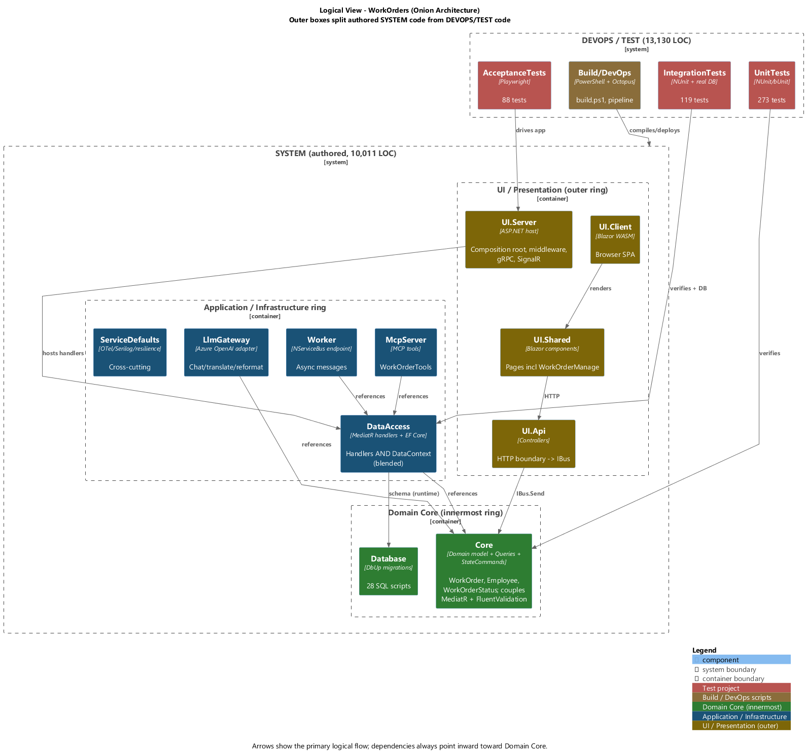
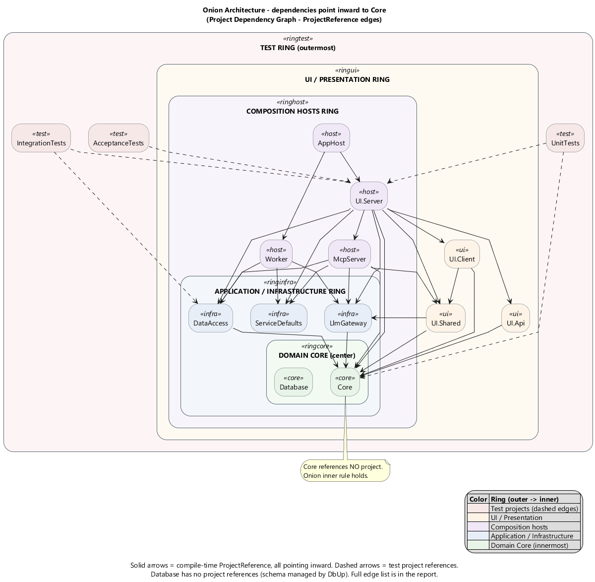
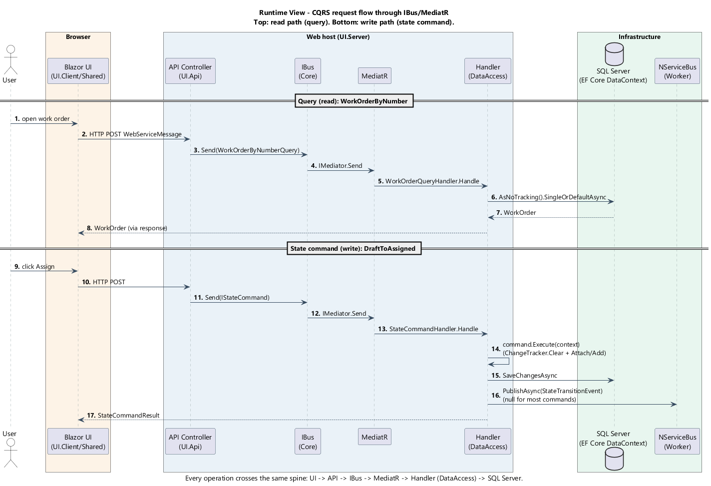
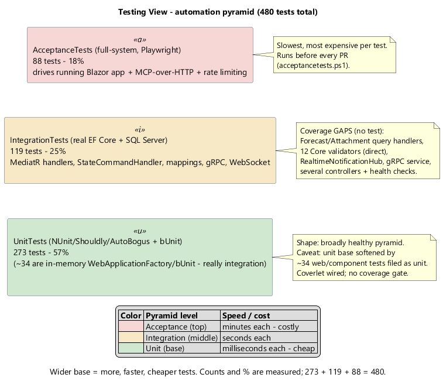
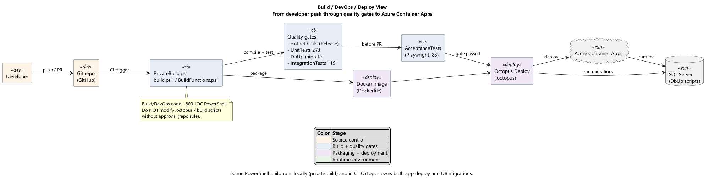
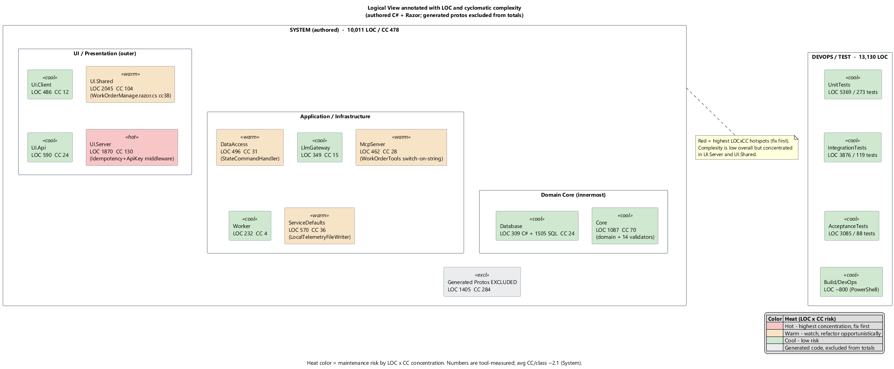

# Codebase Cartography Audit — WorkOrders (.NET 10)

Target: `D:\ClearMeasureLabs\bootcamp-palermo-workorders\src` (solution `ChurchBulletin.sln`)
Date: 2026-07-22. Read-only audit — the target repo was not modified.

## 1. How to reproduce

| Tool | Version | Used for |
|------|---------|----------|
| scc | (on PATH) | LOC / complexity — `scc src --exclude-dir bin,obj,node_modules --by-file -f json` |
| roslynator.dotnet.cli | 0.8.6 | `roslynator analyze src/ChurchBulletin.sln` → `metrics/roslynator.xml` |
| dotnet test `--list-tests` | .NET 10.0.301 | exact test counts per suite |
| dotnet-script | 1.5.0 | `metrics/fp-valuation.csx` — IFPUG FP + backfiring + valuation |
| PlantUML (C4-PlantUML) | plantuml.jar | rendered `diagrams/*.puml` → `images/*.png` offline via Graphviz |

Raw outputs are in `metrics/`. Diagram sources are in `diagrams/`; rendered PNGs in `images/`.

**Exclusions (non-authored, kept out of all tallies):** `bin/`, `obj/`, `node_modules`, coverage.json (25,957 lines, coverlet output), trace `logs/*.jsonl` (19.5k lines), and `src/UI/Server/Generated/Protos/*` (1,405 C# LOC, generated protobuf — the single most "complex" file in the tree at cc 284, correctly excluded). The repo also contains `bootcamp-palermo-workorders-fresh/` and `-master-fresh/` — **full duplicate copies of the source tree** — plus `TicTacToeGame/` and `*.mp4` files; all outside `src/` and excluded.

---

## 2. Executive summary

**Overall health: moderate-to-good.** This is a well-layered Onion/CQRS solution with a genuine, non-trivial test suite (480 tests in a healthy pyramid shape) and real observability wiring. The project-level architecture is clean: **Core references no other project**, DataAccess → Core only, and every host/UI project points inward. Complexity is low on average (~2.1 cyclomatic per class in System code). This is not a typical AI-slop codebase — the bones are sound.

The problems are **concentrated and specific**, not systemic rot:

1. **Anemic + partly-broken domain.** `WorkOrder.ChangeStatus()` silently ignores its `employee` and `date` parameters (`Core/Model/WorkOrder.cs:64`); the `WorkOrderStatus` smart enum is mutable with a fragile equality contract and a `FromCode` that returns `null!` unguarded. Transition metadata and rules live in the command layer, not the entity.
2. **EF Core misuse in the write path.** `StateCommandHandler` clears the change-tracker then does contradictory `Attach`+`Add`/`Update`, with a dead self-assignment no-op (`DataAccess/Handlers/StateCommandHandler.cs:20-38`).
3. **Inconsistent authorization + magic-string dispatch in the MCP tools.** `create-work-order` skips the permission/validity check its sibling performs; `ExecuteWorkOrderCommand` re-implements command dispatch with a string `switch` that mis-maps `"Shelve"` (`McpServer/Tools/WorkOrderTools.cs`).
4. **Pervasive swallowed exceptions** across telemetry, UI, translation, and MCP tools — real faults (DB down) get hidden or reported to an LLM as free text.
5. **The domain leaks the mediator.** Every query record and `IStateCommand` implement MediatR's `IRequest<T>`, and `IBus` — the abstraction meant to hide MediatR — exposes it in its signature.

**Highest-leverage single fix:** put transition behavior (status + actor + date) and the validity/authorization decision back inside the `WorkOrder` aggregate and the state-command types, then delete the duplicated/ignored logic in the handler, the UI code-behind, and the MCP tools. That one move retires findings across four modules at once. Do it behind the existing state-command unit tests (characterize the current EF handler behavior first).

**Size & value:** ~10,011 LOC of authored System code, sized at **118 adjusted function points** (IFPUG; backfiring upper bound 195). Replacement investment lands at roughly **$100k–$210k** at mid-band productivity (Section 4.4).

---

## 3. Architecture

### 3.1 Logical view

Onion layers with the System vs DevOps/Test split. The inner core (`Core` + `Database` migrations) is framework-light; `DataAccess` blends the application (MediatR handlers) and infrastructure (EF Core `DataContext`) responsibilities into one component. UI is the outer ring; `UI.Server` is the composition root that hosts everything. *Visually inspected: legible.*

### 3.2 Dependency view

Every `ProjectReference` edge. All arrows point inward — no dependency-direction violation exists at the project-graph level. `Core` has zero project references (note). Three separate hosts (`UI.Server`, `McpServer`, `Worker`) each bind directly to `DataAccess`, widening the blast radius of any persistence change. *Visually inspected: legible.*

### 3.3 Runtime view

The CQRS request path for a query and a state command: `UI → API controller → IBus → MediatR → Handler (DataAccess) → EF Core → SQL`. The state-command path shows the change-tracker manipulation and the `PublishAsync(StateTransitionEvent)` that is null for every command except `DraftToAssignedCommand`. *Visually inspected: legible.*

### 3.4 Testing view

480 tests in a broadly healthy pyramid (57% unit / 25% integration / 18% acceptance), with the coverage gaps annotated. *Visually inspected: legible.*

### 3.5 Build / DevOps / Deploy view

PowerShell build (`build.ps1`/`BuildFunctions.ps1`) → quality gates (build + unit + DbUp migrate + integration) → Playwright acceptance → Docker image → Octopus Deploy → Azure Container Apps + SQL migrations. *Visually inspected: legible.*

### 3.6 Logical view annotated with metrics

Per-component LOC and cyclomatic complexity. Hotspots (red/warm): `UI.Server` (1,870 LOC / cc 130 — idempotency + api-key middleware), `UI.Shared` (2,045 / cc 104 — `WorkOrderManage.razor.cs` at cc 38), `DataAccess` and `McpServer`. Average cc/class ~2.1 is low; risk is concentrated, not diffuse. *Visually inspected: legible.*

---

## 4. Inventory & metrics

### 4.1 Language breakdown (authored, excludes bin/obj/coverage/logs/generated)

| Language | Files | Code LOC |
|----------|------:|---------:|
| C# (System, excl. generated) | ~360 | 8,506 (incl. Razor code-behind) |
| SQL (DbUp migrations) | 28 | 1,505 |
| C# (Tests) | 168 | 12,330 |
| PowerShell/Shell (build/devops) | 6 | ~800 |
| *Excluded: Generated protobuf C#* | 2 | *1,405* |
| *Excluded: coverage.json / trace jsonl* | 15 | *~45,900* |

> scc undercounts the SQL migrations (7 of 28 files) because its generated-file heuristic skips the long-lined `INSERT` scripts; authoritative SQL count is `wc -l` = 28 files / 1,505 lines.

### 4.2 Per-component LOC + cyclomatic complexity (System)

Source: `metrics/per-project-loc-cc.txt` (C# + Razor, Generated excluded).

| Component | Files | Code LOC | Cyclomatic CC |
|-----------|------:|---------:|--------------:|
| UI.Shared | 40 | 2,045 | 104 |
| UI.Server | 39 | 1,870 | 130 |
| Core | 64 | 1,087 | 70 |
| UI.Api | 24 | 590 | 24 |
| ServiceDefaults | 12 | 570 | 36 |
| DataAccess | 20 | 496 | 31 |
| UI.Client | 14 | 486 | 12 |
| McpServer | 8 | 462 | 28 |
| LlmGateway | 13 | 349 | 15 |
| Database (C#) | 7 | 309 | 24 |
| Worker | 12 | 232 | 4 |
| AppHost | 1 | 10 | 0 |
| **System C#+Razor subtotal** | | **8,506** | **478** |
| **+ SQL migrations** | 28 | **1,505** | — |
| **SYSTEM TOTAL** | | **10,011** | **478** |

Classes/interfaces/records (authored, non-test): ~225 → **avg CC/class ≈ 2.1** (low).

**Reconciliation:** Σ(component C#+Razor line items) = 2045+1870+1087+590+570+496+486+462+349+309+232+10 = **8,506** = subtotal ✓. + SQL 1,505 = **10,011** = System total ✓.

### 4.3 Top-complexity files (authored)

| CC | LOC | File |
|---:|----:|------|
| ~~280~~ | ~~1248~~ | ~~`UI/Server/Generated/Protos/Workorders.cs`~~ (generated — excluded) |
| 38 | 276 | `UI.Shared/Pages/WorkOrderManage.razor.cs` |
| 32 | 158 | `Core/Import/WorkOrderBulkImportCsvParser.cs` |
| 22 | 92 | `UI/Server/ApiKeyAuthenticationMiddleware.cs` |
| 21 | 215 | `ServiceDefaults/LocalTelemetryFileWriter.cs` |
| 19 | 185 | `McpServer/Tools/WorkOrderTools.cs` |
| 17 | 209 | `UI/Server/Middleware/IdempotencyMiddleware.cs` |

### 4.4 Lint / static analysis (Roslynator 0.8.6)

1,081 diagnostics. Top by frequency (`metrics/roslynator.xml`):

| Count | ID | Meaning |
|------:|----|---------|
| 729 | CS8019 | Unnecessary using directive |
| 133 | CA1822 | Member can be marked `static` |
| 98 | CS8602 | Possible null-reference dereference |
| 54 | CS8933 | Using directive duplicates a global using |
| 20 | CA1067 | Override `Equals` when implementing `IEquatable` |
| 13 | CA1873 | Avoid unnecessary work in logging |

The 729 unnecessary + 54 duplicate-global usings are cheap bulk cleanup (AI-verbosity signal). The **98 possible null-dereferences** are the real risk and overlap the swallowed-exception findings below.

**Duplication:** no clone-detector was run, but qualitative duplication is documented in findings (MCP JSON-serialization ×5, telemetry writer ×4, middleware problem-details ×2, duplicated load/save in `WorkOrderManage`).

### 4.5 Function Point sizing (IFPUG, cross-checked by backfiring)

Full computation in `metrics/fp-valuation.csx` / `metrics/fp-valuation-output.txt`.

**Function types (unadjusted):**

| Type | Complexity | Count | Weight | FP |
|------|-----------|------:|-------:|---:|
| EI (external inputs) | Avg | 7 | 4 | 28 |
| EO (external outputs) | Avg | 4 | 5 | 20 |
| EQ (external inquiries) | Low | 7 | 3 | 21 |
| ILF — WorkOrder aggregate | High | 1 | 15 | 15 |
| ILF — Employee+Roles | Avg | 1 | 10 | 10 |
| ILF — Attachment metadata | Low | 1 | 7 | 7 |
| EIF — Azure OpenAI interface | Low | 1 | 5 | 5 |
| **UFP** | | | | **106** |

EI = the 6 state commands + bulk CSV import. EQ = WorkOrderByNumber, list/spec, EmployeeGetAll, attachments, forecast, health, MCP get. ILFs counted as **aggregate roots**, not per-table.

**Value Adjustment Factor (14 GSCs, 0–5):**

| GSC | Rating | | GSC | Rating |
|-----|:---:|---|-----|:---:|
| 1 Data communications | 5 | | 8 Online update | 4 |
| 2 Distributed processing | 3 | | 9 Complex processing | 3 |
| 3 Performance | 3 | | 10 Reusability | 3 |
| 4 Heavy configuration | 2 | | 11 Installation ease | 2 |
| 5 Transaction rate | 2 | | 12 Operational ease | 4 |
| 6 Online data entry | 5 | | 13 Multiple sites | 3 |
| 7 End-user efficiency | 4 | | 14 Facilitate change | 3 |

TDI = 46 → **VAF = 0.65 + 0.01×46 = 1.11** → **AFP = 106 × 1.11 = 118**.

**Backfiring cross-check (Capers Jones LOC/FP):**

| Language | LOC | LOC/FP | FP |
|----------|----:|-------:|---:|
| C# (System) | 7,075 | 55 | 128.6 |
| Razor (System) | 1,431 | 50 | 28.6 |
| SQL (System) | 1,505 | 40 | 37.6 |
| **Backfiring total (upper bound)** | | | **195** |

| Category | Function points |
|----------|----------------:|
| **System (IFPUG, primary)** | **118** |
| System (backfiring upper bound) | 195 |
| DevOps/Test (backfiring, informational) | 242 |

IFPUG hand-count (118) is the conservative primary; backfiring (195) is the LOC-based sanity bound. The gap is the expected AI-verbosity inflation; true size ≈ 120–155 FP.

### 4.6 Economic valuation

Anchor: **BLS May-2024 median software-developer wage $133,080** ([BLS OOH](https://www.bls.gov/ooh/computer-and-information-technology/software-developers.htm)), burdened ×1.45 = $192,966 → **$877/day** (220 working days/yr). System valued at 118 FP.

| FP/day | Band | Man-days | Staff-months | Cost (System) |
|-------:|------|--------:|-------------:|--------------:|
| 0.32 | Full-lifecycle (Jones) | 369 | 16.8 | $323,437 |
| 0.50 | Conservative | 236 | 10.7 | $207,000 |
| 1.00 | Industry mid | 118 | 5.4 | $103,500 |
| 2.00 | Small-team coding | 59 | 2.7 | $51,750 |
| 3.00 | Aggressive / AI-assisted | 39 | 1.8 | $34,500 |

The **0.32 row is full-lifecycle System-only** — do NOT sum it with a DevOps/Test figure (that double-counts test-writing, which the full-lifecycle rate already includes). Headline replacement investment: **~$100k–$210k** (mid bands 0.5–1.0 FP/day).

| | LOC | Function points | Cost (coding-centric, ~1.0 FP/day) |
|--|----:|----------------:|-----:|
| System | 10,011 | 118 (IFPUG) | ~$103,500 |
| DevOps/Test | 13,130 | 242 (backfiring, informational) | n/a (in System full-lifecycle) |
| **Total** | **23,141** | — | ~$103,500 (System, coding-centric) |

---

## 5. Prioritized findings

Format: severity — principle — location — fix. Each defect appears once under its most-specific module.

### Critical

**C1 — Anemic domain: `ChangeStatus` ignores its parameters** · Anemic Domain Model (Enterprise) · `Core/Model/WorkOrder.cs:64-72`. `ChangeStatus(employee, date, status)` sets only `Status`; `employee`/`date` discarded — dates are set externally by each command. *Fix:* move actor/date mutation into the entity; remove the misleading overload. **M.**

**C2 — `WorkOrderStatus` smart enum is mutable with broken equality** · LSP / value-object integrity (SOLID) · `Core/Model/WorkOrderStatus.cs:51-69,86-93`. Public setters on `FriendlyName`/`SortBy` mutate shared singletons process-wide; `Equals` uses `GetType()` with a public parameterless ctor; `FromCode` returns `null!` unguarded. *Fix:* get-only props, seal/value-equality on `Code`, guard `FromCode`. **M.**

**C3 — `StateCommandHandler` misuses DbContext** · Persistence / DbContext misuse · `DataAccess/Handlers/StateCommandHandler.cs:20-38`. Dead self-assignment no-op; `ChangeTracker.Clear()` then contradictory `Attach`+`Add`/`Update`; publishes a null `StateTransitionEvent` for most commands. *Fix:* single `Add`/`Update`, drop the tracker clear and no-op, guard the publish. **M.**

**C4 — MCP `create-work-order` bypasses authorization** · Authorization gap (Enterprise + security) · `McpServer/Tools/WorkOrderTools.cs:48-84`. Builds and sends `SaveDraftCommand` without the `CanCreateWorkOrder()`/`IsValid()` check its sibling `ExecuteWorkOrderCommand` performs. *Fix:* route through the same validation path. **S.**

### High

**H1 — OCP-violating string `switch` over command types** · OCP / magic strings · `McpServer/Tools/WorkOrderTools.cs:106-136`. String literals → `new` command; `"Shelve"` mis-maps to `InProgressToAssignedCommand`. *Fix:* use `StateCommandList`/name→factory registry (Replace Conditional with Polymorphism). **M.**

**H2 — `WorkOrderManage` code-behind is a god component with duplicated load/save** · SRP / Duplicated Code · `UI.Shared/Pages/WorkOrderManage.razor.cs` (276 LOC, cc 38; `LoadWorkOrder` 62-91 vs `HandleSubmit` 121-155). Six responsibilities + `new StateCommandList()` hard dependency. *Fix:* Extract Class (`WorkOrderEditor` service via interface); Extract Method for the shared fetch. **M.**

**H3 — `ChatClientFactory` news-up Azure OpenAI directly** · DIP · `LlmGateway/ChatClientFactory.cs:40-54` (+ duplicated availability check, double config round-trip). *Fix:* inject a provider abstraction; fetch config once. **M.**

**H4 — Swallowed exceptions pervasive** · Empty catch (AI) · `UI.Shared/Pages/WorkOrderManage.razor.cs:194,224,241`; `ServiceDefaults/LocalTelemetryFileWriter.cs:139-224`; `LlmGateway/TranslationService.cs:34-37`; `McpServer/Tools/WorkOrderTools.cs:80-83,178-181`. Telemetry silently drops writes; `SingleAsync` `InvalidOperationException` reused as "not found" (masks the multiple-rows bug); DB faults reported to an LLM as text. *Fix:* catch specific types, log; use null-returning queries for not-found. **M.**

**H5 — Duplicated MCP serialization + not-found boilerplate** · Duplicated Code · `McpServer/Tools/WorkOrderTools.cs:28-29,43-44,77-78,144-145` (+ not-found strings). *Fix:* shared static `JsonSerializerOptions` + helper. **S.**

**H6 — `IsValid()` collapses status + authorization into one bool** · Business-logic leak / misleading error · `McpServer/Tools/WorkOrderTools.cs:138-141`; root `Core/Model/StateCommands/StateCommandBase.cs:16-21`. Authz failures reported as status mismatches. *Fix:* split into `StatusAllows`/`UserAllows` or return a reason object. **S.**

### Medium

**M1 — Domain leaks MediatR (and FluentValidation)** · Onion — framework-agnostic core · `Core/Queries/*` (`: IRequest<>`), `Core/IBus.cs:7`, `Core/Services/IStateCommand.cs:7`, `Core/Core.csproj:17`. Every query record + `IStateCommand` + `IBus` expose MediatR types. *Fix:* keep records as POCOs; move the marker to a DataAccess adapter. **M.**

**M2 — DataAccess conflates application + infrastructure** · Clean Architecture (CCP) · handlers share the project/namespace with `DataContext`; no repository seam. *Fix:* extract an Application project or introduce Core repository interfaces. **L.**

**M3 — `EmployeeGetAllQuery` filters in memory + static global flag** · Feature envy / global state · `DataAccess/Handlers/EmployeeQueryHandler.cs:24-34`. `ToListAsync()` then in-memory `.Where`, plus `EmployeeSpecification.All` static; magic-string `Include("Roles")`. *Fix:* push predicate into the query; typed `Include`. **M.**

**M4 — `WorkOrder.getTruncatedString` silent truncation to magic 4000** · Magic number / silent data mutation · `Core/Model/WorkOrder.cs:41-50`. *Fix:* named constant from mapping; validate not truncate. **S.**

**M5 — Idempotency lock scope ≠ cache key; semaphores never evicted (leak)** · Concurrency / memory leak · `UI/Server/Middleware/IdempotencyMiddleware.cs:82-92`. *Fix:* ref-count/evict semaphores; align lock scope. **M.**

**M6 — LLM response parsed by string prefix (`"TITLE:"`)** · Magic strings / fragile parsing · `UI/Server/WorkOrderReformatAgent.cs:92-98` (splits on `\n` only). *Fix:* structured JSON output. **S.**

**M7 — `WorkOrderStatus.None` excluded from `GetAllItems`** · Special Case / inconsistency · `Core/Model/WorkOrderStatus.cs:13,35-45`. *Fix:* make the lookup total. **S.**

**M8 — `LocalTelemetryFileWriter`: namespace squatting + 4× duplicated writers + per-line flush** · Large class / perf · `ServiceDefaults/LocalTelemetryFileWriter.cs:9,29-37,85-88,127-208`. Declares `namespace Microsoft.Extensions.Hosting`; `AutoFlush=true` on the hot path. *Fix:* own namespace; generic `WriteEntry<T>`; batch flush. **M.**

**M9 — Dead/redundant members** · Dead code · `Core/Model/WorkOrder.cs:32,52-55,74-77` (`FriendlyStatus`, `getTextForStatus`, `GetMessage`); `Core/Model/Employee.cs:90-93` (`GetNotificationEmail(day)` ignores `day`). *Fix:* delete. **S.**

### Low

**L1** — Duplicated problem-details write in `IdempotencyMiddleware.cs:210-238`. Extract `WriteProblemAsync`. **S.**
**L2** — API-key leaf allowlist duplicated across two branches, `ApiKeyAuthenticationMiddleware.cs:76-91`. Extract `IsPublicLeaf` + `HashSet`. **S.**
**L3** — 729 unnecessary + 54 duplicate-global `using` directives (Roslynator CS8019/CS8933). Bulk-remove. **S.**

---

## 6. Testing assessment

**Counts (via `dotnet test --list-tests`):** UnitTests **273**, IntegrationTests **119**, AcceptanceTests **88** = **480 total**.

| Project | Count | Level (by evidence) | Exercises | Real DB | Browser |
|---------|------:|--------------------|-----------|:---:|:---:|
| UnitTests | 273 | Mostly unit; ~34 are in-memory `WebApplicationFactory`/bUnit (really integration) | domain logic, state commands, CSV parser, validators, components | No | No |
| IntegrationTests | 119 | Integration | MediatR handlers, StateCommandHandler per transition, EF mappings, gRPC, WebSocket, LLM/MCP | Yes | No |
| AcceptanceTests | 88 | Acceptance (full-system) | Playwright driving the running Blazor app, MCP-over-HTTP, rate limiting | Yes (running app) | Yes |

**Pyramid: 57% / 25% / 18% — broadly healthy** (not hourglass, not inverted). The unit base is softer than it looks (~34 web/component tests filed as unit → true unit ~240). Acceptance at 18% is on the heavy side but justified by the UI/AI/MCP surface. Coverlet is wired (coverage.json in each suite) but **no coverage gate/threshold** is enforced.

**Covered risky logic:** state commands (unit + integration + Playwright), CSV bulk-import parser, API-key + idempotency middleware, most MediatR handlers.

**Coverage gaps (production code with no test found):** `ForecastQueryHandler`, `AddAttachmentMetadataCommandHandler` (handler level), `WorkOrderAttachmentsQueryHandler`, the **12 `Core/Validation/*Validator` classes (no direct unit tests)**, `RealtimeNotificationHub`/`ServerRealtimeBus`, `WorkOrdersGrpcService` (unit level), `RateLimitingMiddleware` class, several controllers and health checks.

**Refactor-safety verdict:** the highest-risk refactors (C1–C3, H2) are backed by state-command unit + integration tests, so they can be done relatively safely — but characterize the current `StateCommandHandler` EF behavior with an integration test first (C3 changes observable Attach/Add semantics).

---

## 7. Refactoring backlog (sequenced)

1. **Characterize `StateCommandHandler` + `WorkOrderStatus`** with integration/unit tests pinning current behavior (safety net for the next steps). *Tests-first — coverage is thin on the exact EF semantics.*
2. **C1 + C2 + C3 together** — restore transition behavior to the `WorkOrder` aggregate, make `WorkOrderStatus` immutable/total, fix the EF handler. Highest leverage; retires findings across Modules 1/4/5/6.
3. **C4 + H1 + H5 + H6** — unify MCP command dispatch through `StateCommandList`, add the missing authorization check, dedup serialization, split `IsValid`.
4. **H4** — replace swallowed catches with typed catch + logging; convert exception-as-control-flow to null-returning queries.
5. **H2 + H3 + M1** — extract `WorkOrderEditor` from the UI code-behind, inject the LLM provider, and stop leaking MediatR through `IBus`/query records.
6. **M3–M9, L1–L3** — persistence predicate push-down, magic-constant/dead-code cleanup, telemetry writer refactor, and the bulk `using` cleanup (mechanical, low-risk).
7. **Coverage** — add direct unit tests for the 12 validators and the untested handlers/hub; add a coverage threshold gate.
8. **Housekeeping (repo-level)** — remove the duplicated `*-fresh/` source trees and stray `TicTacToeGame/`, `*.mp4`, `err.tmp`, `nul` from the repo root.
