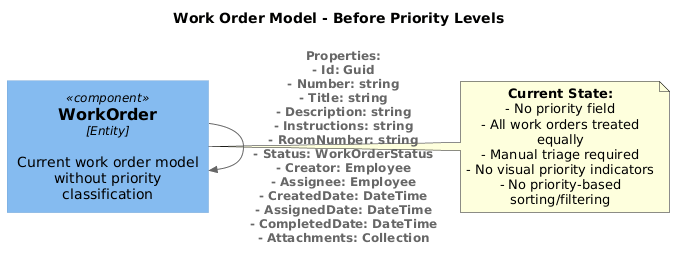
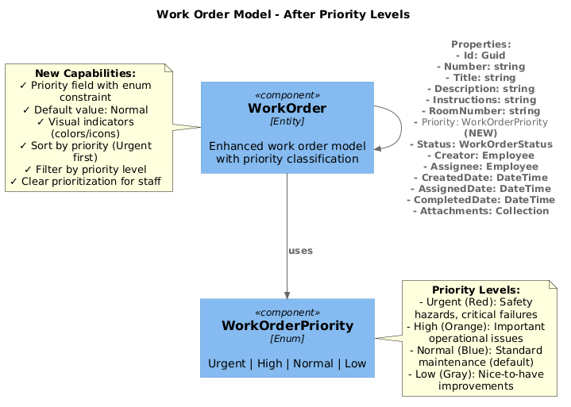

# ADR 0001: Work Order Priority Levels

**Status:** Proposed  
**Date:** 2026-08-05  
**Epic:** #8227

## Context

The church maintenance staff currently manages work orders without a formal priority system. All work orders are treated equally, making it difficult to triage urgent issues (broken HVAC, safety hazards) versus routine maintenance tasks. Staff must manually track which items need immediate attention, leading to potential delays in addressing critical issues.

## Decision

We will add a priority classification system to work orders with four levels:
- **Urgent**: Safety hazards, critical system failures requiring immediate attention
- **High**: Important issues affecting operations but not immediately critical
- **Normal**: Standard maintenance and routine repairs (default)
- **Low**: Nice-to-have improvements and non-urgent tasks

## Conceptual Definition

### Business Value
Church staff can prioritize urgent repairs (broken HVAC, safety hazards) over routine maintenance, ensuring critical issues are addressed first. This improves response times for critical issues and helps staff allocate resources effectively.

### User Stories
1. As a maintenance coordinator, I want to mark work orders as Urgent so that staff know which issues require immediate attention
2. As a maintenance worker, I want to see work orders sorted by priority so I can address the most critical issues first
3. As a facilities manager, I want to filter work orders by priority level so I can review all urgent items at once

### Conceptual Model
```
WorkOrder
├── Priority (enum: Urgent, High, Normal, Low)
├── [existing fields...]
└── Visual indicators (colors/icons) for each priority level
```

### Priority Level Definitions

**Urgent (Red)**
- Safety hazards (exposed wiring, gas leaks, structural damage)
- Critical system failures (HVAC in extreme weather, no water, power outage)
- Security issues (broken locks, alarm system failures)
- Response time: Same day

**High (Orange)**
- Important operational issues (broken sound system before service, leaking roof)
- Equipment failures affecting ministry activities
- Issues affecting multiple areas or people
- Response time: Within 2-3 days

**Normal (Blue)**
- Standard maintenance requests
- Routine repairs
- Cosmetic issues
- Response time: Within 1-2 weeks

**Low (Gray)**
- Nice-to-have improvements
- Non-urgent cosmetic updates
- Future enhancements
- Response time: As time permits

### UI/UX Considerations
- Priority dropdown on create/edit forms with clear descriptions
- Color-coded priority badges on work order cards
- Default priority: Normal (to avoid forcing users to make a choice)
- Sort work orders by priority (Urgent → High → Normal → Low)
- Filter capability to show only specific priority levels

## Architecture Diagrams

### Before: Current Work Order Model


### After: Work Order Model with Priority


## Consequences

### Positive
- Clear prioritization helps staff focus on critical issues first
- Improved response times for urgent matters
- Better resource allocation and scheduling
- Visual indicators make priority immediately obvious
- Filtering and sorting capabilities improve workflow efficiency

### Negative
- Requires training staff on when to use each priority level
- Risk of "priority inflation" (marking everything as Urgent)
- Additional field to maintain in the database
- Existing work orders will need default priority assigned

### Mitigation
- Provide clear guidelines and examples for each priority level
- Monitor priority usage patterns and provide feedback to staff
- Consider requiring justification for Urgent priority
- Migration script will set all existing work orders to Normal priority

## Implementation Notes

This epic decomposes into three child issues:
1. Add WorkOrderPriority enum to Core model (#8264)
2. Add priority field to work order UI forms (#8265)
3. Add priority sorting and filtering to work order list (#8266)

## References
- Epic Issue: #8227
- Child Issues: #8264, #8265, #8266
