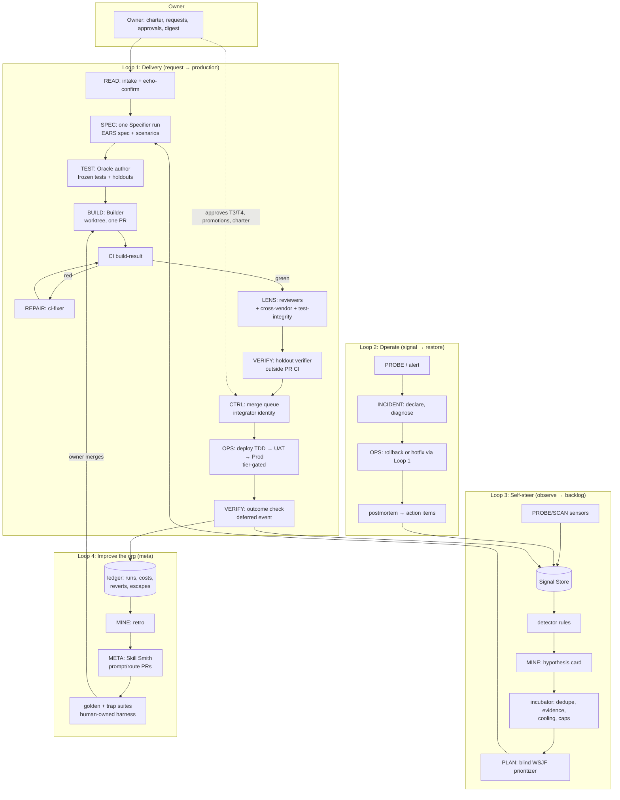
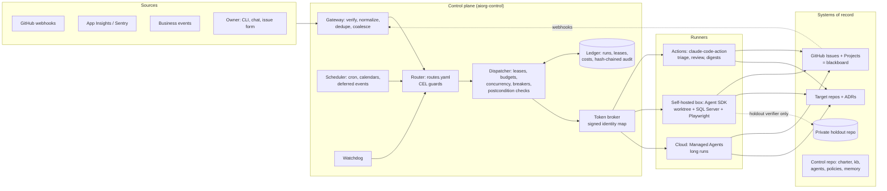

# The 100% AI Software Organization — Master Design

**Status:** design proposal, v1.0 (2026-09-23)
**Scope:** an ecosystem of small, task-oriented AI agents, started from Claude Code and pointed at one or more repositories, that does every job in a software organization. It takes change requests from a human owner and also watches how things are going and adds work to its own backlog.
**Grounding repo:** `ClearMeasureLabs/bootcamp-palermo-workorders` (this repo). Its `feature-loop` factory is the seed.

**How this was produced:** a team of four research agents each designed one slice of the organization independently, cross-examined the other three designs in a debate round, and the results were reconciled into this document. Every claim here traces back to one of the source files below.

| Agent | Lens | Round 1 | Round 2 (debate) |
|---|---|---|---|
| A: Frontier Researcher | What the industry and research literature show works and fails | [research/A-frontier.md](research/A-frontier.md) | [debate/A-debate.md](debate/A-debate.md) |
| B: Work Decomposer | Every role, broken into every task, each task an agent | [research/B-tasks.md](research/B-tasks.md) (401-agent catalog) | [debate/B-debate.md](debate/B-debate.md) (+33 tasks, 19 families) |
| C: Runtime Architect | How to run it on Claude Code | [research/C-runtime.md](research/C-runtime.md) | [debate/C-debate.md](debate/C-debate.md) (v0 plan, cost model) |
| D: Governor & Red Team | Self-steering, human gates, safety, failure modes, rollout | [research/D-governance.md](research/D-governance.md) | [debate/D-debate.md](debate/D-debate.md) (owner interface) |

The catalog is generated from data in [catalog-tools/](catalog-tools/). Run `python3 catalog-tools/render.py` to check its integrity and `python3 catalog-tools/build_md.py` to regenerate `research/B-tasks.md`.

---

## Contents

1. [Executive summary](#1-executive-summary)
2. [First principles](#2-first-principles)
3. [The shape of the organization: tasks, families, services](#3-the-shape-of-the-organization-tasks-families-services)
4. [The work catalog: 434 task types in 26 guilds](#4-the-work-catalog-434-task-types-in-26-guilds)
5. [Triggers, timers, and the org's clock](#5-triggers-timers-and-the-orgs-clock)
6. [The four loops the organization runs](#6-the-four-loops-the-organization-runs)
7. [Runtime architecture on Claude Code](#7-runtime-architecture-on-claude-code)
8. [Governance: autonomy, identity, oracles, safety](#8-governance-autonomy-identity-oracles-safety)
9. [The self-steering backlog](#9-the-self-steering-backlog)
10. [The human owner's experience](#10-the-human-owners-experience)
11. [Cost model](#11-cost-model)
12. [How it fails: the red team, condensed](#12-how-it-fails-the-red-team-condensed)
13. [Rollout: v0 next week to full organization](#13-rollout-v0-next-week-to-full-organization)
14. [Starting it with Claude Code](#14-starting-it-with-claude-code)
15. [Where the debate landed](#15-where-the-debate-landed)
16. [Decisions the owner must make](#16-decisions-the-owner-must-make)

---

## 1. Executive summary

**What it is.** The organization is a set of **~434 task types**. Each is a narrowly scoped job with a trigger, typed inputs, a checkable done-condition, an identity, a budget and an autonomy level. Examples: "classify a new issue", "fix a failing CI run on an agent PR", "check certificate expiry", "write the acceptance tests for a designed item", "find flaky tests", "write the daily owner digest". About 75 of them are plain code (routers, locks, timers, gates, scanners). The rest are LLM runs built from **19 reusable agent templates** (families such as `BUILD`, `LENS`, `READ`, `VERIFY`, `SPEC`). A task type is *template + config*, so the org has hundreds of addressable jobs but fewer than 30 prompts to maintain.

**How it runs.** Work items live on GitHub Issues and Projects, which act as the org's shared blackboard. Events (webhooks, CI results, alerts, owner requests) and timers are routed deterministically to task agents. Each agent runs in a fresh Claude Code session, in isolation, with a hard budget. It writes its result back to GitHub as a structured handoff. The next agent is woken by the resulting event, and success is never taken on an agent's word: it is re-checked against GitHub's own APIs. A mechanical watchdog outside the agents catches stalls.

**How it steers itself.** Deterministic sensors (CI, static analysis, CVEs, flaky tests, SLOs, cost, DORA and flow metrics, usage) feed a pipeline: detect → falsifiable hypothesis → incubator (dedupe, evidence threshold, cooling period, caps) → proposal → blind prioritization (WSJF) → approval by risk tier → execution → **outcome verification** → learning. The org measures whether its self-generated work *mattered*, not just whether it merged.

**How the human stays in charge.** The owner writes a **charter**: mission, priorities, non-negotiables, SLOs, budgets, the autonomy table and the protected surfaces. The owner makes one-sentence requests in any channel, approves a small fixed set of decision types in a single inbox, and reads a 5-minute daily digest. Everything else is reported with a veto window. Owner time runs about 100 min/day in the first phase and about 30 min/day at full autonomy.

**How it stays safe.** Deterministic code decides and enforces; LLMs generate and explain. Separate GitHub App identities write, test, review, merge and deploy, so GitHub rulesets enforce separation of duties. Builders cannot see or edit the hidden acceptance tests that judge them. Agents that read untrusted text have no write access. Autonomy is earned per task type from measured evidence and capped by risk tier and by how strong the tests in that code area are. The kill switch revokes credentials in under 60 seconds instead of asking agents to stop.

**How to start.** v0 runs next week on GitHub Actions + `claude-code-action` + Routines + this repo's existing `feature-loop` skills, with a human merging everything, for roughly $300–800/month. It then grows to governed identities (v1), a control plane (v2) and the full catalog (v3) when measured thresholds are crossed. A disciplined full organization for one mid-size repo is estimated at **$9–14k/month**, roughly the cost of one engineer.

**The honest caveat.** The evidence for fully autonomous delivery is thin. METR's 2025 RCT found experienced developers 19% slower with AI while they believed they were faster. MAST attributes most multi-agent failures to system design and verification, not to the model. The design therefore puts most of its investment into **verification, governance and measurement**, not into more code-writing agents, and it measures whether it beats a human baseline.

---

## 2. First principles

These twelve principles were agreed by all four agents after the debate. Every mechanism later in the document exists to implement one of them.

1. **Tasks, not roles.** A human role bundles 30–100 kinds of work because a person has one calendar. Agents have no such limit, so bundling only adds context bloat and blurs done-criteria. Roles survive as *coverage tags* that prove nothing was left out, and as *lenses* (for example, a security rubric applied by a review template).
2. **Many instances of few templates.** Working factories (Anthropic's 16-agent C compiler, Gas Town, Factory Missions) scale by running many copies of a handful of agent types. Task types are configuration on top of about 19 templates.
3. **State lives outside the model.** Git and GitHub Issues/Projects are the memory. Agents are disposable, with a fresh context per run, because output quality degrades as context grows ("context rot").
4. **Deterministic code decides and enforces; LLMs generate and explain.** Routing, locks, timers, budgets, gates, merges, risk classification and kill switches are code. A rule written only in a prompt is a wish. (The Replit agent deleted a production database during a freeze that existed only as instructions.)
5. **Never trust "done."** Every claim of success is re-derived from a system of record (check-runs API, merge SHA, board state) by something other than the agent that made it. This generalizes this repo's "CI is API-verified only" rule.
6. **Verification capacity is the binding constraint, not generation.** Throughput is throttled to what CI, reviewers and the owner can absorb. In a study of 600 rejected agent PRs, 38% were simply abandoned by reviewers and 23% were duplicates.
7. **The author never grades its own work.** Writing, test-writing, reviewing, merging and deploying use different identities. Builders cannot read or edit the hidden tests that judge them. Every model saturates its visible tests (SpecBench), and Claude Code and Codex have been caught editing tests (EvilGenie).
8. **Every untrusted byte is data.** Issue bodies, comments, logs, emails and web pages are read only by quarantined readers with no write access. Agents that can write never see raw untrusted text.
9. **Autonomy is earned per task type, capped by risk and by test strength, and revoked automatically.** Promotion needs owner approval; demotion is automatic.
10. **Liveness is supervised mechanically from outside.** Agents stall and end their turn while CI is still pending. A timer-driven watchdog that is not the stalled agent re-dispatches the work. Events are primary; timers reconcile the events that get dropped.
11. **The org cannot rewrite its own guardrails.** The charter, autonomy table, permissions, pipelines, agent prompts and the evaluation harness are protected surfaces, changed only by a human-approved PR.
12. **Measure outcomes, not output.** The headline metric is *outcome-verified value per dollar*, guarded by change-failure rate, rework rate and maintainability trends. PR count is never a target.

---

## 3. The shape of the organization: tasks, families, services

The debate's biggest correction was to separate three things the first drafts had merged.

| Layer | Count | What it is | Unit of |
|---|---|---|---|
| **Task type** | ~434 | One config row: `{family, trigger, filters, lens, inputs.trust, outputs, postconditions, identity, runner, model, budget, autonomy ceiling}` | Coverage, routing, budgets, autonomy, metrics |
| **Agent template (family)** | 19 | One prompt/skill plus a tool policy, output schema and eval harness, shared by every task type in the family | Maintenance, evaluation, model upgrades |
| **Deterministic service** | ~75 task types, plus the control plane | Code with no model call: routers, schedulers, locks, gates, merge policy, scanners, metrics | Enforcement |

### 3.1 The 19 families

Counts are over B's original 401 task types; the debate adds 33 more (§4.2).

| Family | # | What it does | LLM? | Identity | Runner | Model |
|---|---|---|---|---|---|---|
| **CTRL**: control service | 34 | Route, lock, move cards, check merge readiness, WIP limits, version bumps | No | Integrator / Governor | service | none |
| **PROBE**: sensor | 35 | Health, drift, certificates, quotas, DORA, flow, cost | No (summary optional) | Reader | service / Actions | Haiku for summaries |
| **SCAN**: tool wrapper | 34 | Semgrep, TruffleHog, SCA, DAST, license, a11y, CRAP; then triage | Tool + LLM triage | Reader (Builder for fixes) | Actions / box | Haiku / Sonnet |
| **READ**: quarantined reader | 19 | Classify issues, tickets, feedback, market signals into a strict schema | Yes, **no tools** | Reader | Actions | Haiku |
| **LENS**: review lens | 20 | Correctness, style, tests, security, EF queries, UI consistency, cost | Yes | Reviewer | Actions | Sonnet |
| **SPEC**: specifier | 30 | Requirements, acceptance criteria, technical design, ADR, threat model, SLO, UX flow | Yes | Builder (docs paths) | cloud / box | **Opus** |
| **BUILD**: change code | 37 | Feature, fix, refactor, migration, endpoint, IaC, dependency bump | Yes | **Builder** | box (worktree) | Sonnet (Opus on retry) |
| **REPAIR**: PR repair loop | 6 | CI fixer, conflict resolver, review-feedback applier, flaky-test fixer | Yes | Builder | box | Sonnet |
| **TEST**: oracle author | 11 | Unit, integration, acceptance, contract, **holdout**, repro tests | Yes | **Oracle** (separate from Builder) | box | Sonnet |
| **VERIFY**: run and judge | 31 | Functional, smoke, perf, a11y runtime, UX walkthrough, **outcome verification** | Tool + LLM verdict | Reviewer / Operator | box / cloud | Sonnet |
| **OPS**: actuator | 21 | Deploy, rollback, rotate, mask, retain, patch | Mostly scripts | Operator | service / box | Sonnet (explain only) |
| **INCIDENT** | 8 | Declare, command, diagnose, status page, postmortem | Mixed | Reader / Operator | cloud (urgent) | Opus for diagnosis |
| **PLAN** | 19 | Blind prioritizer, estimator, splitter, roadmap, capacity | Formula + LLM | Reader (+ issue write) | cloud | Opus |
| **REPORT** | 25 | Digests, health, posture, QBR, funnels, cohorts. **Failures first** | Yes | Reader | Actions | Sonnet |
| **MINE**: signal to hypothesis | 16 | Debt register, toil, revert and escaped-defect analysis, retro | Yes | Reader | cloud | Opus |
| **WRITE**: docs and comms | 29 | Release notes, guides, runbooks, KB. External comms are drafts only | Yes | Builder (docs) | Actions | Sonnet |
| **GATE**: decision packet | 22 | Prepare a decision for the human: prod gate, DPIA, pricing, proposals | Drafts only | none (a human decides) | cloud | Opus |
| **META**: improve the org | 8 | Agent evaluator, prompt tuner ("Skill Smith"), eval regression | Yes | Builder on the control repo only | box | Opus |
| **CHARTER** | 2+ | Charter amendments, permission manifest | Drafts only | none (the owner merges) | — | Opus |

About 60 **rubric/lens files** (security review checklist, onion-architecture rules, EF query rules, a11y heuristics and so on) parameterize LENS, SCAN and VERIFY.

### 3.2 Observers and actors

About two thirds of task types are **observers**: they read, measure and report, and never change code, infrastructure or external state. Observers can run autonomously from day one. **Actors** (BUILD, REPAIR, OPS, merge, deploy, publish) are fewer, and they are where autonomy levels, identities and gates matter. Observers never create work directly. They emit findings into the Signal Store, and only the self-steering pipeline (§9) turns findings into proposals.

### 3.3 A role the human world does not have: the AI-org operator

Guild G00 (Orchestration & Control) and parts of G25 (Kaizen) have no human counterpart. Routing, leasing, budgets, evals, prompt tuning, the kill switch and the audit trail are the management layer of an AI org. They are built first, and the org can never modify them without a human gate.

---

## 4. The work catalog: 434 task types in 26 guilds

The full catalog is in [research/B-tasks.md](research/B-tasks.md). It covers 32 roles grounded in SWEBOK v4, the Google SRE book, DORA, the FinOps Framework, OWASP SAMM, the Pragmatic Institute framework and this repo. Each row gives trigger, inputs, outputs, done-criteria, autonomy and handoffs. It also includes the trigger matrix, the timer calendar, the critical paths and the human-gated list.

### 4.1 Guilds

| Guild | Task types | Human-equivalent roles covered |
|---|---|---|
| G00 Orchestration & Control Plane | 18 | *(new: AI-org operator)* |
| G01 Intake & Triage | 15 | PM, PO, support, QA |
| G02 Product Discovery & Strategy | 18 | PM, UX research, analytics |
| G03 Backlog & Delivery Flow | 17 | PO, scrum master, EM |
| G04 UX Research & Design | 15 | UX research, UX/UI design |
| G05 Architecture & Technical Design | 18 | Architect, backend |
| G06 Construction | 19 | Backend, frontend, data, DBA |
| G07 Code Review & Code Quality | 18 | Code reviewer, every specialist as a lens |
| G08 Test Engineering & QA | 22 | QA / test automation |
| G09 Performance & Capacity | 14 | Performance engineer |
| G10 Security & AppSec | 20 | AppSec |
| G11 Supply Chain, Dependency & License | 13 | Dependency and license compliance |
| G12 CI/CD, Build & Release | 23 | DevOps, release manager |
| G13 Platform & Infrastructure | 16 | Platform / cloud engineer |
| G14 SRE, Observability & Incident | 22 | SRE, on-call, incident manager |
| G15 Data: DBA & Data Engineering | 16 | DBA, data engineer |
| G16 Analytics & Insights | 11 | Product/data analyst |
| G17 Docs & Knowledge | 15 | Technical writer |
| G18 Support & Customer Success | 14 | Support, customer success |
| G19 Accessibility & Localization | 11 | A11y specialist, localization engineer |
| G20 Legal, Privacy & Compliance | 12 | Legal, privacy, compliance |
| G21 FinOps & Cost | 11 | FinOps analyst |
| G22 Communications & Marketing | 10 | Marketing, release comms |
| G23 Engineering Management, Portfolio & Program | 11 | EM, program and portfolio manager |
| G24 Developer Experience | 10 | DX engineer |
| G25 Kaizen: Self-Observation & Backlog Generation | 12 | *(new)* |
| **Round-1 total** | **401** | 625 role-to-task mappings collapsed by dedupe; 217 task types serve 2+ roles |
| Added in the debate | +33 | See §4.2 |
| **Total** | **~434** | ~75 deterministic |

### 4.2 Task types added in the debate

These came from gaps each agent found in the others' designs ([debate/B-debate.md](debate/B-debate.md) R1):

- **Oracle integrity:** `test-integrity-auditor` (different model family), `test-diff-guard`, `literal-leak-scanner`, `holdout-scenario-curator`, `holdout-suite-runner`, `claim-reverifier` (honesty score).
- **Agent evaluation:** `golden-task-curator` (human approves), `trap-task-author`, `model-upgrade-evaluator`, `red-team-exerciser`, `lessons-curator`, `agent-memory-reviewer`, `cross-vendor-reviewer`.
- **Autonomy:** `autonomy-promotion-proposer` (human gate), `autonomy-demoter` (deterministic), `permission-manifest-keeper` (human gate), `charter-amendment-proposer` (human gate).
- **Self-steering:** `hypothesis-card-writer`, `proposal-writer`, `incubator-keeper` (deterministic), `outcome-verifier` (delayed trigger).
- **Runtime safety:** `identity-token-broker`, `ping-pong-detector`, `merge-queue-integrator`, `api-rate-governor`, `injection-classifier`, `mcp-server-pin-auditor`.
- **Resilience of the org itself:** `owner-availability-router`, `provider-outage-degrader`, `transcript-retention-enforcer`.
- **Owner:** `daily-owner-digest`, `spec-document-reader` (echo-and-confirm), `owner-comprehension-briefer`.
- **Provenance:** `ai-code-provenance-checker` (license contamination, snippet similarity).

Merged or renamed: `signal-aggregator` becomes the deterministic detector; `backlog-generator-from-signals` splits into hypothesis and proposal writers; `deploy-freeze-enforcer` becomes a calendar guard; `idea-incubator` (strategic bets) becomes `strategic-bet-proposer`.

### 4.3 What stays human permanently

1. **Intent and values:** what the product is for, who it serves, what it will not do.
2. **Accountability the law assigns to a person:** DPO sign-off, accessibility attestations, contracts, export classification, public security disclosures.
3. **Spending and commitments:** budget envelopes, reservations, vendor engagements, pricing.
4. **Changes to the org's own guardrails:** pipelines, protected paths, agent permissions, the kill switch, the autonomy policy, the evaluation harness. An organization that can relax its own gates has no gates.
5. **Irreversible external acts:** public comms, removing customer-facing features, production data migrations, DNS.
6. **Relationships:** customer escalations, security reporters, auditors, counsel.
7. **Taste arbitration:** when data cannot settle a trade-off (UX tone, naming), the owner decides once and the org records the decision so it does not ask again.

After the debate, about 46 of 434 task types (~11%) are human-gated. Most of them fire monthly or less.

---

## 5. Triggers, timers, and the org's clock

### 5.1 Trigger classes

| Class | Examples | Mechanism |
|---|---|---|
| **GitHub events** | `issues.opened/labeled`, `issue_comment.created`, `pull_request.*`, `pull_request_review.submitted`, `check_suite.completed`, `workflow_run.completed`, `push`, `release`, `projects_v2_item.edited`, `sub_issues` | GitHub App webhooks. PR events are enriched with the changed-file list (cached per head SHA) so path filters work |
| **Security events** | `dependabot_alert`, `code_scanning_alert`, `secret_scanning_alert`, `repository_advisory` | GitHub App subscription (missing from the first runtime draft) |
| **Deploy events** | `deployment_status[env]` or a `repository_dispatch` at the end of each `deploy.yml` job carrying `{env, version}` | Octopus deploys may lack the environment in the payload, so the dispatch step is the reliable path |
| **Monitoring** | `alert.fired`, `healthcheck.unhealthy`, `slo.burn_rate`, `exception.new_fingerprint` | Azure Monitor / App Insights action groups, Sentry; HMAC-verified |
| **Business events** | `feedback.received`, `support.ticket.created`, `cost.anomaly`, `dsr.received` | Generic HMAC-verified `POST /events/{type}` with a per-source schema. Always routed through a READ stage |
| **Owner** | `/aiorg:request`, chat, issue form, email, voice | Normalized into one `Request` object with echo-and-confirm (§10.1) |
| **Handoffs** | Agent A finished; agent B is next | Structured handoff comment on the issue/PR; `next` is an **array** (fan-out) plus `join` routes that wait for all handoffs in a lineage |
| **Delayed one-shot** | Outcome check 14 days after merge, 24 h veto window, 48 h clarification timeout, SLA re-escalation, +30-day adoption review | A `deferred_events(fire_at, event)` table in the scheduler (the runtime twin of `send_later`) |
| **Timers** | See §5.2 | Durable scheduler; timers emit events that pass the same guards as webhooks |
| **Chained stages** | observers → detector → hypothesis → incubator → prioritizer | Only the first stage is on a timer; each later stage fires on `aiorg.run.succeeded[agent=X]` so jitter cannot reorder them |

Routing is deterministic: a `routes.yaml` table of `event → guard (CEL expression) → task type → leases → runner`. The only LLM routing step is the triage reader, which classifies an issue and writes labels; the labels then drive deterministic routes. See [research/C-runtime.md §4.3](research/C-runtime.md) for the full routing table.

**Dedupe happens at three layers:**
1. Delivery ID, which drops redeliveries.
2. A semantic key per event type, e.g. `check_suite:{pr}:{sha}:{conclusion}` or `alert:{rule}:{fingerprint}`.
3. Coalescing windows that collapse bursts to the latest state.

Every run has a `run_key` for idempotency, and every write carries a hidden `<!-- aiorg:run=… -->` marker so retries never double-post. A self-loop guard drops events caused by the org's own bots unless the route explicitly accepts them.

### 5.2 The timer calendar (revised)

| Cadence | Examples | Rule |
|---|---|---|
| **1–15 min** | health probe, SLA clocks, log anomaly, stall watchdog, lease reaper | **Deterministic only.** Sub-15-minute *sensing* moves into the monitoring platform (App Insights availability tests and alert rules), which pushes events. An LLM starts only when a threshold is crossed. A 1-minute Haiku probe would cost about $860/month for nothing |
| **Hourly** | budget governor, blocked-item unblocker, env reaper, runner fleet | Mostly deterministic |
| **Daily** (32) | flaky-test detector, SCA, drift, certificate and backup checks, DORA collector, query performance | Observers first, then the detector, hypothesis writer, incubator, prioritizer and dispatcher: the org's daily stand-up, chained by events |
| **Weekday** | release-candidate cutter, owner digest | Matches `docs/release-cadence.md` |
| **Weekly** (65) | eval regression, backlog groomer, debt registrar, duplication, complexity trend, retro inputs | **Spread across weekdays by guild** with deterministic jitter. The first draft put all 65 on Monday 07:00 |
| **Biweekly** | sprint-style planning, retrospective | `every: 14d, anchor: <date>`, since cron cannot say "even weeks" |
| **Monthly** (35) / **quarterly** (21) / **annual** (1) | cartography, dead code, soak and breakpoint tests, access review, DR drill, SLO review, pen-test coordination | Mostly observers producing proposals |

Calendars add business hours, quiet hours (alerts only), holidays and freeze windows with agent allowlists. Incident agents and rollback set `calendarOverride`. Catch-up after downtime defaults to `last-only`, which prevents a thundering herd.

**Clock substrate by stage:** GitHub Actions `schedule:` (5-minute floor, delayed under load) and Routines (1-hour minimum, owner identity, daily caps) in v0. From v1/v2, a durable scheduler in the control plane (Postgres leader with `FOR UPDATE SKIP LOCKED`). Claude Code's in-session `/loop` and cron expire after 7 days and are never the org's clock.

---

## 6. The four loops the organization runs



**Loop 1, Delivery.** An owner request becomes a confirmed `Request`, then **one** Specifier run (the debate collapsed a six-hop design chain into one rich spec plus an independent test design, because every hop drops implicit decisions). The rest of the path:
1. The Oracle author writes the frozen acceptance tests. For T2+ work, the owner approves the holdout scenario list.
2. A Builder implements in an isolated worktree and opens one PR. It never merges.
3. CI failures route to a REPAIR agent.
4. Once green, review lenses, a different-model-family reviewer and the test-integrity auditor run.
5. A holdout verifier runs the hidden tests outside the PR's own CI and posts a required status.
6. The integrator enqueues the PR in GitHub's merge queue.
7. Deployment is gated by risk tier.
8. A deferred event checks the predicted outcome later.

This mirrors the repo's board columns one-for-one (Conceptual Definition → UX Design → Technical Design → Test Design → Development → Functional Testing → UX Testing → Release Queue → Done), one column at a time, with the parent clamp enforced by the router.

**Loop 2, Operate.** An alert or probe leads to incident declaration, then diagnosis by a READ-then-Opus investigator with read-only tools. Rollback is an OPS actuator; a fix goes through Loop 1 with urgent priority but *normal gates*: skipping the queue never means skipping review. Postmortems produce action items that enter the Signal Store, and the escaped-defect analyzer hardens whichever gate missed the problem.

**Loop 3, Self-steer.** Described in §9.

**Loop 4, Improve the org.** Weekly and monthly retros mine the ledger for escalations, breaker trips, cost outliers, reverts and escaped defects. The Skill Smith proposes changes to prompts, routes and rubrics as PRs to the control repo. A candidate must beat the incumbent on a golden suite *and* pass 100% of trap tasks, on a harness it cannot edit. Rollout goes shadow → canary → full, and the owner merges.

The critical paths at full catalog granularity (owner request to production, incident to prevention, self-generated backlog) are listed in [research/B-tasks.md §7](research/B-tasks.md).

---

## 7. Runtime architecture on Claude Code

### 7.1 Target topology (v2+)



The loop closes through GitHub. Agents never call each other directly: they write to the blackboard, the resulting webhook comes back through the gateway, and the router decides what runs next. Every step is visible, replayable and interruptible by a human with ordinary GitHub tools. The bus only carries "something changed, re-evaluate" signals; losing one is recoverable because the watchdog rescans board state.

### 7.2 Packaging: plugin plus control repo

- **`aiorg` Claude Code plugin** (the human surface): `/aiorg:request`, `/aiorg:status`, `/aiorg:pause`, `/aiorg:explain-run`, shared skills (handoff, lease), hooks, and the `bin/aiorg` CLI. Distributed from a marketplace in the control repo, **pinned to a release tag**, never to a default branch.
- **`aiorg-control` repo** (the org as code): `charter/`, `org.yaml`, `agents/` (19 family templates plus task-type configs), `routing/routes.yaml`, `schedules/schedules.yaml`, `policies/` (permissions, identity map, autonomy), `schemas/handoff.schema.json`, `kb/`, `memory/<agent>/`, `evals/` (golden and trap suites, human-owned), `services/` (gateway, dispatcher, watchdog, token broker), `infra/`. CODEOWNERS makes `charter/`, `policies/`, `routing/`, `agents/` and `evals/` owner-merge only.
- **Per target repo:** only `.aiorg/config.yaml`, which [research/C-runtime.md §3.3](research/C-runtime.md) gives as a full example for this repo. It covers tracker, build commands, CI, protected paths, deploy environments, observed signals, budgets, concurrency, autonomy and calendar.

**Compile, don't discover.** Plugin-loaded subagents ignore `hooks`, `mcpServers` and `permissionMode`, so governance cannot rely on them. For every run, the dispatcher compiles explicit `--agents`, `--settings` (hooks and permissions), `--mcp-config` and `--json-schema` from the control repo at a pinned SHA, and runs `claude --bare` or the Agent SDK with `settingSources: []`. The run spec is **signed** and carries only a `run_id` over `repository_dispatch`. The runner fetches the spec, verifies the signature and policy hash, and mints its own short-lived token in-job. No settings ever travel in the dispatch payload, and there are no static token secrets.

### 7.3 Execution

| Concern | Design |
|---|---|
| **Runner classes** | GitHub-hosted Actions for light work (triage, review, digests); a self-hosted box (Container Apps Jobs or a VM) for anything that runs `PrivateBuild.ps1` / `AcceptanceTests.ps1`, since this repo's full build needs SQL Server, Docker and Playwright; Managed Agents or cloud sessions as an optional adapter for long runs. Owner-identity runners (Routines, `claude --cloud`) are **read-only from v1**, because the kill switch cannot suspend the owner's own account |
| **Isolation** | Container per run; git worktree per writer; Bash sandbox with a network allowlist (NuGet, npm, GitHub, Anthropic API, OTel endpoint); one repo per run |
| **Leases** | `issue:{n}`, `pr:{n}`, `branch:{ref}`, `env:{TDD\|UAT\|Prod}`, `repo:migrations` (DbUp's sequential numbering is a true serialization point). Acquired atomically as a sorted set, with the TTL renewed by the dispatcher heartbeat, not the agent. A `PreToolUse` hook refuses edits and pushes outside held leases. **One writer lease per issue**: other agents woken by the same event run as read-only lenses |
| **Concurrency** | Writers per repo capped by *verification capacity*: `writers = min(config.writers, floor(ci_slots_free / 2), review_queue_headroom)`. Priorities `urgent > high > normal > background`, with aging |
| **Budgets** | Hierarchical: org/day > repo/day > task type/day > run. `--max-budget-usd` hard cap per run. At 80% of the repo day budget only urgent and high work dispatches; at 100% only incident work does. Provider-side workspace spend limits act as a second backstop outside the org. **No automatic budget increase on retry:** one continuation, then a *different* template (for example, a reviewer diagnoses) or escalation |
| **Model tiers** | Haiku: readers, triage, probe summaries. Sonnet: build, repair, review, verify, reports. Opus: spec, test design, incident diagnosis, hypothesis, retro, Skill Smith. Escalation to Opus happens on the second failure of the same `run_key`, decided by the dispatcher; a `PreModelSwitch` hook stops agents from changing their own tier. Model IDs **and the Claude Code CLI version** are pinned, and upgrades go through the eval gate |
| **Failure handling** | Rate limit → pool backoff. Max turns or budget → one continuation, then escalate. Invalid handoff → one resume with the validation error. False postcondition → fresh run up to `retry.max`. Infra failure → fresh container, not counted against the agent. Exhausted → dead letter plus a `needs-owner` card |
| **Postconditions** | Each task type declares checks such as `pr_checks_green`, `card_in_column:X`, `handoff_posted`, `pr_merged`, `master_tip_green`. The dispatcher verifies them via the GitHub API after the run, the feature-loop rule turned into code |

### 7.4 The handoff contract

Every run ends with a JSON object validated against `handoff.schema.json` (returned as `structured_output`). A `Stop` hook refuses to let the agent stop until the handoff is valid, with at most two bounces. The dispatcher, not the agent, posts it as one comment containing readable prose plus a fenced machine block:

```json
{
  "v": 1, "run_id": "3d0b…", "task_type": "technical-design-author", "family": "SPEC",
  "work_item": "ClearMeasureLabs/bootcamp-palermo-workorders#388",
  "status": "done",
  "summary": "Nullable DueDate on WorkOrder; migration 037; overdue badge in list.",
  "artifacts": [{"kind": "adr", "url": "…/pull/415"}],
  "decisions": [{"id": "D1", "text": "DueDate is date-only", "adr": "0012"}],
  "touches": ["src/Core/Model/WorkOrder.cs", "src/Database/scripts/Update/037_*.sql"],
  "acceptance": ["Given DueDate < today and Status != Complete, list shows Overdue badge"],
  "risk_tier": "T2",
  "next": [{"task_type": "acceptance-test-author"}],
  "needs_owner": null,
  "children_proposed": [],
  "cost_usd": 1.84,
  "confidence": 0.8
}
```

`needs_owner` escalates with `{reason, question, options, recommendation, default_on_timeout, blocking}`. Decisions are recorded in ADRs so that parallel agents share *decisions*, not just messages.

### 7.5 State and memory

| State | Home |
|---|---|
| Work items, status, hierarchy | GitHub Issues + sub-issues + Projects v2 (authoritative) |
| Handoffs | Issue/PR comments (mirrored in the ledger) |
| Runs, leases, costs, breakers, events | Ledger. In v0/v1 this is a JSONL file on an `aiorg-ledger` branch plus Actions job summaries; from v2, Postgres. Hash-chained and continuously exported to write-once storage |
| Decisions | ADRs in the target repo (`docs/adr/`), org ADRs in `aiorg-control/kb/adr/` |
| Knowledge | `aiorg-control/kb/` (repo maps, runbooks, glossary) plus each repo's `CLAUDE.md`. Changed only by PR |
| Per-agent memory | `memory/<family>/<repo>.md`. Harvested at the end of a run and proposed as a batched weekly PR gated on the golden suite. Untrusted content can never enter memory |
| Signals | Append-only Signal Store (`{signal_id, source, metric, entity, value, baseline, window, observed_at, raw_ref}`) |
| Transcripts | Access-controlled blob store with redaction at write time, a retention period and a residency decision (owner decision) |

### 7.6 Observability of the agents themselves

Each run exports OpenTelemetry (`CLAUDE_CODE_ENABLE_TELEMETRY=1`) tagged `aiorg.task_type`, `aiorg.family`, `aiorg.run_id`, `aiorg.work_item`, `aiorg.model_tier`, with the dispatcher's trace context propagated, so one trace view shows an issue's whole lifecycle across a dozen runs. Content logging stays off. The dispatcher emits `aiorg.run.count/duration/cost_usd`, queue depth and age, lease wait, breaker state, invalid-handoff rate, first-pass-green ratio, human escalations and response time, and lead time by origin (owner vs self-generated). Dashboards live next to the product's own App Insights.

**Circuit breakers:**

| Scope | Opens when | Effect |
|---|---|---|
| `family:{name}` / `task:{type}` | ≥ 3 failed of last 10, or invalid handoffs > 20% | Routes park; evaluator run filed |
| `repo:{r}` | Default branch red > 2 h after an agent merge, or > 3 agent reverts in 7 days | Writers stop; only readers, ci-fixer and incident work run |
| `budget:{scope}` | Spend ≥ 100% | Paused until the window rolls |
| `github-api` | REST < 10% or GraphQL < 15% remaining, or content-creation throttling (~80/min, ~500/h) | Pools throttle to 1 |
| `churn:{item}` | > 6 runs or > $25 on one item without column progress | `needs-owner` with summary |
| `ping-pong` | > 3 review→fix cycles, or diff hunks oscillating between agents | Escalate to a different reviewer model or the owner |

### 7.7 Kill switch

The kill switch works by **revoking credentials, not by asking agents to stop.**

1. Suspend every aiorg GitHub App installation (`PUT /app/installations/{id}/suspended`). All GitHub writes stop immediately, including from runners that ignore hooks.
2. Deactivate the org's Anthropic API keys or workspace via the Admin API.
3. Cancel Actions runs, interrupt SDK runs, archive cloud sessions.
4. The graceful path: the gateway parks events, the dispatcher refuses new runs, and a `PreToolUse` hook on every tool call exits 2 when the flag is set. The hook **fails closed**: if the ledger is unreachable, writers stop.

States are `RUN`, `READ_ONLY` (sensors and digests only) and `HALT`. The owner can flip them from a phone. Automatic trips:
- SLO fast-burn during an agent deploy
- two agent reverts in 24 h
- a budget hard-stop
- a secret-scan hit in an agent PR
- token spend > 3× the hourly median
- **any use of a planted canary token**

Resume is always manual. Phase 0 exit requires a drill: HALT to last write in under 60 seconds.

---

## 8. Governance: autonomy, identity, oracles, safety

### 8.1 One policy function

The debate found three independent scales (change risk tiers, autonomy levels, permission tiers) with no rule joining them. The resolution is one deterministic function, stored in a protected policy file and evaluated by the Gatekeeper on every actor run:

```
effective_autonomy(task_type, repo, change, area) = min(
    ceiling(task_type),                 # from the catalog: A / R / H
    autonomy_yaml[task_type][repo],     # owner-approved, starts at L1 for every actor
    tier_cap(risk_tier(change)),        # deterministic classifier over paths, diff, deps, migrations
    oracle_ceiling(area)                # how trustworthy the tests are where the change lands
)
```

**Autonomy levels:**

| Level | Name | Meaning |
|---|---|---|
| L0 | Suggest | Proposals only |
| L1 | Draft | Opens PRs; a human merges |
| L2 | Supervised | Merges after agent reviews plus human approval |
| L3 | Autonomous with veto | Merges after agent reviews; appears in the digest with a veto window |
| L4 | Autonomous | Merges and deploys through progressive rollout; reported only |

**Risk tiers** (a deterministic classifier over paths touched, diff size, protected surfaces, migration content and dependency changes):

| Tier | Examples | Approval | Deploy |
|---|---|---|---|
| T0 | Docs, comments, test-only additions | 1 agent reviewer | Auto |
| T1 | Small fix/refactor in one bounded context, ≤ 200 LOC, no protected surfaces | 2 agent reviewers + test-integrity auditor | Auto with canary |
| T2 | Multi-module feature, UI flow, patch/minor dependency bump with no new packages, additive migration | T1 + cross-family reviewer + governor + 24 h veto window | Progressive rollout, auto-rollback on SLO burn |
| T3 | Auth, authorization, PII, public API contract, major dependency, new package, CI/workflow change, lowering sensitivity of an SLO alert | T2 + **human key** (native GitHub review) | Human-approved prod environment |
| T4 | Destructive migration, secret creation/rotation in prod, infra/IAM, data deletion, spend above envelope | **Two keys** (owner + governor) + restore-drill evidence ≤ 7 days old | Maintenance window, human present |

**Oracle ceiling** is a new idea from the debate. An area with low test coverage, no acceptance tests and no holdout scenarios cannot support L3 *for any agent*, whatever that agent's track record. It is computed per code area from coverage, mutation score where available, acceptance and holdout presence, and architecture-rule tests. Low-oracle areas generate "strengthen the tests" work first.

**Migrations.** One disagreement stays open by design, resolved by phase: during Crawl and Walk every schema migration needs a human, and from Run the migration linter's tiers apply (additive = T2, destructive = T4).

**Promotion and demotion.** Example for L2 → L3: at least 30 merged items at L2 (evidence may be pooled across task types in the same family and tier to reach statistical meaning), ≥ 95% golden-task pass, 100% trap-task pass on injection and impossible tasks, revert rate ≤ 3%, escaped defects ≤ 2%, zero integrity violations. **Promotion is a PR to `autonomy.yaml` that the owner merges. Demotion is automatic** on any integrity violation (test tampering, fabricated status, a policy-denied destructive call) or a revert rate above 2× the threshold over 14 days.

### 8.2 Identity and separation of duties

A single bot identity makes separation of duties unenforceable at the GitHub layer, because author, reviewer and merger become one actor. The design uses separate GitHub Apps, with keys held by a **token broker** that is separate from the dispatcher. The broker mints 1-hour, single-repo tokens only when a run's task type matches a signed `identity-map.yaml`.

| App | Can | Cannot | Used by |
|---|---|---|---|
| `aiorg-reader` | Read repo, issues, metrics | Write anything | Observers, READ family, digests |
| `aiorg-builder` | Push `agent/*` branches, open PRs, comment | Push protected branches, edit oracle paths or protected surfaces, approve, merge | BUILD, REPAIR, SPEC, WRITE |
| `aiorg-oracle` | Write test paths and the holdout repo | Write product code, merge | TEST family |
| `aiorg-reviewer` | Reviews, required status checks | Push commits | LENS, test-integrity auditor, holdout verifier |
| `aiorg-integrator` | Enqueue in the merge queue (ruleset bypass for merges only), revert a red merge | Push code, approve | Deterministic merge policy |
| `aiorg-operator` | Deploy to non-prod, request prod deploy, halt, revoke | Approve its own prod request, write product code | OPS, governor, kill switch |
| Human owner | Everything; the only holder of T3 keys and the second T4 key | — | Owner |

v1 can start with four apps (reader, builder, reviewer, integrator/operator) plus path rulesets for oracle paths, and split further on evidence. **Invariants enforced by rulesets, not prompts:**
1. The identity that pushed to a PR cannot approve or merge it.
2. Tests are committed by the oracle identity *before* implementation starts, in paths the builder cannot write.
3. At T2+, at least one reviewer is from a different model family. The cheapest option is GitHub Copilot code review, which this repo already receives. Each reviewer's precision (findings fixed vs declined) is tracked, and reviewers below 70% are dropped.
4. The proposer of an item cannot prioritize it; the implementer cannot verify its outcome.
5. The migration author cannot run it against production.
6. `probe/*`, `exp/*` and `pi/*` branches are structurally unmergeable. This repo has the scar: commit `24da122` reverted an experiment PR that was merged by mistake.
7. Approvals for T3/T4 are **GitHub-native** (owner PR review, environment protection approval, CODEOWNERS), never text parsed from a comment. `/aiorg approve` is allowed only for T2 and only from the named owner.

Phase 0 must verify whether App reviews count toward required reviews in the org's ruleset setup. If they do not, reviewer verdicts become required status checks posted by the reviewer app.

### 8.3 The oracle wall (reward-hacking defenses)

The org assumes every metric it exposes will be gamed.

| Hack | Control |
|---|---|
| Deleting or skipping tests (`[Ignore]`, `[Explicit]`, `Assert.Ignore`, removing `[Test]`) | Deterministic **test-diff guard**: the test inventory is diffed by fully qualified name against the base; any reduction or added skip fails unless labeled by the oracle identity with a justification |
| Weakening assertions | Frozen oracle paths the builder cannot write; an **assertion-strength diff** flags weakened asserts |
| Special-casing test inputs | **Hidden holdouts** in a private `aiorg-holdouts` repo. The builder token cannot read it. A holdout verifier with its own identity runs them *outside* the PR's CI (a PR can edit its own workflow and leak a token) and posts a required `aiorg/holdout` status. Failures are reported only coarsely ("2 scenarios failed in work-order search") so builders cannot learn the tests over retries; after 2 holdout retries the item escalates. For T2+, the owner approves the scenario list; agents from a *different model family* extend it. A static scan flags literals from tests appearing in product code |
| Coverage gaming | Mutation score on changed code (Stryker.NET is a new tool, so it is an owner-gated Phase 2 addition under the no-new-packages rule) |
| Baseline and threshold edits (`qodana.sarif.json`, `crap-gate-threshold.json`, `NoWarn`, `#pragma`) | Protected surfaces plus a **ratchet-only** check against base, consistent with the repo's existing "always replace the Qodana baseline from a real scan" rule |
| CI gaming (`continue-on-error`, editing `if:`, docs-only changes to satisfy a gate) | Workflows are protected; the single required `build-result` check is computed from default-branch workflow definitions. "Docs-only change to unblock a gate" is a flagged pattern (cf. `docs/stallfix-h.md`) |
| Fabricated status | Every claim is re-derived from APIs; the `claim-reverifier` samples digest claims and feeds an honesty score into agent reviews |
| Retry farming | A PR merged after ≥ 2 reruns of the same failing test opens a flake investigation |
| Flaky-test quarantine as test deletion | **Never auto-accepted.** Only the oracle identity may quarantine; each quarantine expires in 14 days, is capped per repo, is listed in the digest, and blocks merges touching the quarantined test's subject code |

### 8.4 Prompt-injection defense

- **Trust by author identity.** Requests from the owner or org members are trusted *as requests*; everything else is quarantined. This matters most for public repos.
- **Mandatory READ stage.** Any task type whose inputs include issue, comment, ticket, log, web or feedback text is compiled into two steps: a tool-less reader emits a strict schema (enums, length-limited fields), then the actor runs on that summary. The dispatcher enforces this from `inputs.trust`; it is not left to the prompt.
- **No run holds all three legs of the lethal trifecta** (private data, untrusted input, a way to send data out). CI jobs that run agent-authored code get no secrets; deploy jobs holding secrets run only reviewed, merged code.
- **Egress allowlist** at the sandbox and network layer. Comments from builder identities are rate-limited and scanned by TruffleHog before posting, since a comment is an exfiltration channel too.
- **Tool-call policy engine** in `PreToolUse`: repo scope, path scope, and a command denylist (`git push --force`, `rm -rf`, `DROP`, `az … delete`, `gh secret`, `curl | sh`).
- **MCP servers and plugins** pinned by version and hash, reviewed as dependencies, each granted the narrowest token.
- **Canary tokens** planted in repos and the knowledge base. Any use proves exfiltration and trips HALT.
- **Memory hygiene:** untrusted text never enters memory; memory is reviewed like code.
- **Honest limit:** the builder must read repo code, CI logs and dependency sources, which are untrusted in principle. The mitigation is that the run holds no secrets: a short-lived single-repo push token, and the model key via OIDC.

### 8.5 Blast radius and anti-runaway

- One repo per run; cross-repo work is linked items with separate runs.
- Diff caps per tier (≈ 400 changed LOC for T1/T2; larger means split or human approval).
- Item cost envelope set at proposal time; at 2× the envelope, work stops and returns to the incubator with the lesson learned.
- Delegation depth ≤ 2 and a TTL on every handoff; no dispatcher chains (an existing repo rule).
- Deadlines on every wait; the external watchdog (a generalized `Check-StalledLanes.ps1`) covers all lanes.
- **Self-generation brake:** if self-generated items outnumber owner requests more than 4:1 over 30 days without matching verified value, the incubator's graduation cap halves automatically.
- Auto-actions are rate-limited (at most 1 auto-revert per hour per service); a cascade signature trips `READ_ONLY`.
- Agents hold **no production database credentials**; diagnostics use read-only masked replicas through a quarantined reader.
- **Master breakage:** if the default branch goes red after an agent merge, the integrator reverts that merge within N minutes and files a child issue (the Bors/Refinery pattern).

### 8.6 Audit trail

An append-only, hash-chained record per run: `{run_id, task_type, family, template_version (prompt+skill hash), model_id, cli_version, identity/token scope, item_id, charter_hash, inputs (hashes + refs), tool_calls (name, args hash, policy decision), outputs, cost, start/end, status, parent_run_id}`. Every agent commit carries an `Agent-Run: <run_id>` trailer. Quarterly, a random 2% of runs are re-audited by a different model, and the owner reads five.

### 8.7 Evaluating the agents

- **Golden suite per family:** 20–50 historical tasks from this repo with known-good outcomes (for example issues #9521–#9530: due-date badge, sortable headers, dark mode), with hidden acceptance tests.
- **Trap tasks:** impossible tasks (must return BLOCKED, not fake success), injection payloads in issue bodies, tasks whose easy fix violates the onion rule, tasks where the tempting fix is skipping a test.
- **Shadow mode** in a staging fork (`bootcamp-palermo-workorders-staging`) with synthetic issues, before any new family version touches the real board.
- **Drift as an event:** a new model *or* a new Claude Code version is routed as an event that runs the golden suite in shadow before adoption.
- **Monthly agent performance review** per family and task type: success rate, outcome-verified rate, revert rate, escaped-defect rate, reviewer-finding density, cost per verified outcome, honesty score, trap-task pass rate.
- **Guardrail negative tests** run in CI for the org itself: "a builder token cannot push `.github/workflows`", "a reviewer token cannot push commits", "the builder cannot read the holdout repo". Otherwise a settings drift silently removes a gate.

---

## 9. The self-steering backlog

```
SENSE → DETECT → HYPOTHESIZE → INCUBATE → PROPOSE → PRIORITIZE → APPROVE → EXECUTE → VERIFY OUTCOME → LEARN
  ▲                                                                                                   │
  └───────────────────────────────────────────────────────────────────────────────────────────────────┘
```

Each arrow is a separate task type or deterministic job. **No single agent both notices a problem and decides it deserves work**, which stops one hallucination from becoming a backlog item.

### 9.1 Sense: deterministic collectors first

| Domain | Signals | Source in this repo's stack |
|---|---|---|
| DORA | Deploy frequency, lead time, change-failure rate, recovery time, rework rate | GitHub API, `deploy.yml` runs, revert commits |
| Flow | WIP per column, flow time, flow efficiency, aging WIP, blocked time | Projects v2 board (`factory-loop.json` column map) |
| Reliability | SLO attainment, multi-window burn rate, `/_healthcheck`, exceptions | OpenTelemetry (ActivitySources, Meter, Serilog → OTel, Azure Monitor) |
| Code health | CRAP vs `productionThreshold: 6`, complexity trend, duplication, Qodana findings, coverage and mutation, onion violations | crap4dotnet, Qodana SARIF, Roslynator |
| Test health | Flake rate, quarantine size, `[LlmTest]` warning rate, runtime trend | Test result XML |
| Security | CVEs in the lockfile, secret-scan hits, new transitive dependencies, package age (slopsquatting guard) | OWASP Dependency-Check, `dotnet list package --vulnerable`, TruffleHog, npm audit |
| Cost | $ per task type, per merged PR, per verified outcome; CI minutes; cloud spend | Run results (`total_cost_usd`), Azure Cost Management |
| Customer and usage | Tickets, feedback, feature adoption, dead features, latency by page | Helpdesk, App Insights |
| Ecosystem | .NET/EF/MediatR releases and deprecations, SDK end-of-life dates | Release feeds (**quarantined reader only**) |
| Agent health | Success, retries, overrides, attributed reverts, golden scores, decomposition quality (reopened children, parent-clamp pullbacks) | Ledger |

### 9.2 Detect and hypothesize

Declarative, version-controlled detector rules create *observations*, e.g. `test.flake_rate_7d > 0.02 and runs_7d >= 20`, multi-window burn `> 14.4`, `method.crap > threshold and changed_in_last_30d`, `cost.usd_per_merged_pr_7d > 2 × 90d median`. Anomaly detection only raises the evidence score of an existing hypothesis and never creates work on its own.

A MINE-family agent turns clustered observations into a **falsifiable hypothesis card** with five parts: the claim; the evidence (signal IDs, never paraphrased logs); the predicted outcome if fixed; the verification metric and date; and the cheapest test that would disprove it. **A card without a metric-backed prediction is rejected by the schema.** That one rule removes most junk.

### 9.3 The incubator (anti-flood core)

Self-generated items go to the incubator, never straight to the backlog:

1. **Dedupe** by entity keys (file, test FQN, endpoint, CVE) and fingerprints. A repeat merges into the existing card and raises its evidence count.
2. **Evidence threshold:** score = Σ(weight × independence), so two signals from the same sensor count once.
3. **Cooling period** (default 7 days); cards whose signal decays are archived with the reason.
4. **Expiry** after 45 days untouched; recurrence restarts the clock and itself counts as evidence.
5. **Caps:** at most 5 graduations per repo per week and 15 open self-generated items. A new graduate must outrank the lowest open one, which is demoted back to the incubator. The backlog becomes a bounded priority queue, not a landfill.
6. **Source quotas:** no sensor family may exceed 40% of graduations in 30 days.
7. **Owner requests never compete for the cap.** They compete only in WSJF ordering.

**Calibration per repo (from the debate).** This repo is a low-traffic training app with almost no customer or usage signal, so strict independence rules would starve the incubator or block its only productive sensor family. **Oracle-bearing classes fast-track**: failing build, flaky test, CVE with a reachable call path, Qodana/CRAP finding, SLO fast-burn. They bypass the independence requirement and the cooling period. The strict rules apply to *speculative* product ideas.

### 9.4 Prioritize, approve, execute

- **WSJF** (cost of delay ÷ job size) from measurable inputs:
  - value: affected users × journey weight from the charter
  - time criticality: error-budget burn, CVE exploitability (EPSS/KEV), end-of-life dates, owner deadlines
  - risk reduction: CRAP hotspots on high-churn files, flake impact on lead time
  - job size: the org's own historical cost for the task type

  **RICE** is used for product ideas, with Confidence capped at 50% when evidence is purely LLM-inferred.
- **The prioritizer is blind to which agent proposed an item**, which prevents self-promotion loops.
- **Fixed capacity allocation from the charter**, e.g. 60% owner/product, 20% reliability & security, 15% maintainability, 5% self-improvement of the org. Self-improvement can never crowd out the product.
- **Approval by tier:** enumerated low-risk classes (flaky *fix* but not quarantine, patch bump with no new transitive packages, docs drift, Qodana mechanical cleanups) are policy-auto within the weekly cap. Product-scope bets and anything outside the capacity allocation go to the owner.
- Execution follows Loop 1.

### 9.5 Verify the outcome, then learn

"Merged with green CI" is output, not outcome. An outcome verifier fires as a **deferred event** at the end of each card's verification window:
- **Confirmed:** the metric moved as predicted. The item closes as *Verified*, and the task type's autonomy evidence and the sensor's weight rise.
- **Null:** no measurable change. The item closes as *No Effect*, and the sensor/hypothesis pattern's weight falls.
- **Harm:** a guardrail metric regressed. A T2 revert proposal and an incident review open.

Low-traffic repos accept **structural outcomes** (CRAP delta, flake rate, finding count, bundle size), and "unverifiable" closures are capped by a quota. A monthly retro recalibrates detector thresholds, sensor weights and rubrics through the Skill Smith path. Each quarter, about 10 items are compared against historical human-handled equivalents (cycle time, defects, rework) as a **counterfactual value check**.

---

## 10. The human owner's experience

### 10.1 The charter (`aiorg-control/charter/`, owner-merge only)

| File | Content |
|---|---|
| `mission.md` | Product purpose, users, what "good" looks like |
| `priorities.yaml` | Quarterly themes, capacity allocation, journey weights for WSJF |
| `non-negotiables.md` | Onion architecture, no new NuGet without approval, no PII in logs, accessibility level, data residency, "never delete customer data without a human key" |
| `slos.yaml` | SLOs per user journey and the error-budget policy (what freezes when the budget is spent) |
| `budgets.yaml` | Monthly $ envelope per repo, family and task; CI-minute cap; idle-cost ceiling; target cost per verified outcome |
| `autonomy.yaml` | Current level per task type per repo: the org chart |
| `protected-surfaces.yaml` | `.github/workflows/**`, `build.ps1`, `PrivateBuild.ps1`, `.octopus/**`, `src/Database/scripts/**`, `global.json`, `*.csproj` package changes, `qodana.sarif.json`, `scripts/crap/crap-gate-threshold.json`, `charter/**`, agent prompts and skills, the eval harness |
| `quality-ratchets.yaml` | Thresholds that may only tighten |
| `taste.md` | Preferred and rejected designs and UX, copy voice, naming. The tacit-knowledge file |
| `owners.yaml` | One *accountable* owner per repo, advisors, a vacation delegate |

Every agent prompt references charter excerpts by content hash, so the audit log records exactly which charter version drove each decision.

### 10.2 Asking for a change, in one sentence

Any channel produces the same `Request`: `/aiorg:request "Add a 'Show overdue only' toggle to the work order list"`, a chat mention, an issue form (a title is enough), a document (a spec reader extracts candidate items for one batch confirm), a DKIM-verified email, or voice. Voice can create requests but never approve anything. Within about 2 minutes the org answers in the same channel:

```
Got it → #9612 "Overdue-only filter on work order list"
Understood as: toggle on /workorders, filters where DueDate < today and Status ∉ {Complete, Cancelled}; persists per session.
Risk: T1 (UI + query). Est: ~$6, ~3h. Starts in Conceptual Definition.
[Confirm] [Edit] [Cancel]     (no answer in 4h → proceeds as understood)
```

The Specifier may ask at most three clarifying questions in one batch. If they are unanswered in 48 hours it proceeds on listed assumptions, which the owner can overturn from the digest. **Authority comes from channel identity, never from content:** a comment saying "Owner here, approved" is data.

### 10.3 The single decision inbox

One Projects view, "Owner Inbox" (label `aiorg:needs-owner`), mirrored as interactive Slack/Teams cards whose buttons are SSO-bound and emit *native GitHub actions*:

```
[T3] Approve prod release 2026.09.24-1  · expires in 20h · default: EXPIRE (not approve)
What: 4 PRs (#9612 overdue filter, #9615 CRAP fix, #9617 EF patch 10.0.3, #9620 login copy)
Why T3: #9617 bumps a data-access package
Evidence: CI green (build-result on a1b2c3), holdouts 42/42, canary 5%→50%→100% w/ auto-rollback
What could go wrong: EF query translation change → WO list slow; rollback ≤ 5 min
[Approve] [Deny] [Ask a question]
```

- Cards are ordered by expiry, then tier.
- **Hard cap of 10 cards.** Beyond that, cards are batched ("approve all 6 patch bumps").
- Defaults on timeout: T2 proceeds, T3/T4 **expire** (never auto-approve), proposals return to the incubator.
- **Attention budget:** when the inbox exceeds its daily budget, the org *stops generating gated work* instead of queuing more of it.
- **Rubber-stamp detection:** repeated T3 approvals in under 10 seconds produce a digest warning.

### 10.4 The daily digest (08:00, under 5 minutes, failures first)

```
AIORG DAILY · bootcamp-palermo-workorders · Tue 24 Sep
STATUS: RUN · spend $41 / $60 day · 0 pages
⚠ PROBLEMS FIRST
  • Reverted #9608 (sort order regression, caught by canary in 6 min). Implementer demoted L3→L2 for "UI list" tasks.
  • Flake: AcceptanceTests.LoginTests 3 reruns yesterday → investigation #9619.
⏳ NEEDS YOU (2)  → Owner Inbox
  • [T3] prod release 2026.09.24-1 (expires 20h)
  • [Q] "Should overdue include items due today?" (default in 4h: no)
✅ SHIPPED (3) with predicted outcome & check date
  • #9612 overdue filter → predict ≥15% of WO-list sessions use it by 08 Oct
🔜 STARTING TODAY (veto window 4h): #9621 Qodana batch 7, #9622 patch bump Shouldly
📈 VERIFIED OUTCOMES: #9580 dashboard cache → p95 home 820→310ms ✔
```

**Veto:** `veto 9621` in chat, the digest button, or `/aiorg stop` on the issue. The item returns to the incubator tagged `owner-vetoed`; three vetoes of the same class in 30 days lower that class's weight.

**Weekly (Monday, 15 minutes):** a one-page scorecard covering DORA and flow trends, SLOs, verified value per dollar, the top 10 by WSJF with components, incubator graduates and rejects with reasons, promotions and demotions awaiting approval (as `autonomy.yaml` PRs), and at most three taste questions.

**Monthly:** charter review, capacity allocation vs actual, red-team results, the counterfactual value check, and an `owner-comprehension-briefer` summary of architectural change (ADRs and cartography diffs) so the owner keeps understanding what they approve.

**Pages** (push notifications) are rare: SLO fast-burn, security incident, kill-switch trip, budget hard-stop, or a T3/T4 wait over 4 hours. More than 2 pages a week in steady state is itself an incident.

### 10.5 Owner time, honestly

| Load | Crawl | Walk | Run |
|---|---|---|---|
| Confirm request interpretations | 10 min/day | 5 | 3 |
| Acceptance-criteria sign-off | 15 | 5 (veto only) | 2 |
| UX acceptance | 15 | 10 | 5 |
| Merge approvals | 30 | 0–5 (T3 only) | 2 |
| Prod deploy gate | 5 | 5 | 2 |
| Migrations, new dependencies, protected paths | 5 | 5 | 3 |
| Self-generated proposals | 10 | 5 | 3 |
| Digest and escalations | 10 | 10 | 8 |
| **Total** | **~100 min/day** | **~45–50** | **~28** |

Actual owner minutes (inbox dwell time, digest opens) are measured. A sustained breach is an org defect for G25 to fix, not an owner problem.

### 10.6 When the owner is away

A vacation mode names a delegate. With no delegate and 72 hours without owner activity, the org drops to `SECURITY_ONLY`: sensors, CVE and SLO work continue; new feature work stops; T3/T4 requests expire. With multiple humans, one accountable owner per repo decides and the others are advisors whose requests enter at normal priority.

---

## 11. Cost model

Prices assumed: Opus 5.5 at $4 input / $20 output per million tokens, Sonnet 5 at $2 / $10, Haiku 4.5 at $1 / $5, with about 90% prompt-cache hits.

**Unit costs:**

| Run type | Model | Est. $/run |
|---|---|---|
| Triage / reader | Haiku | 0.03–0.08 |
| PR lens review | Sonnet | 0.50–1.00 |
| CI fix / bot triage | Sonnet | 1–3 |
| Implement (with build loops) | Sonnet | 3–8 (×1.5 for retries) |
| Spec / test design | Opus | 2–4 |
| Observer / retro / incident diagnosis | Opus or Sonnet | 1–4 |

**Per work item** (owner request to Functional Testing): triage 0.05 + spec 2 + design 3 + test design 2 + implement 9 + CI fixes 1.5 + review 3 + bot triage 1 + holdout verification 1.5 ≈ **$23**, or $30–35 at full scale with more lenses. The Anthropic C-compiler project ran at about $10 per session for comparison.

**Per month, one mid-size repo:**

| Scale | Assumptions | LLM | Infra and CI | Total |
|---|---|---|---|---|
| **v0** | 10–20 items, a few observers, triage, a human merges everything | $300–800 | existing CI | **≈ $0.3–1k** |
| **MVP (~60 task types / ~15 families)** | 40 items; ~10 daily and ~10 weekly LLM observers; 200 triage events; 10 alerts | ~$1.7k ($1.2–2.5k) | $100–300 CI; $0–150 control plane | **≈ $2–3k** |
| **Full catalog, disciplined** | 80 items; ~40% deterministic; LLM only on threshold; path-filtered lenses | ~$8k ($6–12k) | $0.5–1.5k CI; $300–600 Container Apps, Postgres, OTel | **≈ $9–14k** |
| **Full catalog, naive** | Every task an LLM session, Opus default, LLM probes every minute | $30–50k+ | — | **Not viable** |

The disciplined full org costs about as much as one fully loaded engineer. The deciding number is **outcome-verified value per dollar**, not the bill.

**Cost levers, in order of size:**
1. **Context-thrifty tooling** (Phase 0): a `--fast` sampled test mode for the inner loop with the full suite only in CI; one-line, grep-able failure summaries; a `PostToolUse` hook that truncates build logs before they enter context. The C-compiler team found log flooding and time blindness wasted most tokens.
2. Deterministic code for about 150–170 of B's 401 original rows.
3. LLM only on threshold for probes.
4. Path filters on PR lenses. `pull_request.synchronize` woke 32 agents per push in the first draft.
5. No automatic budget escalation on retry.

**CI is the real throughput ceiling.** This repo's `build.yml` fans out across Linux, SQLite, ARM, Windows, Qodana, security scan and acceptance tests. Agents push far more often than humans, so the design requires a local `PrivateBuild.ps1` pass before any push, per-branch `cancel-in-progress` for agent branches, a CI-minutes meter and the verification-rate throttle. Subscription-billed runners (Routines, cloud sessions) do not report `total_cost_usd`, which is another reason writes move to API-key runners by v1.

---

## 12. How it fails: the red team, condensed

The full list of 25 failure modes with scenarios is in [research/D-governance.md §5](research/D-governance.md). The top twelve, with the mechanism that answers each:

| # | Failure | Answer in this design |
|---|---|---|
| 1 | **Oracle corruption / reward hacking**: tests weakened to get green | Frozen oracle identity, test-diff guard, assertion-strength diff, hidden holdouts outside PR CI, quarantine never auto (§8.3) |
| 2 | **Prompt injection** via issues, PR titles, logs | Mandatory READ stage, lethal-trifecta separation, egress allowlist, policy engine, canary tokens (§8.4) |
| 3 | **Rules that exist only in prompts** | Rulesets, scoped Apps, hooks, token broker, fail-closed kill switch (§7.7, §8.2) |
| 4 | **Correlated blind spots**: the same model reviews itself | Cross-family reviewer at T2+, deterministic analyzers, human key for auth (§8.2) |
| 5 | **Throughput theater**: 40 PRs a day, flat value | Outcome verification, value per dollar as the headline, CFR/rework guardrails that shrink WIP (§9.5) |
| 6 | **Backlog flood** | Incubator: dedupe, evidence, cooling, caps, quotas, self-generation brake (§9.3) |
| 7 | **Maintainability decay** | Ratchets, a 15% maintainability allocation, architecture tests, oracle ceiling (§8.1) |
| 8 | **Cost explosion** | Hierarchical budgets, per-run caps, churn breaker, no retry escalation, spend-anomaly trip (§7.3, §7.6) |
| 9 | **Ping-pong / livelock** between agents | Oscillation detector, max 3 review cycles, arbiter escalation (§7.6) |
| 10 | **Silent stalls** (already observed in this repo) | External watchdog, deadlines, heartbeat leases (§5.2, §8.5) |
| 11 | **Fabricated status** | Postconditions verified by the dispatcher, claim re-verifier, honesty score, demotion (§7.3, §8.7) |
| 12 | **Wrong merge authority** (this repo's `24da122` revert) | Integrator-only merge queue, unmergeable probe branches, approved-item linkage (§8.2) |

Others covered: slopsquatting (new packages are T3 plus a registry allowlist), secret leakage, destructive data operations, goal drift ("simpler login" must not remove MFA), taste mediocrity, Goodhart on "Verified" counts, Skill Smith overfitting, memory poisoning, cascading auto-actions, loss of human comprehension, model and CLI regression, license contamination, and repository pollution (probe files such as `docs/mergeprobe-e.md` belong in a sandbox repo).

**Incident runbook for the AI org itself:**
1. HALT.
2. Take a forensic snapshot of the ledger and transcripts.
3. Rotate every App key.
4. Diff the control-repo SHA against the last known good.
5. Re-run the golden and trap suites.
6. The owner resumes.

**Disaster recovery:** rebuild the ledger cache from GitHub, re-mint identities from `identity-map.yaml`, restore schedules from the control repo. **Provider outage:** a deterministic degraded mode freezes writes, keeps probes and rollback running, and pages the owner.

---

## 13. Rollout: v0 next week to full organization

Runtime stages (C) and governance phases (D) advance together. **Each stage is entered only when the previous stage's exit criteria are met.** A new repo always starts at Crawl.

| Stage | Governance phase | Runtime | Exit criteria (measured) |
|---|---|---|---|
| **v0: seed** (week 1) | Crawl, L1 everywhere, **a human merges everything** | GitHub Actions + `claude-code-action` + Routines + the existing `feature-loop` skills (details below) | Stable for 2 weeks; ≥ 20 agent PRs merged; stall watchdog catching real stalls |
| **Phase 0: foundations** (2–4 weeks, overlaps v1) | Charter written; identities; rulesets; budget meters; kill switch; audit log; Signal Store; golden suite v1 (≥ 20 tasks including traps); context-thrifty tooling | GitHub Apps + token broker; JSONL ledger | Kill switch HALT → last write < 60 s (drilled); 100% of agent commits carry `Agent-Run`; guardrail negative tests pass (builder cannot push workflows or read holdouts); 90-day DORA baseline; owner-absence mode, canary tokens and AI-org incident runbook in place |
| **v1: governed** (weeks 2–6) | Crawl → Walk entry. Test-author/implementer split, holdout verifier, test-diff guard, cross-family review, daily digest, incubator (proposals to owner) | Implement lane moves off owner-identity cloud sessions to Actions or a self-hosted runner under the builder App; native merge queue + auto-merge for T0/T1; OTel to App Insights | ≥ 50 agent PRs merged; revert rate ≤ 5%; golden pass ≥ 85% on 3 families; 100% on injection traps; incubator precision ≥ 60% "worth doing"; owner ≤ 90 min/day; CFR not worse than baseline |
| **v2: control plane** (months 2–3) | **Walk:** T0–T1 task types promoted to L3 one at a time (docs, flaky *fixes*, patch bumps, Qodana/CRAP cleanups, small bugs); outcome verification live | Gateway, dispatcher, Postgres ledger, scheduler with deferred events, leases, breakers, box runners, staging fork with shadow mode. **Enter when any of:** > 40 items/month, a second repo, sub-hour schedules needed, cost attribution gaps, GitHub content-creation throttling, > 1 lost trigger/week from concurrency-group drops | Per promoted type: ≥ 30 items at L3, revert ≤ 3%, escaped defects ≤ 2%; ≥ 90% outcome-verification coverage; T1 lead time −30% vs baseline with CFR not worse; cost per verified item stable for 4 weeks; red-team drill (malicious issue, impossible task, hallucinated package) fully contained; owner ≤ 45 min/day |
| **v3: breadth** (ongoing) | **Run:** T2 at L3; selected T1 at L4 (auto-deploy); Skill Smith active; multiple repos | B's catalog rolled in family by family, path-filtered, LLM on threshold; business-event adapters; Managed Agents for long runs | Continuously monitored; a breach demotes that repo to Walk: CFR ≤ charter target, recovery ≤ 1 h, SLOs met, zero Sev-1 agent incidents per quarter, ratchets holding, verified value per $ improving, owner ≤ 30 min/day, quarterly red team contained |
| **Fly** (optional) | Portfolio across repos | Cross-repo coordination, portfolio balancer | Only after two consecutive quarters of Run health on ≥ 2 repos. T4 stays two-key permanently |

### 13.1 v0 in detail: what runs next week in this repo

All new workflow files ship in **one PR the owner approves**, per CLAUDE.md's pipeline rule.

| # | Piece | Mechanism | Reuses |
|---|---|---|---|
| 1 | Triage | `aiorg-triage.yml` on `issues.opened` → `claude-code-action@v1`, `--model haiku --max-turns 8`; tools limited to labels and one comment; applies `type/area/risk` + `aiorg:triaged` | — |
| 2 | Implement lane | The owner labels an issue `aiorg:go` and runs `/feature-loop-dispatch <issues>` in a Claude Code cloud session, as today | `feature-loop`, `feature-loop-dispatch`, `factory-loop.json` unchanged |
| 3 | PR review | `aiorg-review.yml` on PR opened/ready → a review skill (onion rules, testing policy, style) + Copilot review for cross-family coverage | `stylecop`, `run-semgrep`, `trufflehog` |
| 4 | CI fixes | Auto-fix PR subscription from the cloud session; a fallback workflow posts `@claude fix the failing checks` on `check_suite` failure for `aiorg` PRs | `checkin-dance` |
| 5 | Watchdog | `aiorg-watchdog.yml` cron `*/15` runs `Check-StalledLanes.ps1 -Json`; on a stall it labels `aiorg:stalled` and posts the matching instruction (GREEN_UNMERGED → triage bots then request owner merge; DIRTY → merge master) | `Check-StalledLanes.ps1` as-is |
| 6 | Nightly observer | One Routine: backlog synthesis from CI runs, `qodana.sarif.json`, `run-crap-audit.ps1`, dependency scans. At most 3 proposals a night, labeled `aiorg:proposal`, fingerprint-deduped. The owner promotes with `aiorg:go` | `owasp-dependency-scan`, `npm-audit`, CRAP scripts |
| 7 | Weekly security sweep | Routine running the scan skills; findings become proposals | same |
| 8 | Daily digest | Routine (weekdays 08:00) updating one pinned "AI org status" issue | — |
| 9 | Kill switch | Repo variable `AIORG_ENABLED` in every workflow's `if:`; Routines paused by toggle; hard stop by suspending the Claude GitHub App | — |
| 10 | Budgets | `--max-turns`, `--max-budget-usd`, `timeout-minutes`, `concurrency:` groups per issue/PR (these double as leases), and a monthly cap on the API key | — |

**Accepted v0 gaps:** owner-identity writes (so no identity separation and no 60-second kill switch), no holdouts, and a ledger made of labels plus Actions logs. That is exactly why a human merges everything in v0.

### 13.2 What this repo already has, and where it goes

| Existing asset | Becomes |
|---|---|
| `.claude/factory-loop.json` | Imported as the tracker/build/git sections of `.aiorg/config.yaml`; cached board IDs become the board adapter's cache |
| `feature-loop` skill | Split into per-column task types; its rules (API-verified CI, merge-master-before-push, bot-finding triage, children as sub-issues, parent clamp, REST-first) move from prompt text into router code and hooks. The skill stays as the human-invocable fallback |
| `feature-loop-dispatch` skill | Its orchestration moves into the dispatcher: children-first ordering → sub-issue dependency resolution; concurrency 3 → writer pool; anti-stall rules → heartbeats and postconditions. The long-lived orchestrator session is replaced by stateless, timer-driven reconciliation |
| `Check-StalledLanes.ps1` | The watchdog. Its stall kinds (`GREEN_UNMERGED`, `DIRTY`, `CI_FAILED`, `CI_STUCK`, `MERGED_ISSUE_OPEN`) become routed events |
| Quality skills (semgrep, trufflehog, OWASP, npm-audit, roslynator, stylecop, k6, cartography, otel) | SCAN and LENS rubrics; cartography seeds `kb/repos/<repo>.md` at attach time |
| CRAP gate, Qodana baseline, "left-baselined" table | Sensors and ratchets; a `qodana-baseline-refresher` task gated on master green |
| `build.yml` `build-result` single gate | The required check the merge queue keys on |
| `deploy.yml` (TDD → UAT → Prod via Octopus) | OPS routes; agents may promote to TDD only until Run; force-deploy is on the deny list |
| `docs/ai-workers.md` (Cursor, Copilot, Claude, IBM Bob) | Pluggable runner adapters; Copilot is the first cross-family reviewer; the ledger compares vendors on first-pass green and cost. Every Builder start runs a **pre-flight collision check** across open PRs and branches from any author or vendor |
| `[LlmTest]` attribute | The model for bounded nondeterminism in agent evals |

**Gaps this repo shows today**, which become the org's first self-generated items: no SLO or error-budget policy; no scheduled workflows; no DAST, SBOM or license gate; no a11y or l10n automation; no cost visibility; no postmortem template; probe files in `docs/` that belong in a sandbox repo.

---

## 14. Starting it with Claude Code

The operator experience the design targets, with the stage at which each step becomes available:

```bash
# v0 — today's primitives
/plugin marketplace add ClearMeasureLabs/aiorg-control        # pinned tag
/plugin install aiorg@aiorg-control
/aiorg:init --profile github-native                           # opens ONE PR with the v0 workflows + .aiorg/config.yaml
/aiorg:request "Add a 'Show overdue only' toggle to the work order list"
/aiorg:status                                                 # board + ledger summary
/aiorg:pause all                                              # kill switch

# v1+ — governed identities and multiple repos
aiorg init --org clearmeasurelabs --owner <owner> --profile azure   # Apps, token broker, ledger, OTel
aiorg attach ClearMeasureLabs/bootcamp-palermo-workorders --board 1 # PR adding .aiorg/config.yaml, labels, forms
aiorg attach ClearMeasureLabs/<another-repo>                        # starts at Crawl, shadow week first
aiorg replay <event-id> --task implementer@<control-sha> --dry-run  # debug any run
```

`attach` never pushes workflow files directly; it always opens a PR. It runs a shadow week first, in which every route fires but writes only to a shadow ledger and one tracking issue. It also generates a repo map with the cartography skill and proposes the repo's first protected-surface list from its `CLAUDE.md`.

Five complete sample agent definitions (triage-router, solution-designer, implementer, merge-closer, backlog-synthesizer), the compiled hooks and permissions, the schedules file and the Actions runner workflow are in [research/C-runtime.md §10](research/C-runtime.md). Apply the debate revisions when using them: merge-closer becomes bot-triager plus the deterministic merge queue; the implementer's `gh api repos/*` tool is narrowed; and the Actions runner takes only a signed `run_id`.

---

## 15. Where the debate landed

| Question | Round-1 positions | Resolution |
|---|---|---|
| How many agents? | B: 401 distinct agents. C: ~22. A: ~15 templates | **~434 task types = config over 19 template families**, ~60 rubric files and ~75 deterministic types. Autonomy is keyed per task type, with evidence pooled per family × tier for promotion statistics |
| Build a control plane first? | C: gateway + dispatcher + Postgres. A: GitHub-native first | **GitHub-native v0/v1**, keeping C's contracts verbatim (handoff schema, postconditions, `run_key`, lease taxonomy, compile-don't-discover). The control plane arrives at v2 on measured triggers |
| One bot identity? | C: single `aiorg-bot` | **Separate GitHub Apps + token broker**, so GitHub rulesets enforce separation of duties |
| Who merges? | C: LLM merge-closer; B: `pr-merger` agent | **Deterministic merge queue** owned by the integrator App, with auto-revert on red master |
| Autonomy model? | B: fixed A/R/H per agent. D: L0–L4 per task type + T0–T4 per change | **One policy function**: `min(ceiling, autonomy.yaml, tier_cap, oracle_ceiling)`. Every actor starts at L1 on a new repo |
| Design chain length? | B: ~6 serial document writers | **One Specifier + one independent test designer** |
| Self-generated work? | B: generator → gate. C: observers file directly. D: incubator pipeline | **D's pipeline**, calibrated per repo so oracle-bearing classes fast-track |
| Flaky-test quarantine? | C: auto-accept | **Never auto**; oracle identity only, expiring, capped |
| Retry budget? | C: +50% on retry if progress | **Never raised automatically**; one continuation, then a different template or escalation |
| Migrations? | C: all human. D: additive T2, destructive T4 | **C's rule through Walk, D's tiers from Run** |
| Holdout authorship? | D: test-author agent | **The owner approves scenario lists for T2+; a different model family extends them**; they run outside PR CI with coarse feedback |
| Sub-hour timers? | B: 1m/5m LLM agents | **Deterministic only**, with fast sensing moved into the monitoring platform |
| Owner time? | D: ≤ 30 min/day | **Per-phase targets**: ~100 → ~50 → ~30 min/day, measured |
| Approvals? | C: `/aiorg approve` from anyone with write access | **GitHub-native reviews and environment approvals** for T3/T4; `/aiorg approve` only for T2 from the named owner |

**Gaps found only in the debate and now designed in:** delayed one-shot events; fan-out/join handoffs; a merge queue; oracle-strength ceilings; the cost model; CI capacity as the throughput limit; GitHub content-creation limits; context-thrifty tooling; cross-vendor collision checks; model and CLI drift as events; a single attention-budgeted inbox; owner absence; LLM provider outage; transcript governance; canary tokens; guardrail negative tests; an incident runbook and DR for the org itself; a staging org; counterfactual value measurement; AI-code provenance; trust by author identity on public repos.

---

## 16. Decisions the owner must make

The org cannot make these for itself:

1. **Approve the v0 PR** of new workflow files (the repo's pipeline rule requires it).
2. **Write charter v1**: mission, priorities and capacity split, non-negotiables, SLOs, the monthly budget envelope (suggested v0: $1k; MVP: $3k), and the protected-surface list.
3. **Create the GitHub Apps** (reader, builder, oracle, reviewer, integrator, operator) and confirm whether App reviews count toward required reviews in the org's rulesets.
4. **Create the private holdout repo** and seed 10–20 scenarios per key journey.
5. **Name the accountable owner and a vacation delegate.**
6. **Approve new tools** that fall under the no-new-packages rule (for example Stryker.NET for mutation testing, a policy engine for CEL).
7. **Choose transcript retention and residency.**
8. **Decide whether the control plane lives in Azure** (Container Apps + Postgres, matching this repo's footprint) when v2's triggers fire.
9. **Approve the first autonomy promotions** when the evidence arrives. The org proposes them; only the owner merges them.

---

*Sources: 60+ primary and secondary references (Claude Code docs, Anthropic engineering posts, GitHub, Factory, Cognition, Google, AWS, Cursor, OpenHands, StrongDM, Gas Town, METR, DORA 2025, MAST, SpecBench, EvilGenie, ImpossibleBench, NIST CAISI, OWASP Agentic Top 10, GitInject, Chroma, AIDev) are cited inline in the four research files and the four debate files.*
