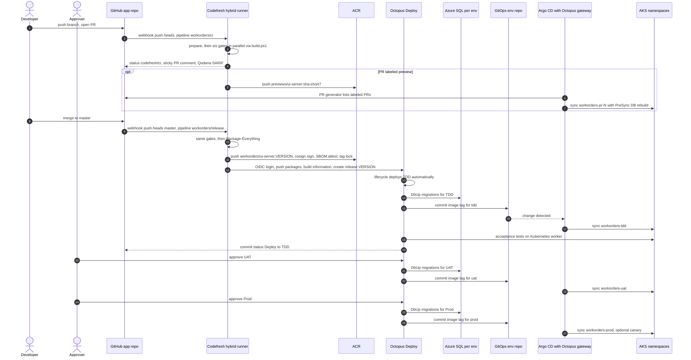

# Round 1: Codefresh Engineer Position Paper

| Field | Value |
|---|---|
| Role | `codefresh-engineer` |
| Round | 1 (position) |
| Date | 2026-09-23 |
| Scope | Build, verification, artifact supply chain and developer-facing delivery; handoffs to Octopus Deploy and Argo CD |
| Status | Design only. Nothing provisioned. Every infrastructure value is a placeholder. |

## 1. Position summary

- **Codefresh owns CI and the artifact supply chain.** Every job feeding today's `build-result` gate runs as a Codefresh classic pipeline on the existing hybrid runner (`<codefresh-runner-runtime>`), calling `build.ps1` unchanged. One required status, `codefresh/ci`, keeps the single-gate semantics (`fail_fast: false` plus per-step `strict_fail_fast: true`).
- **Codefresh mints the version and the immutable artifacts; Octopus records the release.** Version = `MAJOR.MINOR.<first-parent commit height>`, deterministic per commit and therefore rerun-safe. The master pipeline signs the image keyless, attaches an SBOM, and hands off to Octopus over OIDC with four verified marketplace steps, stopping at "release created". No Octopus API key exists.
- **Octopus owns promotion and the environment lifecycle.** Codefresh documents that GitOps Promotions are "disabled and turned off" in runtimes released after 0.24.0, which ends the steelman for Codefresh-driven promotion. Octopus runs lifecycles, approvals, migrations, TDD verification, rollback, DORA, and the Terraform runbooks that create and destroy runtime environments with the `Azure Runtime Provisioner` account. No branch-triggered Codefresh pipeline ever receives that subscription-wide credential.
- **Argo CD is the only reconciler; the Codefresh GitOps Runtime is optional.** If installed, it attaches to the single community Argo CD ("existing Argo CD" mode) for dashboards and image enrichment; nothing on the delivery path depends on it. Octopus's Argo CD steps are the only writer of environment image tags.
- **The pull request is the product.** A developer sees one required check, one sticky summary comment, Qodana findings in code scanning and, on request, a preview environment. Honest parity exceptions: ARM variants stay on GitHub Actions unless an Enterprise ARM runtime is licensed; the Windows LocalDB variant stays on GitHub Actions.

## 2. Responsibility matrix

Bold = owner.

| Capability | Codefresh | Argo CD | Octopus Deploy | Other |
|---|---|---|---|---|
| CI build/test | **Owns**: `ci` and `release` pipelines; `build.ps1` gates | none | none | GitHub Actions: Windows LocalDB (and ARM unless licensed) |
| Artifact and image storage | Produces, pushes, locks released tags | Pulls | Built-in feed for `ChurchBulletin.*` nupkgs; Docker feed to ACR | **ACR** `<acr-name>.azurecr.io`; GHCR copy for the AI Software Factory |
| SBOM/signing | **Owns**: keyless cosign, Syft SBOM attestation, Trivy | none | Optional `cosign verify` step | Cluster admission policy (SRE) |
| Release versioning and record | **Mints version**; pushes build information; creates release | none | **Owns the release record** | Commits and PRs linked via build information |
| Environment promotion | Not used (Promotions disabled) | Executes sync | **Owns**: lifecycle; "Update Argo CD Application Image Tags" | none |
| Approvals/gates | Merge and quality gates | Optional Prod sync windows | **Owns** approvals and freezes | Branch protection, review |
| Kubernetes reconciliation | Optional dashboards | **Owns** | Discovery and commits via gateway | none |
| Non-Kubernetes targets | none | none | **Owns** (Azure SQL; ACA during transition) | none |
| Database migrations | Builds package and migrator image; migrates CI service containers | PreSync Job for previews only | **Owns** TDD/UAT/Prod (DbUp before tag update) | none |
| Config and secrets | CI secrets in contexts `workorders-ci`, `workorders-release`; `azure-runtime-provisioner` attached to no branch pipeline | Syncs references, never values | Deploy-time variables; provisioner account | Azure Key Vault |
| Progressive delivery | none | Argo Rollouts (later) | Orchestrates, waits, aborts | none |
| Rollback | Retains signed, locked artifacts | Emergency only | **Owns**: redeploy previous release; DbUp forward-only | none |
| Runbooks/day-2 ops | Cron pipelines (CI image, full-history secret scan) | none | **Owns** runbooks | none |
| Ephemeral PR environments | Builds preview images, posts URL | **Owns**: ApplicationSet PR generator | Not involved | Shared non-prod SQL, DB per PR |
| Audit/DORA/observability | Build history; optional image enrichment | Sync history, notifications | **Owns DORA** (Insights) and audit | OpenTelemetry to Azure Monitor |
| Runtime environment lifecycle (create/destroy IaC) | Credential-free IaC checks on PRs | Syncs in-cluster add-ons after creation | **Owns**: Terraform plan, approve, apply/destroy runbooks | Terraform (azurerm), remote state; privileged bootstrap for role assignments |

## 3. Target runtime and environment topology

**Decision: TDD, UAT and Prod move from Azure Container Apps to AKS.** Argo CD reconciles Kubernetes resources; on ACA it would reconcile nothing. AKS also enables ApplicationSet previews, Argo Rollouts, and a second Deployment for the NServiceBus `Worker` endpoint (hosted by the Aspire AppHost locally, deployed nowhere today). Codefresh CI is target-agnostic, so the live GitHub Actions to Octopus to ACA path runs in parallel and stays the rollback route until DNS cutover.

| Layer | Logical design (Octopus and GitOps architects own the detail) |
|---|---|
| Clusters | `<aks-ci>` (existing runner cluster; privileged dind pods on a tainted node pool), `<aks-nonprod>`, `<aks-prod>`. Cost fallback: runner pool inside non-prod, never prod. |
| Namespaces | Non-prod: `workorders-tdd`, `workorders-uat`, `workorders-pr-<n>`, `preview-sql`, `argocd`, `octopus-argocd-gateway`, `octopus-k8s-worker`, optional `codefresh-gitops`. Prod: `workorders-prod`, `argocd`, `octopus-argocd-gateway`. |
| Octopus | Space `<octopus-space>`; environments `tdd`, `uat`, `prod`; lifecycle TDD (deploy automatically), UAT, Prod; channels `default` and `hotfix` (skips TDD, replacing `force_skip_tdd`); no tenants; service account `codefresh-release` (OIDC). |
| Argo CD | One instance per cluster; Applications `workorders-{tdd,uat,prod}` annotated `argo.octopus.com/project` and `argo.octopus.com/environment`; ApplicationSet `workorders-previews`. |
| Codefresh runtimes | `<codefresh-runner-runtime>` (x86) for every pipeline; optional ARM runtime (Enterprise); optional GitOps Runtime attached to the non-prod Argo CD. |
| Provisioning identity | `Azure Runtime Provisioner` (client secret, Contributor at subscription scope) used only by Octopus runbooks via library variable set `Azure Runtime Provisioning`. Contributor cannot create role assignments, so AKS pulls from ACR with an ACR scope-map token as `imagePullSecret` (token creation is an ARM write Contributor can make) unless a one-time privileged bootstrap grants `AcrPull`. |

## 4. End-to-end flow



Handoffs:

0. **Environments exist first.** Octopus runbooks create them (Terraform with the provisioner account); Codefresh is not involved.
1. **Branch push.** GitHub webhook fires the `push.heads` trigger of `workorders/ci` (commit status title `codefresh/ci`), mirroring today's `on: push`. PR events are not build triggers; they would build each commit twice.
2. **CI.** `prepare` computes `VERSION` and `CODE_CHANGED` (reusing `.github/scripts/detect-code-changes.sh`, fail-open); six gates run in parallel (section 8.1); status, comment and SARIF return through the GitHub REST API.
3. **Preview (opt-in).** Label `preview`. Branch builds push `previews/ui-server:sha-<short7>` through a registry integration whose ACR token is scoped to `previews/*`; the ApplicationSet PR generator (label filter, `head_short_sha_7`) creates `workorders-pr-<n>`; closing the PR deletes it and a PostDelete hook drops its database.
4. **Merge.** Push to `master` fires `workorders/release`: YAML pinned to `master`, release contexts, `concurrency: 1`, never cancelled.
5. **Publish.** Same gates, `Package-Everything`, image from the unchanged root `Dockerfile` with `cosign.sign: true`, SBOM attestation, Trivy, ACR tag lock.
6. **Codefresh to Octopus.** `obtain-oidc-id-token` (audience = service account ID), `octopusdeploy-login` (exports `OCTOPUS_ACCESS_TOKEN`), `octopusdeploy-push-package` (`OVERWRITE_MODE: ignore`), `octopusdeploy-push-build-information` (commits `HEAD^1..HEAD`, which feed Octopus lead time), `octopusdeploy-create-release` (`RELEASE_NUMBER` = `PACKAGE_VERSION` = `VERSION`, `IGNORE_EXISTING`). Codefresh's responsibility ends here.
7. **TDD.** Lifecycle auto-deploy: DbUp step, image-tag commit to the env repo, Argo CD sync, acceptance tests on an Octopus Kubernetes worker using the Codefresh-built CI image and the `ChurchBulletin.AcceptanceTests` package, then a `Deploy to TDD` commit status. A failed test fails the deployment and blocks UAT.
8. **UAT and Prod.** Octopus approval, same process, environment-scoped variables.

**What a developer sees on a pull request**

- **Checks:** `codefresh/ci` pending within seconds, then pass or fail; "Details" opens the Codefresh build (organization SSO). In shadow mode, `Build result` stays required.
- **One sticky comment per PR, updated each push:** gate table, test counts, coverage, highest production CRAP score against threshold 6, new Qodana findings, NuGet vulnerabilities, secret findings, version, image tag, preview URL, report links.
- **Code scanning:** Qodana SARIF through the code-scanning API, as today's `upload-sarif`.
- **After merge:** `codefresh/release`, then `Deploy to TDD`, on the merge commit; the Octopus release lists the PR's commits and issues.

## 5. Repositories and config-as-code layout

```text
ClearMeasureLabs/bootcamp-palermo-workorders        app repo (existing files untouched)
  platform/
    codefresh/
      pipelines/ci.yml             shared by workorders/ci and workorders/release
      pipelines/ci-image.yml       CI toolchain image (weekly cron + path trigger)
      pipelines/ci-arm.yml         optional, Enterprise ARM runtime
      scripts/                     changed-paths, worktrees, build-info JSON, PR summary
      images/ci-dotnet/Dockerfile  SDK 10 (includes pwsh), go-sqlcmd, Playwright 1.54 browsers
      version.env                  MAJOR=2, MINOR=5 (GitHub Actions stays on 2.4)
      terraform/                   codefresh_project, codefresh_pipeline; context names only
    containers/                    worker and db-migrator Dockerfiles (root Dockerfile untouched)
    infra/terraform/               environment create/destroy IaC, run by Octopus runbooks
    octopus/                       new project OCL and space config (Octopus architect)
    gitops/charts/workorders/      Helm chart if it lives with code (GitOps architect)

<org>/workorders-gitops                              env repo; Octopus Argo CD steps are its only writer
  apps/                            AppProjects, Applications, ApplicationSet
  envs/{tdd,uat,prod}/values.yaml  image tags committed by Octopus
```

Rules the Codefresh slice depends on:

- **Env state never lives in the app repo.** Deployment commits would re-trigger CI (`build.yml` and Codefresh build every push) and collide with `master` branch protection.
- **YAML is reviewed with code; pipeline objects are Terraform** (`codefresh-io/codefresh` provider: triggers, runtimes, concurrency, termination policies, `commit_status_title`, context attachments). Secret values never appear in Terraform.
- **The new Octopus project's OCL lives under `platform/octopus/`,** never `.octopus/` (the live project in another space). A version-controlled project makes `create-release` pass `GIT_REF` and `GIT_COMMIT`.

## 6. Key decisions

| # | Decision | Chosen | Rejected | Reason |
|---|---|---|---|---|
| D1 | CI engine | Codefresh classic pipelines, existing hybrid runner | Keep GitHub Actions; Argo Workflows | Consolidation; runner inside the Azure network; Octopus-native steps |
| D2 | Build logic | `build.ps1` unchanged: `Build`, `Build -UseSqlite`, `Invoke-AcceptanceTests`, `Package-Everything` | Re-implement in YAML | One source of truth with `privatebuild.ps1` |
| D3 | SQL Server in CI | Step service container plus existing `SQL_EXTERNAL`/`SQL_SERVER_HOST`/`SQL_SA_PASSWORD` path | `docker run` via mounted socket | Readiness probe, isolation, no socket |
| D4 | Pipeline split | `ci` (branches, cancels superseded) and `release` (master, queues, release contexts) | One conditional pipeline | Least privilege; Codefresh recommends simple pipelines |
| D5 | Triggers | `push.heads` for branches and master; optional `push.tags` `v*` (retag, GitHub Release, no rebuild); weekly cron | PR events as build triggers | Same model as `on: push`; no double builds |
| D6 | Version | `MAJOR.MINOR.<first-parent height>`, branches add `-ci.<short-sha>` | Octopus `NextPatch`; Codefresh build ID | No sequential Codefresh counter; deterministic; one authority |
| D7 | Octopus integration | Marketplace steps with OIDC; Octopus CLI only for gaps | API key; `dotnet-octo push`; raw REST | Removes the API-key outage class; `IGNORE_EXISTING` |
| D8 | Where Codefresh stops | Release creation; TDD by lifecycle auto-deploy | `deploy-release` plus `task wait` | One orchestrator; Codefresh cannot deploy UAT/Prod |
| D9 | Promotion owner | Octopus lifecycle plus Argo CD steps | Codefresh Promotion Flows | Promotions disabled after runtime 0.24.0 |
| D10 | Codefresh GitOps Runtime | Optional, "existing Argo CD" mode | Runtime-installed Argo CD | One Argo CD; no critical-path dependency |
| D11 | Supply chain | Keyless cosign, SBOM attestation, Trivy, tag lock | Unsigned; key-based cosign | No key management; Fulcio accepts the Codefresh issuer |
| D12 | ARM and Windows | Stay on GitHub Actions | Drop them; Codefresh Windows | ARM Enterprise-only; Windows incubation; they validate workstations, not the artifact |
| D13 | Previews | ApplicationSet PR generator plus Codefresh images | Codefresh Helm installs; Octopus release per PR | Automatic cleanup; no release noise |
| D14 | Cutover | Shadow mode, compare, flip required check | Big-bang | Evidence; rollback = re-require `build-result` |
| D15 | Environment lifecycle runner | Octopus runbooks: Terraform plan, manual intervention, apply; destroy runbook, scheduled for idle environments | Codefresh pipelines with `azure-runtime-provisioner`; laptops | Approvals, audit, environment scoping already in Octopus; secret stays account-bound |
| D16 | Codefresh and the provisioner context | Attached to no pipeline (at most a manual, master-pinned pipeline with approval) | Credentialed `terraform plan` on PRs | Branch authors control branch YAML; the secret would be exfiltrable |

## 7. Risks, and what the other roles are likely to get wrong

### 7.1 Risks in the Codefresh slice

| Risk | Mitigation |
|---|---|
| Parallel steps share one dind pod and volume (GitHub Actions jobs each get a VM): contention, `bin/obj` collisions, Playwright flakiness | Git worktree per gate; dind sized for the peak. If acceptance p95 or flake rate regresses, move `acceptance` to a child pipeline (`codefresh-run`) |
| `build.ps1` detects only GitHub Actions; elsewhere on Linux `Init` forces `NUGET_PACKAGES=/tmp/nuget-packages` | Symlink it to `/codefresh/volume/.nuget/packages`; follow-up item for generic CI detection |
| Git height is wrong on shallow clones | Unshallow, assert, fail rather than mint |
| Qodana baseline drift (`build.yml` uses `:latest`; ABSENT counts as new) | Same pinned linter tag in both systems |
| Codefresh GitOps churn (Hosted runtimes deprecated, Promotions disabled) | No critical-path dependency on it |
| Client-secret principal with Contributor on the whole subscription | Held only by Octopus; one rotation point. Retire the secret via Octopus Azure OIDC (2023.4+, subject `space:<slug>:project:<slug>:environment:<slug>`); an Entra app owner must add that federated credential. Codefresh OIDC fits Azure poorly: its `sub` embeds `scm_user_name` |
| Contributor cannot create role assignments: `AcrPull`, Key Vault RBAC, AKS RBAC roles when local accounts are disabled | Design out where possible (ACR scope-map tokens). Federated credentials on user-assigned identities are ARM writes Contributor can make, but granting those identities access still needs assignments; those go into a reviewed one-time bootstrap by an Owner or RBAC Administrator. Key Vault access policies avoid assignments but are a known escalation path (SRE decision) |
| Other long-lived credentials: ACR integrations, Codefresh GitOps API key, GitHub App key | Repository-scoped ACR tokens; rotation runbooks |
| Private build logs on a public repo | PR summary; `is_public` stays off |
| Externally maintained marketplace steps | Pin versions and digests |
| Two systems publishing during parallel run | Distinct repository `workorders/ui-server`, minor 2.5, separate space |

### 7.2 Likely errors by other roles

**Octopus architect.**
- *Octopus minting the version.* Artifacts exist before the release; two numbering authorities produced the `Release '…' already exists` collisions in `arch/DeployFailure-2026-08-21.md`. Codefresh mints once; Octopus takes `RELEASE_NUMBER` verbatim.
- *API keys for CI-to-Octopus calls.* The longest recorded deploy outage (41 red runs, 13 days) was a rotated API key; OIDC removes that class.
- *Playwright on dynamic cloud workers:* multi-gigabyte cold pulls and a public TDD ingress. The in-cluster Kubernetes worker reuses CI's image and browser build (the 2026-08-21 incident began with a Playwright cache architecture mismatch).
- *Binding the provisioner account to deployment processes.* Environment creation belongs in reviewed runbooks.

**GitOps architect.**
- *Codefresh Promotion Flows or Kargo:* the first is disabled; the second adds a fourth control plane.
- *Argo CD Image Updater for TDD:* a second tag writer bypassing the release record, the TDD gate and lead-time data.
- *Env state in this repo:* re-triggers CI, hits branch protection.
- *PreSync hooks for Azure SQL beyond previews:* re-run on every sync, no approval point, migrations bound to sync timeouts.
- *Crossplane or Azure Service Operator with the provisioner secret:* puts a subscription-wide Contributor secret into a cluster Secret.

**SRE/security lead.**
- *Treating the runner as trusted.* dind pods are privileged: tainted pool, egress allowlist, never in prod, release credentials only in the master-pinned pipeline.
- *Expecting SLSA provenance from the build step:* not a documented field. Honest gap: signature plus SBOM now; freestyle-generated provenance would be self-attested.
- *Splitting the provisioner per environment:* right goal, but it needs role assignments, so it belongs to the privileged bootstrap.

**Pragmatist.**
- *"Keep GitHub Actions for CI."* Viable, and hosted runners are free for a public repository, so cost is not the argument. The arguments: the explicit request, one vendor (Octopus has owned Codefresh since February 2024), a runner inside the Azure network, OIDC-native Octopus steps. The required check flips only after 50 consecutive builds where both systems agree.
- *"Stay on ACA":* Argo CD would reconcile nothing; ACA remains the rollback path.
- *Terraform from laptops with the shared secret:* no audit, no approvals, secret sprawl.

## 8. Implementation highlights

### 8.1 Gate parity map

| GitHub Actions job | Codefresh step | Notes |
|---|---|---|
| Detect code changes | `prepare` runs `detect-code-changes.sh` unchanged | No `event.before`: master diffs `HEAD^1..HEAD`, branches diff against `merge-base origin/master`; errors emit a non-docs path (fail-open) |
| Integration Build (SQL container) + CRAP | `build_sql`: `Build` with `mssql` service, then `run-crap-audit.ps1 -SkipTests -FailOnViolations` | CRAP reads `build/test` coverage |
| Integration Build (SQLite) | `build_sqlite`: `Build -UseSqlite` | own worktree |
| Code Analysis | `code_analysis`: `dotnet format` style and analyzers, `EnforceCodeStyleInBuild` | identical commands |
| Qodana | `qodana`: `jetbrains/qodana-cdnet`, baseline, threshold 0 | token optional |
| Security Scan (disabled: `if: false`) | `security_scan`: NuGet vulnerable/deprecated, Gitleaks CLI, credential files | advisory two weeks, then blocking |
| Acceptance Tests (x86) | `acceptance`: `Invoke-AcceptanceTests` with a second `mssql` service | on hosted Ubuntu the engine resolves to SQL-Container, not SQLite |
| ARM SQLite builds, Windows LocalDB | GitHub Actions (ARM optionally `ci-arm`) | Enterprise ARM; Windows incubation |
| `build-result` | root `fail_fast: false`, `strict_fail_fast: true`, `gate` step | status `codefresh/ci` |
| Publish RC (ACR, GHCR, `rc-<version>`) | `ui_image`, GHCR push, `gh release create` | AI Software Factory contract |
| Publish to Octopus | `octopus_*` steps, fatal on master | new space, OIDC |
| (new) IaC checks | `iac_checks`: fmt, validate, tflint, `trivy config`; no credentials | runs when `platform/infra/**` changes |

### 8.2 Pipeline objects (Terraform)

```hcl
# platform/codefresh/terraform/pipelines.tf (sketch, placeholders only)
resource "codefresh_pipeline" "ci" {
  name = "workorders/ci"
  spec {
    spec_template {
      repo     = "ClearMeasureLabs/bootcamp-palermo-workorders"
      path     = "./platform/codefresh/pipelines/ci.yml"
      revision = ""                                   # YAML from the triggering branch
      context  = var.git_context
    }
    trigger {
      name                = "branch-push"
      type                = "git"
      provider            = "github"
      context             = var.git_context
      repo                = "ClearMeasureLabs/bootcamp-palermo-workorders"
      events              = ["push.heads"]
      branch_regex        = "/^(?!master$).+/"        # lookahead support to verify
      commit_status_title = "codefresh/ci"
    }
    termination_policy {
      on_create_branch { ignore_trigger = false }     # cancel superseded builds of the branch
    }
    runtime_environment {
      name   = var.runner_runtime                     # <codefresh-runner-runtime>
      cpu    = var.ci_cpu
      memory = var.ci_memory
    }
    contexts = ["workorders-ci"]                      # never azure-runtime-provisioner
  }
}

resource "codefresh_pipeline" "release" {
  name = "workorders/release"
  spec {
    spec_template {
      repo     = "ClearMeasureLabs/bootcamp-palermo-workorders"
      path     = "./platform/codefresh/pipelines/ci.yml"
      revision = "master"                             # manual runs cannot swap in branch YAML
      context  = var.git_context
    }
    trigger {
      name                = "master-push"
      type                = "git"
      provider            = "github"
      context             = var.git_context
      repo                = "ClearMeasureLabs/bootcamp-palermo-workorders"
      events              = ["push.heads"]
      branch_regex        = "/^master$/"
      commit_status_title = "codefresh/release"
    }
    concurrency = 1                                   # master builds queue, never cancel
    runtime_environment { name = var.runner_runtime }
    contexts  = ["workorders-ci", "workorders-release"]   # still no provisioner context
    variables = { PUBLISH = "true" }
  }
}
```

### 8.3 Pipeline YAML (excerpt)

```yaml
# platform/codefresh/pipelines/ci.yml (sketch)
version: "1.0"
mode: parallel
fail_fast: false                        # every gate reports (docs/ci-single-gate.md semantics)
stages: [prepare, verify, publish, handoff]

steps:
  main_clone:
    type: git-clone
    stage: prepare
    repo: "${{CF_REPO_OWNER}}/${{CF_REPO_NAME}}"
    revision: "${{CF_REVISION}}"
    git: "<git-integration>"

  prepare:
    stage: prepare
    image: "<acr-name>.azurecr.io/platform/ci-dotnet@sha256:<digest>"
    working_directory: "${{main_clone}}"
    when: { steps: [ { name: main_clone, on: [success] } ] }
    commands:
      - git fetch --unshallow --quiet || true
      - test "$(git rev-parse --is-shallow-repository)" = "false"
      - . platform/codefresh/version.env
      - V="${MAJOR}.${MINOR}.$(git rev-list --count --first-parent HEAD)"
      - '[ "${CF_BRANCH}" = "master" ] || V="${V}-ci.${CF_SHORT_REVISION}"'
      - cf_export VERSION="${V}"
      - cf_export BUILD_BUILDNUMBER="${V}"
      - C=$(bash platform/codefresh/scripts/changed-paths.sh | bash .github/scripts/detect-code-changes.sh --from-list - | sed 's/^code=//')
      - cf_export CODE_CHANGED="${C}"
      - cf_export IAC_CHANGED="$(bash platform/codefresh/scripts/changed-paths.sh --iac)"   # no grep -q under a pipe (SIGPIPE lesson in detect-code-changes.sh)
      - bash platform/codefresh/scripts/worktrees.sh sqlite analysis qodana acceptance
      - mkdir -p /codefresh/volume/.nuget/packages

  build_sql:
    stage: verify
    title: Integration Build (SQL Server service) + CRAP
    image: "<acr-name>.azurecr.io/platform/ci-dotnet@sha256:<digest>"
    working_directory: "${{main_clone}}"
    fail_fast: false
    strict_fail_fast: true              # continue, but mark the build failed
    when:
      steps: [ { name: prepare, on: [success] } ]
      condition: { all: { code: '"${{CODE_CHANGED}}" == "true"' } }
    environment:
      - DATABASE_ENGINE=SQL-Container
      - SQL_EXTERNAL=true               # build.ps1 skips docker, uses the service
      - SQL_SERVER_HOST=mssql,1433
      - SQL_SA_PASSWORD=${{CI_SQL_SA_PASSWORD}}   # encrypted var in context workorders-ci
      - DATABASE_NAME=ChurchBulletin
      - AI_OpenAI_ApiKey=${{AI_OPENAI_APIKEY}}
      - AI_OpenAI_Url=${{AI_OPENAI_URL}}
      - AI_OpenAI_Model=${{AI_OPENAI_MODEL}}
    services:
      composition:
        mssql:
          image: "mcr.microsoft.com/mssql/server:2022-latest"   # pin by digest
          environment:
            - ACCEPT_EULA=Y
            - MSSQL_SA_PASSWORD=${{CI_SQL_SA_PASSWORD}}
          ports: [1433]
      readiness:
        image: "mcr.microsoft.com/mssql/server:2022-latest"
        timeoutSeconds: 120
        periodSeconds: 5
        commands:
          - /opt/mssql-tools18/bin/sqlcmd -S mssql -U sa -P "${{CI_SQL_SA_PASSWORD}}" -C -Q "SELECT 1"
    commands:
      - ln -sfn /codefresh/volume/.nuget/packages /tmp/nuget-packages
      - pwsh -NoProfile -Command '. ./build.ps1; Build'
      - pwsh -NoProfile -File scripts/crap/run-crap-audit.ps1 -SkipTests -FailOnViolations

  # build_sqlite, code_analysis, security_scan and acceptance share this shape,
  # each in /codefresh/volume/wt/<name>. qodana keeps the image entrypoint:
  qodana:
    stage: verify
    image: "jetbrains/qodana-cdnet:<tag-that-produced-the-baseline>"
    working_directory: /codefresh/volume/wt/qodana
    fail_fast: false
    strict_fail_fast: true
    when:
      steps: [ { name: prepare, on: [success] } ]
      condition: { all: { code: '"${{CODE_CHANGED}}" == "true"' } }
    cmd:                                # flag spelling to verify against the image
      - --project-dir=/codefresh/volume/wt/qodana
      - --results-dir=/codefresh/volume/reports/qodana
      - --solution=src/ChurchBulletin.sln
      - --baseline=qodana.sarif.json
      - --fail-threshold=0

  iac_checks:                           # no Azure credentials, ever
    stage: verify
    image: "<acr-name>.azurecr.io/platform/iac-tools@sha256:<digest>"   # terraform, tflint, trivy
    working_directory: "${{main_clone}}/platform/infra/terraform"
    fail_fast: false
    strict_fail_fast: true
    when:
      steps: [ { name: prepare, on: [success] } ]
      condition: { all: { iac: '"${{IAC_CHANGED}}" == "true"' } }
    commands:
      - terraform fmt -check -recursive
      - terraform init -backend=false && terraform validate
      - tflint --recursive
      - trivy config --exit-code 1 .

  # ---- release pipeline only (PUBLISH=true, master) ----
  package:
    stage: publish
    image: "<acr-name>.azurecr.io/platform/ci-dotnet@sha256:<digest>"
    working_directory: "${{main_clone}}"
    when:
      branch: { only: [master] }
      condition: { all: { publish: '"${{PUBLISH}}" == "true"' } }
      steps:
        all:
          - { name: build_sql, on: [success] }
          - { name: build_sqlite, on: [success] }
          - { name: code_analysis, on: [success] }
          - { name: qodana, on: [success] }
          - { name: security_scan, on: [success] }
          - { name: acceptance, on: [success] }
    commands:
      - ln -sfn /codefresh/volume/.nuget/packages /tmp/nuget-packages
      - pwsh -NoProfile -Command '. ./build.ps1; Package-Everything'
      - rm -rf built && cp -a src/UI/Server/bin/Release/net10.0/publish built   # root Dockerfile copies /built/

  ui_image:
    stage: publish
    type: build
    working_directory: "${{main_clone}}"
    dockerfile: Dockerfile              # root Dockerfile, unchanged
    image_name: workorders/ui-server
    tags: ["${{VERSION}}", "sha-${{CF_SHORT_REVISION}}"]
    registry: "<acr-integration>"
    cosign:
      sign: true                        # keyless: Codefresh OIDC, Fulcio, Rekor
    when: { steps: [ { name: package, on: [success] } ] }

  # sigstore_token (obtain-oidc-id-token, AUDIENCE: sigstore) and sbom_scan_lock
  # (syft SBOM, cosign attest, trivy, ACR tag lock) run here; omitted for brevity.

  octopus_token:
    stage: handoff
    type: obtain-oidc-id-token          # exports ID_TOKEN, valid five minutes
    arguments: { AUDIENCE: "${{OCTOPUS_SERVICE_ACCOUNT_ID}}" }
    when: { steps: [ { name: sbom_scan_lock, on: [success] } ] }

  octopus_login:
    stage: handoff
    type: octopusdeploy-login           # exports OCTOPUS_ACCESS_TOKEN; pin step version
    arguments:
      ID_TOKEN: "${{ID_TOKEN}}"
      OCTOPUS_URL: "${{OCTOPUS_URL}}"
      OCTOPUS_SERVICE_ACCOUNT_ID: "${{OCTOPUS_SERVICE_ACCOUNT_ID}}"
    when: { steps: [ { name: octopus_token, on: [success] } ] }

  octopus_packages:
    stage: handoff
    type: octopusdeploy-push-package
    arguments:
      OCTOPUS_ACCESS_TOKEN: "${{OCTOPUS_ACCESS_TOKEN}}"
      OCTOPUS_URL: "${{OCTOPUS_URL}}"
      OCTOPUS_SPACE: "${{OCTOPUS_SPACE}}"
      PACKAGES:
        - "${{main_clone}}/build/ChurchBulletin.UI.${{VERSION}}.nupkg"
        - "${{main_clone}}/build/ChurchBulletin.Database.${{VERSION}}.nupkg"
        - "${{main_clone}}/build/ChurchBulletin.AcceptanceTests.${{VERSION}}.nupkg"
        - "${{main_clone}}/build/ChurchBulletin.Script.${{VERSION}}.nupkg"
      OVERWRITE_MODE: ignore            # reruns of the same commit are no-ops
    when: { steps: [ { name: octopus_login, on: [success] } ] }

  octopus_build_info:
    stage: handoff
    type: octopusdeploy-push-build-information
    arguments:
      OCTOPUS_ACCESS_TOKEN: "${{OCTOPUS_ACCESS_TOKEN}}"
      OCTOPUS_URL: "${{OCTOPUS_URL}}"
      OCTOPUS_SPACE: "${{OCTOPUS_SPACE}}"
      PACKAGE_IDS: [ChurchBulletin.Database, ChurchBulletin.AcceptanceTests, workorders/ui-server]
      FILE: "${{main_clone}}/build/octopus-buildinfo.json"   # BuildUrl=CF_BUILD_URL, Commits=HEAD^1..HEAD
      VERSION: "${{VERSION}}"
      OVERWRITE_MODE: overwrite
    when: { steps: [ { name: octopus_packages, on: [success] } ] }

  octopus_release:
    stage: handoff
    type: octopusdeploy-create-release
    arguments:
      OCTOPUS_ACCESS_TOKEN: "${{OCTOPUS_ACCESS_TOKEN}}"
      OCTOPUS_URL: "${{OCTOPUS_URL}}"
      OCTOPUS_SPACE: "${{OCTOPUS_SPACE}}"
      PROJECT: "${{OCTOPUS_PROJECT}}"
      RELEASE_NUMBER: "${{VERSION}}"
      PACKAGE_VERSION: "${{VERSION}}"
      GIT_REF: refs/heads/master        # only for a version-controlled project
      GIT_COMMIT: "${{CF_REVISION}}"
      IGNORE_EXISTING: "true"           # replaces deploy.yml's rerun check (#9032)
    when: { steps: [ { name: octopus_build_info, on: [success] } ] }

hooks:
  on_finish:                            # never changes the build result
    exec:
      image: "<acr-name>.azurecr.io/platform/ci-dotnet@sha256:<digest>"
      commands:
        - pwsh -NoProfile -File "${{CF_VOLUME_PATH}}/${{CF_REPO_NAME}}/platform/codefresh/scripts/Publish-BuildSummary.ps1"
```

### 8.4 Identities at the Codefresh boundary

```text
Octopus service account  codefresh-release (space <octopus-space>)
  OIDC identity          Issuer   https://oidc.codefresh.io
                         Subject  account:<codefresh-account-id>:pipeline:<release-pipeline-id>:*
                                  (wildcards since Octopus 2024.1; tighten to the sub seen in a test build)
  Role                   custom: BuiltInFeedPush, BuildInformationPush, ReleaseCreate, ReleaseView, ProjectView
                         (+ DeploymentCreate scoped to TDD only if lifecycle auto-deploy requires it)

Azure provisioning       Octopus account "Azure Runtime Provisioner" (slug azure-runtime-provisioner)
                         via library variable set "Azure Runtime Provisioning" (AzureRuntimeProvisioner)
  Runbook create env     Plan to apply a Terraform template -> Manual intervention -> Apply a Terraform template
  Runbook destroy env    Manual intervention -> Destroy Terraform resources (scheduled for idle environments)
  Codefresh context      azure-runtime-provisioner: exists, attached to no pipeline (D16)
```

### 8.5 Codefresh GitOps promotion CRDs: not applicable

`Product`, `PromotionFlow`, `PromotionPolicy` and `PromotionTemplate` (`codefresh.io/v1beta1`) are documented, but Promotions are disabled after runtime 0.24.0, so the design writes none. With the optional runtime, the only Codefresh metadata is `codefresh.io/product: workorders` on the Applications plus a `codefresh-report-image` step feeding the Images view.

## 9. Assumptions, open questions, and capabilities to verify

### 9.1 Verified capabilities

| Claim | Source |
|---|---|
| Eight Octopus steps for Codefresh (login, create-package, push-package, create-release, deploy-release, deploy-release-tenanted, run-runbook, push-build-information), running the Octopus CLI in a container | <https://octopus.com/docs/packaging-applications/build-servers/codefresh-pipelines>, <https://codefresh.io/docs/docs/integrations/octopus-deploy/> |
| `octopusdeploy-login` inputs and `OCTOPUS_ACCESS_TOKEN` export; `create-release` `CHANNEL`, `GIT_REF`, `GIT_COMMIT`, `PACKAGE_VERSION`, `IGNORE_EXISTING`; `OVERWRITE_MODE`; `deploy-release` documents no wait | <https://codefresh.io/steps/step/octopusdeploy-login>, <https://codefresh.io/steps/step/octopusdeploy-create-release>, <https://codefresh.io/steps/step/octopusdeploy-push-build-information>, <https://codefresh.io/steps/step/octopusdeploy-deploy-release> |
| Octopus OIDC for other issuers, subject wildcards since 2024.1; Azure OIDC accounts since 2023.4; default subject `space:…:project:…:environment:…` | <https://octopus.com/docs/octopus-rest-api/openid-connect/other-issuers>, <https://octopus.com/docs/infrastructure/accounts/azure>, <https://octopus.com/docs/infrastructure/accounts/openid-connect> |
| Codefresh OIDC: `obtain-oidc-id-token` (`AUDIENCE`, `ID_TOKEN`, five-minute tokens); `sub` includes `scm_user_name` | <https://codefresh.io/docs/docs/integrations/oidc-pipelines/>, <https://codefresh.io/steps/step/obtain-oidc-id-token> |
| No sequential build number; `cf_export`; step result members | <https://codefresh.io/docs/docs/pipelines/variables/> |
| Service containers with readiness; parallel mode, `when.steps`, `fail_fast`, `strict_fail_fast`; conditions; hooks | <https://codefresh.io/docs/docs/pipelines/service-containers/>, <https://codefresh.io/docs/docs/pipelines/advanced-workflows/>, <https://codefresh.io/docs/docs/pipelines/steps/freestyle/>, <https://codefresh.io/docs/docs/pipelines/conditional-execution-of-steps/>, <https://codefresh.io/docs/docs/pipelines/hooks/> |
| Git triggers, commit status title, automatic PR status; Terraform `codefresh_pipeline` fields | <https://codefresh.io/docs/docs/pipelines/triggers/git-triggers/>, <https://codefresh.io/docs/docs/ci-cd-guides/pull-request-branches/>, <https://registry.terraform.io/providers/codefresh-io/codefresh/latest/docs/resources/pipeline> |
| Build step auto-push, cache, buildx, keyless `cosign.sign`, no provenance or SBOM fields; Fulcio accepts the Codefresh issuer | <https://codefresh.io/docs/docs/pipelines/steps/build/>, <https://github.com/sigstore/fulcio/blob/main/config/identity/config.yaml> |
| Volume caching rules; ARM Enterprise-only; Windows incubation; `codefresh-run` | <https://codefresh.io/docs/docs/pipelines/pipeline-caching/>, <https://codefresh.io/docs/docs/installation/runner/arm-support/>, <https://codefresh.io/docs/docs/incubation/windows/>, <https://codefresh.io/steps/step/codefresh-run> |
| Hosted GitOps Runtimes deprecated; "existing Argo CD" mode; Promotions disabled after 0.24.0; promotion CRDs; image reporting needs a runtime | <https://codefresh.io/docs/docs/installation/gitops/>, <https://codefresh.io/docs/docs/installation/gitops/runtime-install-with-existing-argo-cd/>, <https://codefresh.io/docs/docs/promotions/promotions-overview/>, <https://codefresh.io/docs/docs/promotions/yaml/promotion-policy-crd/>, <https://codefresh.io/docs/docs/gitops-integrations/ci-integrations/codefresh-classic/> |
| Octopus Argo CD steps and annotations (Early Access as of 2025-12-01); Kubernetes worker execution containers; lifecycle auto-deploy; Insights lead time from build-information commits; Terraform plan/apply/destroy steps | <https://octopus.com/docs/argo-cd/steps/update-application-image-tags>, <https://octopus.com/docs/argo-cd/annotations>, <https://octopus.com/blog/argo-cd-in-octopus>, <https://octopus.com/docs/infrastructure/workers/kubernetes-worker>, <https://octopus.com/docs/releases/lifecycles>, <https://octopus.com/docs/insights>, <https://octopus.com/docs/deployments/terraform> |
| Contributor NotActions exclude `Microsoft.Authorization/*/Write` (no role assignments) but not other resource writes | <https://learn.microsoft.com/en-us/azure/role-based-access-control/built-in-roles/privileged#contributor> |
| ApplicationSet PR generator; PostDelete hooks since v2.10; Qodana Community for .NET Docker-only, token optional; Octopus acquired Codefresh (2024-02-27) | <https://argo-cd.readthedocs.io/en/stable/operator-manual/applicationset/Generators-Pull-Request/>, <https://argo-cd.readthedocs.io/en/stable/user-guide/sync-waves/>, <https://www.jetbrains.com/help/qodana/qodana-cdnet-docker-readme.html>, <https://octopus.com/news/octopus-acquires-codefresh> |

### 9.2 Unverified (verify before implementation)

- [UNVERIFIED] PR event spellings in pipeline specs (`pullrequest.*` vs `pull_request.*`); unused on the main path.
- [UNVERIFIED] Lookahead in `branch_regex`; fallback `when.branch.ignore: [master]`.
- [UNVERIFIED] `cf_export` values inside step-level `services`; the design uses a context variable.
- [UNVERIFIED] Qodana image flag names through `cmd`.
- [UNVERIFIED] Build information keyed by a Docker image package ID.
- [UNVERIFIED] Whether lifecycle auto-deploy needs `DeploymentCreate` on the release creator.
- [UNVERIFIED] Whether Octopus Argo CD steps wait for sync and health; GA status on 2026.4; coexistence with a Codefresh GitOps Runtime.
- [UNVERIFIED] Octopus OIDC subject format for runbook runs, and Terraform-step binding of an OIDC Azure account.
- [UNVERIFIED] ACR tokens and scope maps on the registry's current SKU.
- [UNVERIFIED] Retrieving the Codefresh Git integration token in steps; the design uses a dedicated GitHub App.

### 9.3 Assumptions

- The runner cluster can host a node pool sized for the peak parallel load and is not the prod cluster.
- `Microsoft.Playwright` stays at 1.54.0; the CI image pins matching browsers.
- The provisioner credential is used for Azure resource lifecycle only, never for CI.

### 9.4 Open questions for the chief architect

1. Is an Enterprise ARM runtime licensed? If not, ARM variants stay on GitHub Actions.
2. Does the AI Software Factory keep its GHCR plus `rc-<version>` contract?
3. Should the `Worker` endpoint be deployed (image built from `platform/containers/`)?
4. Where does the new Octopus project's OCL live? This sets `GIT_REF`/`GIT_COMMIT`.
5. Is the optional Codefresh GitOps Runtime wanted, given its license, API key and upgrade cadence?
6. Who runs the one-time privileged bootstrap for role assignments, and can an Entra app owner add an Octopus federated credential so the provisioner's client secret can be retired?
