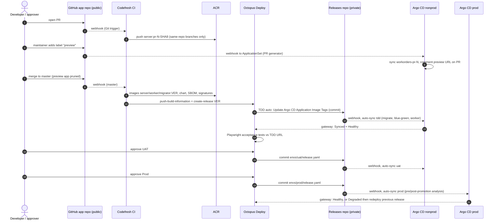

# Round 1 Position Paper: GitOps Architect

| Field | Value |
|---|---|
| Role | `gitops-architect` (Argo CD / GitOps) |
| Round | 1: position |
| Date | 2026-09-23 |
| Status | Design only; every environment value is a placeholder. |

**Thesis.** Git holds desired state. Argo CD alone changes cluster state. Codefresh and Octopus write only artifacts, release records and Git commits. Research moved the promotion writer from Codefresh to Octopus: Codefresh GitOps promotions are switched off, and Octopus ships Argo CD steps built on this split: "During a deployment, Octopus modifies the desired state in Git, and Argo CD takes care of reconciling those changes to the cluster" ([Octopus blog](https://octopus.com/blog/argo-cd-in-octopus)).

## 1. Position summary

- **AKS replaces Azure Container Apps: one nonprod and one prod cluster.** Argo CD reconciles Kubernetes objects, and Container Apps exposes no Kubernetes API. AKS also brings Argo Rollouts, in-network migrations, a home for the Worker, and PR previews that cost one namespace each. Container Apps stays live until cutover.
- **One writer per thing.** Argo CD alone writes the clusters. Octopus alone writes each environment's pin, `envs/<env>/release.yaml` in a private releases repo, through "Update Argo CD Application Image Tags". Codefresh writes images, the chart, SBOMs, signatures and the Octopus release. Humans change everything else by pull request. Terraform, run by Octopus runbooks, writes Azure resources only.
- **Upstream Argo CD 3.5.x, one instance per cluster**, bootstrapped as app-of-apps, with ApplicationSets for workloads. Rejected: a Codefresh GitOps Runtime (Promotions disabled after runtime 0.24.0; GitOps Cloud no longer sold) and hub-and-spoke (the hub would hold prod credentials, and Octopus already spans instances).
- **One Helm chart, ordered by sync waves:** ExternalSecrets, then the DbUp Job (Sync hook), then UI.Server as a blue-green Rollout, then the Worker. The single human approval per environment happens in Octopus before the Git write. Gates inside the cluster are automated analyses, so no Rollout waits paused for a click.
- **Auto-sync, prune and self-heal everywhere, Prod included.** Rollback is Octopus "redeploy previous release" (a Git write), plus a Rollouts abort mid-rollout. Secrets flow from Key Vault through the External Secrets Operator (ESO) with Workload Identity. Environment create/destroy is Terraform in Octopus runbooks, split into a privileged foundation layer and a runtime layer that needs only Contributor.

## 2. Responsibility matrix

"Owner" marks the single accountable tool. Each cell names what that tool writes.

| Capability | Codefresh | Argo CD | Octopus Deploy | Other |
|---|---|---|---|---|
| CI build/test | **Owner.** Pipelines on the hybrid runner reuse `build.ps1` targets. | — | — | The GitHub Actions `build.yml` stays live until cutover. |
| Artifact & image storage | Pushes images `workorders/{server,worker,migrator}` and the chart to ACR as OCI artifacts. | Pulls the chart from ACR using Workload Identity. | Uses ACR as a Docker feed. Its built-in feed holds the acceptance-test package. | `<acr-name>.azurecr.io` with tag immutability. |
| SBOM/signing | **Owner.** Generates the SBOM and signs images and chart. | Does not verify signatures. | Stores build information. | Kyverno `ImageValidatingPolicy` verifies signatures at admission. |
| Release versioning & release record | Computes the version and creates the release (`octopusdeploy-create-release`). | — | **Owner.** A release is an immutable snapshot of the image versions. | The releases repo's Git log is a secondary record. |
| Environment promotion | — | Reconciles the result. | **Owner.** Lifecycle phases, then commits `envs/<env>/release.yaml`. | — |
| Approvals/gates | CI quality gates only. | Automated gates: waves, hooks, Rollouts analysis. | **Owner of human gates.** Manual intervention steps, Platform Hub policies. | PR review on the config repo. |
| Kubernetes reconciliation | Never. | **Only actor.** | Never applies anything. Reads status through the gateway. | — |
| Non-Kubernetes targets | — | — | **Owner.** Legacy Container Apps until cutover, plus future non-Kubernetes pieces. | — |
| Database migrations | Builds the migrator image. | **Runs** DbUp as a Sync hook Job at wave -1. | Visibility, plus runbooks for baseline and repair. | — |
| Config & secrets | — | Applies values files and `ExternalSecret` resources. | Process variables only. No workload secrets. | Git values; Key Vault read through ESO with Workload Identity. |
| Progressive delivery | — | **Argo Rollouts** blue-green with AnalysisTemplates. | Waits for the outcome. | In-cluster Prometheus fed by an OTel collector. |
| Rollback | — | Rollouts abort (during a rollout); self-heal (drift). | **Owner.** Redeploy the previous release, which writes Git. | — |
| Runbooks/day-2 ops | — | Rollout actions under RBAC: abort, retry, restart. | **Owner.** Runbooks. | — |
| Ephemeral PR environments | Builds `pr-<n>-<sha8>` images. | **Owner.** ApplicationSet pull-request generator. | — | GitHub label gate. |
| Audit/DORA/observability | Build logs. | Sync history, notifications, metrics. | **Owner** of DORA metrics (Insights) and the deployment audit trail. | Azure Monitor / App Insights; Git history. |
| *Added:* Runtime-environment lifecycle (IaC create/destroy) | Never. The CI tool does not hold subscription rights. | In-cluster state only, after bootstrap. | **Owner.** Runbooks with Terraform steps and an Azure OIDC account. | Terraform. A privileged foundation layer is applied by an administrator. |

## 3. Target runtime and environment topology

### 3.1 Why AKS instead of Azure Container Apps

1. **Reconciliation needs a Kubernetes API.** Container Apps has none. Driving `Microsoft.App/containerApps` through Azure Service Operator is [UNVERIFIED] and would lose hooks, Rollouts and self-heal.
2. **Migrations.** DbUp runs today on hosted Windows workers with the firewall steps disabled, so Azure SQL must accept dynamic worker IPs. An in-cluster Job reaches SQL over the VNet or a private endpoint.
3. **The Worker is never deployed today.** No pipeline builds `src/Worker` (NServiceBus endpoint `WorkOrderProcessing`, the AI-bot saga), yet the C4 container diagram shows it as its own container. On AKS it is a Deployment, optionally scaled on queue depth by KEDA's MSSQL scaler (Workload Identity from v2.20, [KEDA](https://keda.sh/docs/latest/scalers/mssql/)).
4. **Cheap previews.** UI.Server switches to SQLite and the LearningTransport when the connection string starts with `Data Source=` (`ServerApplication.ShouldUseLearningTransport`), so a PR namespace costs one pod.
5. **Cost, stated honestly.** Clusters need upgrades, node pools, Gateway API, certificates and policy. Mitigations: AKS Automatic preconfigures Workload Identity, KEDA and Managed Prometheus ([Learn](https://learn.microsoft.com/en-us/azure/aks/intro-aks-automatic)); ingress uses Gateway API because ingress-nginx retired in March 2026 ([kubernetes.io](https://www.kubernetes.io/blog/2025/11/11/ingress-nginx-retirement/)).

### 3.2 Logical topology

| Plane | Element | Placeholder / value | Notes |
|---|---|---|---|
| Clusters | CI runner cluster | `<aks-cluster-context>` | Existing; Codefresh builds only, never a deployment target. |
| | Nonprod | `<aks-nonprod>` | Namespaces: `argocd`, `argo-rollouts`, `external-secrets`, `observability`, `kyverno`, `octopus-argocd-gateway`, `workorders-tdd`, `workorders-uat`, `workorders-pr-<n>`. |
| | Prod | `<aks-prod>` | Namespaces: `argocd`, add-ons, `workorders-prod`. |
| Argo CD | Instances | `argocd-nonprod`, `argocd-prod` | Upstream 3.5.x; each manages only its own cluster, itself included. |
| | AppProjects | `platform`, `workorders`, `workorders-preview` | `default` is locked (no sources, no destinations). |
| | ApplicationSets | `workorders-envs`, `workorders-previews` (nonprod only) | Git-files generator; previews use a git-files × pull-request matrix. |
| | Applications | `root`, add-ons, `workorders-{tdd,uat,prod}`, `workorders-pr-<n>` | `root` is the app-of-apps entry point. |
| Octopus | Space / project | `<octopus-space>` / `workorders` (config-as-code) | Separate from the live legacy project. |
| | Environments | `tdd`, `uat`, `prod` | Slugs match the Argo CD annotations; no preview environment. |
| | Lifecycles / channels | `standard` (TDD auto → UAT → Prod); `hotfix` (UAT → Prod) | `docs/release-cadence.md`: "Hotfixes may go out at any time". |
| | Tenants | none | Single-tenant application. |
| | Argo CD instances | Two gateways, one per Argo CD instance | Nonprod gateway: `tdd`, `uat`. Prod gateway: `prod`. |
| Codefresh | Runtime | `<codefresh-runner-runtime>` | CI only. No Codefresh GitOps Runtime. |

### 3.3 Per-environment policy

| Env | Cluster | Argo CD sync policy | UI.Server strategy | Database | Human gate |
|---|---|---|---|---|---|
| `pr-<n>` | nonprod | auto, prune, self-heal | Deployment | SQLite, UI only (the Worker needs the SQL transport) | Maintainer applies the `preview` label |
| `tdd` | nonprod | auto, prune, self-heal | Blue-green, auto-promote, pre-promotion smoke check | New Azure SQL (parallel run) | None. Deploys automatically when a release is created. |
| `uat` | nonprod | same as `tdd` | Adds post-promotion analysis, first in `dryRun` mode | Azure SQL | Octopus manual intervention |
| `prod` | prod | auto, prune (`PruneLast`), self-heal | Pre- and post-promotion analysis; `scaleDownDelaySeconds: 600` | Azure SQL | Octopus manual intervention plus Platform Hub policy |

### 3.4 Environment lifecycle and the provisioning identity

The provisioning service principal has Contributor rights at subscription scope. Contributor's `notActions` include `Microsoft.Authorization/*/Write`, so it cannot create role assignments ([Learn](https://learn.microsoft.com/en-us/azure/role-based-access-control/built-in-roles/privileged#contributor)). The IaC is therefore split into two layers:

| Layer | Contents | Applied by | Frequency |
|---|---|---|---|
| **Foundation** (privileged) | ACR; resource groups; per-environment Key Vaults using the RBAC permission model; user-assigned managed identities (UAMIs) for kubelet, server, worker, migrator, ESO and the Argo CD repo-server; **all role assignments** (AcrPull, Key Vault Secrets User, Network Contributor for BYO subnets); SQL Entra admin group | An administrator with Owner or Role Based Access Control Administrator rights, through an Octopus runbook that requires approval | Rare |
| **Runtime environment** | The AKS cluster, reusing the pre-created kubelet and control-plane identities; Azure SQL databases; federated identity credentials tying each cluster's OIDC issuer to the foundation UAMIs | Octopus runbooks running the "Apply a Terraform template" and "Destroy Terraform resources" steps with the Contributor principal | Per environment |
| **In-cluster bootstrap** | Argo CD Helm release plus the `root` Application and `platform` AppProject | The same Terraform run, using the `helm` provider | Once per cluster. This is the **only sanctioned push into a cluster.** |
| **In-cluster state** | Everything else, including Argo CD itself | Argo CD, from Git | Continuous |

Consequences:
- Pods never use the Contributor principal. Argo CD needs no subscription rights: it pulls the chart with Workload Identity (`useAzureWorkloadIdentity`) and signs users in through Entra federation.
- Retire the client secret in favor of an Octopus Azure OIDC account ([Octopus](https://octopus.com/docs/infrastructure/accounts/azure)) backed by an admin-added federated credential on the same app registration.
- Previews stay namespaces, not clusters: each cluster consumes one of the 20 federated identity credentials allowed per UAMI ([Learn](https://learn.microsoft.com/en-us/azure/aks/workload-identity-overview)).

## 4. End-to-end flow



1. **PR opened.** A GitHub webhook triggers Codefresh, which pushes `workorders/server:pr-<n>-<sha8>` for same-repo branches (forks get no image) and posts a commit status. `build.yml` keeps running unchanged.
2. **Preview.** A maintainer adds the `preview` label; the webhook reaches Argo CD's `/api/webhook`. The matrix generator (TDD `env.yaml` × pull requests) creates `workorders-pr-<n>`: trusted chart, PR image. Notifications (`github` service, `pullRequestComment`) post the URL. On PR close the generator drops it and the finalizer prunes everything.
3. **Merge.** Codefresh computes `<ver>`, builds, tests, and pushes three images, SBOM, signatures and (when changed) the chart. It then runs `octopusdeploy-login` (OIDC), `octopusdeploy-push-build-information` and `octopusdeploy-create-release` with packages `server`, `worker`, `migrator` at `<ver>` ([Codefresh](https://codefresh.io/docs/docs/integrations/octopus-deploy/)). CI stops there: no deploy, no wait, no Git write.
4. **TDD (automatic phase).** "Update Argo CD Application Image Tags" finds Applications annotated `workorders`/`tdd` and commits `envs/tdd/release.yaml` directly. "Wait for Argo CD Applications" requires Synced and Healthy; raise its 180 s default to cover the rollout ([Octopus](https://octopus.com/docs/argo-cd/steps/wait-for-argo-cd-applications)). Playwright then runs from a worker with HTTP reach to the TDD ingress.
5. **Reconcile.** The releases-repo webhook triggers a sync: wave -3 ServiceAccounts, ConfigMap, SecretStore, AnalysisTemplates; wave -2 ExternalSecrets (Healthy once Ready); wave -1 the `db-migrate` Sync hook; wave 0 Services and the Rollout (preview, smoke, promote, post-analysis); wave 1 the Worker. The gateway streams status to Octopus.
6. **UAT.** Lifecycle promotion, manual intervention, then the same two steps for `uat`.
7. **Prod.** Manual intervention and policy checks, then a commit to `envs/prod/release.yaml`; the prod Argo CD (separate gateway) syncs. The Wait timeout exceeds migration plus the 10-minute post-promotion analysis, so Octopus records success only when true and its DORA data matches reality ([Octopus Insights](https://octopus.com/docs/insights)).
8. **Failure.** Analysis fails and Rollouts aborts; the active Service stays on (or returns to) the stable ReplicaSet. The Application turns Degraded, the Wait step fails, and the change-failure rate counts it. Recovery is Octopus "redeploy previous release", which commits the previous tags, so Git, cluster and Octopus agree again.

## 5. Repositories and config-as-code layout

| Repo | Visibility | Writers | Contents |
|---|---|---|---|
| `ClearMeasureLabs/bootcamp-palermo-workorders` (this repo) | Public | Developers, via PR | Code; chart source; Codefresh YAML; Octopus config-as-code for the new project; Terraform; placeholder-only seeds of the GitOps repos |
| `<org>/workorders-gitops` | **Private** | Humans and Renovate, via PR (CODEOWNERS) | AppProjects, ApplicationSets, add-ons, per-environment `env.yaml` (chart pin) and `values.yaml` |
| `<org>/workorders-releases` | **Private** | **Octopus only** (deploy key) | `envs/{tdd,uat,prod}/release.yaml` |

The GitOps repos are private (they name hosts, vaults and clusters); this repo carries placeholder seeds only.

```text
bootcamp-palermo-workorders/platform/
├── gitops/                          # seeds; placeholders only
│   ├── charts/workorders/           # chart source; CI publishes oci://<acr-name>.azurecr.io/helm/workorders
│   ├── gitops-repo/clusters/{nonprod,prod}/
│   │   ├── root.yaml  projects/  addons/  appsets/
│   │   └── envs/<env>/{env.yaml,values.yaml}
│   └── releases-repo/envs/{tdd,uat,prod}/release.yaml
├── codefresh/                       # pipelines (codefresh-engineer)
├── octopus/workorders/              # config-as-code base path for the NEW project; .octopus/ untouched
└── terraform/{foundation,environment}/
```

Octopus config-as-code supports a custom base path per project, and sensitive variables stay in the Octopus database ([Octopus](https://octopus.com/docs/projects/version-control/config-as-code-reference)).

Values precedence: chart defaults, then `values.yaml` (config repo), then `release.yaml` (releases repo). The last file wins.

## 6. Key decisions

| Decision | Chosen | Rejected | Reason |
|---|---|---|---|
| Runtime | AKS, nonprod and prod clusters | Stay on ACA; ACA driven through ASO | No Kubernetes API, so no Argo CD. ASO support for Container Apps is [UNVERIFIED]. |
| Argo CD distribution | Upstream `argo/argo-cd` chart, 3.5.x | Codefresh GitOps Runtime; AKS Argo CD extension | Codefresh: "Promotions has been disabled and turned off, and will no longer be available in GitOps Runtimes released after version 0.24.0" ([Codefresh](https://codefresh.io/docs/docs/promotions/promotions-overview/)). Also, "The GitOps Cloud product is no longer available" ([Octopus](https://octopus.com/codefresh)). The AKS extension is still in preview ([Learn](https://learn.microsoft.com/en-us/azure/azure-arc/kubernetes/conceptual-gitops-argocd)). |
| Topology | One Argo CD per cluster, managing itself | Hub-and-spoke | A hub holds prod credentials, needs paths to private API servers, and is a single point of failure; Octopus already spans instances. |
| Promotion writer | Octopus "Update Argo CD Application Image Tags" | Argo CD Image Updater; Codefresh commits; Codefresh Promotions | Image Updater keeps no release record and defaults to `argocd` write-back, bypassing Git ([docs](https://argocd-image-updater.readthedocs.io/en/stable/basics/update-methods/)). CI commits make CI a promoter. Codefresh Promotions are disabled. |
| Write mode | Direct commit after the Octopus approval | A PR per environment | A PR would mean two approvals for one decision. PR mode with "Pull request merged" verification (2026.2+) stays an option for Prod. |
| Repo split | A config repo (PR-only) and a releases repo (Octopus-only) | One repo | Octopus's credential can then change *which* version runs, never *how* it runs. GitHub has no path-scoped push permission [UNVERIFIED]. |
| Packaging | Helm chart in OCI, pinned per environment, plus values files | Kustomize; Octopus-rendered manifests; Source Hydrator | Octopus supports Helm tag paths; Kustomize needs a CRD transformer for Rollout images; Octostache cannot be previewed locally; Source Hydrator is beta and unsigned ([docs](https://argo-cd.readthedocs.io/en/stable/user-guide/source-hydrator/)). |
| Migrations | Argo CD Sync hook Job at wave -1 | Octopus step on a worker; migrations at app startup | The in-cluster Job gets ordering with the rollout, private network access and Workload Identity. Startup migrations race across replicas. |
| Progressive delivery | Blue-green for UI.Server | Weighted canary; plain Deployment | Blue-green needs no traffic-router plugin, avoids long periods of mixed-version Blazor WASM asset loads, and aborts instantly. |
| Worker | Deployment (RollingUpdate), with KEDA optional | Rollout | Message consumers compete for the same queue, so traffic cannot be split between versions. |
| Sync policy | Auto, prune and self-heal everywhere | Manual sync in Prod | Git is the gate. Manual sync is click-ops, and Argo CD rollback is blocked when auto-sync is on ([docs](https://argo-cd.readthedocs.io/en/stable/user-guide/auto_sync/)). |
| Secrets | ESO, Key Vault with RBAC, Workload Identity; one SecretStore per namespace | CSI driver; Octopus sensitive variables; SOPS | .NET reads configuration from environment variables. The Octopus manifests step refuses sensitive variables ([Octopus](https://octopus.com/docs/argo-cd/steps/update-application-manifests)). |
| PR environments | ApplicationSet PR generator | Octopus Ephemeral Environments | The Octopus docs mention no Argo CD support. The PR generator cleans up natively when a PR closes. |
| Environment IaC runner | Octopus runbooks running Terraform, split into foundation and runtime layers | Crossplane or ASO under Argo CD; Codefresh; GitHub Actions | Keeps subscription rights out of clusters and CI. Provides approvals and audit. Uses Octopus's native Terraform steps and Azure OIDC. |
| Provisioning credential | Federated credential (OIDC) on the existing app registration | Keep the client secret | Nothing to leak or rotate. A long-lived API key caused the longest outage in the Deploy workflow's history (EP18 in `arch/DeployFailure-2026-08-21.md`). |
| Key Vault permission model | RBAC | Access policies | Under access policies, Contributor "can grant themselves data plane access" ([Learn](https://learn.microsoft.com/en-us/azure/key-vault/general/rbac-access-policy)). |

## 7. Risks, and what the other roles are likely to get wrong

### 7.1 Risks

| Risk | Mitigation |
|---|---|
| Argo CD in Octopus was Early Access as of December 2025. GA status in 2026.4 is [UNVERIFIED]. | Keep the `release.yaml` contract tool-agnostic. Fallback writer: an Octopus script step that runs `git commit`. Run a TDD spike first. |
| How the Octopus step behaves with three-source Applications is [UNVERIFIED]. | Keep image repository and tag together in `release.yaml`. Spike it. Fallback: a two-source layout. |
| A paused Rollout reports `Suspended` (checked in Argo CD's `health.lua`), never Healthy. | `autoPromotionEnabled: true`. The human gate sits in Octopus. |
| DbUp migrations are forward-only. | Use expand/contract migrations. The previous version must run against the new schema. |
| `/_healthcheck` calls the LLM and the database. `NeedsReboot` can be flipped by an anonymous GET to `/_demo/setneedsreboot/true`. | Probe `/alive` only. Add a database-only `/ready` endpoint (app change). Block `/_demo/*` in `uat` and `prod`. |
| Image tags could collide with the live `churchbulletin.ui:2.4.N` tags. | Use new repositories under `workorders/*`, immutable tags, and a distinct version scheme. |
| During parallel run, the `UI.Server` and `WorkOrderProcessing` endpoints would compete across ACA and AKS on a shared transport. | Use separate databases until cutover. |
| PR previews run untrusted PR code. | Label gate; trusted chart version; `workorders-preview` project restricted to namespaced kinds; impersonation (beta since 3.5.0). |
| Contributor cannot create role assignments, which blocks AcrPull, Key Vault RBAC and subnet roles. | Put every grant in the foundation layer. Runtime-environment Terraform must contain zero `azurerm_role_assignment` resources. A CI policy check enforces this. |
| A cluster's OIDC issuer changes when the cluster is re-created. | Terraform re-creates the federated identity credentials (Contributor is allowed to). Watch the 20-per-UAMI limit. |
| An Argo CD compromise is a cluster compromise. | One instance per cluster; private UI and API; Entra SSO; locked `default` project; no cluster-scoped kinds in app projects. |

### 7.2 Anticipated arguments

- **Octopus architect.** *"Deploy with the Kubernetes agent or a Helm step."* That is push-based with no continuous reconciliation, and two appliers fight self-heal; Octopus's own Argo CD guidance keeps Octopus out of the cluster. Kubernetes workers serve tests and runbooks only. *"Run DbUp from Octopus."* Strongest form: a failed migration never produces a commit. Yet the failure outcome is identical (a failed hook stops at wave -1; old pods keep serving), and Octopus would need a network path and credentials to every database. *"Keep config in Octopus variables."* That splits configuration across two systems, and previews need Helm anyway.
- **Codefresh engineer.** *"Use the GitOps Runtime for dashboards and promotions."* The section 6 quotes settle this; Codefresh CI stays, as it "continues to be developed and supported" ([Octopus](https://octopus.com/codefresh)). *"CI commits TDD tags or triggers `argocd app sync` for speed."* Octopus's automatic TDD phase is as fast and records the release; auto-sync plus webhooks makes CI syncs unnecessary.
- **SRE/security lead.** *"Manual sync in Prod."* Git and cluster would disagree. Break-glass is an RBAC-limited toggle that survives because `ignoreApplicationDifferences` covers `/spec/syncPolicy`. *"CSI driver instead of ESO."* Environment-variable configuration needs Kubernetes Secrets either way; the better goal is removing secrets, since Microsoft.Data.SqlClient 5.2+ supports `Active Directory Workload Identity` ([Learn](https://learn.microsoft.com/en-us/sql/connect/ado-net/sql/azure-active-directory-authentication)).
- **Pragmatist.** *"Stay on ACA."* Then Argo CD has no role; phase it instead (TDD beside ACA, then UAT/Prod, then analysis and previews). *"Two GitOps repos is ceremony."* It buys hard credential separation; a single repo is an acceptable fallback if simplicity wins.

## 8. Implementation highlights

**Root Application** (applied once at bootstrap, together with the `platform` AppProject):

```yaml
apiVersion: argoproj.io/v1alpha1
kind: Application
metadata:
  name: root
  namespace: argocd
  finalizers: [resources-finalizer.argocd.argoproj.io]
spec:
  project: platform
  source:
    repoURL: https://github.com/<org>/workorders-gitops.git
    targetRevision: main
    path: clusters/prod            # projects/, addons/ (argo-cd itself, ESO, Rollouts, Kyverno, OTel, Octopus gateway), appsets/
    directory: { recurse: true }
  destination: { name: in-cluster, namespace: argocd }
  syncPolicy:
    automated: { prune: true, selfHeal: true }
```

**AppProject** (prod excerpt; no cluster-scoped kinds):

```yaml
apiVersion: argoproj.io/v1alpha1
kind: AppProject
metadata: { name: workorders, namespace: argocd }
spec:
  sourceRepos:
    - https://github.com/<org>/workorders-gitops.git
    - https://github.com/<org>/workorders-releases.git
    - <acr-name>.azurecr.io/helm
  destinations: [ { name: in-cluster, namespace: workorders-prod } ]
  clusterResourceWhitelist: []
  namespaceResourceWhitelist:
    - { group: "", kind: ConfigMap }
    - { group: "", kind: Service }
    - { group: "", kind: ServiceAccount }
    - { group: apps, kind: Deployment }
    - { group: batch, kind: Job }
    - { group: argoproj.io, kind: Rollout }
    - { group: argoproj.io, kind: AnalysisTemplate }
    - { group: external-secrets.io, kind: SecretStore }
    - { group: external-secrets.io, kind: ExternalSecret }
    - { group: gateway.networking.k8s.io, kind: HTTPRoute }
    - { group: policy, kind: PodDisruptionBudget }
  roles:
    - name: sre-oncall
      groups: ["<ENTRA_GROUP_OBJECT_ID_SRE>"]
      policies:
        - p, proj:workorders:sre-oncall, applications, get, workorders/*, allow
        - p, proj:workorders:sre-oncall, applications, action/argoproj.io/Rollout/*, workorders/*, allow
```

**Environment ApplicationSet.** The Helm expressions for Octopus are escaped so the ApplicationSet controller emits them literally:

```yaml
apiVersion: argoproj.io/v1alpha1
kind: ApplicationSet
metadata: { name: workorders-envs, namespace: argocd }
spec:
  goTemplate: true
  goTemplateOptions: ["missingkey=error"]
  syncPolicy: { applicationsSync: create-update }     # deleting the set never deletes an environment
  ignoreApplicationDifferences: [ { jsonPointers: [/spec/syncPolicy] } ]   # break-glass toggle survives
  generators:
    - git:
        repoURL: https://github.com/<org>/workorders-gitops.git
        revision: main
        files: [ { path: clusters/prod/envs/*/env.yaml } ]
  template:
    metadata:
      name: 'workorders-{{.env}}'
      finalizers: [resources-finalizer.argocd.argoproj.io]
      annotations:
        argo.octopus.com/project.release: workorders
        argo.octopus.com/environment.release: '{{.env}}'
        argo.octopus.com/image-replace-paths.chart: >-
          {{`{{ .Values.server.image.repository }}:{{ .Values.server.image.tag }},{{ .Values.worker.image.repository }}:{{ .Values.worker.image.tag }},{{ .Values.migrations.image.repository }}:{{ .Values.migrations.image.tag }}`}}
        notifications.argoproj.io/subscribe.on-health-degraded.teams-workflows: '{{.alertChannel}}'
    spec:
      project: workorders
      destination: { name: in-cluster, namespace: 'workorders-{{.env}}' }
      sources:
        - name: chart
          repoURL: <acr-name>.azurecr.io/helm          # repo secret: enableOCI + useAzureWorkloadIdentity
          chart: workorders
          targetRevision: '{{.chartVersion}}'
          helm:
            valueFiles:
              - $config/clusters/prod/envs/{{.env}}/values.yaml
              - $release/envs/{{.env}}/release.yaml
        - { name: config,  repoURL: 'https://github.com/<org>/workorders-gitops.git',  targetRevision: main, ref: config }
        - { name: release, repoURL: 'https://github.com/<org>/workorders-releases.git', targetRevision: main, ref: release }
      syncPolicy:
        automated: { prune: true, selfHeal: true }
        syncOptions: [PruneLast=true]
        retry: { limit: 5, backoff: { duration: 30s, factor: 2, maxDuration: 5m } }
```

**Release pin** (`envs/prod/release.yaml`; written only by Octopus):

```yaml
server:
  image:
    repository: <acr-name>.azurecr.io/workorders/server
    tag: "<release-version>"
worker:
  image:
    repository: <acr-name>.azurecr.io/workorders/worker
    tag: "<release-version>"
migrations:
  image:
    repository: <acr-name>.azurecr.io/workorders/migrator
    tag: "<release-version>"
```

**Preview generator** (matrix: previews follow TDD's chart pin):

```yaml
  generators:
    - matrix:
        generators:
          - git:
              repoURL: https://github.com/<org>/workorders-gitops.git
              revision: main
              files: [ { path: clusters/nonprod/envs/tdd/env.yaml } ]
          - pullRequest:
              github: { owner: ClearMeasureLabs, repo: bootcamp-palermo-workorders, appSecretName: github-app-repo-creds, labels: [preview] }
              requeueAfterSeconds: 300
  template:
    metadata: { name: 'workorders-pr-{{.number}}', finalizers: [resources-finalizer.argocd.argoproj.io] }
    spec:
      project: workorders-preview
      destination: { name: in-cluster, namespace: 'workorders-pr-{{.number}}' }
      source:
        repoURL: <acr-name>.azurecr.io/helm
        chart: workorders
        targetRevision: '{{.chartVersion}}'
        helm:
          valuesObject:
            profile: preview          # Deployment, SQLite, ASPNETCORE_ENVIRONMENT=Testing, no Worker
            server: { image: { repository: <acr-name>.azurecr.io/workorders/server, tag: 'pr-{{.number}}-{{.head_short_sha}}' } }
      syncPolicy: { automated: { prune: true, selfHeal: true }, syncOptions: [CreateNamespace=true] }
```

**Chart: migration hook.** The DbUp positional arguments come from `src/Database/Console/DatabaseOptions.cs`:

```yaml
apiVersion: batch/v1
kind: Job
metadata:
  name: workorders-db-migrate
  annotations:
    argocd.argoproj.io/hook: Sync                    # Sync phase: runs after wave -2 ExternalSecrets are Ready
    argocd.argoproj.io/sync-wave: "-1"
    argocd.argoproj.io/hook-delete-policy: BeforeHookCreation
spec:
  backoffLimit: 1
  activeDeadlineSeconds: 900
  template:
    metadata: { labels: { azure.workload.identity/use: "true" } }
    spec:
      serviceAccountName: workorders-migrator
      restartPolicy: Never
      containers:
        - name: dbup
          image: "{{ .Values.migrations.image.repository }}:{{ .Values.migrations.image.tag }}"
          args: ["update", "$(DB_SERVER)", "$(DB_NAME)", "/app/scripts", "$(DB_USER)", "$(DB_PASSWORD)"]
          envFrom: [ { secretRef: { name: workorders-migrator-db } } ]   # interim; Entra WI removes the password
```

**Chart: secrets** (a namespace-scoped store, one Key Vault per environment):

```yaml
apiVersion: external-secrets.io/v1
kind: SecretStore
metadata: { name: key-vault, annotations: { argocd.argoproj.io/sync-wave: "-3" } }
spec:
  provider:
    azurekv:
      authType: WorkloadIdentity
      vaultUrl: "https://{{ .Values.keyVault.name }}.vault.azure.net"
      serviceAccountRef: { name: workorders-eso }
---
apiVersion: external-secrets.io/v1
kind: ExternalSecret
metadata: { name: workorders-server, annotations: { argocd.argoproj.io/sync-wave: "-2" } }
spec:
  secretStoreRef: { kind: SecretStore, name: key-vault }
  target: { name: workorders-server }
  data:
    - { secretKey: ConnectionStrings__SqlConnectionString, remoteRef: { key: workorders-sql-connection } }
    - { secretKey: AI_OpenAI_ApiKey,                       remoteRef: { key: workorders-openai-key } }
    - { secretKey: ApiKeyAuthentication__ValidationKey,     remoteRef: { key: workorders-api-validation-key } }
```

**Chart: Rollout and analysis.** Rollouts placeholders are escaped for Helm:

```yaml
apiVersion: argoproj.io/v1alpha1
kind: Rollout
metadata: { name: workorders-server }
spec:
  selector: { matchLabels: { app.kubernetes.io/name: workorders-server } }
  template:
    metadata: { labels: { app.kubernetes.io/name: workorders-server, azure.workload.identity/use: "true" } }
    spec:
      serviceAccountName: workorders-server
      containers:
        - name: server
          image: "{{ .Values.server.image.repository }}:{{ .Values.server.image.tag }}"
          ports: [ { name: http, containerPort: 8080 } ]
          envFrom: [ { secretRef: { name: workorders-server } }, { configMapRef: { name: workorders-server } } ]
          env:
            - { name: OTEL_EXPORTER_OTLP_ENDPOINT, value: "http://otel-collector.observability:4317" }
            - { name: OTEL_RESOURCE_ATTRIBUTES, value: "service.version={{ .Values.server.image.tag }}" }
            - { name: ASPNETCORE_FORWARDEDHEADERS_ENABLED, value: "true" }
          livenessProbe:  { httpGet: { path: /alive, port: http } }
          readinessProbe: { httpGet: { path: /alive, port: http } }   # never /_healthcheck (LLM, DB, /_demo toggle)
  strategy:
    blueGreen:
      activeService: workorders-server
      previewService: workorders-server-preview
      autoPromotionEnabled: true
      scaleDownDelaySeconds: {{ .Values.rollout.scaleDownDelaySeconds }}
      prePromotionAnalysis:
        templates: [ { templateName: smoke } ]
        args: [ { name: base-url, value: "http://workorders-server-preview.{{ .Release.Namespace }}.svc" } ]
      postPromotionAnalysis:
        templates: [ { templateName: error-rate } ]
        args: [ { name: version, value: "{{ .Values.server.image.tag }}" } ]
---
apiVersion: argoproj.io/v1alpha1
kind: AnalysisTemplate
metadata: { name: error-rate, annotations: { argocd.argoproj.io/sync-wave: "-3" } }
spec:
  args: [ { name: version } ]
  metrics:
    - name: http-5xx-ratio
      interval: 1m
      count: 10
      failureLimit: 1
      successCondition: result[0] < 0.02
      provider:
        prometheus:
          address: http://prometheus.observability:9090
          query: |
            (sum(rate(http_server_request_duration_seconds_count{service_version="{{`{{args.version}}`}}",http_response_status_code=~"5.."}[2m]))
             / (sum(rate(http_server_request_duration_seconds_count{service_version="{{`{{args.version}}`}}"}[2m])) > 0)) or vector(0)
```

The `smoke` template uses the Job provider, which succeeds only when the Job exits 0 ([Rollouts](https://argoproj.github.io/argo-rollouts/analysis/job/)). It runs `curl -f` against `/alive`, `/_healthcheck` (503 when Unhealthy) and `/`. The app already exports OTLP when `OTEL_EXPORTER_OTLP_ENDPOINT` is set and App Insights when its connection string is set (`ServiceDefaults/Extensions.cs`), so analysis needs no code change.

## 9. Assumptions, open questions, and capabilities to verify

**Assumptions.**
- Two AKS clusters are acceptable, with UAT sharing the nonprod cluster.
- Private GitOps repos are allowed.
- The new platform gets new databases for its parallel run.
- The live `.octopus/` project and `.github/workflows/*` stay untouched.
- A privileged administrator is available to apply the foundation layer.

**Open questions.**
1. Which version scheme does the Codefresh pipeline use?
2. Is Prod approval an Octopus manual intervention, or PR mode with "Pull request merged"?
3. These app changes are needed, owned outside this slice:
   - a `/ready` endpoint (database check only);
   - DbUp and Worker support for Entra Workload Identity authentication;
   - a Worker health endpoint;
   - running NServiceBus installers inside the migration Job.
4. Who opens the chart-pin PRs, and in what order? Should it be Renovate or humans?
5. Can the provisioning service principal be made owner of Entra groups, so the runtime layer can grant access by group membership? [UNVERIFIED]

**Verified (official docs, 2026-09-23).**

- *Octopus:* Argo CD [steps](https://octopus.com/docs/argo-cd/steps) and verification modes ("Pull request merged" from 2026.2); [scoping annotations](https://octopus.com/docs/argo-cd/annotations) with `.<source-name>` suffixes; [image-replace-paths](https://octopus.com/docs/argo-cd/annotations/helm-annotations); outbound gRPC [gateway](https://octopus.com/docs/argo-cd/instances), one per instance; [Git drift](https://octopus.com/docs/argo-cd/live-object-status); [Wait step](https://octopus.com/docs/argo-cd/steps/wait-for-argo-cd-applications) (180 s default); [Terraform steps](https://octopus.com/docs/deployments/terraform); [Azure OIDC](https://octopus.com/docs/infrastructure/accounts/azure); [ephemeral environments](https://octopus.com/docs/projects/ephemeral-environments) (no Argo CD mention); [2026.2 changes](https://octopus.com/downloads/whatsnew/2026.2).
- *Codefresh:* [Promotions disabled](https://codefresh.io/docs/docs/promotions/promotions-overview/); [hosted runtimes deprecated](https://codefresh.io/docs/docs/installation/gitops/); [Octopus steps](https://codefresh.io/docs/docs/integrations/octopus-deploy/).
- *Argo CD 3.5.3* (latest stable; 3.6.0-rc1 on 2026-09-16, [releases](https://github.com/argoproj/argo-cd/releases)): phase → wave → kind → name ordering and `BeforeHookCreation` default ([sync-waves](https://argo-cd.readthedocs.io/en/stable/user-guide/sync-waves/)); annotation tracking default since 3.0 ([upgrade](https://argo-cd.readthedocs.io/en/stable/operator-manual/upgrading/2.14-3.0/)); [PR generator](https://argo-cd.readthedocs.io/en/stable/operator-manual/applicationset/Generators-Pull-Request/); [matrix](https://argo-cd.readthedocs.io/en/stable/operator-manual/applicationset/Generators-Matrix/) (two children max); [applicationsSync / ignoreApplicationDifferences](https://argo-cd.readthedocs.io/en/stable/operator-manual/applicationset/Controlling-Resource-Modification/); [sync options](https://argo-cd.readthedocs.io/en/stable/user-guide/sync-options/); [impersonation](https://argo-cd.readthedocs.io/en/stable/operator-manual/app-sync-using-impersonation/) (beta 3.5.0); [Entra SSO](https://argo-cd.readthedocs.io/en/stable/operator-manual/user-management/microsoft/); [`useAzureWorkloadIdentity`](https://argo-cd.readthedocs.io/en/stable/user-guide/private-repositories/); [Teams Workflows](https://argo-cd.readthedocs.io/en/stable/operator-manual/notifications/services/teams-workflows/); app-of-apps [health](https://argo-cd.readthedocs.io/en/stable/operator-manual/health/).
- *Argo Rollouts 1.10.0* ([releases](https://github.com/argoproj/argo-rollouts/releases)): [blue-green](https://argoproj.github.io/argo-rollouts/features/bluegreen/); [analysis args](https://argoproj.github.io/argo-rollouts/features/analysis/); [Prometheus auth](https://argoproj.github.io/argo-rollouts/analysis/prometheus/) (sigv4, OAuth2, headers).
- *Other:* [ESO azurekv](https://external-secrets.io/latest/provider/azure-key-vault/) (`external-secrets.io/v1`); [Kyverno ImageValidatingPolicy](https://kyverno.io/docs/policy-types/image-validating-policy/); [ACR attach needs Owner/UAA](https://learn.microsoft.com/en-us/azure/aks/cluster-container-registry-integration); [forwarded headers](https://learn.microsoft.com/en-us/aspnet/core/host-and-deploy/proxy-load-balancer); [SDK container publish](https://learn.microsoft.com/en-us/dotnet/core/containers/sdk-publish).

**[UNVERIFIED], to be tested in a TDD spike:**
- General availability of Argo CD in Octopus as of 2026.4.
- Octopus step behavior with three sources (OCI chart plus two Git `ref` sources), and whether the image repository and tag must share one file.
- Whether the Wait step can consume the commit SHA produced by the update step.
- The gateway permissions needed for "trigger sync".
- Whether Octopus signs its commits. This blocks AppProject `signatureKeys`.
- The Rollout phase during post-promotion analysis.
- Using Azure Managed Prometheus through Rollouts' OAuth2 authentication.
- ASO support for Container Apps.
- Mixed-version asset loading in .NET 10 Blazor WASM during a switch.
- Prometheus metric and label names after OTel conversion.
- Codefresh OIDC to Azure for ACR push.
- The EF Core 10 transitive SqlClient version (expected 6.x).
- GitHub path-scoped push restrictions.
- Whether namespaces created with `CreateNamespace=true` are left behind when a preview Application is deleted.
