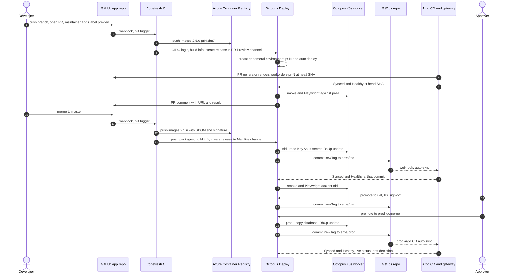

# Round 1 — Octopus Architect Position Paper

> Role: `octopus-architect`. Thesis: Octopus Deploy is the release-orchestration control plane and the system of record for which version runs where, including Argo CD-reconciled workloads. Design only; identifiers are placeholders; sources in §9; unconfirmed claims marked [UNVERIFIED].

## 1. Position summary

- **One release record, one promotion engine.** An Octopus release is the immutable unit of change: image and package versions, OCL process commit, variable snapshot, build information. Every change to `tdd`, `uat`, `prod`, a cohort tenant or a PR preview is an Octopus deployment. Codefresh builds; Argo CD reconciles; neither decides what runs where.
- **Octopus writes Git, Argo CD applies, the gateway reports back.** "Update Argo CD Application Image Tags" commits Kustomize `newTag` values to environment overlays; verification "Argo CD Application is healthy" waits for Synced + Healthy *at that commit*. The Octopus Argo CD Gateway (outbound gRPC) feeds Live Object Status and Git drift detection. Octopus never applies manifests.
- **Everything that is not desired Kubernetes state lives in the Octopus process:**
  - DbUp migrations on an in-cluster Octopus Kubernetes worker, before the image commit
  - Playwright acceptance tests against TDD
  - go/no-go gates and freezes
  - Config-as-Code runbooks: backup, restore, secret rotation, environment create/destroy
- **Governance as code, never under `.octopus/`:** Terraform (`OctopusDeploy/octopusdeploy` 1.20.0) for space resources, OCL at a new base path, Platform Hub templates and Rego policies (Enterprise; fallback defined).
- **Container Apps → AKS**, because Argo CD reconciles only Kubernetes; the live path runs untouched until cutover. Octopus runbooks create/destroy environments with the Contributor principal, confined to `infra-*` environments.

## 2. Responsibility matrix

**O** = owner · S = supports · — = none.

| Capability | Codefresh | Argo CD | Octopus Deploy | Other |
|---|---|---|---|---|
| CI build/test | **O** `build.ps1` gates on hybrid runner | — | S build information | GitHub Actions until cutover |
| Artifact & image storage | S pushes images, NuGet packages | — | S built-in feed; ACR feed via OIDC | **O** ACR `<acr-name>.azurecr.io`, tag locking |
| SBOM/signing | **O** SBOM + signatures | — | S policy restricts feeds | S admission verification (SRE) |
| Release versioning & record | S computes version, creates release | — | **O** snapshot, notes, per-env history | — |
| Environment promotion | — | S applies Git state | **O** lifecycles, channels, tenants | — |
| Approvals/gates | S pre-release gates | — | **O** manual interventions, Rego policies, freezes, optional ServiceNow/JSM | PR review |
| Kubernetes reconciliation | — | **O** auto-sync, self-heal, prune | S observes via gateway | — |
| Non-Kubernetes targets | — | — | **O** Azure SQL, Key Vault, Container Apps during parallel run | — |
| Database migrations | S CI integration tests | S sync-wave Job, preview DBs only | **O** DbUp `update` before image commit | Azure SQL PITR |
| Config & secrets | S OIDC identity | S applies config + ExternalSecret objects | S reads deployment-time secrets via OIDC; blocks sensitive values from Git | **O** Key Vault + secret operator (SRE) |
| Progressive delivery | — | **O** Argo Rollouts (phase 3) | S gate before rollout, waits for Healthy | Azure Monitor |
| Rollback | — | S reconciles reverted tag | **O** redeploy prior release; restore runbooks | — |
| Runbooks/day-2 ops | — | S break-glass UI | **O** CaC runbooks, schedules | — |
| Ephemeral PR environments | S `-pr` release, deprovision call | **O** materialization (PR generator) | **O** record, tests, auto-deprovision | `preview` label |
| Audit/DORA/observability | S build logs | S sync history | **O** audit log, Insights | **O** OpenTelemetry → App Insights |
| *Environment provisioning (brief update)* | S IaC static checks, no cloud credentials | S in-cluster add-ons | **O** Terraform plan/apply/destroy runbooks | Owner bootstrap: role assignments, locks |

## 3. Target runtime and environment topology

**Move to AKS.**
1. Argo CD needs a Kubernetes API; Container Apps exposes none.
2. Namespace-per-preview/cohort is cheap on a shared non-prod cluster.
3. The NServiceBus Worker (`WorkOrderProcessing`: sagas, outbox, `RemotableBus:ApiUrl` → UI) runs today only in the Aspire AppHost; on AKS it is a second Deployment in the same release.
4. In-cluster Octopus workers reach private Azure SQL endpoints.

Container Apps stays live during the parallel run; cutover TDD → UAT → Prod after N consecutive green releases (chief architect sets N).

**Workloads:** `ui-server` (`churchbulletin.ui`, port 8080, `/_healthcheck`, in-process NServiceBus endpoint `UI.Server`, MCP at `/mcp`); `worker` (new image `churchbulletin.worker`); McpServer not deployed (stdio tool); schema via the `ChurchBulletin.Database` DbUp console (`update`, `rebuild`, `baseline`).

| Cluster | Namespaces | Components |
|---|---|---|
| `<aks-nonprod>` | `workorders-{tdd,uat}`, `workorders-pr-<n>`, `workorders-cohort-<slug>` | Argo CD; gateway (tdd, uat, bootcamp); Kubernetes worker pool `aks-nonprod` |
| `<aks-prod>` | `workorders-prod` | Argo CD; gateway (prod); worker pool `aks-prod` |
| `<aks-cluster-context>` | `<codefresh-runner-runtime>` | CI only |

Databases: Azure SQL per governed environment (as today); SQL Server container for previews; cohorts use a container by default, Azure SQL serverless for backup/restore labs.

| Octopus object | Design |
|---|---|
| Space | `<octopus-space>` only. Lifecycles cannot span spaces |
| Environments | `tdd`, `uat`, `prod`, `bootcamp`, plus runbook-only `infra-nonprod` and `infra-prod` |
| Parent environment | `preview` → ephemeral `pr-<n>`, deprovisioned after 7 days inactive |
| Lifecycles | `mainline`: tdd (automatic) → uat → prod · `hotfix`: uat → prod · `bootcamp` |
| Channels | `Mainline`: default; package tag `^$`; ref `refs/heads/master` · `Hotfix`: `^hotfix`; `refs/heads/hotfix/*`; replaces `force_skip_tdd` · `PR Preview`: EphemeralEnvironment; `^pr\d+`; name `pr-#{Octopus.Release.CustomFields[PullRequestNumber]}` · `Bootcamp`: tenant tag `Cohort/*` |
| Tenants | One per cohort, tag set `Cohort`, connected to `workorders` × `bootcamp`. Per-student tenants optional (licensed add-on) |
| Projects | `workorders` (CaC, `TenantedOrUntenanted`); `workorders-infrastructure` (runbooks only) |
| Worker pools | `aks-nonprod` and `aks-prod` via `#{WorkerPool}`; `Hosted Ubuntu` for steps that need no network adjacency |
| Teams | Platform Engineers, Developers, UAT Sign-off, Prod Approvers, Instructors (`Cohort/*`), Students (own tenant: view + runbooks) |

**Argo CD:**
- One instance per cluster, each with its own gateway (Octopus requires one gateway per instance).
- AppProjects `workorders-nonprod` and `workorders-prod`.
- Applications `workorders-{tdd,uat,prod}`, built from Kustomize overlays.
- ApplicationSets: `workorders-previews` (PR generator, label `preview`) and `workorders-cohorts` (Git files generator).
- Annotations: `argo.octopus.com/project: workorders` and `argo.octopus.com/environment: <slug>`, plus `argo.octopus.com/tenant: <slug>` for cohorts.
- Sync is automated with selfHeal and prune. No Image Updater write-back, no sync windows on governed apps.

**Codefresh:** CI on the hybrid runner; no GitOps runtime needed. If one becomes the Argo CD distribution, Octopus registers it as an ordinary instance [UNVERIFIED] and its promotion features stay off.

**Identity layers (brief update):**

| Layer | Runner | Identity | Creates |
|---|---|---|---|
| 0 Bootstrap (once) | Owner/UAA human | Human, MFA | Role assignments (AcrPull, Key Vault Secrets User, RG roles for deploy identities); prod `CanNotDelete` locks; federated credential on the provisioning app registration; Terraform state storage |
| 1 Environment lifecycle | `workorders-infrastructure` runbooks, built-in Terraform steps | Contributor principal (client secret now, OIDC target) | AKS, SQL, user-assigned identities and their federated credentials, DNS, worker/gateway Helm releases |
| 2 Release deployment | `workorders` deployments | Per-environment-class Azure OIDC accounts, pre-authorized in layer 0 | Nothing structural |

Contributor excludes `Microsoft.Authorization/*/Write` and `/Delete`: no role assignments, no locks. Layer 1 therefore reuses layer-0 identities across cluster rebuilds and adds a federated credential per new cluster issuer, which Contributor can do (20 per identity, no wildcards). Optional hardening:
- Role Based Access Control Administrator constrained by ABAC conditions to AcrPull and Key Vault Secrets User.
- Owner-placed `CanNotDelete` locks on prod; the Contributor principal cannot remove them, so a runaway destroy cannot reach prod.

## 4. End-to-end flow



1. **PR opened** → GitHub webhook → Codefresh Git trigger: current gates, version `2.5.0-pr<N>.<sha7>`, images to ACR.
2. **Preview opt-in** (maintainer-only `preview` label; branches in this repository only): `obtain-oidc-id-token` (audience = Octopus service-account ID) → `octopusdeploy-login` → `octopusdeploy-push-package` → `octopusdeploy-push-build-information` → `octopusdeploy-create-release` (channel `PR Preview`, `GIT_REF` = branch, custom field `PullRequestNumber` [UNVERIFIED argument]).
3. Octopus creates `pr-<N>` and auto-deploys; independently the ApplicationSet PR generator creates `workorders-pr-<N>` at `{{head_sha}}`, and a sync-wave Job runs DbUp `rebuild` against the in-namespace SQL.
4. Preview process: **Wait for Argo CD Applications** (count 1, commit hash = head SHA) → smoke → Playwright → PR comment.
5. **PR closed** → Codefresh cleanup pipeline calls Octopus deprovision via CLI/REST (no Codefresh step [UNVERIFIED]); the ApplicationSet removes the Application; 7-day inactivity is the backstop.
6. **Merge** → Codefresh builds `2.5.<master commit count>`; pushes images, SBOM/signatures, `ChurchBulletin.Database`/`AcceptanceTests` packages and build information; checks for an existing release, then creates it (`Mainline`, `refs/heads/master`). No CI job waits on deployments.
7. **TDD** (automatic):
   - policies evaluate
   - Key Vault read via the Azure OIDC account
   - DbUp `update` on the worker
   - **Update Argo CD Application Image Tags** commits directly to `envs/tdd`, with Trigger sync and "healthy" verification (900 s; the default is 180 s)
   - smoke test (Degraded fails, per #9017)
   - Playwright
8. Argo CD syncs; the gateway reports Synced + Healthy for that commit; Octopus resumes.
9. **UAT:** human promotion, same process, plus a "UX sign-off" manual intervention (board column UX Testing). UAT-complete releases form the Release Queue.
10. **Prod:** freeze check → policy-required go/no-go (Prod Approvers) → Azure SQL copy `<db>-pre-<release>` → DbUp → commit `envs/prod` → prod Argo CD sync → verification → smoke test (Degraded warns until #9016 closes).
11. **Afterwards:** dashboard per environment; Live Object Status and drift detection expose out-of-band edits; Insights records DORA data. Failure → "Prevent progression" blocks later phases; rollback in §8.

## 5. Repositories and config-as-code layout

```text
ClearMeasureLabs/bootcamp-palermo-workorders   (app repo, public; .octopus/** = LIVE, untouched)
└── platform/
    ├── octopus/project/                 CaC base path of new project `workorders` (process, settings, variables, runbooks/)
    ├── octopus/infrastructure-project/  CaC base path of `workorders-infrastructure` (runbooks only)
    ├── octopus/terraform/space/         environments, lifecycles, projects, channels, tenants, accounts, feeds,
    │                                    git credentials, teams, freezes, service accounts
    ├── octopus/terraform/argo-gateway/  helm_release per Argo CD instance
    ├── octopus/platform-hub/            mirror of Platform Hub repo: process templates, policies/*.rego
    ├── infra/environments/              Terraform modules run by infrastructure runbooks (cluster, app-env, cohort)
    ├── gitops/                          GitOps repo sketch + preview overlay (read at PR head by the PR generator)
    ├── docker/                          worker + migrator Dockerfiles (root Dockerfile untouched)
    └── codefresh/                       pipelines (codefresh-engineer)

<org>/workorders-gitops                  base/ · envs/{tdd,uat,prod}/kustomization.yaml · tenants/<cohort>/ · argocd/
<org>/octopus-platform-hub               instance-level Platform Hub repository
```

- **Separate GitOps repo:** Octopus commits on every deployment; in the app repo that would retrigger CI and bury code history. Different write principal; can be private.
- **CaC base path `platform/octopus/project`, never `.octopus`:** process changes travel with code PRs. Docs show `.octopus` default and `.octopus/<project>` convention; an outside path is [UNVERIFIED]; fallback `.octopus/workorders-platform/` only with approval.
- **Public-repo hygiene:** no hostnames or resource names in OCL; a Terraform-managed library variable set supplies them from private tfvars; sensitive values never in OCL.

## 6. Key decisions

| # | Decision | Chosen | Rejected | Reason |
|---|---|---|---|---|
| D1 | Promotion engine | Octopus | Codefresh Promotion Flows, Image Updater, Kargo, GitHub Actions | One audit trail for gates, freezes, DB ordering, runbooks; vendor retired GitOps Cloud and recommends Octopus |
| D2 | Octopus → Argo CD | Image-tag step, direct commit, Trigger sync, healthy verification | Octopus applying manifests; PR mode | Argo CD stays the sole applier. PR mode can be switched on per environment if SRE mandates Git four-eyes |
| D3 | Overlay format | Kustomize `newTag` | Shared Helm chart | For Helm the step rewrites *every* referenced values file, chart default included (cross-env leak); for Kustomize only `newTag` |
| D4 | Shared-DB migrations | Octopus DbUp step on in-cluster worker | PreSync hook; migrate on startup | A migration is a one-time ordered action. Hooks run on every sync and are skipped during selective sync |
| D5 | Preview DB | Argo sync-wave `rebuild` Job | Octopus step | The DB lives exactly as long as the Application (concession) |
| D6 | Runtime | AKS non-prod + prod | Stay on ACA; one cluster | Argo CD needs Kubernetes; limits blast radius |
| D7 | Tenancy | Tenant per cohort | Per-student by default | Tenants are licensed; previews cover per-student changes |
| D8 | CaC location | App repo, new base path | Reuse `.octopus/` | Live project untouched |
| D9 | Space config | Terraform ~> 1.20 | Portal | CaC excludes environments, lifecycles, tenants |
| D10 | Identity | OIDC: Codefresh → Octopus; Octopus → Azure and ACR | API keys | EP18: an invalid or rotated API key caused 41 red runs over ~13 days |
| D11 | Git write | Credential restricted to the GitOps repo (fine-grained token or SSH deploy key) | Org-wide token | Argo steps choose the credential by repository restriction |
| D12 | Versioning | Version = image tag = package = release number, derived from the commit; create only after an existence check | Feed trigger; run numbers | Version collisions recurred (EP20/EP21), and feed triggers race across artifacts |
| D13 | Human gates | Manual interventions enforced by Rego; Octopus Approvals at GA; ITSM optional | GitHub environment approvals | One trail; enforceable by policy |
| D14 | Previews | PR generator + Octopus ephemeral environment | Octopus writing per-PR folders | Argo steps cannot delete folders |
| D15 | Environment-lifecycle runner | Octopus runbooks: Terraform plan/apply/destroy from Git | Codefresh pipelines | Approvals, audit, schedules and tenant RBAC in one place; one credential holder |
| D16 | Provisioning credential | Entered once in the Octopus portal (never in Terraform state or a repo), scoped to `infra-*`; migrate to OIDC via a federated credential | Secret stored in two tools; reused for deployments | Single holder, no reach into app environments |
| D17 | Role-assignment gap | Layer-0 bootstrap, reusable pre-authorized identities, optional constrained delegation | Owner granted to automation | Contributor cannot write `Microsoft.Authorization/*` |

## 7. Risks, and what the other roles are likely to get wrong

**GitOps architect**

*Likely argument:* "Git is the system of record. Octopus is a second control plane. Use Image Updater or Kargo, and PreSync hooks for migrations."

*Answer:* Git records desired state, not approvals, test results, migrations run or version-to-version changes. The Octopus record anchors to Git through the commit it writes and verifies; drift detection surfaces bypasses. Image Updater has no migration ordering, gates or cohort targeting. PreSync hooks couple schema changes to reconciliation retries. `argocd app rollback` is blocked on auto-sync apps, so rollback is a Git change anyway.

*Concession:* Argo CD keeps full reconciliation autonomy; ApplicationSets generate previews and cohorts; previews migrate via a sync-wave Job.

**Codefresh engineer**

*Likely argument:* "Codefresh GitOps Products, Environments and Promotion Flows promote natively on Argo CD."

*Answer:* Two promotion engines give two answers to "what is in prod". Octopus's Codefresh FAQ says GitOps Cloud "is no longer available", recommends Octopus for release orchestration, and keeps Codefresh CI. Azure SQL, the Container Apps parallel run, tenants, freezes, ITSM and runbooks already live in Octopus.

*Concession:* Codefresh owns CI end to end: SBOM, signing, build information and release creation.

**SRE/security**

*Likely argument:* Octopus with Git write and Azure credentials is a prime target; Octopus outages recur in this repo's history (503s, timeouts); no digest pinning; a subscription-scope Contributor secret is dangerous.

*Answer:*
- OIDC everywhere except the provisioning secret (one holder, `infra-*` scope, exit path).
- Git write limited to one repository; steps refuse sensitive variables in manifests and commit messages.
- Admission-time signature verification makes the tag writer irrelevant to supply-chain trust.
- An Octopus outage pauses promotions only; Argo CD keeps reconciling. Break-glass = reviewed Git commit, surfaced later by drift detection.
- Owner-placed locks stop the Contributor principal from deleting prod.

*Concession:*
- Octopus pins tags, not digests [UNVERIFIED], so ACR tag locking and admission verification are mandatory.
- NServiceBus `EnableInstallers()` needs runtime DDL rights; moving the installers into deployment is an app follow-up.

**Pragmatist**

*Likely argument:* "This is overkill for a bootcamp app that already ships through GitHub Actions to Container Apps."

*Answer:* The explicit ask is this platform; the live path stays intact. Phases: (1) Terraform space, CaC project, Codefresh handoff, TDD on AKS; (2) UAT and Prod; (3) previews, cohorts, Platform Hub, Rollouts. Octopus is the constant across the Container Apps → AKS move.

*Concession:* phase 1 has no per-student tenants, Rollouts or ITSM; Platform Hub only if licensed.

| Cross-cutting risk | Mitigation |
|---|---|
| Young Argo integration (Early Access Dec 2025; Wait step May 2026) | Documented behavior only; fallback git-commit script step |
| Gateway scoping vs dynamic `pr-<n>` [UNVERIFIED] | Test in phase 3; fallback smoke-only |
| Create-release documents `GIT_REF`, no commit SHA: OCL may be newer than the build | Confirm a commit argument [UNVERIFIED] |
| Argo sync windows + Octopus freezes double-gate (timeouts) | No sync windows on governed apps |
| Imperative `kubectl` changes vs self-heal | Restarts come from the secret-reload operator or Git |
| Enterprise-only features (Platform Hub, ITSM, space-level Insights, multi-project freezes) | Fallbacks: step templates, manual interventions, project-level Insights, per-project freezes |
| Project templates (Public Preview) lack ephemeral channels | Do not build `workorders` from a template |
| Public repo with student forks | Maintainer-only label; admin-created ApplicationSets; branch-process channels never reach Azure accounts |
| AKS in a custom VNet may attempt role assignments [UNVERIFIED] | Managed VNet, or layer-0 pre-authorization |
| In-memory WebSocket hub vs replicas/canary | App follow-up before Rollouts |

## 8. Implementation highlights

**Terraform — space resources** (provider 1.20.0 attributes):

```hcl
provider "octopusdeploy" {
  address      = var.octopus_url          # <OCTOPUS_URL>
  access_token = var.octopus_access_token # short-lived OIDC token; no API key
  space_id     = var.octopus_space_id     # <octopus-space-id>
}

resource "octopusdeploy_parent_environment" "preview" {
  name                          = "preview"
  space_id                      = var.octopus_space_id
  automatic_deprovisioning_rule = { days = 7 }
}

resource "octopusdeploy_project" "workorders" {
  name                              = "workorders"
  lifecycle_id                      = octopusdeploy_lifecycle.mainline.id
  project_group_id                  = octopusdeploy_project_group.workorders.id
  tenanted_deployment_participation = "TenantedOrUntenanted"
  is_version_controlled             = true
  included_library_variable_sets    = [octopusdeploy_library_variable_set.infrastructure.id]
  git_github_app_persistence_settings {
    github_connection_id = var.github_connection_id # created in the portal
    url                  = "https://github.com/ClearMeasureLabs/bootcamp-palermo-workorders.git"
    base_path            = var.cac_base_path        # "platform/octopus/project" — never ".octopus"
    default_branch       = "master"
    protected_branches   = ["master"]
  }
}

resource "octopusdeploy_channel" "pr_preview" {
  name                                = "PR Preview"
  project_id                          = octopusdeploy_project.workorders.id
  type                                = "EphemeralEnvironment"
  parent_environment_id               = octopusdeploy_parent_environment.preview.id
  ephemeral_environment_name_template = "pr-#{Octopus.Release.CustomFields[PullRequestNumber]}"
  custom_field_definitions            = [{ field_name = "PullRequestNumber", description = "GitHub PR number" }]
  git_reference_rules                 = ["refs/heads/*"]
  rule {
    tag = "^pr\\d+"
    action_package {
      deployment_action = "Acceptance tests"
      package_reference = "ChurchBulletin.AcceptanceTests"
    }
  }
}

resource "octopusdeploy_azure_openid_connect" "nonprod" {
  name                   = "azure-nonprod-oidc"
  application_id         = var.nonprod_deploy_client_id # <AZURE_CLIENT_ID> of a layer-0 identity
  tenant_id              = var.azure_tenant_id          # <AZURE_TENANT_ID>
  subscription_id        = var.azure_subscription_id    # <AZURE_SUBSCRIPTION_ID>
  audience               = "api://AzureADTokenExchange"
  execution_subject_keys = ["space", "project", "environment"] # tenant omitted: one credential per env covers cohorts
  environments           = [for e in ["tdd", "uat", "bootcamp"] : octopusdeploy_environment.env[e].id]
}

resource "octopusdeploy_user" "codefresh_ci" {
  display_name = "svc-codefresh-ci"
  username     = "svc-codefresh-ci"
  is_service   = true
  is_active    = true
}

resource "octopusdeploy_service_account_oidc_identity" "codefresh_master" {
  name               = "codefresh-master"
  service_account_id = octopusdeploy_user.codefresh_ci.id
  issuer             = "https://oidc.codefresh.io"
  # account:{accountId}:pipeline:{pipelineId}:scm_repo_url:{url}:scm_user_name:{user}:scm_ref:{ref}
  subject            = var.codefresh_master_subject
}

data "octopusdeploy_accounts" "provisioning" { # client-secret principal entered once in the portal
  account_type = "AzureServicePrincipal"
  partial_name = "azure-provisioning"
}
```

**OCL — `platform/octopus/project/deployment_process.ocl` (excerpt):**

```ocl
step "prod-go-no-go" {
    name = "Prod go/no-go"
    action {
        action_type = "Octopus.Manual"
        environments = ["prod"]
        properties = {
            Octopus.Action.Manual.Instructions = "Confirm UAT sign-off, release notes and freeze calendar for #{Octopus.Release.Number}."
            Octopus.Action.Manual.ResponsibleTeamIds = "prod-approvers"
        }
    }
}

step "read-deployment-secrets" {
    name = "Read deployment secrets"
    action {
        action_type = "Octopus.AzurePowerShell"
        environments = ["tdd", "uat", "prod", "bootcamp"]
        worker_pool_variable = "WorkerPool"
        properties = {
            Octopus.Action.Azure.AccountId = "#{Azure.DeployAccount}"
            Octopus.Action.Script.ScriptSource = "Inline"
            Octopus.Action.Script.Syntax = "PowerShell"
            Octopus.Action.Script.ScriptBody = <<-EOT
                $pw = az keyvault secret show --vault-name "#{Azure.KeyVault}" --name "#{Sql.MigratorSecretName}" --query value -o tsv
                Set-OctopusVariable -name "MigratorPassword" -value $pw -sensitive
                EOT
        }
    }
}

step "migrate-database" {
    name = "Migrate database (DbUp update)"
    action {
        action_type = "Octopus.Script"
        environments = ["tdd", "uat", "prod", "bootcamp"]
        worker_pool_variable = "WorkerPool"   # in-cluster Kubernetes worker; worker image adds the .NET 10 runtime
        properties = {
            Octopus.Action.AutoRetry.MaximumCount = "2"
            Octopus.Action.Script.ScriptSource = "Inline"
            Octopus.Action.Script.Syntax = "Bash"
            Octopus.Action.Script.ScriptBody = <<-EOT
                pkg="#{Octopus.Action.Package[ChurchBulletin.Database].ExtractedPath}"
                dll=$(find "$pkg" -name ClearMeasure.Bootcamp.Database.dll | head -n 1)
                dotnet "$dll" update "#{Azure.SqlServerFqdn}" "#{Azure.SqlDatabase}" "$pkg/scripts" \
                  "#{Sql.MigratorUser}" "#{Octopus.Action[Read deployment secrets].Output.MigratorPassword}"
                EOT
        }
        packages "ChurchBulletin.Database" {
            acquisition_location = "Server"
            feed = "octopus-server-built-in"
            package_id = "ChurchBulletin.Database"
            properties = {
                Extract = "True"
                SelectionMode = "immediate"
            }
        }
    }
}

step "promote-via-argo-cd" {
    name = "Update Argo CD image tags"
    action {
        action_type = "<ARGO_UPDATE_IMAGE_TAGS_ACTION_TYPE>"   # [UNVERIFIED] copy from an OCL export of the step
        environments = ["tdd", "uat", "prod", "bootcamp"]
        # Git commit method: direct commit. Trigger sync: on. Verification: "Argo CD Application is healthy", 900 s.
        packages "churchbulletin.ui" {
            acquisition_location = "NotAcquired"
            feed = "acr"
            package_id = "churchbulletin.ui"
            properties = {
                Extract = "False"
                Purpose = "DockerImageReference"
                SelectionMode = "immediate"
            }
        }
        # packages "churchbulletin.worker" { ... identical shape ... }
    }
}

step "smoke-test" {
    name = "Smoke test"
    action {
        action_type = "Octopus.Script"
        worker_pool_variable = "WorkerPool"
        properties = {
            Octopus.Action.Script.ScriptSource = "Inline"
            Octopus.Action.Script.Syntax = "Bash"
            Octopus.Action.Script.ScriptBody = <<-EOT
                body=$(curl -fsS --retry 30 --retry-delay 5 "#{App.BaseUrl}/_healthcheck")
                case "$body" in
                  *Healthy*)  exit 0 ;;
                  *Degraded*) if [ "#{Smoke.FailOnDegraded}" = "True" ]; then exit 1; fi; echo "Degraded (warning)"; exit 0 ;;
                  *)          exit 1 ;;
                esac
                EOT
        }
    }
}
```

`deployment_settings.ocl` keeps `connectivity_policy { allow_deployments_to_no_targets = true }` (no deployment targets). `Smoke.FailOnDegraded` is `True` only for `tdd` (#9017).

**Argo CD contract (GitOps repo):**

```yaml
apiVersion: argoproj.io/v1alpha1
kind: Application
metadata:
  name: workorders-prod
  namespace: argocd
  annotations:
    argo.octopus.com/project: workorders     # Octopus project slug
    argo.octopus.com/environment: prod       # Octopus environment slug
spec:
  project: workorders-prod
  source: { repoURL: "https://github.com/<org>/workorders-gitops.git", targetRevision: main, path: envs/prod }
  destination: { server: "https://kubernetes.default.svc", namespace: workorders-prod }
  syncPolicy: { automated: { prune: true, selfHeal: true } }
---
# envs/prod/kustomization.yaml — Octopus rewrites only newTag
apiVersion: kustomize.config.k8s.io/v1beta1
kind: Kustomization
resources: ["../../base"]
images:
  - { name: "<acr-name>.azurecr.io/churchbulletin.ui", newTag: "2.5.812" }
  - { name: "<acr-name>.azurecr.io/churchbulletin.worker", newTag: "2.5.812" }
```

**Codefresh → Octopus handoff (documented steps and arguments):**

```yaml
  octopus_oidc:
    type: obtain-oidc-id-token
    arguments:
      AUDIENCE: '${{OCTOPUS_SERVICE_ACCOUNT_ID}}'
  octopus_login:
    type: octopusdeploy-login
    arguments:
      ID_TOKEN: '${{ID_TOKEN}}'
      OCTOPUS_URL: '${{OCTOPUS_URL}}'
      OCTOPUS_SERVICE_ACCOUNT_ID: '${{OCTOPUS_SERVICE_ACCOUNT_ID}}'
  octopus_build_info:
    type: octopusdeploy-push-build-information
    arguments:
      OCTOPUS_ACCESS_TOKEN: '${{OCTOPUS_ACCESS_TOKEN}}'
      OCTOPUS_URL: '${{OCTOPUS_URL}}'
      OCTOPUS_SPACE: '${{OCTOPUS_SPACE}}'
      PACKAGE_IDS: [churchbulletin.ui, churchbulletin.worker, ChurchBulletin.Database, ChurchBulletin.AcceptanceTests]
      FILE: build/octopus-buildinfo.json
      VERSION: '${{VERSION}}'
      OVERWRITE_MODE: ignore
  octopus_release:
    type: octopusdeploy-create-release
    arguments:
      OCTOPUS_ACCESS_TOKEN: '${{OCTOPUS_ACCESS_TOKEN}}'
      OCTOPUS_URL: '${{OCTOPUS_URL}}'
      OCTOPUS_SPACE: '${{OCTOPUS_SPACE}}'
      PROJECT: workorders
      RELEASE_NUMBER: '${{VERSION}}'
      CHANNEL: Mainline
      GIT_REF: refs/heads/master
      PACKAGES: ['churchbulletin.ui:${{VERSION}}', 'churchbulletin.worker:${{VERSION}}', 'ChurchBulletin.Database:${{VERSION}}', 'ChurchBulletin.AcceptanceTests:${{VERSION}}']
```

**Platform Hub policy (Rego):**

```rego
package workorders_prod_requires_go_no_go

default result := {"allowed": false, "action": "block"}  # "block" value [UNVERIFIED]; docs name Block and Warn

result := {"allowed": true} if { input.Environment.Slug != "prod" }

result := {"allowed": true} if {
    some step in input.Steps
    step.ActionType == "Octopus.Manual"
}
```

**Gateway install (documented Helm values):**

```hcl
resource "helm_release" "octopus_argocd_gateway" {
  name      = "octopus-argocd-gateway"
  namespace = "octopus-argocd-gateway"
  chart     = "oci://registry-1.docker.io/octopusdeploy/octopus-argocd-gateway-chart"
  version   = var.gateway_chart_version
  values = [yamlencode({
    gateway = {
      argocd  = { serverGrpcUrl = var.argocd_grpc_url, authenticationTokenSecretName = "argocd-octopus-token", authenticationTokenSecretKey = "token" }
      octopus = { serverGrpcUrl = var.octopus_grpc_url }
    }
    registration = {
      octopus = { name = "argocd-nonprod", serverApiUrl = var.octopus_url, spaceId = var.octopus_space_id,
                  environments = ["tdd", "uat", "bootcamp"],
                  serverAccessTokenSecretName = "octopus-gateway-registration", serverAccessTokenSecretKey = "token" }
      argocd  = { webUiUrl = var.argocd_ui_url }
    }
  })]
}
```

The Argo CD account for the gateway is `accounts.octopus: apiKey`, with `applications get,sync`, `clusters get` and `logs get`, as documented.

| Runbook (CaC) | Scope | Core steps | Trigger |
|---|---|---|---|
| `env-create` / `env-destroy` | `workorders-infrastructure` / `infra-*` | Terraform plan → manual intervention (prod) → apply/destroy; worker + gateway Helm | Manual; scheduled idle teardown |
| `cohort-create` / `cohort-teardown` | infrastructure | Cohort module; tenant connection | Instructor |
| `db-backup` | `workorders` / uat, prod | `az sql db copy` or export | Pre-release; scheduled |
| `db-restore-pitr` | `workorders` | Prompted time → PITR to new DB → update Key Vault secret → reload | Manual + manual intervention |
| `rotate-sql-credential` | `workorders` | New secret → `ALTER LOGIN` → Key Vault → verify | Monthly (CaC triggers use the default branch) |
| `run-acceptance-tests` | `workorders` / tdd, uat | Playwright against `#{App.BaseUrl}` | On demand |

**Rollback:** redeploy the prior release; forward-only DbUp applies nothing, the step writes the older tags, Argo CD syncs. Requires expand/contract migrations (destructive changes one release later). Data recovery: `db-restore-pitr`.

## 9. Assumptions, open questions, and capabilities to verify

**Assumptions:**
- Octopus Cloud 2026.4.x.
- The license tier is unknown: Platform Hub, ITSM, space-level Insights and multi-project freezes require Enterprise.
- Codefresh OIDC is available.
- Argo CD 3.x is installed by the GitOps architect.
- Prod and non-prod may share a subscription; a separate prod subscription is recommended.

**Open questions:**
1. Can a Space Manager-only account create service-account users, GitHub App connections and Platform Hub content?
2. Will an Entra admin run layer 0 and add a federated credential for `<OCTOPUS_URL>` to the provisioning app registration?
3. Does gateway environment registration cover ephemeral children of `preview`?
4. Is a base path outside `.octopus/` accepted?
5. Can a GitHub App connection serve as the Argo steps' Git credential? The app requests write "for Argo CD"; Git-credential docs list only username/password and SSH.
6. What are the action type strings for the Argo steps?
7. Does the Codefresh create-release step take a commit SHA and custom fields?
8. Which Key Vault permission model applies? Contributor can write access policies; RBAC needs layer 0.

**Sources:**
- Argo CD in Octopus — gateway, Helm values, Terraform bootstrap, Argo user:
  - https://octopus.com/docs/argo-cd
  - https://octopus.com/docs/argo-cd/instances
  - https://octopus.com/docs/argo-cd/instances/helm-chart-values
  - https://octopus.com/docs/argo-cd/instances/terraform-bootstrap
  - https://octopus.com/docs/argo-cd/instances/argo-user
- Annotations:
  - https://octopus.com/docs/argo-cd/annotations
  - https://octopus.com/docs/argo-cd/annotations/helm-annotations
- Steps — commit method, PR mode, verification (2026.1/2026.2), Trigger sync, sensitive-variable guard, Kustomize `newTag`, Helm values rewrite, no CRD scan:
  - https://octopus.com/docs/argo-cd/steps
  - https://octopus.com/docs/argo-cd/steps/update-application-image-tags
  - https://octopus.com/docs/argo-cd/steps/update-application-manifests
  - https://octopus.com/docs/argo-cd/steps/wait-for-argo-cd-applications
  - https://octopus.com/blog/argo-cd-verified-deployments
- Live status, drift, limits:
  - https://octopus.com/docs/argo-cd/live-object-status
  - https://octopus.com/docs/argo-cd/troubleshooting
  - https://octopus.com/blog/argo-cd-in-octopus
- Ephemeral environments (2025.4; no tenants, lifecycles, freezes or Insights):
  - https://octopus.com/docs/projects/ephemeral-environments
- Channels, tenants, prevent progression:
  - https://octopus.com/docs/releases/channels
  - https://octopus.com/docs/tenants
  - https://octopus.com/docs/releases/prevent-release-progression
- CaC scope and one-way conversion; CaC runbooks:
  - https://octopus.com/docs/projects/version-control/config-as-code-reference
  - https://octopus.com/docs/projects/version-control/converting
  - https://octopus.com/docs/runbooks/config-as-code-runbooks
- Platform Hub:
  - https://octopus.com/docs/platform-hub
  - https://octopus.com/docs/platform-hub/templates/process-templates
  - https://octopus.com/docs/platform-hub/templates/project-templates
  - https://octopus.com/docs/platform-hub/policies
- Approvals, freezes, Insights, pricing:
  - https://octopus.com/docs/approvals
  - https://octopus.com/docs/approvals/octopus-approvals
  - https://octopus.com/docs/approvals/servicenow
  - https://octopus.com/docs/deployments/deployment-freezes
  - https://octopus.com/docs/insights
  - https://octopus.com/pricing
- Kubernetes agent and worker:
  - https://octopus.com/docs/kubernetes/targets/kubernetes-agent
  - https://octopus.com/docs/infrastructure/workers/kubernetes-worker
- OIDC and Git:
  - https://octopus.com/docs/infrastructure/accounts/azure
  - https://octopus.com/docs/infrastructure/accounts/openid-connect
  - https://octopus.com/docs/api/authentication/openid-connect
  - https://octopus.com/docs/infrastructure/git-credentials
  - https://octopus.com/docs/projects/version-control/github
- Terraform provider 1.20.0, Terraform steps, build information:
  - https://registry.terraform.io/providers/OctopusDeploy/octopusdeploy/latest/docs
  - https://octopus.com/docs/deployments/terraform
  - https://octopus.com/docs/packaging-applications/build-servers/build-information
- Codefresh:
  - https://octopus.com/docs/packaging-applications/build-servers/codefresh-pipelines
  - https://codefresh.io/steps/step/octopusdeploy-login
  - https://codefresh.io/steps/step/octopusdeploy-push-build-information
  - https://codefresh.io/steps/step/obtain-oidc-id-token
  - https://codefresh.io/docs/docs/integrations/oidc-pipelines/
  - https://octopus.com/codefresh
- Argo CD:
  - https://argo-cd.readthedocs.io/en/stable/user-guide/auto_sync/
  - https://argo-cd.readthedocs.io/en/stable/user-guide/sync-waves/
  - https://argo-cd.readthedocs.io/en/stable/operator-manual/applicationset/Generators-Pull-Request/
- Azure:
  - https://learn.microsoft.com/en-us/azure/role-based-access-control/built-in-roles/privileged
  - https://learn.microsoft.com/en-us/azure/azure-resource-manager/management/lock-resources
  - https://learn.microsoft.com/en-us/entra/workload-id/workload-identity-federation-create-trust-user-assigned-managed-identity
  - https://learn.microsoft.com/en-us/azure/role-based-access-control/delegate-role-assignments-overview

**Still [UNVERIFIED]:** Argo step action types; OCL channel-slug syntax; digest pinning; gateway with a Codefresh GitOps runtime; ephemeral slug derivation; custom worker image; base path outside `.octopus/`; Rego `block`; Codefresh custom-field/commit-SHA/deprovision support; AKS custom-VNet behavior under Contributor.
