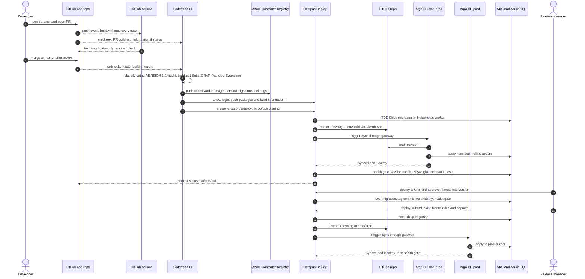

# Round 1 — Pragmatist: one verb, one tool

| Field | Value |
|---|---|
| Role | pragmatist (DevEx and bootcamp teaching lead) |
| Round | 1 — position paper, 2026-09-23 |
| Scope | Design only. Environment-specific values are placeholders. Nothing is provisioned. |
| Evidence | Product claims cite `[Rn]` (section 9). Repo facts cite file paths. |

## 1. Position summary

- **One verb, one tool.** Codefresh *builds*. Octopus Deploy *releases*: promotes, approves, migrates the database, rolls back, runs runbooks, creates and destroys environments. Argo CD *reconciles* Kubernetes to Git. GitHub Actions *gates the merge*. Overlapping features (Codefresh deploy/approval steps and promotions, Argo CD Image Updater and sync windows, Octopus Kubernetes YAML steps) stay off, enforced by a boundary lint. Learners memorise four verbs, not three products that all "deploy".
- **The vendor already drew the Codefresh line.** Codefresh CI continues and GitOps Cloud is no longer available [R1]; promotions are disabled in GitOps Runtimes after 0.24.0 [R2]; the runtime's Argo CD fork sat at 3.1.5 in November 2025 [R3] while upstream is 3.5.3 [R4]. Full Codefresh means full Codefresh CI; full Argo CD means upstream Argo CD driven by Octopus's Argo CD integration [R7].
- **Strangler, not big bang.** The GitHub Actions → Octopus → Azure Container Apps (ACA) path stays live and untouched. The new path (new Octopus space, version major 3, its own TDD/UAT databases, AKS) takes over one environment at a time, only after measurable exit criteria pass — the Strangler Fig pattern the README already teaches (pattern 25).
- **Smallest complete platform, honest about environments and cost.** Two AKS clusters, one Argo CD each, Kustomize, three environments, two lifecycles. Terraform, run only by Octopus runbooks, creates and destroys environments in two layers: an admin-applied *foundation* holding every role assignment (the Contributor provisioning principal cannot create them [R37]) and a Contributor-applied *environment* layer. Previews stay inside the non-prod cluster and never touch subscription credentials.
- **Teachable, with an unchanged inner loop.** `PrivateBuild.ps1`, `AcceptanceTests.ps1` and the Aspire AppHost stay the developer loop; pipelines wrap `build.ps1`; every CI gate keeps running; labs 18–22 teach the rest.

## 2. Responsibility matrix

**O** = owner (only tool allowed) · c = contributes · — = must not.

| Capability | Codefresh | Argo CD | Octopus Deploy | Other |
|---|---|---|---|---|
| CI build/test | **O** build of record on `master` (`build.ps1 Build`, CRAP, `Package-Everything`); informational PR builds | — | — | GitHub Actions: every PR gate + `build-result`, unchanged |
| Artifact & image storage | c pushes | — | c built-in feed: Database, AcceptanceTests nupkgs | **O** ACR `workorders/{ui,worker}`, release tags locked [R41] |
| SBOM/signing | **O** SBOM + signature | — | c SBOM attached to release | admission check: SRE slice, audit mode first |
| Release versioning & record | c computes `3.0.<commit height>`; sole Default-channel creator | — | **O** release record: packages, build info, commits, process snapshot | — |
| Environment promotion | — (removed [R2]) | — (auto-sync never promotes) | **O** lifecycles, channels | — |
| Approvals/gates | — (no `approval` steps) | — (no sync windows) | **O** manual interventions, freezes, RBAC | GitHub review + `build-result` |
| Kubernetes reconciliation | — (no `deploy`/helm steps [R22]) | **O** auto-sync + self-heal | c commits tags, triggers sync, waits healthy [R7][R9] | — |
| Non-Kubernetes targets | — | — | **O** Azure SQL, Key Vault, legacy ACA | — |
| Database migrations | c packages DbUp | — (PreSync [R18] in previews only) | **O** DbUp on a Kubernetes worker [R28], before the tag commit | — |
| Config & secrets | c CI-only, OIDC | c ConfigMaps, `SecretProviderClass` | c environment-scoped deploy variables | **O** Key Vault + CSI driver + workload identity [R49] |
| Progressive delivery | — | deferred (Rollouts) | c blocking health gate | rolling update + readiness |
| Rollback | — | — (UI rollback blocked by auto-sync [R17]) | **O** redeploy previous release | schema forward-only |
| Runbooks/day-2 | — | c read-only view | **O** restart, scale, reset TDD DB, restore, provision/destroy | — |
| Ephemeral PR environments | c `pr-ui:<full sha>` for `preview`-labelled PRs | **O** ApplicationSet PR generator [R19], phase 5 | — | — |
| Audit/DORA/observability | c build history, statuses | c sync history, notifications | **O** audit log, Insights [R34] | Azure Monitor via existing OpenTelemetry |

**Overlaps resolved.**

- *Codefresh promotions vs Octopus lifecycles vs Argo CD auto-sync.* Promotions are gone [R2]. Lifecycles decide *when* a version may enter an environment; auto-sync decides only *how fast* Git becomes cluster state, and only Octopus writes `envs/**`.
- *Codefresh GitOps Runtime vs upstream Argo CD.* Upstream. The runtime bundles Argo CD, Rollouts, Workflows and Events [R6], hosted runtimes are deprecated [R5], and the fork trails upstream by four minor versions; the existing-Argo CD (BYOA) mode [R50] only adds a second console.
- *Octopus Argo CD integration vs Codefresh promotion.* Octopus: image-tag and manifest steps, Trigger Sync, and verification "Argo CD Application is healthy" (2026.1+) or "Pull request merged" (2026.2+) [R7] — the vendor's recommended path [R1].
- *Freezes.* Octopus deployment freezes only [R32]; Argo CD sync windows [R48] unused. Two freeze calendars would disagree.
- *Release creation.* Only Codefresh `octopusdeploy-create-release` [R13]; external feed triggers [R27] off. A second creation path repeats the version collisions in `arch/DeployFailure-2026-08-21.md`.

**Consoles by role** (cognitive load counted in consoles and credentials):

| Role | Uses | Never needs |
|---|---|---|
| Developer / student | IDE, GitHub, Codefresh log, Octopus read-only | Argo CD, GitOps repo, Azure portal |
| Release manager | Octopus | Codefresh, Argo CD, kubectl |
| On-call | Octopus, Argo CD read-only, Azure Monitor | Codefresh |
| Platform engineer | all four + Azure | — |

## 3. Target runtime and environment topology

**ACA → AKS: yes, for the new path only.** Argo CD reconciles Kubernetes API objects; ACA exposes no Kubernetes API [R16]. Legacy ACA serves until the Prod cutover criteria pass, then retires. AKS non-prod with ACA prod is rejected: every environment in a lifecycle must deploy the same way.

| Element | Non-prod | Prod |
|---|---|---|
| Cluster | `<aks-nonprod>`, AKS Standard, Free tier, autoscaler; pools `system`, `ci` (tainted, Codefresh runner), `apps`; candidate: reuse `<aks-cluster-context>` | `<aks-prod>`, AKS Standard, Standard tier, no CI |
| Namespaces | `argocd`, `octopus-gateway`, `octopus-worker`, `codefresh-runner`, `workorders-tdd`, `workorders-uat`, `wo-pr-<n>` | `argocd`, `octopus-gateway`, `octopus-worker`, `workorders-prod` |
| Argo CD | upstream, pinned 3.5.x; AppProjects `workorders`, `previews` | upstream; AppProject `workorders` |
| Octopus agents | gateway (one per instance [R11]) + Kubernetes worker pool `k8s-nonprod` | gateway + pool `k8s-prod` |
| Workloads | `ui-server` (root `Dockerfile`); `worker` (never deployed before; base `dotnet/aspnet:10.0` because ServiceDefaults references `Microsoft.AspNetCore.App`) | same |
| Ingress | Gateway API via the AKS application routing add-on; ingress-nginx is retired [R46] | same |
| Data | new TDD and UAT databases, never shared with legacy (NServiceBus queues and DbUp journals would collide) | one Prod database, shared with legacy only during cutover |

Two clusters because the Codefresh runner creates docker-in-docker build pods [R54] (normally privileged) that never belong beside prod, and one Argo CD per cluster avoids remote cluster-admin credentials.

**Octopus (`<octopus-space>`).** Environments `tdd`, `uat`, `prod`. Lifecycles [R33]: `workorders-default` (TDD automatic → UAT manual → Prod manual) and `workorders-hotfix` (UAT → Prod). Channels: `Default` (Codefresh creates releases) and `Hotfix` (release manager creates `<image version>-hotfix.<n>` over an already-built image — the auditable replacement for `force_skip_tdd` in `deploy.yml`). Tenants: none. Platform Hub: deferred; its permissions are system-team only [R25] and the platform service account is Space Manager.

**Codefresh.** One pipeline runtime, the existing hybrid runner `<codefresh-runner-runtime>`. No GitOps runtime.

**Environment lifecycle IaC and the provisioning principal.**

- *Tool:* Terraform, run only by Octopus runbooks: plan → manual intervention showing the plan artifact → apply; destroy mirrors it [R29]. Codefresh never holds subscription credentials (CI must not be able to delete environments); Argo CD never manages Azure resources (Crossplane would be a fourth control plane).
- *Split by permission.* Contributor cannot write `Microsoft.Authorization/*` [R37]:
  - `foundation` — applied rarely by an Owner, User Access Administrator or RBAC Administrator: per-environment resource groups; user-assigned identities (AKS control plane, kubelet, app, migration worker, Codefresh push); **every role assignment** (AcrPull, AcrPush, Key Vault Secrets User at resource-group scope, Managed Identity Operator on the kubelet identity, subnet Network Contributor); Terraform state; CanNotDelete locks on prod, which Contributor cannot remove [R38].
  - `environment` — applied by the Contributor principal via Octopus: AKS with pre-created identities (never `--attach-acr`), Azure SQL, Key Vault in RBAC mode (inherits resource-group assignments), Application Insights, DNS, and federated credentials on the pre-created identities (allowed for Contributor [R39]).
  - Destroy removes resources inside a resource group, never the group (that deletes its role assignments). Prod has no destroy runbook.
- *Credential:* the client-secret principal lives only in Octopus (an Azure account scoped to provisioning runbooks) with an expiry-check runbook — legacy lost 13 days to one expired or rotated API key (EP18, `arch/DeployFailure-2026-08-21.md`). Phase 3 swaps it for a federated-credential account [R30], a one-time Entra/Owner action. Codefresh gets only AcrPush via OIDC [R14]; Argo CD needs no Azure credential.

**Ephemeral environments: verdict.** Default-on, Azure-backed PR environments are not worth it: CI already runs the full Playwright suite on every push, a SQL Server container needs about 2 GB per namespace, the AI factory opens many PRs, and each Azure-backed environment would need the Contributor principal. Phase 5 adds opt-in previews: label `preview` → Codefresh builds `workorders/pr-ui:<full sha>` → ApplicationSet PR generator → namespace with a SQL Server container seeded by DbUp `rebuild` (includes TestData) → deleted on PR close [R19]. That serves the pre-merge "Functional Testing" column. Octopus ephemeral environments [R24] cannot join lifecycles and would be a second preview model.

**Cost.** New fixed cost is mostly two AKS clusters (ACA bills by consumption), runner nodes, per-environment SQL, licences and log ingestion (prices [UNVERIFIED]). Levers: autoscaler minimum 0 on `apps` and `ci`; no nightly non-prod stop, because CI and TDD serve the AI factory around the clock; phase-5 classroom clusters stop on schedule on AKS Standard — node auto-provisioning, always on in AKS Automatic, prevents stopping [R40].

## 4. End-to-end flow



1. **Push/PR.** GitHub webhooks start `build.yml` (unchanged gates → `build-result`, the only required check) and Codefresh pipeline `workorders-ci`, whose git trigger posts commit status `codefresh/workorders-ci` automatically [R53] — informational until phase 4.
2. **Build of record (Codefresh, `master`).** Classify paths with `.github/scripts/detect-code-changes.sh` (same allowlist as GitHub Actions; docs-only stops here) → `VERSION=3.0.$(git rev-list --count HEAD)` → `build.ps1 Build` against a SQL Server service container [R23] → CRAP gate → `Package-Everything` → images `workorders/ui` and `workorders/worker` tagged VERSION → SBOM, signature, ACR tag lock.
3. **Codefresh → Octopus.** `obtain-oidc-id-token` (audience = service-account id) → `octopusdeploy-login` → `octopusdeploy-push-package` → `octopusdeploy-push-build-information` → `octopusdeploy-create-release` with VERSION and the commit, so the config-as-code process snapshot matches the commit [R13][R15]. Codefresh stops here.
4. **TDD (automatic phase).** (a) DbUp `update` on the non-prod Kubernetes worker; (b) "Update Argo CD Application Image Tags" commits `newTag` to `apps/workorders/envs/tdd` through the Octopus GitHub App [R31], with Trigger Sync and verification "Argo CD Application is healthy" [R7]; (c) Argo CD syncs and reports through the outbound gRPC gateway [R11]; (d) health gate: `/_healthcheck` must be `Healthy`, `/api/version` must equal VERSION; (e) acceptance package on the worker with `StartLocalServer=false`, the TDD URL and TDD connection string (tests query the database through `IBus`), TRX attached [R36]; (f) commit status `platform/tdd`, distinct from legacy "Deploy to TDD" until cutover.
5. **UAT.** Manual intervention (UAT approvers), then steps a–d; `Degraded` tolerated until #9016 closes, via one environment-scoped variable (#9017).
6. **Prod.** Freeze checked; manual intervention; steps a–d via the prod gateway; Insights records it.

**Every existing gate survives.**

| Gate | Today | End state |
|---|---|---|
| Compile (warnings as errors), unit, integration on SQL container | GitHub `build-linux` | unchanged; repeated in the Codefresh build of record (same `build.ps1`) |
| Integration on SQLite, ARM SQLite, Windows LocalDB | GitHub Actions | unchanged; Codefresh Windows builds are incubation-only on Windows Server 1709 [R21] |
| `dotnet format`, analyzers, Qodana (failThreshold 0), CRAP | GitHub Actions, `PrivateBuild.ps1` | unchanged; CRAP also in Codefresh |
| Security scan (Gitleaks, NuGet vulnerabilities) | defined but `if: false` in `build.yml` (Lab 09 says it runs) | Codefresh adds NuGet and image scans; re-enabling the GitHub job is a separate approved change |
| Playwright in CI (x64, ARM) | GitHub Actions | unchanged |
| Playwright against deployed TDD | `deploy.yml` | Octopus TDD step, recorded on the release |
| Post-deploy health | TDD only; none for UAT/Prod in `deploy.yml` | every environment, blocking |
| UAT/Prod approval | GitHub environments | Octopus manual interventions + RBAC |

## 5. Repositories and config-as-code layout

Two repositories: the app repo (source, build, pipeline definitions, Octopus process) and a new GitOps repo `<gitops-repo>` (desired cluster state only). Octopus commits a tag on every deployment; inside the app repo each commit would start every GitHub Actions job (YAML outside `docs/` counts as code in `detect-code-changes.sh`) and a Codefresh build, `master` protection would need a bot bypass, and Argo CD would clone 35 MB of `video/`.

```text
<app repo>/platform/
  README.md                         onboarding
  design/                           debate papers, platform-design.md
  codefresh/ci.yml                  steps; thin wrapper over build.ps1
  codefresh/workorders-ci.spec.yml  pipeline spec for `codefresh create pipeline -f` [R52]
  docker/worker.Dockerfile          Worker image; UI keeps the root Dockerfile
  octopus/workorders/               OCL: deployment_process, deployment_settings, variables, runbooks/
  terraform/octopus/                environments, lifecycles, channels, feeds, accounts, Git credentials
  terraform/azure/foundation/       admin-applied: resource groups, identities, ALL role assignments, state, locks
  terraform/azure/environment/      Contributor-applied via Octopus runbooks: AKS, SQL, Key Vault, App Insights, FICs
  argocd/                           pinned Helm values, gateway values, AppProjects, root Applications
  gitops-seed/                      seed for <gitops-repo>; moved there in phase 2, then deleted here
  checks/                           tool-boundaries.sh, consistency.sh
  docs/                             bootstrap guide, walkthroughs, labs 18–22

<gitops-repo>/
  apps/workorders/base/                 Deployments, Services, ConfigMap, SecretProviderClass, HTTPRoute
  apps/workorders/envs/{tdd,uat,prod}/  kustomization.yaml; images[].newTag written only by Octopus
  apps/workorders/previews/             phase 5 overlay
  clusters/{nonprod,prod}/              annotated Applications, AppProjects, ApplicationSet
```

Octopus config-as-code covers process, runbooks, settings and non-sensitive variables [R26]; `terraform/octopus` covers the rest via the `OctopusDeploy/octopusdeploy` provider [R51]. Legacy owns `.octopus/`; the default path "can be changed" [R26], but a path outside `.octopus/` is [UNVERIFIED] (fallback: a `.octopus/` subdirectory after legacy retires).

**Local-dev parity contract.**

- CI calls `build.ps1` exactly as `PrivateBuild.ps1` does; no build logic lives in pipeline YAML. `build.ps1` already supports an external SQL Server (`SQL_EXTERNAL`, `SQL_SERVER_HOST`, `SQL_SA_PASSWORD`, `DATABASE_NAME`). Caveat: its only CI detector is `Test-IsGitHubActions`, so Codefresh runs in "local" mode (unique database names, NuGet cache path) — acceptable, recorded.
- The AppHost is the topology reference, not the configuration reference: `ui-server` and `worker` become Deployment names, but its `AppInsights` connection string is not what the code reads. Manifests set `ApplicationInsights__ConnectionString` and `APPLICATIONINSIGHTS_CONNECTION_STRING`; the Worker also requires `RemotableBus__ApiUrl`. Aspire's Kubernetes publisher would need a new package, `Aspire.Hosting.Kubernetes` [R43] — deferred pending approval.

```yaml
# platform/codefresh/ci.yml — sketch excerpt (master trigger). Thin wrapper over build.ps1.
# Boundary rule: no deploy, approval, launch-composition or helm steps in this file.
version: "1.0"
stages: [prepare, build, publish, release]
steps:
  clone:
    type: git-clone
    stage: prepare
    repo: "${{CF_REPO_OWNER}}/${{CF_REPO_NAME}}"
    revision: "${{CF_REVISION}}"
    git: "<git-integration-name>"                  # full history needed for commit height [UNVERIFIED default depth]
  classify_and_version:
    stage: prepare
    image: mcr.microsoft.com/dotnet/sdk:10.0       # SDK images ship pwsh [R47]
    working_directory: "${{clone}}"
    commands:
      - git diff --name-only --no-renames HEAD^1 HEAD > /tmp/changed.txt || echo fail-open > /tmp/changed.txt
      - cf_export CODE_CHANGED=$(bash .github/scripts/detect-code-changes.sh --from-list /tmp/changed.txt | cut -d= -f2)
      - cf_export VERSION=3.0.$(git rev-list --count HEAD)   # patch must stay <= 65534 [R42]
  build_test_package:
    stage: build
    image: mcr.microsoft.com/dotnet/sdk:10.0
    working_directory: "${{clone}}"
    when:
      condition:
        all:
          code: '"${{CODE_CHANGED}}" == "true"'
    environment:
      - BUILD_BUILDNUMBER=${{VERSION}}
      - DATABASE_ENGINE=SQL-Container
      - SQL_EXTERNAL=true                          # existing build.ps1 switch
      - SQL_SERVER_HOST=mssql
      - SQL_SA_PASSWORD=${{CI_SQL_SA_PASSWORD}}    # throwaway CI-only value, encrypted pipeline variable
    commands:
      - pwsh -NoProfile -Command ". ./build.ps1; Build"
      - pwsh -NoProfile -File ./scripts/crap/run-crap-audit.ps1 -SkipTests -FailOnViolations
      - pwsh -NoProfile -Command ". ./build.ps1; Package-Everything"
    services:
      composition:
        mssql:
          image: mcr.microsoft.com/mssql/server:2022-latest
          environment:
            - ACCEPT_EULA=Y
            - MSSQL_SA_PASSWORD=${{CI_SQL_SA_PASSWORD}}
  # ... image build and push (workorders/ui, workorders/worker), SBOM, signature, ACR tag lock ...
  octopus_id_token:
    type: obtain-oidc-id-token
    stage: release
    arguments:
      AUDIENCE: "<octopus-service-account-id>"
  octopus_login:
    type: octopusdeploy-login
    stage: release
    arguments:
      ID_TOKEN: "${{steps.octopus_id_token.output.id_token}}"
      OCTOPUS_URL: "<octopus-url>"
      OCTOPUS_SERVICE_ACCOUNT_ID: "<octopus-service-account-id>"
  create_release:
    type: octopusdeploy-create-release
    stage: release
    arguments:
      OCTOPUS_ACCESS_TOKEN: "${{steps.octopus_login.output.access_token}}"   # [UNVERIFIED] on this step
      OCTOPUS_URL: "<octopus-url>"
      OCTOPUS_SPACE: "<octopus-space>"
      PROJECT: workorders
      RELEASE_NUMBER: "${{VERSION}}"
```

```yaml
# <gitops-repo>/clusters/nonprod/workorders-tdd.yaml — sketch
apiVersion: argoproj.io/v1alpha1
kind: Application
metadata:
  name: workorders-tdd
  namespace: argocd
  annotations:
    argo.octopus.com/project: workorders         # Octopus project slug [R10]
    argo.octopus.com/environment: tdd            # Octopus environment slug
    argo.octopus.com/space: <octopus-space-slug>
spec:
  project: workorders
  source:
    repoURL: https://github.com/<org>/<gitops-repo>.git
    targetRevision: main
    path: apps/workorders/envs/tdd
  destination:
    server: https://kubernetes.default.svc
    namespace: workorders-tdd
  syncPolicy:
    automated:
      prune: true
      selfHeal: true
---
# <gitops-repo>/apps/workorders/envs/tdd/kustomization.yaml — newTag written only by Octopus [R8]
resources: [../../base]
namespace: workorders-tdd
images:
  - name: <acr-name>.azurecr.io/workorders/ui
    newTag: "3.0.1655"
  - name: <acr-name>.azurecr.io/workorders/worker
    newTag: "3.0.1655"
```

## 6. Key decisions

| # | Decision | Chosen | Rejected | Reason |
|---|---|---|---|---|
| D1 | Boundaries | One verb, one tool + boundary lint | Every tool "deploys a bit" | Three deployers is the top confusion risk |
| D2 | Codefresh scope | CI: PR builds, build of record, Octopus hand-off | GitOps Runtime, Promotion Flows, deploy/approval steps | GitOps Cloud gone, promotions disabled, CI continues [R1][R2] |
| D3 | Argo CD | Upstream 3.5.x, one per cluster, pinned | Codefresh fork; hub-and-spoke | Currency; fewer parts; no remote cluster credentials |
| D4 | Runtime | AKS for the new path; ACA retired after cutover | Stay on ACA; AKS non-prod + ACA prod | Argo CD needs the Kubernetes API [R16]; one mechanism per lifecycle |
| D5 | Promotion, approval | Octopus lifecycles, manual interventions, freezes; hotfix channel | GitHub environments; sync windows | One audit trail; auditable `force_skip_tdd` replacement |
| D6 | Migrations | Octopus DbUp step on a Kubernetes worker before the tag commit | Argo PreSync for named environments | Log beside the approval; DDL credential stays out of the cluster |
| D7 | Version authority | Codefresh computes `MAJOR.MINOR.<commit height>`; sole Default-channel creator | GitHub run number; Octopus NextPatch; feed triggers | Same commit, same version: rerun-safe (#9032, EP21) and computable locally |
| D8 | GitOps repo | Separate repo; Kustomize base + 3 overlays; Octopus sole writer of `envs/**` | Same repo; Helm; Image Updater | No deploy→build loop; two workloads need no Helm |
| D9 | Sync policy | Auto-sync + self-heal; Trigger Sync + "healthy" verification | Manual sync; inbound webhooks | Drift correction is teachable; nothing inbound |
| D10 | Credentials | OIDC for Codefresh→Octopus [R15], Octopus→Azure [R30]; GitHub App [R31]; workload identity | API keys; long-lived CI secrets | EP18: 41 red runs over 13 days from one key |
| D11 | Environment IaC | Terraform `foundation` (admin) + `environment` (Contributor via Octopus) | Codefresh pipelines; Crossplane; Terraform Cloud | Contributor cannot assign roles [R37]; CI must not delete environments |
| D12 | CI gates | GitHub Actions keeps every gate and `build-result`; Codefresh adds the build of record | Move all gates to Codefresh | Windows LocalDB cannot move [R21] |
| D13 | Previews | Deferred; opt-in label, in-cluster SQL | Azure-backed PR environments; Octopus ephemeral environments | Cost, credentials, second model |
| D14 | Progressive delivery | Rolling update + readiness + health gate | Rollouts canary on day one | One replica, no Prometheus [R44]; the database is the real risk |

**Cut or deferred.** Codefresh GitOps Runtime and Promotion Flows; Image Updater (second `newTag` writer [R45]); sync windows; tenants; Platform Hub; feed triggers; an app Helm chart; the Kubernetes agent as a deployment target (keep the worker); service mesh; hub-and-spoke or self-managed Argo CD; Crossplane.

## 7. Risks, and what the other roles are likely to get wrong

| Risk | Mitigation |
|---|---|
| Two CIs confuse contributors ("which red X?") | Only `build-result` required until phase 4; README explains both |
| Argo CD in Octopus was Early Access in December 2025 [R12]; 2026.4 status [UNVERIFIED] | Phase 2 exit requires 20 consecutive TDD releases; fallback: script commit + auto-sync |
| Subscription-wide Contributor can delete anything unlocked, legacy included | Held only by Octopus; runbooks scoped; admin locks on prod and legacy; OIDC in phase 3 |
| Role-assignment gap blocks first provisioning | Foundation first; lint forbids role assignments in `environment/` |
| Rollback meets a migrated schema | Expand/contract (Lab 19); forward-only DbUp; restore runbook behind approval |
| `EnableInstallers()` in UI.Server needs DDL rights for the app identity | Keep until migrations own NServiceBus tables; flagged to SRE |
| Commit height needs full history; version parts ≤ 65534 [R42] | Full-depth clone; bump MINOR before 65,000 (`master` has 1,628 commits) |
| Preview tag drift: `CF_SHORT_REVISION` is 7 characters [R20], `{{.head_short_sha}}` 8 [R19] | Full SHA on both sides, checked |
| Docs drift (Lab 09 describes a disabled scan and an outdated concurrency block) | Walkthroughs asserted by `consistency.sh` |

**Octopus architect** will likely want Octopus to apply Kubernetes directly, plus Platform Hub, tenants and feed triggers on day one. Octopus's own integration makes Argo CD the applier [R7]; Platform Hub needs system-team permissions and a second project to pay off; tenants model customers; feed triggers are a second release path.

**GitOps architect** will likely want folder-to-folder PR promotion, PreSync migrations, Image Updater, Rollouts and self-managed Argo CD. Octopus already commits by pull request and waits for "Pull request merged" [R7]; Image Updater races Octopus for one field; PreSync moves migration logs and DDL credentials away from the approval record; Rollouts analysis needs traffic and a provider the app lacks [R44].

**Codefresh engineer** will likely want a GitOps Runtime with Products, Promotion Flows and DORA dashboards, and every gate in Codefresh. Promotions are disabled [R2], GitOps Cloud is gone [R1], the fork lags [R3][R4], and the Windows LocalDB gate cannot move [R21]. Codefresh's real value — fast, OIDC-native CI with first-class Octopus steps [R13] — deserves to be excellent, not stretched.

**SRE/security lead** will likely demand enforced signatures, digest pinning, private endpoints and zero secrets on day one. Right direction, wrong order: audit before enforce; the Octopus step writes tags, not digests [R8], so pair ACR tag locks [R41] with signature verification; the client-secret principal is bootstrap-only, with a dated exit.

## 8. Implementation highlights

**Roadmap** (legacy stays live; each phase is reversible by stopping the new path).

| Phase | Scope | Exit criteria |
|---|---|---|
| P0 Paper | Adjudicated design; sketch; `checks/*.sh` | Sign-off; checks pass; Gitleaks clean |
| P1 Foundation + CI shadow | Admin applies `foundation`; Codefresh builds, tests, pushes on `master`, no releases | 10 consecutive commits green in both CIs with equal TRX totals; build of record ≤ 1.2× GitHub `build-linux` + publish |
| P2 TDD on AKS | `environment` via runbook; Argo CD, gateway, GitOps repo; TDD only | ≥ 20 consecutive releases, ≥ 90 % green (legacy: 207 of 289 master Deploy runs, 72 %); median commit→verified TDD ≤ legacy; drills: bad migration fails while the old version serves; drift self-heals |
| P3 UAT, approvals, Worker | UAT on AKS; manual interventions; Worker; OIDC replaces client secret | Two cycles approved in Octopus; blocking UAT health gate; Insights shows lead time; redeploy rollback < 15 min |
| P4 Prod cutover | Shared Prod database, single migration owner (legacy Prod job disabled by an approved `.github/**` change); DNS switch | 30 days with change-failure rate ≤ legacy; retire legacy project, ACA apps, GitHub publish jobs; Codefresh check becomes required |
| P5 Optional | Previews, Rollouts blue/green, Platform Hub, admission enforcement, classroom clusters | A measured need per item |

**A day in the life.**

- *Developer.* Runs the AppHost, writes migration `032_*.sql` as in Lab 04, runs `./PrivateBuild.ps1` — nothing new. After merge, Octopus (read-only) shows release `3.0.N` with its commits; the TDD footer shows the same version, git SHA and environment. A red TDD names the failing step, with TRX attached. Never opens Argo CD, the GitOps repo or Azure.
- *Release manager.* Lives in Octopus: what is where, release notes, deploy, approve. Weekday-only Prod releases (`docs/release-cadence.md`) become a recurring weekend freeze [R32]; hotfixes use the Hotfix channel on a built image; overrides record a reason. Monthly Insights review [R34].
- *On-call.* Paged on an unhealthy `/_healthcheck`: Octopus first (what changed, who approved), Argo CD read-only second, logs in Azure Monitor. Bad release → redeploy the previous release in Octopus (a Git commit; schema stays forward-only). Infrastructure fault → runbooks. Never `kubectl set image` or Argo CD UI rollback (blocked anyway [R17]).

**Proposed labs** (Sections 06–07). Each has an offline variant that reads `platform/` and predicts every hand-off; students hold read-only SSO roles and no deploy or Azure credentials.

| Lab | Title | Type | Builds on |
|---|---|---|---|
| 18 | Follow one commit to production | Analyze, 40 min | 07, 09 |
| 19 | Ship a schema change safely (expand/contract) | Build, 50 min | 04 |
| 20 | Promotion, approvals, freezes, hotfix channel | Process, 40 min | 07 |
| 21 | Drift and rollback | Experiment, 40 min | 10 |
| 22 | On-call: runbooks, health gates, DORA | Operate/Report, 40 min | 10 |
| 17+ | Capstone stretch: Cancelled status to UAT | Build | 17 |

**Cross-slice consistency checks** (`platform/checks/consistency.sh`, pragmatist-owned): Octopus slugs equal the `argo.octopus.com/*` annotations and overlay names; Codefresh image names equal Octopus package references and Kustomize `images[].name`; no `:latest` in desired state (legacy pushes `latest` from every branch); release version = image tag = `/api/version` = footer; manifest keys match what the code reads (`ConnectionStrings__SqlConnectionString`, `ApplicationInsights__ConnectionString`, `RemotableBus__ApiUrl`, `ASPNETCORE_ENVIRONMENT`); probes `/alive` and `/_healthcheck` on 8080; full SHA for previews; role assignments only in `foundation/`; no prod destroy runbook; closing keywords for work-item links [R35].

```bash
# platform/checks/tool-boundaries.sh — sketch; fails when a tool leaves its lane
set -euo pipefail
fail=0
deny() { if grep -rnE "$1" $2 2>/dev/null; then echo "BOUNDARY: $3"; fail=1; fi; }
deny 'type:[[:space:]]*(deploy|approval|launch-composition|helm)' 'platform/codefresh' 'Codefresh builds; it never deploys or approves'
deny 'argocd-image-updater|ImageUpdater' 'platform/argocd platform/gitops-seed' 'Octopus is the only image-tag writer'
deny 'syncWindows' 'platform/argocd platform/gitops-seed' 'freezes live in Octopus'
deny ':latest' 'platform/gitops-seed' 'no floating tags in desired state'
deny 'kubectl (apply|set image|patch)' 'platform/octopus' 'Argo CD applies Kubernetes state'
deny 'azurerm_role_assignment' 'platform/terraform/azure/environment' 'Contributor cannot assign roles'
exit "$fail"
```

## 9. Assumptions, open questions, and capabilities to verify

**Assumptions.** A1: Octopus Cloud 2026.4.x includes step verification (2026.1+) and PR-merged verification (2026.2+) [R7]. A2: the runner's `ci` pool is x64 and can host a SQL Server service container [UNVERIFIED]. A3: an Owner or User Access Administrator applies `foundation`. A4: the AI factory consumes legacy `rc-<version>` prereleases until cutover. A5: the GitOps repo holds no secrets.

**Open questions.** Q1: reuse `<aks-cluster-context>` (hosting 2024 samples) or start clean? Q2: is an Octopus base path outside `.octopus/` accepted? Q3: do `octopusdeploy-create-release` and `octopusdeploy-push-build-information` accept `OCTOPUS_ACCESS_TOKEN` and a git commit? Q4: can one image-tag step use PR commits and still wait for health? Q5: can the runner schedule arm64, so ARM gates could move later? Q6: does the factory depend on the "Deploy to TDD" status? Q7: UAT data — DbUp `TestData` or a sanitized copy? Q8: when does SQL move to Entra authentication, which needs directory permissions beyond Contributor?

**[UNVERIFIED].** Argo CD in Octopus GA status in 2026.4; base path outside `.octopus/`; OIDC tokens on every `octopusdeploy-*` step; git-clone default depth; Codefresh token subject format for Azure federation; whether AKS Automatic creation needs caller role or policy assignments; tooling in the Octopus Kubernetes worker default image; all pricing.

**References (verified 2026-09-23).**

| Ref | Fact | Source |
|---|---|---|
| R1 | Codefresh CI continues; GitOps Cloud unavailable | https://octopus.com/codefresh |
| R2 | Promotions disabled after runtime 0.24.0 | https://codefresh.io/docs/docs/promotions/promotions-overview/ |
| R3 | Runtime fork synced to Argo CD 3.1.5 | https://codefresh.io/docs/posts/2025/11/30/nov-release-notes/ |
| R4 | Argo CD v3.5.3 latest stable | https://github.com/argoproj/argo-cd/releases |
| R5 | Hosted runtimes deprecated | https://codefresh.io/docs/docs/installation/gitops/ |
| R6 | Runtime components | https://codefresh.io/docs/docs/installation/gitops/runtime-architecture/ |
| R7 | Argo CD steps, Trigger Sync, verification | https://octopus.com/docs/argo-cd/steps |
| R8 | Image-tag step: Kustomize `newTag` | https://octopus.com/docs/argo-cd/steps/update-application-image-tags |
| R9 | Wait for Argo CD Applications | https://octopus.com/docs/argo-cd/steps/wait-for-argo-cd-applications |
| R10 | `argo.octopus.com/*` annotations | https://octopus.com/docs/argo-cd/annotations |
| R11 | Gateway: outbound, one per instance | https://octopus.com/docs/argo-cd/instances |
| R12 | Early Access announcement | https://octopus.com/blog/argo-cd-in-octopus |
| R13 | Codefresh Octopus steps | https://codefresh.io/docs/docs/integrations/octopus-deploy/ |
| R14 | Codefresh OIDC | https://codefresh.io/docs/docs/integrations/oidc-pipelines/ |
| R15 | Octopus OIDC, any verifiable issuer | https://octopus.com/docs/api/authentication/openid-connect |
| R16 | ACA: no Kubernetes API | https://learn.microsoft.com/en-us/azure/container-apps/compare-options |
| R17 | Auto-sync blocks rollback | https://argo-cd.readthedocs.io/en/stable/user-guide/auto_sync/ |
| R18 | Hook types incl. PreSync | https://argo-cd.readthedocs.io/en/stable/user-guide/sync-waves/ |
| R19 | PR generator, 8-char short SHA | https://argo-cd.readthedocs.io/en/stable/operator-manual/applicationset/Generators-Pull-Request/ |
| R20 | Codefresh variables, 7-char SHA | https://codefresh.io/docs/docs/pipelines/variables/ |
| R21 | Codefresh Windows: incubation | https://codefresh.io/docs/docs/incubation/windows/ |
| R22 | Codefresh `deploy`, `approval`, `launch-composition` step types | https://codefresh.io/docs/docs/pipelines/steps/ |
| R23 | Service containers | https://codefresh.io/docs/docs/pipelines/service-containers/ |
| R24 | Octopus ephemeral environments | https://octopus.com/docs/projects/ephemeral-environments |
| R25 | Platform Hub permissions | https://octopus.com/docs/platform-hub |
| R26 | Config-as-code scope, base path | https://octopus.com/docs/projects/version-control |
| R27 | External feed triggers | https://octopus.com/docs/projects/project-triggers/external-feed-triggers |
| R28 | Kubernetes worker | https://octopus.com/docs/infrastructure/workers/kubernetes-worker |
| R29 | Terraform steps | https://octopus.com/docs/deployments/terraform |
| R30 | Azure accounts, federated credentials | https://octopus.com/docs/infrastructure/accounts/azure |
| R31 | GitHub App connections | https://octopus.com/docs/projects/version-control/github |
| R32 | Deployment freezes | https://octopus.com/docs/deployments/deployment-freezes |
| R33 | Lifecycles; channels | https://octopus.com/docs/releases/lifecycles · https://octopus.com/docs/releases/channels |
| R34 | Insights (DORA) | https://octopus.com/docs/insights |
| R35 | Issue tracker keywords | https://octopus.com/docs/releases/issue-tracking/github |
| R36 | Artifacts | https://octopus.com/docs/projects/deployment-process/artifacts |
| R37 | Contributor NotActions | https://learn.microsoft.com/en-us/azure/role-based-access-control/built-in-roles/privileged |
| R38 | Locks: Owner/UAA only | https://learn.microsoft.com/en-us/azure/azure-resource-manager/management/lock-resources |
| R39 | Contributor creates identity FICs | https://learn.microsoft.com/en-us/entra/workload-id/workload-identity-federation-create-trust-user-assigned-managed-identity |
| R40 | Stop/start limits; AKS Automatic uses NAP | https://learn.microsoft.com/en-us/azure/aks/start-stop-cluster · https://learn.microsoft.com/en-us/azure/aks/intro-aks-automatic |
| R41 | ACR tag lock | https://learn.microsoft.com/en-us/azure/container-registry/container-registry-image-lock |
| R42 | Version parts ≤ 65534 | https://learn.microsoft.com/en-us/dotnet/api/system.reflection.assemblyversionattribute |
| R43 | Aspire Kubernetes publisher | https://aspire.dev/integrations/compute/kubernetes/ |
| R44 | Rollouts analysis providers | https://argoproj.github.io/argo-rollouts/ |
| R45 | Image Updater | https://argocd-image-updater.readthedocs.io/en/stable/ |
| R46 | ingress-nginx retirement | https://www.kubernetes.io/blog/2025/11/11/ingress-nginx-retirement/ |
| R47 | PowerShell in SDK images | https://learn.microsoft.com/en-us/powershell/scripting/install/powershell-in-docker |
| R48 | Sync windows | https://argo-cd.readthedocs.io/en/stable/user-guide/sync_windows/ |
| R49 | Key Vault CSI driver | https://learn.microsoft.com/en-us/azure/aks/csi-secrets-store-driver |
| R50 | Runtime with existing Argo CD | https://codefresh.io/docs/docs/installation/gitops/runtime-install-with-existing-argo-cd/ |
| R51 | Octopus Terraform provider | https://registry.terraform.io/providers/OctopusDeploy/octopusdeploy/latest/docs |
| R52 | Pipeline spec, `codefresh create pipeline -f` | https://codefresh.io/docs/docs/integrations/codefresh-api/ |
| R53 | Git triggers set commit status | https://codefresh.io/docs/docs/pipelines/triggers/git-triggers/ |
| R54 | Runner creates engine and DinD pods | https://codefresh.io/docs/docs/installation/runner/runner-architecture/ |
