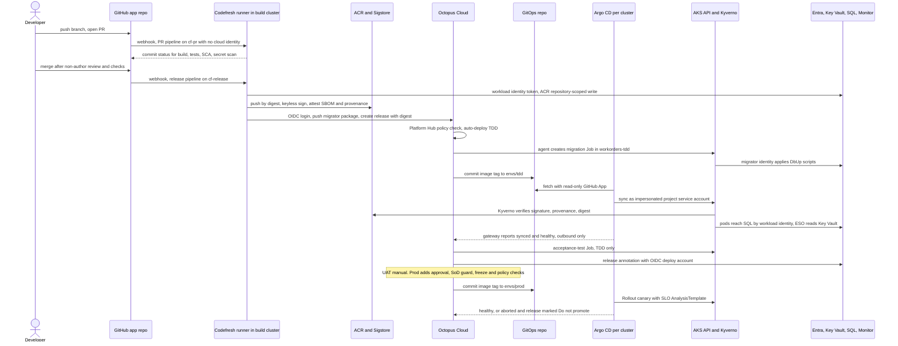

# Round 1 — SRE + Security & Compliance position

Role: `sre-security`. Thesis: the platform is complete only when it is safe to operate and auditable. Product claims are cited in section 9; `[UNVERIFIED]` marks what documentation did not confirm.

Evidence from this repo:

- **Secrets exposure.** `.octopus/variables.ocl` maps `az_login_appkey` to `#{AzureAccount.Password}`. `deployment_process.ocl` writes the SQL connection string as a plain Container App env var, and `deploy.yml` reads it back, so any Reader sees the credential. `UpdateAzureSql.ps1` passes the password as a process argument.
- **Supply chain.** The `build.yml` `security-scan` job is disabled (`if: false && ...`). Images are pushed as `:latest` with `--cache-from ...:latest`. There is no SBOM, signature or provenance.
- **Operability.** EP18 (41 red runs, 13 days) came from a rotated Octopus API key. #9011 and #9017 show UAT/Prod promoted with no health verification, and `Degraded` never gates.
- **App surface.** An anonymous `GET /_demo/setneedsreboot/{bool}` flips `/_healthcheck` to Unhealthy. `/_healthcheck/detailed` returns stack traces. `/mcp` is unauthenticated (`ServerApplication.cs`).

## 1. Position summary

1. **Secretless by default.** Machine hops use OIDC or AKS Workload Identity (WI):
   - Codefresh→Octopus and Codefresh→Sigstore.
   - Octopus→Azure, per environment and per deployment/runbook.
   - Pods→SQL, Key Vault and Monitor.
   - Argo CD SSO.

   The remaining long-lived secrets go in a register with owner, vault and rotation. The client-secret Contributor principal is a bootstrap credential with a deletion date.
2. **One authorization path to production, enforced at admission.** Octopus alone authorizes prod changes: lifecycle, approval with separation of duties, policy, audit stream. Argo CD alone writes to prod clusters. Codefresh holds no cluster, GitOps-prod or subscription credentials. Kyverno admits only digest-pinned images keyless-signed by the Codefresh release pipeline, with SLSA provenance. Bypasses fail closed.
3. **Layered least privilege, provisioning included.** Role assignments, locks and deny policies live in a persistent access layer under dual control. Environment create/destroy runs as Octopus runbooks under a federated identity with Contributor on environment resource groups only.
4. **Verification fails closed inside the delivery path.**
   - Argo Rollouts canary with SLO analysis; Octopus waits on "Argo CD application is healthy"; liveness uses `/alive`; no gate uses `continue-on-error`.
   - Expand/contract migrations under a separate identity.
   - Forward-fix by default; PITR as a rehearsed last resort.
5. **One audit trail, one DORA dataset, SLO alerting.**
   - All tool and Azure events land in one Log Analytics workspace, keyed by release version, commit SHA and image digest.
   - DORA comes from Octopus, enriched with incident-linked failures.
   - Burn-rate alerts use the app's existing OpenTelemetry.

## 2. Responsibility matrix

| Capability | Codefresh | Argo CD | Octopus Deploy | Other |
|---|---|---|---|---|
| CI build/test | PR and release pipelines, build cluster only | — | — | GitHub Actions stays live until cut-over |
| Artifact & image storage | Push by digest | Reads manifests only | Built-in feed (DB package); ACR feed | ACR: images plus OCI referrers; tags locked |
| SBOM/signing | Keyless sign; SBOM + provenance attestations | — | Policy requires provenance-check step | Kyverno verifies; Defender gates CVEs |
| Release versioning & record | Computes version; build information | — | **System of record** (version, digest, commits, approvals) | Rekor entries |
| Environment promotion | — | Applies desired state | **Lifecycle** tdd→uat→prod; hotfix channel | — |
| Approvals/gates | PR checks | Maintenance sync windows | Approval, SoD guard, freezes, Platform Hub policy, optional ITSM | GitHub rulesets |
| Kubernetes reconciliation | **None** | **Sole writer** (impersonation) | Jobs in one namespace only | Kyverno |
| Non-Kubernetes targets | — | — | SQL migrations, annotations, legacy ACA | — |
| Database migrations | Builds migrator image | Previews only (PreSync) | Migration Job before image bump; PITR marker | SQL PITR/LTR |
| Config & secrets | Runtime secret store (in runner cluster) | Syncs `ExternalSecret` manifests | Only the Git bot credential | Key Vault + ESO + WI |
| Progressive delivery | — | Rollouts canary + analysis | Waits for healthy | Azure Monitor workspace |
| Rollback | — | Auto-abort | Redeploy previous release; "Do not promote" | DB forward-fix/PITR |
| Runbooks/day-2 | — | On-call Rollout abort | Config-as-code runbooks, OIDC | Action groups |
| Ephemeral PR environments | PR image (PR pipeline identity) | Label-gated ApplicationSet | Optional preview-DB runbook | TTL cleanup |
| Audit/DORA/observability | Audit export | Events, notifications | Audit stream, Insights (DORA) | Log Analytics, App Insights, Managed Prometheus |
| **Runtime-env provisioning** | May trigger a scoped runbook | Bootstraps add-ons | **Runs Terraform** as `id-env-lifecycle` | State in Azure Storage (Entra auth) |
| **Privileged access** (roles, locks, policy) | None | None | `access` runbook, dual control | Constrained RBAC Administrator; PIM Owner |

## 3. Target runtime and environment topology

**The new platform runs on AKS Automatic; ACA stays the live prod path until a readiness review passes.** The platform drives the move, not the app: Argo CD, Rollouts and admission-time signature verification need Kubernetes. ACA has the smaller attack surface; AKS Automatic narrows the gap with preconfigured Azure RBAC, WI, API-server VNet integration, enforced Deployment Safeguards and automatic upgrades. Readiness: 14 days of UAT SLO data, rollback and PITR drills, 14 days of Kyverno enforcement without false denies, and the legacy prod project frozen so one pipeline migrates prod.

| Cluster | Contents | Guardrail |
|---|---|---|
| `aks-build` (existing runner cluster) | Codefresh runner: `cf-pr` (no cloud identity), `cf-release` (master only, WI, ACR repo-scoped write) | Privileged dind never shares nodes with workloads |
| `aks-nonprod` | `workorders-{tdd,uat}`, `workorders-pr-*`, plus platform namespaces (Argo CD, Rollouts, Kyverno, ESO, collector, Octopus agent, Argo gateway) | Kyverno Audit→Enforce; previews TTL 72h |
| `aks-prod` | `workorders-prod` plus platform namespaces | Enforce; no standing human write |

Namespaces are default-deny, with egress only to private endpoints and Azure OpenAI/Monitor. `worker` becomes a second image (`RemotableBus:ApiUrl` points at `ui-server` in-cluster); migrator and acceptance tests are Jobs; each workload has its own identity.

**Azure identity layers.** These close the Contributor role-assignment gap:

| Layer | Contents | Identity |
|---|---|---|
| L0 governance | Locks; Azure Policy (FIC issuer allowlist, Entra-only SQL, Key Vault RBAC model) | PIM Owner, rare |
| L1 persistent access | RGs, UAMIs, FICs, direct role assignments at RG/ACR scope, Terraform state | `id-access-admin`: RBAC Administrator with conditions limiting it to allowlisted roles for service principals; or PIM Owner for bootstrap |
| L2 environment lifecycle | AKS (BYO cluster and kubelet UAMIs), SQL (Entra-only), Key Vault (RBAC), App Insights | `id-env-lifecycle`: Contributor on `rg-workorders-<env>`, Octopus OIDC |
| L3 deploy | Annotations, migration secret read | `id-octopus-deploy-<env>`, data plane only |
| L4 runtime | App, worker, migrator, ESO, Kyverno, analysis | One UAMI per workload per env (WI) |

L2 never assigns roles. L1 pre-assigns them on persistent UAMIs and RGs (AcrPull for kubelet, Managed Identity Operator for the cluster identity, Key Vault Secrets User at RG scope for ESO), directly rather than through groups, which lag about 24 hours for managed identities. SQL users need no Azure role: L2, in the Entra admin group, runs `CREATE USER ... WITH OBJECT_ID`.

**Octopus** (`<octopus-space>`):
- Environments `tdd`, `uat`, `prod`. No tenants: one customer, so tenants add surface without isolation.
- Lifecycles `workorders-standard` (TDD auto, then UAT and Prod manual) and `workorders-hotfix` (UAT→Prod plus post-incident review); matching channels.
- Azure OIDC accounts per environment and type, plus `azure-oidc-env-lifecycle`.
- One Kubernetes agent per cluster, script pods scoped to `workorders-<env>`.
- Argo CD instances per cluster; Git credential `gitops-bot`.

**Argo CD:**
- One instance per cluster, in-cluster destinations only. Hub-and-spoke concentrates prod credentials.
- AppProjects: `platform-addons` (the only project allowed cluster-scoped kinds), `workorders-nonprod`, `workorders-previews`, `workorders-prod`.
- Applications carry `argo.octopus.com/project` and `argo.octopus.com/environment` annotations.

**Codefresh:**
- The release pipeline is pinned to `cf-release`. It loads its YAML from Git, and ABAC restricts edits.
- If the Codefresh GitOps runtime is adopted, it *replaces* community Argo CD; never two per cluster.

**Separation of duties:**

| Action | Allowed | Excluded |
|---|---|---|
| Create release | `svc-codefresh-release` (OIDC: package push, release create) | Humans; any deploy right |
| Deploy UAT | `uat-deployers` | Codefresh |
| Approve Prod | `prod-approvers` (humans; AI Factory identities excluded) | Deployment creator (SoD guard step) |
| Write prod cluster | Nobody standing; `bg-workorders-prod` via PIM, second approver, 4h | Octopus, Codefresh, on-call |
| Argo CD prod on-call | `get`, `logs`, Rollout `abort` | `sync`, `override`, `delete` |

**DR, blast radius, cost:**
- Clusters rebuild from Git (Terraform plus an Argo CD bootstrap); secrets return from Key Vault through ESO.
- Blast radius is bounded by per-environment clusters, UAMIs, vaults and Octopus accounts. A tool outage stops change, not traffic.
- Prod SQL moves from Basic (7-day PITR) to Standard (35 days) plus LTR, with a quarterly nonprod restore drill.
- Cost controls:
  - Budgets per RG and the AKS cost analysis add-on.
  - `ContainerLogV2` on Basic logs.
  - A daily cap on the nonprod workspace only; a capped prod workspace goes blind mid-incident.
  - ACR purge of PR tags; spot build nodes.
  - Dropping the PII/cardinality `user.name` attribute on `app.user.logins`.

## 4. End-to-end flow



| # | Handoff | Credential | Trust boundary | Control |
|---|---|---|---|---|
| 1 | PR → Codefresh | Codefresh GitHub App | TB1 public repo, forks untrusted; TB2 SaaS → runner | `cf-pr`: no secrets, no identity |
| 2 | PR validation | none | — | Tests, `--vulnerable --include-transitive`, Gitleaks re-enabled |
| 3 | Merge | GitHub user | TB1 | Non-author review; CODEOWNERS on `platform/**`, migrations |
| 4 | Build → ACR | WI (fallback: repo-scoped ACR token, 30d) | TB3 | One build per merge; digest; tag lock |
| 5 | Sign → Sigstore | Codefresh OIDC | TB4 public Fulcio/Rekor | Signer = release pipeline |
| 6 | Codefresh → Octopus | OIDC exchange | TB5 | Subject pinned to pipeline, repo, `master`; no deploy right |
| 7 | Octopus → cluster | Kubernetes agent (outbound) | TB6 | Jobs only, one namespace; Kyverno pins image/SA |
| 8 | Octopus → GitOps | `gitops-bot` token | TB7 | Only the bot may change `envs/**` |
| 9 | GitOps → Argo CD → API | Read-only GitHub App; impersonation | TB8, TB9 | AppProject limits; admission verify |
| 10 | Pods → Azure | WI | TB10 | Passwordless SQL; namespaced ESO stores |
| 11 | Argo CD → Octopus | Gateway JWT, read-only | TB11 | "Trigger sync" off |
| 12 | Octopus → Azure | OIDC per env/type | TB12 | Deploy and runbook subjects map to different identities |
| 13 | Runbook → subscription | `id-env-lifecycle` | TB13 | Plan review, approval, locks, deny policies |

## 5. Repositories and config-as-code layout

```text
<org>/bootcamp-palermo-workorders (public)   app; .octopus/ = LIVE legacy, untouched
└── platform/
    ├── codefresh/           pr.yml, release.yml (release YAML is trusted computing base)
    ├── octopus/workorders/  config-as-code for the NEW project (process, runbooks, non-sensitive vars)
    ├── octopus/terraform/   environments, lifecycles, teams, OIDC accounts, feeds
    ├── infra/terraform/     bootstrap-identity/ + access/ (L1), runtime-env/ (L2 create/destroy)
    ├── gitops/              template mirrored to the private GitOps repo
    └── guardrails/          <- sre-security slice
        ├── identity/  secrets/  policy/kyverno/  policy/octopus/
        ├── observability/   collector, PodMonitor, SLO rules, dashboards
        └── runbooks/        rollback, PITR, break-glass, key rotation, Sigstore outage
<org>/workorders-gitops (private)           apps/workorders/{base,envs/*}, argocd/, clusters/
<org>/octopus-platform-hub (private)        process templates + policies
```

The GitOps repo is private. It carries hostnames, client IDs and vault names: no secrets, but useful for reconnaissance. Rulesets make `envs/**` bot-only; CODEOWNERS covers `argocd/**` and `clusters/**`. Octopus sensitive variables never reach Git.

## 6. Key decisions

| Decision | Chosen | Rejected | Reason |
|---|---|---|---|
| Provisioning credential | Bootstrap once, then delete the secret; `id-env-lifecycle` (UAMI + FIC) with Contributor on env RGs | Secret in Codefresh/Octopus; subscription Contributor in automation | See comparison below |
| Env IaC runner | Octopus config-as-code runbooks with Terraform steps, approvals, scheduled TTL destroy; Codefresh only triggers | Codefresh pipelines; local Terraform | Approval, audit and policy cover runbook runs |
| Role-assignment gap | L1 access layer; persistent UAMIs; RG-scope inheritance | Key Vault access policies; `--attach-acr`; group grants for MIs | No self-grant path; no 24h lag |
| Codefresh → Octopus | OIDC service account, wildcard subject | `OCTO_API_KEY` | EP18 |
| Codefresh → ACR | Runner WI + ACR ABAC | SP secret; Codefresh OIDC → Entra | The push `sub` embeds `scm_user_name`, so exact-match FICs fail; flexible FICs do not accept Codefresh |
| Octopus → Azure | OIDC per env with `type` in the subject | SP secret account | Removes the `az_login_appkey` class of exposure |
| Signing | Keyless `cosign` + SBOM + provenance | Notation + Key Vault; AKS Image Integrity | No keys; Image Integrity is preview and audit-only |
| Admission | Kyverno `ImageValidatingPolicy` at controller level; Defender CVE gating | Gatekeeper + Ratify | One engine; digest mutation |
| Secrets | Key Vault per env + ESO namespaced stores | SOPS/Sealed Secrets; CSI-only | No ciphertext in a public org |
| SQL auth | App: `Active Directory Workload Identity` (no code change); migrator: vaulted password until it gains an Entra option | Passwords in pods | SqlClient ≥ 6.1.1 bundles Entra auth |
| Prod write path | Argo CD pull only | Octopus `kubectl`/Helm; Codefresh sync; Image Updater beyond previews | Single authorization path |
| Migrations | Octopus-run Job; expand/contract lint | Prod PreSync hooks; public SQL endpoint | Approval context, PITR marker |
| Canary analysis | Rollouts Job provider under WI → Azure Monitor workspace | `oauth2.clientSecret`; retired auth proxy | Secretless |
| DORA | Octopus Insights + incident-linked "Do not promote" | Codefresh DORA as second source | One failure definition |

**Client secret vs OIDC (provisioning):**

| Axis | Client secret | OIDC (`id-env-lifecycle`) |
|---|---|---|
| Stored credential | Bearer secret; leaks via logs and env dumps | None; tokens live about an hour |
| Replay | From anywhere, unless licensed Conditional Access | Only a token from the trusted issuer with the exact subject |
| Context | Sign-ins name only the principal | Subject names space, project, environment, runbook |
| Failure mode | Expiry/rotation outage (EP18 class) | Issuer outage; subject errors |
| Setup | Day 0 | FIC (Contributor can create) **plus** role assignment (Contributor cannot) |
| Reach | Subscription Contributor effectively reaches the data plane: SQL admin reset, `listKeys`, access-policy self-grant, FIC takeover | Same unless scope narrows to env RGs |

Verdict: the secret is used once, by a human, alongside a PIM Owner, because it cannot grant its replacement a role; then it is deleted. Until deletion:
- Key Vault only;
- 30-day expiry or less;
- alert on every sign-in;
- Conditional Access if licensed.

## 7. Risks, and what the other roles are likely to get wrong

**Risks:**
- **R1 Contributor reach.** Controls sit at L0, which Contributor cannot change:
  - ReadOnly locks on privileged UAMIs.
  - FIC issuer allowlist (preview).
  - Key Vault RBAC model.
  - Entra-only SQL policy. Deny applies only at creation, so an alert on `azureADOnlyAuthentications/write` covers later changes.
  - A separate prod subscription later.
- **R2 Sigstore dependency.** Verifying at Deployment/Rollout/Job level and denying ownerless Pods keeps pod rescheduling independent of Rekor/Fulcio. Break-glass is a PIM-gated, time-bound `PolicyException`; unsigned images are never admitted.
- **R3 Residual secrets.** Git bot token (90d), gateway JWT, Argo CD GitHub App key, migrator password, Azure OpenAI key (the app uses `AzureKeyCredential`), and the GitOps runtime Git token if adopted.
- **R4 Parallel-run migrations.** The new stack gets its own databases until cut-over; then the legacy project is frozen for prod.
- **R5 Pipeline YAML is trusted code.** Kyverno trusts the signer identity, so pipeline edits need CODEOWNERS approval plus ABAC.
- **R6 Hidden coupling.**
  - `ShouldUseLearningTransport` treats `Data Source=` strings, which is what `SqlConnectionStringBuilder` emits, as a signal for file-based NServiceBus. A config test requires `Server=`.
  - SqlClient 7 moves Entra auth to `Microsoft.Data.SqlClient.Extensions.Azure`. A TDD smoke test guards it.
- **R7 Licensing.** Platform Hub policies, audit stream, ITSM and space-level Insights require Enterprise. Fallbacks: Kyverno plus process templates, API audit export, project-level Insights.

**Likely errors by other roles:**
- **Octopus architect.** Likely to deploy via Kubernetes-agent script pods, which default to cluster-admin, keep connection strings as sensitive variables, and model the Contributor principal as a secret-based account. Answer: agent Jobs scoped by `targetNamespaces`, Argo CD steps for the app, OIDC accounts, passwordless SQL. Adopted from this role: Octopus as release system of record.
- **GitOps architect.** Likely to make a merge to `envs/prod` the approval, run Image Updater or promoters without approval, run PreSync migrations, and centralize a hub Argo CD. Answer: Git records desired state but does not authorize; Image Updater stays in previews; a hub concentrates prod credentials. Adopted: pull-based sync, self-heal, impersonation.
- **Codefresh engineer.** Likely to make Promotion Flows the authority, deploy through the registered cluster integration, store the Contributor secret in shared configuration, and run a second Argo CD. Answer: one authority; a cluster integration is CI with prod write; no subscription credential in CI. Adopted: Codefresh OIDC and keyless signing.
- **Pragmatist.** Likely to stay on ACA, keep keys "for now", and skip policy. Answer: EP18 cost 13 days, while OIDC is a one-time setup. Phasing: OIDC, passwordless SQL, signing and SoD first; Kyverno Audit→Enforce next; Sentinel, ITSM and Defender gating optional. Conceded: ACA stays prod until readiness passes.

**STRIDE (delivery path):**

| | Threat | Control | Residual |
|---|---|---|---|
| S | Another pipeline or a fork PR poses as the release pipeline | OIDC subject and SAN pinning; secretless `cf-pr` | Account admins |
| S | Provisioning secret replayed | Delete; sign-in alerts | Until deletion |
| T | Mutable tag or cache poisoning (`:latest` today) | Digest, tag lock, `mutateDigest`/`verifyDigest` | Registry delete |
| T | Direct GitOps commit or `kubectl` to prod | Rulesets; no standing write; signature check; self-heal | Break-glass |
| R | Approval repudiated | Audit stream copy; approval output variables; PIM logs | Retention |
| I | SQL credential in Container App env; `az_login_appkey`; detailed health output; `user.name` label | Passwordless SQL; ingress restrictions; collector processor | Browser App Insights key |
| D | `/_demo/setneedsreboot/true`; Sigstore outage; capped logs | `/alive` liveness; ingress deny; controller-level verify | Canary noise |
| E | Agent script pods cluster-admin; Argo CD controller; cluster integration; dind next to workloads; Contributor escalation | `targetNamespaces`; impersonation; build cluster; L0 controls | Contributor on env RGs |

## 8. Implementation highlights (placeholders only)

**Federated credentials** (azurerm; create FICs on one UAMI sequentially, because concurrent writes return 409):

```hcl
resource "azurerm_federated_identity_credential" "app_prod" {
  name                      = "aks-prod-workorders-app"
  user_assigned_identity_id = azurerm_user_assigned_identity.app_prod.id
  issuer                    = var.aks_prod_oidc_issuer_url          # <AKS_OIDC_ISSUER_URL>
  subject                   = "system:serviceaccount:workorders-prod:workorders-app"
  audience                  = ["api://AzureADTokenExchange"]
}
resource "azurerm_federated_identity_credential" "env_lifecycle_uat" {
  name                      = "octopus-env-lifecycle-uat"
  user_assigned_identity_id = azurerm_user_assigned_identity.env_lifecycle.id
  issuer                    = "https://<octopus-instance>.octopus.app"   # no trailing slash
  subject                   = "space:<space-slug>:project:platform-environments:environment:uat:type:runbook" # [UNVERIFIED key mix]
  audience                  = ["api://AzureADTokenExchange"]           # [UNVERIFIED Octopus default]
  depends_on                = [azurerm_federated_identity_credential.app_prod]
}
```

**Passwordless runtime config** (a ConfigMap, not a Secret; the string must start with `Server=`):

```yaml
ConnectionStrings__SqlConnectionString: "Server=tcp:<sql-server>.database.windows.net,1433;Database=<db>;Authentication=Active Directory Workload Identity;User Id=<UAMI_CLIENT_ID>;Encrypt=True"
OTEL_EXPORTER_OTLP_ENDPOINT: "http://otel-collector.otel.svc:4317"
# probes: liveness /alive (self only), readiness /_healthcheck, startupProbe /alive
```

```sql
CREATE USER [id-workorders-app-prod] FROM EXTERNAL PROVIDER WITH OBJECT_ID = '<UAMI_OBJECT_ID>';
ALTER ROLE db_datareader ADD MEMBER [id-workorders-app-prod];
ALTER ROLE db_datawriter ADD MEMBER [id-workorders-app-prod];
GRANT CREATE TABLE TO [id-workorders-app-prod];               -- NServiceBus EnableInstallers (interim)
GRANT ALTER ON SCHEMA::nServiceBus TO [id-workorders-app-prod];
```

**Secrets via ESO** (namespaced store; one identity per namespace):

```yaml
apiVersion: external-secrets.io/v1
kind: SecretStore
metadata: { name: kv-workorders, namespace: workorders-prod }
spec:
  provider:
    azurekv:
      authType: WorkloadIdentity
      vaultUrl: "https://<kv-workorders-prod>.vault.azure.net"
      serviceAccountRef: { name: eso-workorders }   # annotated azure.workload.identity/client-id
---
apiVersion: external-secrets.io/v1
kind: ExternalSecret
metadata: { name: llm-gateway, namespace: workorders-prod }
spec:
  refreshInterval: 1h0m0s
  secretStoreRef: { kind: SecretStore, name: kv-workorders }
  target: { name: llm-gateway, creationPolicy: Owner }
  data:
    - secretKey: AI_OpenAI_ApiKey
      remoteRef: { key: ai-openai-apikey }
```

**Admission: only images signed by the release pipeline, with provenance:**

```yaml
apiVersion: policies.kyverno.io/v1
kind: ImageValidatingPolicy
metadata: { name: workorders-release-provenance }
spec:
  validationActions: [Deny]            # Audit in nonprod for the first 14 days
  failurePolicy: Fail
  webhookConfiguration: { timeoutSeconds: 15 }
  matchConstraints:
    resourceRules:
      - { apiGroups: ['apps'], apiVersions: ['v1'], resources: ['deployments'], operations: ['CREATE','UPDATE'] }
      - { apiGroups: ['batch'], apiVersions: ['v1'], resources: ['jobs'], operations: ['CREATE','UPDATE'] }
      # Rollouts: sibling policy using spec.images CEL extraction
  matchImageReferences:
    - glob: '<acr-name>.azurecr.io/churchbulletin.*'
  validationConfigurations: { mutateDigest: true, verifyDigest: true, required: true }
  credentials: { providers: ['azure'] }
  attestors:
    - name: codefresh
      cosign:
        keyless:
          identities:
            - issuer: 'https://oidc.codefresh.io'
              subject: 'https://g.codefresh.io/<cf-account-name>/<cf-project>/<cf-release-pipeline>:<cf-account-id>/<cf-pipeline-id>'
        ctlog: { url: 'https://rekor.sigstore.dev' }
  attestations:
    - name: provenance
      intoto: { type: 'https://slsa.dev/provenance/v1' }
  validations:
    - expression: "images.containers.map(i, verifyImageSignatures(i, [attestors.codefresh])).all(e, e > 0)"
      message: "image not signed by the Codefresh release pipeline"
    - expression: "images.containers.map(i, verifyAttestationSignatures(i, attestations.provenance, [attestors.codefresh])).all(e, e > 0)"
      message: "missing signed SLSA provenance"
```

**Prod AppProject** (`application.sync.impersonation.enabled: "true"` in `argocd-cm`):

```yaml
apiVersion: argoproj.io/v1alpha1
kind: AppProject
metadata: { name: workorders-prod, namespace: argocd }
spec:
  sourceRepos: ['https://github.com/<org>/workorders-gitops.git']
  destinations: [{ server: https://kubernetes.default.svc, namespace: workorders-prod }]
  clusterResourceWhitelist: []
  namespaceResourceBlacklist: [{ group: '', kind: ResourceQuota }, { group: networking.k8s.io, kind: NetworkPolicy }]
  destinationServiceAccounts:
    - { server: https://kubernetes.default.svc, namespace: workorders-prod, defaultServiceAccount: argocd-deployer }
  roles:
    - name: oncall
      groups: ['<ENTRA_GROUP_OBJECT_ID_ONCALL>']
      policies:
        - p, proj:workorders-prod:oncall, applications, get, workorders-prod/*, allow
        - p, proj:workorders-prod:oncall, logs, get, workorders-prod/*, allow
        - p, proj:workorders-prod:oncall, applications, action/argoproj.io/Rollout/abort, workorders-prod/*, allow
```

**Codefresh → Octopus without an API key; keyless signing in the build step:**

```yaml
steps:
  build:
    type: build
    image_name: churchbulletin.ui
    registry: <acr-integration-name>
    cosign: { sign: true }                     # keyless via Codefresh OIDC
  obtain_id_token: { type: obtain-oidc-id-token }
  octopus_login:
    type: octopusdeploy-login
    arguments:
      ID_TOKEN: '${{ID_TOKEN}}'
      OCTOPUS_URL: 'https://<octopus-instance>.octopus.app'
      OCTOPUS_SERVICE_ACCOUNT_ID: '<octopus-service-account-audience>'
  # octopusdeploy-push-package / octopusdeploy-create-release then take OCTOPUS_ACCESS_TOKEN: '${{OCTOPUS_ACCESS_TOKEN}}'
```

The Octopus OIDC identity trusts issuer `https://oidc.codefresh.io` with subject `account:<cf-account-id>:pipeline:<cf-release-pipeline-id>:scm_repo_url:https://github.com/<org>/<repo>:scm_user_name:*:scm_ref:master`.

**Platform Hub policy** (conditions Rego; OCL wrapper `[UNVERIFIED]`):

```rego
package workorders_prod_guardrails

default result := {"allowed": false, "reason": "prod needs an unskipped approval and provenance check from the main process branch"}

result := {"allowed": true} if { input.Environment.Slug != "prod" }

result := {"allowed": true} if {
    input.Environment.Slug == "prod"
    some a in input.Steps
    a.ActionType == "Octopus.Manual"            # [UNVERIFIED action type string in policy input]
    not a.Id in input.SkippedSteps
    some v in input.Steps
    v.Slug == "verify-image-provenance"
    v.Enabled
    not v.Id in input.SkippedSteps
    input.Release.GitRef == "refs/heads/main"   # CaC process branch, [UNVERIFIED format]
}
```

SoD guard: a script step after approval fails when `Octopus.Action[Approve prod].Output.Manual.ResponsibleUser.Id` equals `Octopus.Deployment.CreatedBy.Id`.

**SLO: 99.5% non-5xx over 28 days, fast-burn page** (metric names depend on collector translation, `[UNVERIFIED]`):

```hcl
resource "azurerm_monitor_alert_prometheus_rule_group" "workorders_slo" {
  name                = "workorders-prod-slo"
  location            = var.location
  resource_group_name = var.rg_observability
  cluster_name        = var.aks_prod_name
  scopes              = [var.azure_monitor_workspace_id]
  interval            = "PT1M"
  rule {
    record     = "workorders:http_errors:ratio_rate5m"
    expression = "sum(rate(http_server_request_duration_seconds_count{http_response_status_code=~\"5..\",http_route!~\"_healthcheck.*|alive|health\"}[5m])) / sum(rate(http_server_request_duration_seconds_count{http_route!~\"_healthcheck.*|alive|health\"}[5m]))"
  }
  rule {
    record     = "workorders:http_errors:ratio_rate1h"
    expression = "sum(rate(http_server_request_duration_seconds_count{http_response_status_code=~\"5..\",http_route!~\"_healthcheck.*|alive|health\"}[1h])) / sum(rate(http_server_request_duration_seconds_count{http_route!~\"_healthcheck.*|alive|health\"}[1h]))"
  }
  rule {
    alert      = "WorkordersErrorBudgetFastBurn"
    expression = "workorders:http_errors:ratio_rate1h > (14.4 * 0.005) and workorders:http_errors:ratio_rate5m > (14.4 * 0.005)"
    for        = "PT2M"
    severity   = 1
    action { action_group_id = var.oncall_action_group_id }
    annotations = { runbook = "platform/guardrails/runbooks/slo-fast-burn.md" }
  }
}
```

**Canary analysis without a client secret** (the WI label goes on the Job pod; "no data" counts as a failed measurement):

```yaml
apiVersion: argoproj.io/v1alpha1
kind: AnalysisTemplate
metadata: { name: workorders-slo-canary, namespace: workorders-prod }
spec:
  metrics:
    - name: canary-error-ratio
      interval: 2m
      count: 5
      failureLimit: 1
      provider:
        job:
          spec:
            backoffLimit: 0
            template:
              metadata: { labels: { azure.workload.identity/use: "true" } }
              spec:
                serviceAccountName: rollouts-analysis   # UAMI: Monitoring Data Reader on the workspace
                restartPolicy: Never
                containers:
                  - name: slo-probe
                    image: <acr-name>.azurecr.io/platform/slo-probe@sha256:<digest>
                    args: ["--query-endpoint", "<AMW_QUERY_ENDPOINT>", "--max-error-ratio", "0.01"]
```

## 9. Assumptions, open questions, capabilities to verify

**Assumptions:**
- One tenant and one subscription today; a separate prod subscription is recommended.
- Octopus Cloud Enterprise (fallbacks in R7).
- Entra ID P2 for PIM.
- A prod SQL tier upgrade is affordable.

**Open questions:**
- Q1: Who holds Owner/UAA for the L1 bootstrap? Is the client-secret principal deleted right after?
- Q2: Is the subscription shared with other workloads?
- Q3: Is the registered Codefresh cluster-integration cluster meant for workloads?
- Q4: Chief architect: community Argo CD or the Codefresh GitOps runtime (one, not both)?
- Q5: App changes needing approval:
  - an Entra option for the migrator;
  - `Azure.Identity` (a new package) for keyless OpenAI and App Insights;
  - moving NServiceBus installers out of runtime;
  - gating `/_demo/*` and securing `/mcp`;
  - dropping the `user.name` metric tag.

**Capability sources:**

| Capability | Status | Source |
|---|---|---|
| Octopus Argo CD steps, annotations, gateway, PR mode; healthy verification (2026.1) | Verified | https://octopus.com/docs/argo-cd/steps/update-application-image-tags · https://octopus.com/docs/argo-cd/annotations · https://octopus.com/docs/argo-cd/instances · https://octopus.com/blog/argo-cd-verified-deployments |
| Platform Hub policies (Rego, schema, Enterprise, GA 2025.4) | Verified | https://octopus.com/docs/platform-hub/policies · https://octopus.com/docs/platform-hub/policies/schema · https://octopus.com/blog/policies-blog-post |
| Octopus OIDC (Azure accounts, subject format, other issuers with wildcards) | Verified | https://octopus.com/docs/infrastructure/accounts/azure · https://octopus.com/docs/infrastructure/accounts/openid-connect · https://octopus.com/docs/octopus-rest-api/openid-connect/other-issuers |
| Agent permissions; sensitive variables outside Git; CaC runbooks; Terraform steps | Verified | https://octopus.com/docs/kubernetes/targets/kubernetes-agent/permissions · https://octopus.com/docs/projects/version-control/config-as-code-reference · https://octopus.com/blog/introducing-config-as-code-runbooks · https://octopus.com/docs/deployments/terraform |
| Audit stream; Insights; manual-intervention outputs | Verified | https://octopus.com/docs/security/users-and-teams/auditing/audit-stream · https://octopus.com/docs/insights · https://octopus.com/docs/projects/built-in-step-templates/manual-intervention-and-approvals |
| Codefresh OIDC claims; `octopusdeploy-login`; `cosign.sign`; Fulcio SAN template | Verified | https://codefresh.io/docs/docs/integrations/oidc-pipelines/ · https://codefresh.io/docs/docs/integrations/octopus-deploy/ · https://codefresh.io/docs/docs/pipelines/steps/build/ · https://github.com/sigstore/fulcio/blob/main/config/identity/config.yaml |
| Codefresh runner service accounts | Verified for IRSA/GKE; **Azure WI inside dind push `[UNVERIFIED]`**, spike | https://codefresh.io/docs/docs/installation/runner/install-codefresh-runner/ |
| Codefresh secret store, GitOps ABAC, execution context, audit, Git runtime token, separate Argo CD, DORA definitions | Verified | https://codefresh.io/docs/docs/integrations/secret-storage/ · https://codefresh.io/docs/docs/administration/account-user-management/gitops-abac/ · https://codefresh.io/docs/docs/administration/account-user-management/pipeline-execution-context/ · https://codefresh.io/docs/docs/administration/account-user-management/audit/ · https://codefresh.io/docs/docs/security/git-tokens/ · https://codefresh.io/docs/docs/installation/gitops/argo-with-gitops-side-by-side/ · https://codefresh.io/docs/docs/dashboards/dora-metrics/ |
| Argo CD impersonation (beta; all operations in 3.5), 3.0 RBAC, Entra SSO via WI, PR generator | Verified | https://argo-cd.readthedocs.io/en/stable/operator-manual/app-sync-using-impersonation/ · https://argo-cd.readthedocs.io/en/stable/operator-manual/upgrading/3.4-3.5/ · https://argo-cd.readthedocs.io/en/stable/operator-manual/upgrading/2.14-3.0/ · https://argo-cd.readthedocs.io/en/stable/operator-manual/user-management/microsoft/ · https://argo-cd.readthedocs.io/en/stable/operator-manual/applicationset/Generators-Pull-Request/ |
| Rollouts Prometheus auth options; Job provider | Verified | https://argo-rollouts.readthedocs.io/en/stable/analysis/prometheus/ · https://argo-rollouts.readthedocs.io/en/stable/analysis/job/ |
| Kyverno `ImageValidatingPolicy` stable (1.19); ESO Azure WI | Verified | https://kyverno.io/docs/policy-types/image-validating-policy/ · https://external-secrets.io/latest/provider/azure-key-vault/ |
| AKS Automatic; Image Integrity preview; Defender gated deployment | Verified | https://learn.microsoft.com/en-us/azure/aks/intro-aks-automatic · https://learn.microsoft.com/en-us/azure/aks/image-integrity · https://learn.microsoft.com/en-us/azure/defender-for-cloud/runtime-gated-overview |
| Workspace PromQL (Entra token); retired auth proxy; PodMonitor CRDs | Verified | https://learn.microsoft.com/en-us/azure/azure-monitor/metrics/prometheus-api-promql · https://learn.microsoft.com/en-us/azure/azure-monitor/containers/prometheus-authorization-proxy · https://learn.microsoft.com/en-us/azure/azure-monitor/containers/prometheus-metrics-scrape-crd |
| SqlClient WI; EF Core 10 → SqlClient ≥ 6.1.1; SqlClient 7 split | Verified | https://learn.microsoft.com/en-us/sql/connect/ado-net/sql/azure-active-directory-authentication · https://www.nuget.org/packages/Microsoft.EntityFrameworkCore.SqlServer/10.0.0 · https://techcommunity.microsoft.com/blog/sqlserver/microsoft-data-sqlclient-7-0-is-here-a-leaner-more-modular-driver-for-sql-server/4503173 |
| 20-FIC limit; flexible FIC scope | Verified | https://learn.microsoft.com/en-us/entra/workload-id/workload-identity-federation-considerations · https://learn.microsoft.com/en-us/entra/workload-id/workload-identities-flexible-federated-identity-credentials |
| Contributor limits; constrained delegation; locks; Key Vault self-grant; MI group lag; Conditional Access for workload identities | Verified | https://learn.microsoft.com/en-us/azure/role-based-access-control/built-in-roles/privileged · https://learn.microsoft.com/en-us/azure/role-based-access-control/delegate-role-assignments-overview · https://learn.microsoft.com/en-us/azure/azure-resource-manager/management/lock-resources · https://learn.microsoft.com/en-us/azure/key-vault/general/rbac-access-policy · https://learn.microsoft.com/en-us/entra/identity/managed-identities-azure-resources/managed-identity-best-practice-recommendations · https://learn.microsoft.com/en-us/entra/identity/conditional-access/workload-identity |
| FIC allowed-issuer policy (preview) | Verified via third-party mirror | https://www.azadvertizer.net/azpolicyadvertizer/2571b7c3-3056-4a61-b00a-9bc5232234f5.html |
| Entra-only SQL policy; `WITH OBJECT_ID`; PITR 7/35 days, LTR | Verified | https://learn.microsoft.com/en-us/azure/azure-sql/database/authentication-azure-ad-only-authentication-policy · https://learn.microsoft.com/en-us/sql/t-sql/statements/create-user-transact-sql · https://learn.microsoft.com/en-us/azure/azure-sql/database/automated-backups-overview |
| ACR ABAC; tag lock; App Insights Entra ingestion (no JS SDK) | Verified | https://learn.microsoft.com/en-us/azure/container-registry/container-registry-rbac-abac-repository-permissions · https://learn.microsoft.com/en-us/azure/container-registry/container-registry-image-lock · https://learn.microsoft.com/en-us/azure/azure-monitor/app/azure-ad-authentication |
| Burn rates; SLSA levels (step-authored provenance = L2 at most); daily cap; cost analysis | Verified | https://sre.google/workbook/alerting-on-slos/ · https://slsa.dev/spec/v1.0/levels · https://learn.microsoft.com/en-us/azure/azure-monitor/logs/daily-cap · https://learn.microsoft.com/en-us/azure/aks/cost-analysis |
| Octopus Argo steps with GitHub App credentials; ACR feed via OIDC; OIDC audience default; Rego OCL wrapper; Kyverno with Deployment Safeguards; node-RG creation under RG-scoped Contributor; Octopus Cloud egress IPs | `[UNVERIFIED]` | Test in nonprod |
