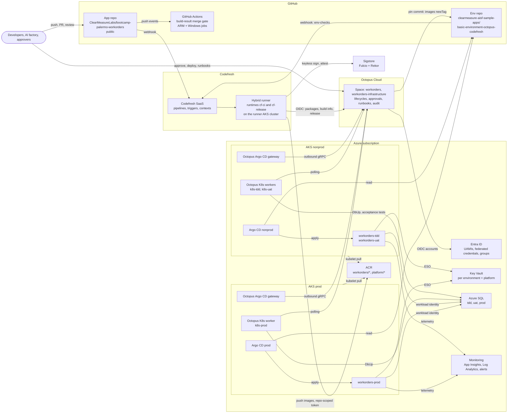
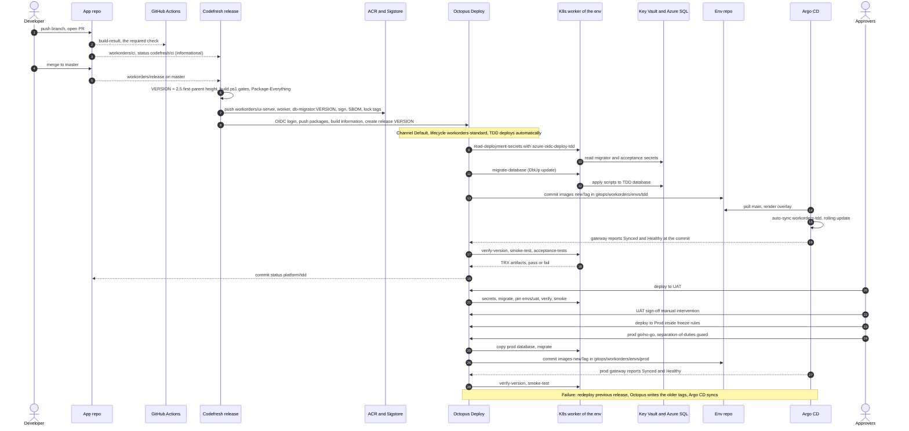
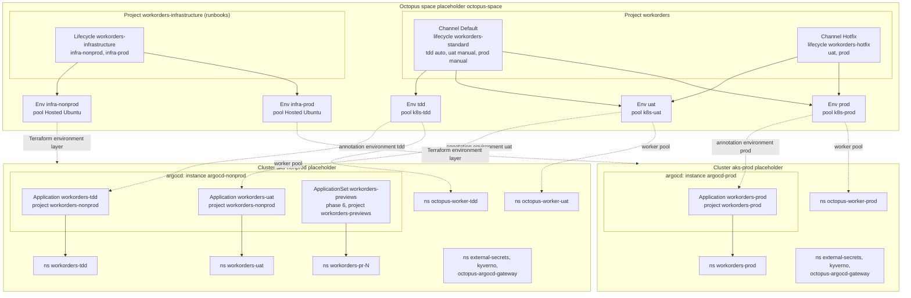

# Work Orders Delivery Platform: Adjudicated Design

| Field | Value |
|---|---|
| Role | `chief-architect` (adjudicator) |
| Date | 2026-09-24 (evidence checked 2026-09-23) |
| Status | Design and implementation sketch. Nothing is provisioned; every environment-specific value is a placeholder. |
| Inputs | Shared brief; the ten debate papers in `design/debate/`; the app repo at commit `46104c1`; official documentation (Evidence register, §2.3). |
| App repo | `ClearMeasureLabs/bootcamp-palermo-workorders` (public). Live delivery (`.github/**`, `.octopus/**`, root `Dockerfile`) stays untouched. |
| Environment repo | `clearmeasure-aisf-sample-apps/basic-environment-octopus-codefresh` (user directive). Not attached to this session; visibility unknown; treated as public. Staged under `platform/` of the app checkout as an exact mirror of its root. |
| Path conventions | Paths without a prefix are environment-repo paths (`gitops/…` is staged at `platform/gitops/…`). `app:` marks app-repo paths. |
| Citation conventions | `R1-OA` = `design/debate/round-1-octopus-architect.md`; `GA` gitops-architect, `CE` codefresh-engineer, `SRE` sre-security, `P` pragmatist; `R2-*` = round 2. `E<n>` = Evidence register entry. `F<n>` = repo fact (§2.4). `[UNVERIFIED]` = not confirmed in official docs. `[VERIFY]` = must be proven in the phase-2 TDD spike before it is relied on. |

## 1. Executive summary

The platform delivers the work-order app with one verb per tool: Codefresh builds, Octopus Deploy releases, Argo CD reconciles, and GitHub Actions keeps the merge gate during a parallel run. The new path targets Azure Kubernetes Service (AKS): one nonprod cluster (TDD, UAT) and one prod cluster, each running its own upstream Argo CD 3.5. The live GitHub Actions → Octopus → Container Apps path runs untouched until measured cutover criteria pass.

On each master merge, Codefresh mints `2.5.<first-parent height>` and runs the same `build.ps1` gates. It then publishes signed `workorders/*` images to ACR and two NuGet packages to Octopus, and creates the Octopus release over OIDC. Octopus deploys TDD automatically. For every environment it reads secrets from that environment's Key Vault, runs DbUp on an in-cluster Kubernetes worker, and commits two image tags to a Kustomize overlay. It then waits for Argo CD to report Synced and Healthy at that commit and verifies version and health. In TDD only, it runs Playwright, because the suite wipes its target database. UAT and Prod are manual promotions with sign-off, go/no-go, separation of duties, a pre-migration database copy and freezes.

The environment repo holds Argo CD, the GitOps overlays, Octopus config-as-code and Terraform. Octopus is the only writer of `images[].newTag`; people change everything else by pull request. Azure infrastructure splits into two layers: a foundation applied by an Owner, which holds every role assignment, and an environment layer that only Octopus runbooks apply.

Key recommendations to the user:
- Make the environment repo private.
- Narrow the stored GitHub credential to that repo.
- Confine the stored Azure provisioner to `infra-nonprod`, then retire it for OIDC identities.
- Confirm the Octopus license tier.
- Approve the app work items that gate Prod cutover.

Deferred: PR previews, blue-green Rollouts, Platform Hub. Cut: tenants.

### The platform in one paragraph

Codefresh builds; Octopus Deploy releases; Argo CD reconciles; GitHub Actions gates merges until evidence justifies a change. A master merge makes Codefresh mint `2.5.<first-parent height>`, run the `build.ps1` gates, push signed `workorders/ui-server`, `workorders/worker` and `workorders/db-migrator` images to ACR, push the `ChurchBulletin.Database` and `ChurchBulletin.AcceptanceTests` packages to Octopus, and create the release over OIDC. Octopus deploys TDD automatically and UAT and Prod on approval. For each environment it reads secrets from that environment's Key Vault, runs DbUp on that environment's in-cluster Kubernetes worker, commits two `newTag` values to `gitops/workorders/envs/<env>/kustomization.yaml`, waits until Argo CD reports Synced and Healthy at that commit, then verifies version and health; in TDD only it also runs Playwright. Argo CD 3.5 on each AKS cluster auto-syncs, prunes and self-heals from the environment repo. Pods reach SQL and Key Vault through workload identity, and Kyverno admits only images signed by the Codefresh release pipeline. An Owner applies the Azure foundation, which holds every role assignment; Octopus runbooks apply the environment layer. The live GitHub Actions → Octopus → Container Apps path runs untouched until Prod cutover.

## 2. Decision log

Status values: **Decided** (binding on implementers), **Recommended to user** (needs the user's approval or action), **Deferred** (design fixed or sketched, not built in the current phases).

### 2.1 Contested items C1–C12

#### ADR-C1 Packaging and overlay format — Decided

- **Context.**
  - The Octopus "Update Argo CD Application Image Tags" step is the only writer of environment pins (ADR-D4).
  - What it rewrites depends on the Argo CD source type.
  - UI.Server may later become an Argo Rollout.
- **Options.**
  - (a) A Helm chart in OCI, pinned per environment, with Git values files that Octopus rewrites through `image-replace-paths`.
  - (b) A Kustomize base plus per-environment overlays; Octopus rewrites `images[].newTag`.
  - (c) Plain YAML.
- **Who argued what.**
  - **Helm.** R1-GA §6 ("Packaging" row) and §8. R2-OA §1 conceded to Helm, and R2-OA §3 C1 keeps it.
  - **Kustomize.** R1-OA §6 D3 and R1-P §6 D8. In round 2: R2-GA §1 and §3 C1, R2-CE §1 and §3 C1, R2-SRE §3 C1, and R2-P §3 C1.
  - **The crossover.**
    - The gitops-architect moved from Helm to Kustomize after reading the step's Helm rewrite rule.
    - The octopus-architect moved from Kustomize to Helm, citing the round-1 claim that "Kustomize needs a Rollout transformer".
    - The gitops-architect retracted that claim in R2-GA §2.
- **Decision.**
  - Use Kustomize, in three layers:
    - `gitops/workorders/base/` holds the reviewed structure.
    - `gitops/workorders/envs/<env>/kustomization.yaml` is the pin file. Octopus writes only `images[].newTag` there.
    - `gitops/workorders/envs/<env>/config/` holds the human-owned environment configuration.
  - The app has no Helm chart.
  - Rollouts, when adopted, reuse the same pin (ADR-C3, §7.6).
- **Rationale.**
  1. The write surface is smaller.
     - For Kustomize, Octopus "will only update the `newTag` field(s) found in the Kustomize file. No other files will be edited."
     - For Helm, the step updates "every Helm values file referenced by the Application — both the chart's default `values.yaml` and any files listed in the Application's `spec.source.helm.valueFiles`", and it never writes `valuesObject` (E1).
  2. The Helm-OCI path is undocumented.
     - Octopus "cannot update charts sourced from a Helm repository or OCI feed", and only Git repository sources are supported for updates (E2).
     - Every Helm-annotation example uses a Git-hosted chart (E6).
     - The step also fails if any repository referenced by the Application has no Git credential (E1). How it behaves with an OCI chart source is [UNVERIFIED].
  3. The Rollout premise is false.
     - Kustomize's built-in image field specs include `spec/template/spec/containers[]/image` and carry no kind filter (E10).
     - The Rollouts Kustomize configuration adds name references, labels and replicas, not images (E11; R2-GA §2; R2-SRE §2).
  4. There is no chart release pipeline and no chart-version pin, and `kustomize build` renders locally (R2-P §3 C1).
  5. Plain YAML is rejected because the step's YAML scan excludes CRDs (E1).
- **Consequences.**
  - The base declares no `images:` block; every overlay pins both images.
  - Previews override images with `spec.source.kustomize.images` (R2-P §2).
  - Configuration promotion needs its own rule (ADR-D6).
  - A future shared chart, for example for sample-app templates, is rendered into Kustomize by CI so the one-field pin contract holds (R2-SRE §5). Kustomize `helmCharts` is an [UNVERIFIED] alternative (R2-CE §5).
- **Dissent.**
  - The octopus-architect keeps Helm, with ref-source scoping and `image-replace-paths.chart` (R2-OA §3 C1).
  - Revisit only if a Git-hosted chart becomes necessary, and only after a spike proves that ref-source updates work.

#### ADR-C2 Database migrations — Decided (named environments); previews Deferred with ADR-C4

- **Context.**
  - DbUp (`ChurchBulletin.Database`) is forward-only.
  - The console accepts only SQL authentication or Windows integrated security, and takes the password as a positional argument (F9).
  - Argo CD alone applies desired state (ADR-D2).
- **Options.**
  - (a) An Argo CD Sync or PreSync hook Job.
  - (b) An Octopus step that runs before the pin commit, on an in-cluster Kubernetes worker.
  - (c) A Job that an Octopus step creates in the worker's own namespace.
  - (d) Migrate on app startup.
- **Who argued what.**
  - (a): R1-GA §6 and §8; withdrawn in R2-GA §1.
  - (b): R1-OA §6 D4, R1-CE §2, R1-P §6 D6, R2-CE §3 C2, R2-P §3 C2, R2-SRE §3 C2 (plus a PreSync read-only guard) and R2-GA §3 C2 (per-environment pools).
  - (c): R2-OA §5.1.
  - (d): rejected by all, because startup migrations race across replicas (R1-GA §6).
- **Decision.**
  - For `tdd`, `uat` and `prod`, the `workorders` process runs these steps in order:
    1. `read-deployment-secrets`: an Azure CLI step using the per-environment OIDC account. It reads `workorders-sql-migrator-password`.
    2. `db-copy-pre-release`: prod only.
    3. `migrate-database`: the `ChurchBulletin.Database` package at the release version runs `update`.
    4. `update-argo-cd-image-tags`.
  - All four steps run on the target environment's Kubernetes worker pool (`k8s-<env>`). `migrate-database` runs inside step container `<acr-name>.azurecr.io/platform/ci-dotnet:<ci-image-version>`; `read-deployment-secrets` uses the default worker-tools container.
  - A failed migration ends the deployment before any Git commit.
  - After WI-05 adds Entra authentication to DbUp:
    - The password step is deleted.
    - The worker's script-pod service account federates to `id-workorders-<env>-migrator`.
    - If the worker chart cannot label script pods for workload identity [VERIFY], the step switches to mechanism (c).
- **Rationale.**
  - Hooks "are not run" during selective sync (E12). They also re-run on every sync, and a failed hook leaves a pin in Git whose schema was never applied (R2-OA §3 C2; R2-P §2).
  - The Kubernetes worker "is limited to modifying its local namespace" (E27). So the migration has network reach to private endpoints without a write path into Argo-managed namespaces (R2-GA §3 C2).
  - The package path mirrors the proven legacy step (`app:.octopus/deployment_process.ocl`, step `run-db-migrations`).
  - Per-environment pools isolate credentials and network reach. The TDD pool also runs the destructive acceptance suite (ADR-C11).
- **Consequences.**
  - Migrations must follow expand/contract, because rollback redeploys older images over a newer schema.
  - Until WI-05, the migrator password passes through Octopus as a sensitive output variable and appears as a process argument inside the script pod.
  - The PreSync read-only schema guard is Deferred as a phase-6 option (R2-SRE §5; R2-P §5).
- **Dissent.**
  - The octopus-architect prefers the Job mechanism now (R2-OA §5.1).
  - The sre-security role wants the PreSync guard now (R2-SRE §3 C2).

#### ADR-C3 Progressive delivery for UI.Server — Decided (rolling update through cutover); blue-green Deferred; canary rejected

- **Context.**
  - UI.Server runs as one replica.
  - It holds WebSocket connections in an in-process `ConcurrentDictionary` (`RealtimeNotificationHub`; R2-GA §1).
  - It serves version-coupled Blazor WebAssembly assets.
  - No metrics pipeline exists for analysis.
- **Options.**
  - A rolling update.
  - A blue-green Rollout.
  - A canary with SLO analysis.
- **Who argued what.**
  - **Canary:** R1-SRE §1; withdrawn in R2-SRE §1.
  - **Blue-green, with different timing:**
    - R1-GA §6; at cutover per R2-GA §3 C3.
    - Phase 3 per R2-OA §3 C3.
    - Phase 5 per R2-P §3 C3.
    - After a realtime backplane and at least two replicas per R2-SRE §3 C3.
  - **Rolling update first:** R1-P §6 D14 and R2-CE §3 C3.
- **Decision.**
  - **Phases 2–5.**
    - `ui-server` and `worker` are Deployments using `RollingUpdate` with `maxUnavailable: 0` and `maxSurge: 1`.
    - Startup, liveness and readiness probes all use `/alive`.
    - Octopus verifies with "Argo CD Application is healthy" (900 s), then runs `verify-version` and `smoke-test`.
  - **Phase 6 option: prod blue-green for `ui-server`.**
    - Uses the Argo Rollouts add-on and a Rollout with `workloadRef` to the existing Deployment, so the pin contract is unchanged.
    - Sets `autoPromotionEnabled: true`.
    - Runs a Job-provider smoke analysis before promotion.
    - Runs post-promotion analysis in `dryRun` for 14 days.
    - Entry criteria: at least two replicas, and WI-09 (realtime backplane) is done.
  - The Worker is never a Rollout, because it is a competing consumer on its queue.
- **Rationale.**
  - A paused Rollout reports Suspended, never Healthy, so the Octopus verification needs auto-promotion (R1-GA §7.1).
  - The Job provider needs no metrics store (R2-GA §2).
  - A canary would split WebAssembly clients and the notification hub across versions (R2-GA §1; R2-SRE §1).
  - The real release risk is the database, not traffic (R1-P §6 D14).
- **Consequences.**
  - `gitops/workorders/components/bluegreen/` is staged but referenced by no overlay.
  - SLO burn-rate alerts serve as the post-deploy signal from phase 3 (ADR-D15).
- **Dissent.**
  - The gitops-architect wants blue-green at cutover (R2-GA §3 C3).
  - The octopus-architect wants it in phase 3 (R2-OA §5.2).

#### ADR-C4 PR preview environments — Deferred (phase 6); design Decided

- **Context.**
  - Each preview needs a namespace, images and data.
  - Previews must not touch subscription credentials.
- **Options.**
  - (a) The ApplicationSet PR generator only.
  - (b) The PR generator plus Octopus ephemeral environments.
  - (c) Not building previews.
- **Who argued what.**
  - (b): R1-OA §6 D14; withdrawn in R2-OA §1.
  - (a): R1-GA §6, R1-CE §6 D13, R2-GA §3 C4, R2-CE §3 C4, R2-SRE §3 C4 and R2-P §3 C4 (deferred to phase 5).
  - SQLite, UI only: R2-P §3 C4; the default in R2-GA §3 C4.
  - SQL Server container: R2-OA §3 C4 and R2-CE §3 C4.
- **Decision.** Phase 6, opt-in, built as follows:
  - **Generator.** ApplicationSet `workorders-previews` uses the pull-request generator with label `preview`, applied by maintainers.
  - **Scope.**
    - Same-repo branches only.
    - AppProject `workorders-previews`, which allows namespaced kinds only and has no Azure identity.
    - Namespace `workorders-pr-<number>`, with a resource quota.
    - At most three open previews, by maintainer policy.
    - Deleted when the PR closes.
  - **Images.** `workorders-previews/ui-server` and `workorders-previews/worker`, tagged `pr-<number>-<head_sha>`, built by the `workorders/preview` pipeline.
  - **Data.**
    - An in-namespace SQL Server container whose password comes from an ESO `Password` generator.
    - A Sync-hook Job at wave `-1` runs `workorders/db-migrator` with `rebuild`, then `seed` (WI-07).
  - **Excluded.** No Octopus ephemeral environment and no release per PR.
- **Rationale.**
  - Octopus ephemeral environments get no lifecycles, freezes, Insights or tenants, and document no Argo CD support (E41; R2-SRE §2).
  - The Codefresh create-release step has no custom-field argument (E18), and no Codefresh Octopus step deprovisions (R2-CE §2 F2).
  - The generator deletes Applications when a PR closes.
  - A SQL Server container is chosen over SQLite for three reasons:
    - The Worker requires the SQL transport (F5).
    - A SQLite preview contains no rows at all (F4).
    - A DbUp-built database contains only the ten role-less employees inserted by `008_AddSomeEmployeeRecords.sql` (F10), so a seed step is needed in either case.
    - The SQL container also exercises the PR's migrations.
- **Consequences.**
  - Each preview costs about one SQL Server pod.
  - WI-07 (seed command) gates phase 6.
  - The PR generator has "only admins may create ApplicationSets" semantics, and the project field is never templated (E14).
- **Dissent.**
  - The pragmatist wants SQLite, UI only (R2-P §3 C4).
  - The gitops-architect wants SQLite by default, with a second label for SQL (R2-GA §3 C4).

#### ADR-C5 GitOps repository topology and location — Decided (single environment repo, per-path writers); visibility and credential scope Recommended to user

- **Context.**
  - The user named the repo `clearmeasure-aisf-sample-apps/basic-environment-octopus-codefresh`.
  - The stored Octopus Git credential is restricted to `https://github.com/clearmeasure-aisf-sample-apps/*`.
- **Options.**
  - Separate config and releases repos.
  - One environment repo.
  - The app repo.
- **Who argued what.**
  - **Two repos:** R1-GA §5; void per R2-GA §2, and kept as a fallback in R2-SRE §3 C5.
  - **One GitOps repo:** R1-OA §5, R1-CE §5, R1-SRE §5 and R1-P §5.
  - **The single directed repo:** all five papers in round 2 (§3 C5 of each).
- **Decision.**
  - The environment repo holds `argocd/`, `gitops/`, `.octopus/`, `octopus/terraform/`, `terraform/`, `policies/`, `codefresh/`, `scripts/`, `contracts/`, `design/` and `docs/`.
  - Writers per path are listed in §6.1:
    - Octopus writes only the three pin files on `main`, plus config-as-code edits on non-`main` branches.
    - Argo CD reads with its own read-only credential.
    - Codefresh reads and posts commit statuses.
- **Rationale.**
  - The user's directive names the repo.
  - An org-wide credential makes a second repo add no credential separation (R2-GA §2; R2-CE §3 C5).
  - Push rulesets that restrict file paths exist only for private or internal repos, and bypass is granted to roles, teams or GitHub Apps (E31).
- **Consequences.**
  - If the repo stays public, path control rests on four controls: CODEOWNERS, the bot-path audit in `platform-env/env-checks`, Octopus Git drift detection, and Argo CD reconciling only what Git holds.
  - The documented fallback is a private repo named `basic-environment-octopus-codefresh-releases` for the pin files. Its overlays would reference the config tree through Kustomize remote resources [UNVERIFIED with Argo CD repo credentials].
- **Dissent.**
  - None remaining. The two-repo split from R1-GA §5 is recorded as the fallback.

#### ADR-C6 CI engine and required merge check — Decided for the parallel run; flip Recommended to user

- **Context.**
  - `build-result` is the single required check (`app:docs/ci-single-gate.md`). It covers eight jobs, including ARM and Windows LocalDB (F12).
  - Fork PRs exist on this public repo.
- **Options.**
  - (a) `build-result` stays required forever.
  - (b) Flip to `codefresh/ci` after evidence.
  - (c) Two required checks.
- **Who argued what.**
  - (a): R2-SRE §3 C6, on fork safety.
  - (b): R2-CE §3 C6 (decoupled from runtime cutover) and R2-P §3 C6 (a single check whose gate asserts a GitHub `platform-matrix` workflow).
  - (c): R2-OA §3 C6 and R2-GA §3 C6.
- **Decision.**
  - **Phases 1–5.**
    - GitHub Actions `build-result` remains the only required check, and `app:.github/workflows/build.yml` stays unchanged.
    - Codefresh `workorders/ci` runs every Linux gate on same-repo branch pushes and posts `codefresh/ci` as an informational status.
    - Codefresh `workorders/release`, triggered by `master`, is the build of record and the only publisher for the new platform.
    - ARM SQLite and Windows LocalDB stay on GitHub Actions.
  - **Recommended flip** (needs user approval and a `.github/**` change). `codefresh/ci` becomes the single required check only when all of these hold:
    - 50 consecutive code-changing same-repo commits show equal verdicts and equal TRX totals.
    - Codefresh p95 duration is at most 1.2× that of GitHub Actions.
    - Fork PRs build through an identity-free `workorders/ci-fork` pipeline gated by a maintainer label.
    - The ARM and Windows jobs move to a GitHub `platform-matrix` workflow, and the `gate` step of `codefresh/ci` asserts that workflow's check run for the same SHA.
- **Rationale.**
  - Fork commits never fire Codefresh push triggers (R2-SRE §3 C6).
  - ARM builds are "only available to Enterprise customers" (E22).
  - Windows builds are in incubation, on Windows Server 1709 (E23).
  - Keeping exactly one required check preserves the single-gate semantics (R2-P §4).
  - The CI flip is independent of runtime readiness (R2-CE §3 C6).
- **Consequences.**
  - Linux gates run twice during the parallel run.
  - No gate is lost (R2-CE §4).
- **Dissent.**
  - The sre-security role keeps `build-result` permanently.
  - The octopus-architect and the gitops-architect want a second required check.

#### ADR-C7 Version authority and continuity — Decided

- **Context.**
  - Legacy versions are `2.4.<GitHub run number>`.
  - Octopus release-number collisions caused incidents EP20 and EP21 (`app:arch/DeployFailure-2026-08-21.md`).
- **Options.**
  - `2.5.<first-parent height>`.
  - `3.0.<height>`.
  - Octopus `NextPatch`.
  - A Codefresh build ID.
- **Who argued what.**
  - `2.5.<height>`: R1-CE §6 D6, R2-OA §3 C7, R2-GA §3 C7, R2-CE §3 C7 and R2-SRE §3 C7.
  - `3.0`: R1-P §6 D7; withdrawn in R2-P §1.4.
- **Decision.**
  - `.codefresh/scripts/version.sh` produces the version:
    - On `master`: `MAJOR.MINOR.<git rev-list --count --first-parent HEAD>`, with `MAJOR=2` and `MINOR=5` read from `.codefresh/version.env`.
    - On branches: `2.5.<n>-ci.<sha7>`. These versions are never released.
  - The image tag, the Octopus package version and the release number are the same string.
  - `IGNORE_EXISTING: true` makes release creation idempotent.
  - Hotfix-channel releases are numbered `<package-version>-hotfix.<n>` and are created over existing images.
  - Legacy keeps `2.4.<run>` in its own space until it is retired.
- **Rationale.**
  - The version is deterministic per commit and safe on reruns.
  - `2.5.x` sorts above every `2.4.x`.
  - A major bump would signal a breaking change that has not happened (R2-OA §3 C7).
- **Consequences.**
  - The clone must have full depth. This checkout is shallow (F17), so `version.sh` unshallows or fails.
  - A rewritten `master` history could repeat a number. The ACR tag lock makes that push fail loudly (ADR-D11).
- **Dissent.** None.

#### ADR-C8 Octopus tenants per cohort — Decided (cut)

- **Context.** No cohort requirement exists in the brief.
- **Options.** One tenant per cohort, per-student tenants, or no tenants.
- **Who argued what.**
  - For: R1-OA §6 D7.
  - Against: R1-GA §3.2, R1-SRE §3, R1-P §3 and all round-2 papers.
- **Decision.** No tenants. The `argo.octopus.com/tenant` annotation stays available for a future cohort model.
- **Rationale.**
  - Tenants are a licensed add-on.
  - Ephemeral environments cannot use them (E41).
  - They add RBAC surface without isolation for a single customer (R2-SRE §3 C8).
- **Consequences.** Untenanted projects and untenanted OIDC subjects.
- **Dissent.** None.

#### ADR-C9 Octopus Platform Hub — Deferred

- **Context.**
  - Platform Hub policies (Rego) could enforce prod guardrails.
- **Options.**
  - Adopt Platform Hub now.
  - Defer it.
  - Cut it.
- **Who argued what.**
  - Adopt now: R1-OA §6 D13 and R1-SRE §8.
  - Defer or cut: R1-P §3, R2-OA §3 C9, R2-GA §3 C9, R2-CE §3 C9, R2-SRE §3 C9 and R2-P §3 C9.
- **Decision.**
  - Deferred.
  - `policies/octopus/prod-deployment-guardrails.rego` is staged as an inactive policy.
  - Interim controls:
    - Pull-request review of config-as-code.
    - Manual interventions.
    - The separation-of-duties step.
    - Deployment freezes.
    - Kyverno.
- **Rationale.**
  - The pricing page lists Platform Hub under Enterprise (E25).
  - Its permissions "can only be assigned to system teams" (E24).
  - The platform service account is Space Manager only.
- **Consequences.** Revisit Platform Hub when an Enterprise license and system-team rights are confirmed.
- **Dissent.** None. It was deferred, not rejected.

#### ADR-C10 Provisioning credential lifecycle — Recommended to user

- **Context.**
  - By the user's choice, the client-secret principal (Contributor at subscription scope) is stored in two places:
    - Octopus: account `Azure Runtime Provisioner` and variable set `Azure Runtime Provisioning`.
    - Codefresh: context `azure-runtime-provisioner`.
  - Contributor cannot write `Microsoft.Authorization/*` (E36).
- **Options.**
  - Bootstrap, then delete.
  - Octopus holds it long term.
  - Migrate to OIDC by a set date.
- **Who argued what.**
  - Bootstrap, then delete: R1-SRE §6 and R2-SRE §3 C10.
  - Single holder, then OIDC in phase 3: R1-OA §6 D16 and R2-OA §5.3.
  - OIDC at the end of phase 1: R2-CE §3 C10.
  - OIDC at the phase-2 exit: R2-P §3 C10.
  - Scoped to runbooks: R2-GA §3 C10.
- **Decided within the design.**
  - Only `workorders-infrastructure` runbooks in `infra-nonprod` may use `Azure Runtime Provisioner`, through the account variable `Azure.LifecycleAccount`.
  - It is never used in `workorders`, in `infra-prod`, in any Codefresh pipeline, in Argo CD or in any cluster.
  - The foundation creates `id-env-lifecycle-nonprod` and `id-env-lifecycle-prod`, with federated credentials for the Octopus issuer. `octopus/terraform` creates the matching Octopus accounts `azure-oidc-env-lifecycle-nonprod` and `azure-oidc-env-lifecycle-prod`.
- **Recommended to the user.**
  1. Restrict the account (currently unrestricted) to `infra-nonprod`.
  2. Include `Azure Runtime Provisioning` in no project; the built-in Terraform steps use the account directly.
  3. Keep the Codefresh context unattached, then delete it at the phase-2 exit.
  4. Set secret expiry to 90 days or less and alert on its sign-ins.
  5. Have an Owner place `CanNotDelete` locks on the prod and legacy resource groups.
  6. Switch `infra-nonprod` to OIDC at the phase-2 exit.
  7. Use OIDC for `infra-prod` from its first apply.
  8. Then delete the client secret from Entra and from both stores. If other sample apps need it, restrict it to those projects instead.
- **Rationale.**
  - It is a bearer secret whose reach includes data-plane escalation paths (R1-SRE §6).
  - The OIDC replacement needs only role assignments that the Owner already applies in the foundation.
- **Consequences.** Nonprod provisioning can start before OIDC is proven; prod never depends on the secret.
- **Dissent.** None on direction. Timing differs between papers, as listed above.

#### ADR-C11 Acceptance tests against TDD and the promotion gate — Decided

- **Context.**
  - The acceptance suite wipes its target database.
  - `ServerFixture.OneTimeSetUp` calls `ZDataLoader.LoadData()`, which calls `DatabaseEmptier.DeleteAllData()`.
  - That deletes every row in every `[dbo]` table except `SchemaVersions` and `sysdiagrams`, whether or not `StartLocalServer` is set (F8; R2-OA §2).
- **Options.**
  - Octopus step on the worker.
  - Codefresh waits for the deployment, then tests.
  - Argo CD PostSync hook.
  - Rollouts analysis.
- **Who argued what.**
  - Octopus step: all five in round 2 (§3 C11 of each).
  - Tests in UAT: R1-OA §8; retracted in R2-OA §2.
- **Decision.**
  - **Where and when.**
    - Step `acceptance-tests` runs in `tdd` only.
    - It follows the healthy verification of `update-argo-cd-image-tags`, then `verify-version` and `smoke-test`.
    - It runs `ChurchBulletin.AcceptanceTests` at the release version on `k8s-tdd`, in step container `platform/ci-dotnet`.
  - **Inputs.**
    - `StartLocalServer=false`.
    - `ApplicationBaseUrl=#{App.BaseUrl}`.
    - The TDD connection string for login `workorders_acceptance`.
    - The AI settings.
  - **Results.**
    - TRX files become Octopus artifacts.
    - A failure fails the deployment, and the lifecycle then blocks UAT.
    - `report-commit-status` posts `platform/tdd` to the app commit.
    - Runbook `run-acceptance-tests` exists for on-demand runs in `tdd` only.
  - **Interlocks.**
    1. The step and the runbook are environment-scoped to `tdd`.
    2. The script exits unless `Octopus.Environment.Name` is `tdd` and `Acceptance.AllowDestructiveReset` is `True`. That variable is defined only for `tdd`.
    3. Login `workorders_acceptance`, and its password in Key Vault, exist only for TDD.
    4. TDD data is declared disposable.
    5. WI-08 adds an opt-in guard inside the suite.
- **Rationale.**
  - One orchestrator records the results on the release.
  - The private TDD endpoint is reachable from the in-cluster worker.
  - The tests use the same image and browsers as CI (R2-CE §3 C11).
- **Consequences.**
  - UAT and Prod never run the suite.
  - UAT data needs a seed or copy (Q8).
- **Dissent.** None.

#### ADR-C12 App-side prerequisites — Decided (list and gates); each work item Recommended to user

- **Context.** Several app facts make naive probes and exposure unsafe:
  - `/_healthcheck` aggregates the LLM, database and `NeedsReboot` checks (F2).
  - An anonymous `GET /_demo/setneedsreboot/true` flips `NeedsReboot` in every environment (F3).
  - The Worker has no health endpoint (F5).
  - DbUp cannot use Entra (F9).
- **Options.**
  - All app changes first.
  - Platform mitigations now, with app changes gating later phases.
- **Who argued what.**
  - R2-OA §3 C12, R2-GA §3 C12, R2-CE §3 C12, R2-SRE §3 C12 and R2-P §3 C12. The sre-security role wanted passwordless SQL and gated `/_demo` routes before any AKS environment.
- **Decision.** Platform-side mitigations apply from phase 2, with no `app:src/**` change:
  - Probes use `/alive`.
  - The Gateway redirects `/_demo/*`, `/_diagnostics/*`, `/_healthcheck/detailed` and `/mcp` in uat and prod.
  - NetworkPolicies restrict in-cluster callers.
  - Connection strings start with `Server=`.
  - The Worker image comes from a new Dockerfile.
  - `RemotableBus__ApiUrl` is set for the Worker.
  - App work items WI-01 to WI-12 (§8) each gate a named phase.
- **Rationale.**
  - Probing `/_healthcheck` would let one anonymous request, or an Azure OpenAI outage, remove every pod from service (R2-GA §2; R2-CE §2 F7).
  - TDD holds no user data, so passwordless migration can wait until before prod (R2-P §3 C12).
- **Consequences.**
  - Prod cutover is blocked until WI-01, WI-02, WI-03, WI-05 and WI-08 are merged.
- **Dissent.**
  - The sre-security role wanted these before any AKS environment. That is adopted for prod only.

### 2.2 Consensus decisions that shape implementation

#### ADR-D1 Target runtime — Decided

- **Context.**
  - Argo CD reconciles Kubernetes objects.
  - Azure Container Apps exposes no Kubernetes API.
- **Options.**
  - Stay on Container Apps.
  - AKS for the new path.
  - AKS nonprod with Container Apps prod.
- **Who argued what.**
  - AKS: R1-OA §3, R1-GA §3.1, R1-CE §3, R1-SRE §3 and R1-P §3. All agree.
- **Decision.**
  - Two AKS clusters on the Standard (not Automatic) SKU:
    - `aks-workorders-nonprod`: Free pricing tier, for `tdd` and `uat`.
    - `aks-workorders-prod`: Standard pricing tier (uptime SLA).
  - Both clusters run with:
    - Workload identity and the OIDC issuer.
    - Entra integration with Azure RBAC, and local accounts disabled.
  - The Codefresh runner stays on the existing runner cluster `<aks-cluster-context>`, never on an app cluster.
  - Container Apps stays live until Prod cutover.
- **Rationale.**
  - AKS Automatic uses node auto-provisioning, and clusters with it cannot be stopped (E42).
  - Its controls are enabled explicitly on Standard instead (R2-SRE §1).
- **Consequences.**
  - The platform takes on cluster operations: upgrades and node pools.
- **Dissent.**
  - None. The sre-security role preferred AKS Automatic in round 1 and conceded Standard (R2-SRE §1).

#### ADR-D2 Tool lanes — Decided

- **Context.** Every tool has overlapping "deploy" features.
- **Options.** Let each tool deploy a bit, or give one verb to each tool.
- **Who argued what.** R1-P §1 and §2, adopted by R2-OA §1, R2-GA §1 and R2-SRE §1.
- **Decision.** Each tool has one verb, and the other tools' overlapping features stay off:

  | Tool | Verb | Features that stay off |
  |---|---|---|
  | Codefresh | builds | `deploy`, `approval`, `helm` and `launch-composition` steps; the GitOps Runtime; Promotions |
  | Octopus | releases, promotes, approves, migrates and runs runbooks | Kubernetes YAML and Helm steps against app namespaces |
  | Argo CD | reconciles | Image Updater; sync windows |
  | GitHub Actions | gates merges during the parallel run | — |

  `scripts/checks/tool-boundaries.sh` enforces these rules.
- **Rationale.** Three deployers are the top confusion risk (R1-P §6 D1).
- **Consequences.** The boundary lint runs in `platform-env/env-checks`.
- **Dissent.** None.

#### ADR-D3 Argo CD distribution and topology — Decided

- **Context.**
  - Codefresh GitOps Promotions are disabled after runtime 0.24.0 (E34).
  - "The GitOps Cloud product is no longer available" (E35).
  - The runtime's existing-Argo CD install mode needs a non-expiring admin token (R2-GA §2; R2-SRE §2).
- **Options.**
  - Upstream Argo CD, one instance per cluster.
  - A hub-and-spoke instance.
  - A Codefresh GitOps Runtime.
- **Who argued what.**
  - Upstream, one per cluster: R1-GA §6, R1-P §6 D3 and R1-SRE §3.
  - Optional Codefresh runtime: R1-CE §6 D10; retracted in R2-CE §2.2.
- **Decision.**
  - Upstream Argo CD 3.5.x on each cluster, from the `argo/argo-cd` chart with app version 3.5.3 (E13).
  - Instances: `argocd-nonprod` and `argocd-prod`.
  - Terraform bootstraps each instance once; after that, Argo CD manages itself through its own add-on Application.
  - No Codefresh GitOps Runtime and no hub.
- **Rationale.**
  - A hub concentrates prod credentials.
  - Octopus already spans instances.
- **Consequences.**
  - Argo CD 3.6.0-rc1 (2026-09-16) is not adopted until it reaches GA.
- **Dissent.** None.

#### ADR-D4 Promotion writer and Git write mode — Decided

- **Context.** Exactly one actor may change what version runs in each environment.
- **Options.**
  - Writers: Octopus's Argo CD step, Argo CD Image Updater, commits from CI, or Codefresh Promotions.
  - Write mode: direct commit or pull request.
- **Who argued what.**
  - All five choose Octopus: R1-OA §6 D2, R1-GA §6, R1-CE §6 D9, R1-SRE §6 and R1-P §2.
  - PR mode for prod was offered as an option (R1-GA §6).
- **Decision.**
  - Octopus step `update-argo-cd-image-tags` ("Update Argo CD Application Image Tags") is the only writer of pins.
  - It commits directly to `main`, with Trigger sync off.
  - It verifies with "Argo CD Application is healthy" and a timeout of 900 s. The default for the separate Wait step is 180 s (E4).
  - Octopus retries the step once.
  - Not used: Image Updater, commits from CI, or Codefresh Promotions.
- **Rationale.**
  - Verification waits for the commit the step itself created (E3; R2-OA §2 F1).
  - The gateway account can stay read-only, because `sync` is needed only for Trigger sync (E7).
  - The single human approval happens in Octopus, so a PR would ask for a second approval of the same decision (R1-GA §6).
- **Consequences.**
  - Without Trigger sync, lead time grows by Argo CD's polling interval (default 120 s plus jitter).
  - What happens when two concurrent deployments commit to the same branch is [VERIFY]. The step retry covers it.
- **Dissent.**
  - The pragmatist and the octopus-architect preferred Trigger sync in round 1 (R1-P §4; R1-OA §4).

#### ADR-D5 Sync policy and rollback — Decided

- **Context.**
  - Argo CD's manual rollback is blocked on applications with auto-sync (E40).
  - Two freeze calendars would disagree.
- **Options.**
  - Auto-sync everywhere, or manual sync in prod.
  - Argo CD sync windows, or Octopus freezes.
- **Who argued what.**
  - Auto-sync everywhere: R1-GA §6, R2-GA §4 and R1-P §6 D9.
  - Manual sync in prod was anticipated for sre-security; R1-SRE never proposed it.
- **Decision.**
  - Every named-environment Application uses `automated: {prune: true, selfHeal: true}` and `PruneLast=true`.
  - Named-environment Applications carry no `resources-finalizer`.
  - No sync windows are used.
  - Octopus deployment freeze `prod-weekend-freeze` covers weekends, matching the weekday releases in `app:docs/release-cadence.md`.
  - Rollback means Octopus "redeploy previous release", which writes the older tags.
  - Break-glass is a reviewed Git commit, surfaced by drift detection (`docs/runbooks/break-glass.md`).
- **Rationale.** Git is the gate, and Octopus holds the calendar.
- **Consequences.** Deleting an Application does not delete its workloads.
- **Dissent.** None.

#### ADR-D6 Configuration promotion across environments — Decided (gap closed by adjudication)

- **Context.**
  - A Kustomize base is shared by `tdd`, `uat` and `prod`.
  - A merged base change reaches every environment at once, outside the Octopus lifecycle.
  - The Helm design pinned chart versions per environment instead; no Kustomize proponent addressed this.
- **Options.**
  - Versioned remote bases.
  - Base directories copied per version.
  - Components promoted per environment.
- **Who argued what.** Not debated. This is a chief-architect decision.
- **Decision.**
  - A change that must roll through the environments is added as a Kustomize component under `gitops/workorders/components/<change>/`.
    - It is enabled first in `envs/tdd/config`, then `uat`, then `prod`, each by pull request.
    - It is folded into `base/` after all three have it.
  - A direct `base/` change that alters runtime behaviour needs the `all-environments` pull-request label and a platform-owner review, enforced by CODEOWNERS.
  - Configuration follows expand/contract: new configuration is added to every environment before the release that needs it reaches that environment.
- **Rationale.**
  - Keeps the one-field pin contract and needs no remote fetches.
- **Consequences.**
  - `docs/walkthroughs/02-schema-change.md` also teaches configuration expand/contract.
- **Dissent.** None recorded. It was not debated.

#### ADR-D7 Octopus space model and config-as-code location — Decided

- **Context.**
  - The platform space `<octopus-space>` is empty apart from built-ins.
  - The live project is in another space, and its `.octopus/` directory in the app repo stays untouched.
- **Options.**
  - Config-as-code in the app repo, or in the environment repo.
  - Base path `.octopus/<project>`, or a path outside `.octopus`.
  - One worker pool per cluster, or one per environment.
- **Who argued what.**
  - App repo: R1-OA §5, R1-CE §5 and R1-P §5. All moved to the environment repo in round 2.
  - `.octopus/<project>`: R2-OA §6 and R2-P §6.
  - `octopus/projects/<project>`: R2-GA §6, R2-CE §6 and R2-SRE §6.
  - Per-environment pools: R2-GA §3 C2.
- **Decision.** The model is fixed in §7.2:
  - **Projects:** `workorders` and `workorders-infrastructure`. Their config-as-code base paths are `.octopus/workorders` and `.octopus/workorders-infrastructure` in the environment repo, with default branch `main`, which is protected.
  - **Environments:** `tdd`, `uat`, `prod`, `infra-nonprod` and `infra-prod`.
  - **Lifecycles:** `workorders-standard`, `workorders-hotfix` and `workorders-infrastructure`.
  - **Channels:** `Default` and `Hotfix`.
  - **Kubernetes worker pools:** `k8s-tdd`, `k8s-uat` and `k8s-prod`.
  - Terraform provider `OctopusDeploy/octopusdeploy` 1.20.0 manages everything that config-as-code excludes (E26, E30).
- **Rationale.**
  - The docs keep `.octopus` as the default and recommend a per-project subfolder for multiple projects (E26).
  - A path outside `.octopus` remains [UNVERIFIED] (R1-OA §5; R1-P §9).
  - The environment repo is covered by the stored Git credential.
  - The user directive places Octopus configuration in that repo.
  - Terraform steps can source files from the project's own Git repository (E29).
- **Consequences.**
  - Releases pass `GIT_REF: refs/heads/main` and no `GIT_COMMIT`, because an app SHA does not resolve in the environment repo (R2-OA §6; R2-CE §2 F1).
  - Traceability to the app commit comes from build information and release notes.
- **Dissent.** None.

#### ADR-D8 Identity federation between tools — Decided

- **Context.**
  - Incident EP18: an invalid or rotated Octopus API key caused 41 consecutive red runs over about 13 days (`app:arch/DeployFailure-2026-08-21.md`).
  - Codefresh push tokens embed `scm_user_name` in `sub` (E15).
  - Entra federated credentials need an exact subject match, and flexible credentials accept only GitHub, GitLab and Terraform Cloud (E37).
- **Options.**
  - API keys, or OIDC everywhere.
  - For Codefresh to ACR: Codefresh OIDC to Entra, runner workload identity, or repository-scoped tokens.
- **Who argued what.**
  - OIDC from Codefresh to Octopus: R1-CE §6 D7, R1-OA §6 D10, R1-SRE §6 and R1-P §6 D10.
  - For ACR, the sre-security role proposed runner workload identity (R1-SRE §6), and the pragmatist proposed Codefresh OIDC (R1-P §3, withdrawn in R2-P §2).
  - Repository-scoped tokens: R2-CE §2 F4 and R2-P §2.
- **Decision.**
  - **Codefresh to Octopus.**
    - Octopus service account `svc-codefresh-release`, with an OIDC identity for issuer `https://oidc.codefresh.io`.
    - `AUDIENCE` is set to the service account ID (E16, E17).
    - The subject wildcards only the user segment (E19).
  - **Octopus to Azure.**
    - Per-environment Azure OIDC accounts `azure-oidc-deploy-{tdd,uat,prod}`.
    - Environment-lifecycle accounts `azure-oidc-env-lifecycle-{nonprod,prod}`.
    - An ACR feed with OIDC (E21, E30, E38).
  - **Codefresh to ACR.**
    - Repository-scoped ACR tokens held as Codefresh registry integrations.
    - Runner workload identity is Deferred [UNVERIFIED inside docker-in-docker].
  - **Signing.** Codefresh signs keyless through Sigstore.
  - **No Octopus API key in any pipeline.** The existing API key GitHub secret (`OCTO_API_KEY`) stays with the legacy path until decommission.
- **Rationale.** No stored bearer secret crosses from CI into Octopus or Azure.
- **Consequences.**
  - The foundation layer, applied by the Owner, creates the Octopus-issuer federated credentials once. Nothing federated is created by hand.
- **Dissent.** None.

#### ADR-D9 Secrets and SQL authentication — Decided

- **Context.**
  - Today the SQL connection string is a plain Container App environment variable that `deploy.yml` reads back.
  - The live `.octopus/variables.ocl` binds `az_login_appkey` to the account password (R1-SRE intro).
- **Options.**
  - The Key Vault CSI driver, the External Secrets Operator (ESO), Octopus sensitive variables, or SOPS.
- **Who argued what.**
  - ESO: R1-GA §6, R1-SRE §6, R2-GA §1 and R2-SRE §6.
  - CSI driver: R1-P §2.
- **Decision.**
  - **Key Vaults.** One Key Vault per environment (`<kv-workorders-{env}>`) plus one per cluster for platform secrets (`<kv-workorders-platform-{cluster}>`). All use the RBAC permission model.
  - **ESO stores.**
    - A namespaced `SecretStore` named `key-vault` in each app namespace, authenticated with workload identity.
    - A `ClusterSecretStore` named `platform-keyvault`, limited to the namespaces `argocd` and `octopus-argocd-gateway`.
  - **App SQL access.** Passwordless, with `Authentication=Active Directory Workload Identity` in a connection string that starts with `Server=` (F4).
  - **Interim SQL passwords.** Only two, both until WI-05:
    - `workorders_migrator` in every environment.
    - `workorders_acceptance` in TDD only.
- **Rationale.**
  - The app reads configuration from environment variables.
  - EF Core 10 requires `Microsoft.Data.SqlClient` 6.1.1 or later, which supports workload identity with no new package (E43).
  - The resolved version is [VERIFY], because no lock file exists.
  - Under access policies, a Contributor can grant itself data-plane access (R1-GA §6).
- **Consequences.**
  - Contributor alone cannot write secrets into an RBAC vault, so the foundation grants `Key Vault Secrets Officer` to the lifecycle identities.
- **Dissent.** The pragmatist preferred the CSI driver (R1-P §2).

#### ADR-D10 Azure infrastructure layering — Decided

- **Context.** Contributor cannot create role assignments, locks or policy assignments (E36).
- **Options.**
  - One Terraform layer, or a privileged foundation plus a Contributor environment layer.
  - For the lifecycle runner: Octopus runbooks, Codefresh pipelines, or Crossplane.
- **Who argued what.**
  - The layer split: R1-GA §3.4, R1-SRE §3, R1-P §3 and R1-OA §3. All agree.
  - The runner: Octopus runbooks, argued by all five (R1-CE §6 D15).
- **Decision.**
  - **`terraform/foundation/`**
    - Applied by a human Owner or User Access Administrator, using Privileged Identity Management (PIM).
    - Creates resource groups, networks, ACR, Log Analytics, Terraform state and every user-assigned managed identity (UAMI).
    - Creates **every role assignment**, the Octopus-issuer federated credentials, locks, Azure Policy assignments and Entra groups.
  - **`terraform/environment/`**
    - Applied by Octopus runbooks (`env-plan`, `env-apply`, `env-destroy`).
    - Creates AKS clusters, SQL, Key Vaults, App Insights and the workload federated credentials.
    - Performs the one-time Argo CD bootstrap and installs the Octopus Kubernetes workers.
    - Contains zero `azurerm_role_assignment` resources; the boundary lint enforces this.
  - **Guardrails.**
    - `env-destroy` exists only for `infra-nonprod`.
    - It removes resources inside resource groups, never the groups themselves.
- **Rationale.** Pre-created identities keep their role assignments across cluster rebuilds.
- **Consequences.**
  - Rebuilding a cluster changes its OIDC issuer, so the workload federated credentials are re-created (limit: 20 per UAMI).
- **Dissent.** None.

#### ADR-D11 Supply chain and admission — Decided

- **Context.**
  - Legacy ships `:latest` from every branch, with no SBOM, signature or provenance (F12).
- **Options.**
  - Signing: keyless cosign, or Notation with Key Vault.
  - Admission: Kyverno, or Gatekeeper with Ratify.
  - Digests: mutate references to digests, or verify only.
- **Who argued what.**
  - Keyless signing with Kyverno: R1-SRE §6 and R1-CE §6 D11.
  - The mutation conflicts with self-heal: R2-GA §2.
  - Tag lock: R1-P §2.
- **Decision.**
  - **Codefresh `workorders/release`** produces the supply-chain evidence:
    - It signs keyless with `cosign.sign: true`.
    - It attaches an SBOM attestation from Syft.
    - It attaches a provenance attestation, labelled as step-authored and SLSA level 2 at most.
    - It locks the release tags in ACR.
  - **Kyverno `ImageValidatingPolicy`** verifies at the Deployment, Job and Rollout level against the release pipeline's Fulcio identity (E33):
    - It runs in Audit mode in nonprod from phase 2.
    - It runs in Enforce mode in prod before cutover.
  - **Provenance** stays in Audit mode.
  - **No `mutateDigest`.**
- **Rationale.**
  - Kyverno's rewrite would make the live object differ from Git, and self-heal would keep reverting it (R2-GA §2).
  - Octopus writes tags, so ACR tag locks carry immutability.
- **Consequences.**
  - The platform depends on public Sigstore (Fulcio and Rekor).
  - Break-glass is a PIM-gated, time-bound `PolicyException` (`docs/runbooks/break-glass.md`).
- **Dissent.** The sre-security role wanted `mutateDigest` (R2-SRE §3 C1), which is rejected.

#### ADR-D12 Probes, health and exposure — Decided

- **Context.** Two app facts (F1–F3):
  - `/alive` runs only the `self` check and is mapped in every environment.
  - `/_healthcheck` runs every check.
- **Options.**
  - Readiness on `/_healthcheck`.
  - Readiness on `/alive`, with a `/ready` endpoint later.
- **Who argued what.**
  - Readiness on `/_healthcheck`: R1-SRE §8, withdrawn in R2-SRE §1.
  - `/alive`: R1-GA §8 and all round-2 papers.
- **Decision.**
  - **Probes.** Startup, liveness and readiness probes use `/alive` on port 8080 until WI-01 delivers `/ready`.
  - **Smoke.** `/_healthcheck` is used only by the Octopus smoke step.
  - **Gateway (uat and prod).** HTTPRoute rules answer `/_demo`, `/_diagnostics`, `/_healthcheck/detailed` and `/mcp` with a `RequestRedirect` to `/`, so those paths never reach the app.
  - **NetworkPolicies in each `workorders-<env>` namespace.**
    - Ingress is denied by default.
    - `ui-server:8080` accepts traffic only from the Gateway's namespace, `octopus-worker-<env>` and the `worker` pods.
    - Egress is not restricted until an FQDN-capable policy engine is adopted (Deferred to the phase-4 hardening).
- **Rationale.** In-cluster callers bypass the Gateway (R2-GA §2).
- **Consequences.** Readiness does not reflect database health until WI-01.
- **Dissent.** The sre-security role wants default-deny egress now (R1-SRE §3). Deferred.

#### ADR-D13 Human gates — Decided

- **Context.** Legacy uses GitHub environment approvals and a `force_skip_tdd` bypass (F13).
- **Options.**
  - GitHub environments.
  - Octopus manual interventions.
  - Octopus Approvals, which are in Public Preview (E39).
  - Platform Hub policies (ADR-C9).
- **Who argued what.**
  - Manual interventions: R1-OA §6 D13, R1-P §6 D5, R2-P §1 and R2-SRE §1.
  - A separation-of-duties guard: R1-SRE §8.
- **Decision.** The `workorders` process has four human or policy gates:
  - `uat-signoff`: a manual intervention in UAT for the `UAT Approvers` team.
  - `prod-go-no-go`: a manual intervention in Prod for the `Prod Approvers` team.
  - `sod-guard`: a script that fails when the approver created the deployment.
  - `hotfix-justification`: a manual intervention on the `Hotfix` channel for `Release Managers`.
- **Rationale.** One audit trail. The Hotfix channel is the auditable replacement for `force_skip_tdd` (R1-P §3).
- **Consequences.** Octopus Approvals, with "block approvals by the deployment creator", replaces the script guard when it reaches GA.
- **Dissent.** None.

#### ADR-D14 Octopus-owned components inside clusters — Decided

- **Context.**
  - Octopus upgrades Kubernetes agents and workers automatically unless `upgrade_locked` is set (E30).
  - If Argo CD owned those Helm releases, it would fight the upgrades.
- **Options.**
  - Argo CD manages the workers and the gateway.
  - Terraform installs both.
  - A split between the two.
- **Who argued what.**
  - Gateway through Terraform: R1-OA §8.
  - Everything in-cluster from Git: R1-GA §3.4.
- **Decision.**
  - **Kubernetes workers.**
    - Installed by `terraform/environment/bootstrap.tf` as `helm_release` resources, one per environment, in namespace `octopus-worker-<env>`.
    - Octopus upgrades them after that. The release ignores version drift.
    - Argo CD does not manage them.
  - **Argo CD gateway.**
    - Installed as an Argo CD add-on Application from the pinned gateway chart.
    - Its secrets come through ESO.
    - Argo CD account `octopus` is read-only.
- **Rationale.** Neither component ends up with two controllers.
- **Consequences.**
  - Registering a worker needs a short-lived bearer token held as sensitive variable `Octopus.WorkerRegistrationToken`.
  - Terraform state then contains that token.
- **Dissent.** None recorded.

#### ADR-D15 Observability and SLOs — Decided

- **Context.**
  - The app exports to Azure Monitor when `ApplicationInsights:ConnectionString` is set, and over OTLP when `OTEL_EXPORTER_OTLP_ENDPOINT` is set (`app:src/ChurchBulletin.ServiceDefaults/Extensions.cs`).
- **Options.**
  - App Insights in the app only.
  - An in-cluster OTel collector with Prometheus.
  - Azure Managed Prometheus.
- **Who argued what.**
  - Prometheus-based analysis: R1-GA §8 and R2-SRE §1.
  - Burn-rate alerts: R1-SRE §8.
- **Decision.**
  - Each environment has one App Insights resource, and every environment writes to the shared Log Analytics workspace.
  - A fast-burn SLO alert (99.5 % of requests without a 5xx over 28 days) is defined in `terraform/environment/monitoring.tf` as a log alert. Health routes are excluded.
  - The OTel collector and Prometheus are Deferred until Rollouts analysis needs them (phase 6).
- **Rationale.** No new in-cluster component and no app change.
- **Consequences.** WI-12 removes the `user.name` metric tag (F15).
- **Dissent.** None.

#### ADR-D16 Parallel-run data, cutover and the Worker — Decided

- **Context.**
  - NServiceBus queues and DbUp journals would collide on a shared database.
  - The `WorkOrderProcessing` Worker has never been deployed (F5).
- **Options.**
  - For the new path's data: share the legacy databases, or create new ones.
  - For prod data at cutover: copy it, or keep sharing.
- **Who argued what.**
  - Separate databases until cutover: R1-GA §7.1, R1-SRE §7 R4 and R1-P §3.
  - A single migration owner at cutover: R2-P §4.
- **Decision.**
  - **During the parallel run.** The new path owns its own TDD and UAT databases.
  - **At cutover.** Prod data moves by a rehearsed copy into the new prod SQL server during a short write freeze (Q10).
  - **Migrations.** Exactly one migration owner. The legacy prod deployment is disabled through an approved change.
  - **Worker replicas.** Every overlay sets `replicas: 0` for the Worker until it is enabled:
    - In TDD in phase 2.
    - In UAT in phase 3.
    - In prod only after product-owner sign-off, because the AI bot saga goes live then.
- **Rationale.**
  - Events published with no subscriber leave no backlog; the Worker subscribes on start.
- **Consequences.** Cutover needs a maintenance window (§9).
- **Dissent.** None.

#### ADR-D17 Codefresh pipeline trust boundaries — Recommended to user (runtimes); Decided (pipeline rules)

- **Context.**
  - Docker-in-docker build pods are privileged.
  - Branch authors control the pipeline YAML on their branches.
- **Options.**
  - One shared runtime, or separate runtimes for CI and release.
- **Who argued what.**
  - Split runtimes: R1-SRE §3 and R2-CE §1.
  - Contexts unattached: R1-CE §6 D16.
- **Decision.**
  - **Pipeline rules (Decided).**
    - `workorders/release` loads its YAML from `master`, pinned in the spec, and runs with concurrency 1.
    - Release credentials exist only in `workorders/release`.
    - The contexts `azure-runtime-provisioner` and `github-aisf-sample-apps-token` are attached to no pipeline.
  - **Runtimes (Recommended to user).** Two runtime environments on the runner cluster, on separate node pools:
    - `<cf-runtime-ci>`: no cloud identity.
    - `<cf-runtime-release>`: tainted.
- **Rationale.** A branch build could otherwise poison the Docker layer cache that release builds reuse.
- **Consequences.** The runner cluster needs one extra node pool.
- **Dissent.** None.

#### ADR-D18 Staging and repository move — Recommended to user

- **Context.**
  - The environment repo is not attached.
  - Every non-Markdown path under `platform/` counts as code for `app:.github/scripts/detect-code-changes.sh` (F16).
- **Options.**
  - Keep the staging area in the app repo, or move it and delete it.
- **Who argued what.** R1-P §5 (seed copy moved in phase 2).
- **Decision.**
  - App-repo files live outside `platform/`: `app:.codefresh/**` and `app:containers/**`.
  - Once the environment repo is attached, copy `platform/` to its root, and then remove `platform/` from the app repo.
- **Rationale.** Removes the ambiguity and the needless full CI runs.
- **Consequences.** One commit in each repo.
- **Dissent.** None.

### 2.3 Evidence register

Entries E1–E33 were verified this session on 2026-09-23. E34–E43 were verified by the debaters (the source paper is noted), and their URLs were re-checked for consistency.

| # | Fact | Source |
|---|---|---|
| E1 | The image-tag step behaves differently by source type. **Kustomize:** it edits only `newTag`. **Helm:** it rewrites the chart's default `values.yaml` and every file in `valueFiles`, and never `valuesObject`. **Plain YAML:** it scans known kinds only (CRDs are excluded). It picks the Git credential by repository restriction, and fails when a referenced repository has no credential. | https://octopus.com/docs/argo-cd/steps/update-application-image-tags |
| E2 | Octopus "cannot update charts sourced from a Helm repository or OCI feed"; only Git sources are supported for updates. | https://octopus.com/docs/argo-cd/troubleshooting |
| E3 | Commit methods are direct commit and pull request. Verification options are "Argo CD Application is healthy" (2026.1+) and "Pull request merged" (2026.2+). Trigger sync is optional. | https://octopus.com/docs/argo-cd/steps |
| E4 | The Wait for Argo CD Applications step has a default timeout of 180 s and accepts commit hashes of 7–40 hex characters. | https://octopus.com/docs/argo-cd/steps/wait-for-argo-cd-applications |
| E5 | Scoping annotations are `argo.octopus.com/project`, `environment` and `tenant`, with an optional `.<source-name>` suffix; an unnamed single source takes the unscoped form. | https://octopus.com/docs/argo-cd/annotations |
| E6 | The Helm-annotation examples use charts from Git repositories. | https://octopus.com/docs/argo-cd/annotations/helm-annotations |
| E7 | The documented gateway account (`accounts.octopus: apiKey`) is granted `applications get`, `applications sync`, `clusters get` and `logs get`. `sync` serves Trigger sync only (R2-GA §2), so a read-only account is [VERIFY] in the spike. | https://octopus.com/docs/argo-cd/instances/argo-user |
| E8 | The gateway chart values cover registration (`serverApiUrl`, `spaceId`, `environments`, `name`, a token secret) and `argocd.serverGrpcUrl`. | https://octopus.com/docs/argo-cd/instances/helm-chart-values |
| E9 | Octopus 2026.2 still "evolves the Argo CD Preview". 2026.3 adds cross-space gateways, the Wait step for self-hosted instances, and a deployment approval system. GA in 2026.4 is [UNVERIFIED]. | https://octopus.com/downloads/whatsnew/2026.3 |
| E10 | Kustomize's built-in image field specs include `spec/template/spec/containers[]/image`, with no kind filter. | https://github.com/kubernetes-sigs/kustomize/blob/master/api/internal/konfig/builtinpluginconsts/images.go |
| E11 | The Argo Rollouts Kustomize integration: transformer config for Rollout CRDs; OpenAPI patching from Kustomize 4.5.5. | https://argoproj.github.io/argo-rollouts/features/kustomize/ |
| E12 | During selective sync, "Hooks are **not** run" and the sync is not recorded in history. | https://argo-cd.readthedocs.io/en/stable/user-guide/selective_sync/ |
| E13 | Argo CD v3.5.3 is the latest stable release (2026-09-14); v3.6.0-rc1 was published on 2026-09-16. | https://github.com/argoproj/argo-cd/releases |
| E14 | PR generator parameters include `head_sha`, `head_short_sha` and `head_short_sha_7`. Label filtering requires all listed labels. "Only admins may create ApplicationSets." | https://argo-cd.readthedocs.io/en/stable/operator-manual/applicationset/Generators-Pull-Request/ |
| E15 | Codefresh OIDC tokens use issuer `https://oidc.codefresh.io`. A git-push `sub` embeds `scm_repo_url`, `scm_user_name` and `scm_ref`. Tokens expire after 5 minutes. | https://codefresh.io/docs/docs/integrations/oidc-pipelines/ |
| E16 | In `obtain-oidc-id-token` 1.2.3, `AUDIENCE` defaults to `https://g.codefresh.io`, and the step exports `ID_TOKEN`. | https://codefresh.io/steps/step/obtain-oidc-id-token |
| E17 | `octopusdeploy-login` 1.0.0 takes `ID_TOKEN`, `OCTOPUS_URL` and `OCTOPUS_SERVICE_ACCOUNT_ID`, and exports `OCTOPUS_ACCESS_TOKEN`. | https://codefresh.io/steps/step/octopusdeploy-login |
| E18 | `octopusdeploy-create-release` 1.0.1 takes `GIT_REF`, `GIT_COMMIT`, `CHANNEL`, `PACKAGE_VERSION`, `PACKAGES`, `IGNORE_EXISTING` and `RELEASE_NOTES`, and has no custom-field argument. | https://codefresh.io/steps/step/octopusdeploy-create-release |
| E19 | Octopus OIDC subjects for other issuers support the wildcards `*` and `?` (added in 2024.1), and a custom audience. | https://octopus.com/docs/octopus-rest-api/openid-connect/other-issuers |
| E20 | Default OIDC subject keys are space, project, tenant and environment, giving `space:<s>:project:<p>:environment:<e>`. Keys can be customised. | https://octopus.com/docs/infrastructure/accounts/openid-connect |
| E21 | Azure OIDC accounts need Octopus 2023.4+. The issuer URL has no trailing slash. They need AzureRM provider 3.22+ and az CLI 2.30+. | https://octopus.com/docs/infrastructure/accounts/azure |
| E22 | Codefresh: "ARM support is only available to Enterprise customers." | https://codefresh.io/docs/docs/installation/runner/arm-support/ |
| E23 | Codefresh Windows builds are in incubation, available on request, on a Windows Server 1709 VM. | https://codefresh.io/docs/docs/incubation/windows/ |
| E24 | Platform Hub permissions (PlatformHubEdit, PlatformHubView) "can only be assigned to system teams". | https://octopus.com/docs/platform-hub |
| E25 | The pricing page lists Platform Hub, ITSM, SIEM audit streaming and Insights with DORA under Enterprise, at a list price of $24,600/year for Octopus Cloud, as shown on 2026-09-23. | https://octopus.com/pricing |
| E26 | The config-as-code directory defaults to `.octopus` and "can be changed"; a per-project subfolder is recommended when several projects share a repo. Sensitive variables, channels, triggers, environments and lifecycles are not stored in Git. | https://octopus.com/docs/projects/version-control/config-as-code-reference |
| E27 | The Kubernetes worker "is limited to modifying its local namespace". Each step can set its own container image. No Docker is available, and inline execution containers are not supported. | https://octopus.com/docs/infrastructure/workers/kubernetes-worker |
| E28 | Kubernetes agent script pods have cluster-wide admin access unless restricted; the chart exposes `scriptPods.serviceAccount.targetNamespaces` and `annotations`. | https://octopus.com/docs/kubernetes/targets/kubernetes-agent/permissions |
| E29 | Terraform steps can source templates from Git, including the project's own repository (2024.1). Variable substitution is applied to `*.tf` files by default. | https://octopus.com/docs/deployments/terraform/working-with-built-in-steps |
| E30 | Provider `OctopusDeploy/octopusdeploy` 1.20.0 (2026-09-21) includes `octopusdeploy_azure_container_registry` with `oidc_authentication` (subject keys `space` and `feed`), `octopusdeploy_azure_openid_connect` with `execution_subject_keys`, `octopusdeploy_service_account_oidc_identity`, `octopusdeploy_kubernetes_agent_worker` with `upgrade_locked`, and `octopusdeploy_deployment_freeze`. | https://registry.terraform.io/providers/OctopusDeploy/octopusdeploy/latest/docs |
| E31 | Push rulesets apply only to private or internal repositories. Bypass can be granted to roles, teams or GitHub Apps. | https://docs.github.com/en/repositories/configuring-branches-and-merges-in-your-repository/managing-rulesets/about-rulesets |
| E32 | Codefresh pipeline specs (`codefresh create pipeline -f`) define `triggers`, `contexts`, `runtimeEnvironment`, `specTemplate` and `concurrency`. Trigger events include `push.heads`, `pullrequest.opened`, `pullrequest.synchronize` and `pullrequest.labeled` [VERIFY exact spellings]. | https://codefresh.io/docs/docs/integrations/codefresh-api/ |
| E33 | The Fulcio SAN template for Codefresh is `{{.platform_url}}/{{.account_name}}/{{.pipeline_name}}:{{.account_id}}/{{.pipeline_id}}`. | https://github.com/sigstore/fulcio/blob/main/config/identity/config.yaml |
| E34 | Codefresh Promotions are disabled in GitOps runtimes after 0.24.0 (R1-GA §6; R1-P R2). | https://codefresh.io/docs/docs/promotions/promotions-overview/ |
| E35 | "The GitOps Cloud product is no longer available"; Codefresh CI continues (R1-GA §6; R1-P R1). | https://octopus.com/codefresh |
| E36 | Contributor NotActions include `Microsoft.Authorization/*/Write` (R1-GA §3.4; R1-P R37). | https://learn.microsoft.com/en-us/azure/role-based-access-control/built-in-roles/privileged |
| E37 | Flexible federated identity credentials support only GitHub, GitLab and Terraform Cloud issuers (R2-CE §2; R2-SRE §2). | https://learn.microsoft.com/en-us/entra/workload-id/workload-identities-flexible-federated-identity-credentials |
| E38 | Octopus supports an ACR feed over OIDC from 2025.2 (R2-SRE §2). | https://octopus.com/blog/oidc-external-feeds |
| E39 | Octopus Approvals is in Public Preview (R2-SRE §2; R2-P §2). | https://octopus.com/docs/approvals/octopus-approvals |
| E40 | Argo CD cannot roll back an application that has automated sync enabled (R1-P R17). | https://argo-cd.readthedocs.io/en/stable/user-guide/auto_sync/ |
| E41 | Octopus ephemeral environments get no lifecycles, freezes, Insights or tenants, and no native Argo CD support (R2-SRE §2). | https://octopus.com/docs/projects/ephemeral-environments |
| E42 | Clusters that use node auto-provisioning cannot be stopped (R2-SRE §2). | https://learn.microsoft.com/en-us/azure/aks/start-stop-cluster |
| E43 | EF Core SqlServer 10 depends on `Microsoft.Data.SqlClient` 6.1.1 or later (R2-GA §2). | https://www.nuget.org/packages/Microsoft.EntityFrameworkCore.SqlServer/10.0.0 |

### 2.4 Repo facts used above (app repo at `46104c1`)

| # | Fact | Location |
|---|---|---|
| F1 | `/alive` runs only the `self` check (tag `live`). `MapDefaultEndpoints` maps it in every environment. | `app:src/ChurchBulletin.ServiceDefaults/Extensions.cs` |
| F2 | `/_healthcheck` and `/health` run the LlmGateway, DataAccess, Server, API, Jeffrey, NeedsReboot and ProcessThreadCount checks. | `app:src/UI/Server/UIServiceRegistry.cs` |
| F3 | Anonymous endpoints are mapped in every environment: `GET /_demo/setneedsreboot/{bool}`, `POST /_diagnostics/reset-db-connections`, `GET /_version`, `GET /api/version`, `/_healthcheck/detailed` and `/mcp`. | `app:src/UI/Server/ServerApplication.cs`, `app:src/UI/Api/Controllers/DiagnosticController.cs` |
| F4 | A connection string that starts with `Data Source=` selects SQLite and LearningTransport. The `Testing` environment only calls `EnsureCreated`, and a SQLite preview has no rows. | `app:src/UI/Server/ServerApplication.cs`, `app:src/UI/Server/TestingDatabaseStartupFilter.cs` |
| F5 | The Worker is a generic host running NServiceBus endpoint `WorkOrderProcessing`. It always uses the SQL transport with outbox and installers, and requires `RemotableBus:ApiUrl`. It publishes no `appsettings`, has no HTTP endpoint, and its output is `Worker.dll`. | `app:src/Worker/*` |
| F6 | The root Dockerfile copies `/built/`, which CI stages from the `ChurchBulletin.UI` nupkg. | `app:Dockerfile`, `app:.github/workflows/build.yml` (Publish Release Candidate) |
| F7 | The AppHost defines resources `ui-server` and `worker`, with connection strings `SqlConnectionString` and `AppInsights`. | `app:src/ChurchBulletin.AppHost/AppHost.cs` |
| F8 | The acceptance setup always calls `ZDataLoader.LoadData()`, which triggers `DatabaseEmptier.DeleteAllData()`: every `[dbo]` table is emptied except `SchemaVersions` and `sysdiagrams`, then reseeded. | `app:src/AcceptanceTests/ServerFixture.cs`, `app:src/IntegrationTests/{ZDataLoader,DatabaseEmptier}.cs` |
| F9 | The DbUp console takes positional arguments: server, database, script directory, user, password. It supports SQL authentication or integrated security only. | `app:src/Database/Console/*` |
| F10 | `008_AddSomeEmployeeRecords.sql` inserts 10 employees. No migration inserts roles. `scripts/{Create,Everytime,TestData}` hold only placeholders. | `app:src/Database/scripts/**` |
| F11 | `build.ps1` detects only GitHub Actions and otherwise forces `/tmp/nuget-packages`. It supports `SQL_EXTERNAL`, `SQL_SERVER_HOST` and `SQL_SA_PASSWORD`. | `app:build.ps1` |
| F12 | `build-result` depends on eight jobs, including ARM and Windows. Legacy CI pushes `churchbulletin.ui:latest` from every branch, publishes to Octopus with an API key, and has `security-scan` disabled. | `app:.github/workflows/build.yml` |
| F13 | TDD acceptance tests use the Container App's connection string. Versions are `2.4.<run>`. `force_skip_tdd` exists. | `app:.github/workflows/deploy.yml` |
| F14 | The live process includes a disabled firewall step, DbUp on `hosted-windows`, and `az containerapp update`; `az_login_appkey` is bound to the account password. | `app:.octopus/*.ocl` |
| F15 | `LoginCounter` is tagged with `user.name`. | `app:src/DataAccess/Handlers/TelemetryHandler.cs` |
| F16 | Every path counts as code except `*.md`, `docs/*`, `LICENSE*` and `.github/ISSUE_TEMPLATE/*`, so staged YAML, HCL and OCL under `platform/` trigger the full CI. | `app:.github/scripts/detect-code-changes.sh` |
| F17 | This checkout is a shallow clone. | `git rev-parse --is-shallow-repository` returns `true` |

## 3. Architecture

### 3.1 System context



The legacy path runs beside this system until phase 5 (§9), unchanged: `app:.github/workflows/build.yml` → `deploy.yml` → the legacy Octopus space → Container Apps.

### 3.2 End-to-end sequence: commit to production



Handoffs are listed below in order. §7 gives the exact names and arguments.

1. **Branch push.**
   - GitHub Actions runs `build-result`, which remains required.
   - Codefresh `workorders/ci` runs the Linux gates and posts `codefresh/ci`.
2. **Merge to master.**
   - Codefresh `workorders/release` mints `VERSION`.
   - It re-runs the gates, then runs `Package-Everything`.
   - It stages `built/` from the `ChurchBulletin.UI.<VERSION>.nupkg`.
   - It builds three images, signs and attests them, and locks their tags.
3. **Handoff to Octopus.**
   - Codefresh calls, in order: `obtain-oidc-id-token`, `octopusdeploy-login`, `octopusdeploy-push-package`, `octopusdeploy-push-build-information`, `octopusdeploy-create-release`.
   - Codefresh stops there; it never deploys or waits.
4. **TDD (automatic).** Octopus runs `read-deployment-secrets` → `migrate-database` → `update-argo-cd-image-tags` (healthy verification) → `verify-version` → `smoke-test` → `acceptance-tests` → `report-commit-status`.
5. **UAT (manual).**
   - The same steps without acceptance tests.
   - Then `uat-signoff`.
6. **Prod (manual, freeze-aware).** `prod-go-no-go` → `sod-guard` → `read-deployment-secrets` → `db-copy-pre-release` → `migrate-database` → `update-argo-cd-image-tags` → `verify-version` → `smoke-test`.
7. **Failure and rollback.**
   - A failed step fails the deployment.
   - Recovery is Octopus "redeploy previous release". Migration is a no-op, because the schema is forward-only; the older tags are committed; Argo CD syncs.

### 3.3 Logical environment topology



The Codefresh runner cluster `<aks-cluster-context>` is outside this topology. It hosts runtimes `<cf-runtime-ci>` and `<cf-runtime-release>` and never runs workloads.

## 4. Responsibility matrix

Legend:
- **O** marks the owner. Every row has exactly one.
- **c** means the tool contributes.
- — means the tool must not act.

The "Azure platform" column covers Terraform-managed Azure resources and the in-cluster platform add-ons: ESO, Kyverno and the Gateway.

| Capability | GitHub | Codefresh | Octopus Deploy | Argo CD | Azure platform |
|---|---|---|---|---|---|
| Source control, review and merge approval | **O** | — | — | — | — |
| Required merge check (phases 1–5) | **O** `build-result` | c `codefresh/ci` (shadow) | — | — | — |
| ARM and Windows LocalDB verification | **O** | — | — | — | — |
| Build of record, version minting, image and package publication | — | **O** | c (built-in feed receives packages) | — | c (ACR stores images) |
| SBOM, signature and provenance | — | **O** | — | — | c (Kyverno verifies) |
| Environment-repo validation CI | — | **O** `platform-env/env-checks` | — | — | — |
| Registry and tag immutability | — | c (locks tags at publish) | — | — | **O** (ACR) |
| Release record (snapshot, build info, notes) | — | c (creates the release) | **O** | — | — |
| Environment promotion (lifecycles, channels, freezes) | — | — | **O** | — | — |
| Human approvals and separation of duties | c (PR review of configuration) | — | **O** | — | — |
| Environment pin write (`images[].newTag`) | — | — | **O** | — | — |
| Desired-state authoring (manifests, config, AppProjects) | **O** (env-repo PRs, CODEOWNERS) | — | — | — | — |
| Kubernetes reconciliation and drift correction | — | — | c (Live Object Status, drift view) | **O** | — |
| Workload rollout strategy | — | — | c (verifies health) | **O** | — |
| Admission policy | — | — | — | c (delivers policies) | **O** (Kyverno) |
| Schema migration, named environments | — | c (packages DbUp) | **O** | — | — |
| Schema and seed, previews (phase 6) | — | c (migrator image) | — | **O** | — |
| Post-deploy verification (version, smoke, TDD acceptance) | — | — | **O** | c (health) | — |
| Rollback | — | — | **O** (redeploy previous release) | c (syncs) | — |
| Day-2 runbooks (backup, PITR, rotation) | — | — | **O** | — | — |
| Environment-layer IaC execution | — | c (credential-free checks) | **O** (runbooks) | — | c (Terraform code) |
| Privileged foundation (role assignments, locks, policy) | — | — | — | — | **O** (human Owner) |
| Runtime secrets (Key Vault → ESO → Secret) | — | — | — | c (applies `ExternalSecret`) | **O** |
| Workload identity to Azure | — | — | — | — | **O** |
| PR preview environments (phase 6) | c (label) | c (preview images) | — | **O** | — |
| Telemetry and SLO alerts | — | — | — | — | **O** (App Insights, Log Analytics) |
| Deployment audit trail and DORA metrics | — | c (build history) | **O** | c (sync history) | — |

## 5. Identities, secrets and trust boundaries

### 5.1 Trust boundaries

| # | Crossing | Credential | Controls |
|---|---|---|---|
| TB1 | Public app repo → Codefresh SaaS | Codefresh default GitHub integration (existing) | Push triggers fire only for same-repo branches. Branch YAML never receives release contexts. |
| TB2 | Codefresh SaaS → runner cluster | Runner registration (existing) | Two runtimes: `<cf-runtime-ci>` with no identity, and `<cf-runtime-release>` on a tainted pool. |
| TB3 | Runner → ACR | Repository-scoped ACR tokens (registry integrations) | Push is scoped to `workorders/*`, `workorders-previews/*` or `platform/*`. Tokens expire in 90 days or less. Tags are locked. |
| TB4 | Runner → Sigstore | Codefresh OIDC (audience `sigstore`) | The signer identity is the Fulcio SAN of `workorders/release`. |
| TB5 | Codefresh → Octopus | Codefresh OIDC → `svc-codefresh-release` | The subject is pinned to the account, the pipeline and `scm_ref:master`. The account can push packages and build information and create releases; it cannot deploy (except the TDD auto-deploy, [VERIFY]). |
| TB6 | Octopus → env repo | Stored Git credential `GitHub clearmeasure-aisf-sample-apps` | Direct pushes to `main` are limited to the pin files; config-as-code edits go to branches. Also: ruleset bypass by team, bot-path audit, drift detection. |
| TB7 | Env repo → Argo CD | Read-only GitHub App or read-only token (new) | Never the stored PAT. |
| TB8 | Argo CD → cluster API | Argo CD controller | AppProject destination and kind allow-lists. Impersonation is Deferred to phase-4 hardening (beta). |
| TB9 | Pods → Azure | AKS workload identity (UAMI per workload per environment) | Exact-subject federated credentials. No secrets in pods except ESO-synced app keys. |
| TB10 | Gateway → Octopus | Outbound gRPC; registration token (ESO) | Argo CD account `octopus` is read-only (`applications get`, `logs get`, `clusters get`). |
| TB11 | Octopus workers → Octopus / SQL / Key Vault | Worker polling certificate; Octopus Azure OIDC accounts | One pool per environment. A worker can modify only its own namespace. |
| TB12 | Octopus → Azure | OIDC accounts `azure-oidc-deploy-<env>` and `azure-oidc-env-lifecycle-<class>` | Each account is scoped to its environment(s). Subjects are exact. |
| TB13 | Runbooks → subscription | Stored `Azure Runtime Provisioner` (interim, `infra-nonprod` only) → `id-env-lifecycle-*` | Plan, then a manual intervention, then apply. Owner locks. No prod destroy. |

### 5.2 Identity inventory

| Identity | Kind | Used by | Permissions | Credential location | Recommended end state |
|---|---|---|---|---|---|
| Azure Owner or User Access Administrator | Human (PIM) | `terraform/foundation` apply; locks | Owner on the subscription (just-in-time) | Entra MFA | PIM with approval |
| Entra administrator | Human | Entra groups, the Argo CD SSO app registration, admin consent | Groups and Application Administrator | Entra MFA | PIM |
| Platform engineer | Human | `octopus/terraform` apply; sensitive Octopus variables | Space Manager in `<octopus-space>` | Octopus SSO | Unchanged |
| **`Azure Runtime Provisioner`** (stored by the user) | Service principal with a client secret | `workorders-infrastructure` runbooks in `infra-nonprod`, phases 1–2 | Contributor at subscription scope. The foundation adds AKS RBAC Cluster Admin on `rg-workorders-aks-nonprod`, Key Vault Secrets Officer on the nonprod environment resource groups, Storage Blob Data Contributor on the Terraform state container, and SQL admin group membership. | Octopus account `Azure Runtime Provisioner` plus variable set `Azure Runtime Provisioning`; Codefresh context `azure-runtime-provisioner` | Replaced by `id-env-lifecycle-*`; secret deleted everywhere (ADR-C10) |
| **GitHub fine-grained PAT, org `clearmeasure-aisf-sample-apps`** (stored by the user) | Token | Octopus config-as-code and pin commits; Codefresh env-repo triggers and clone | Contents read/write on the org's repositories | Octopus Git credential `GitHub clearmeasure-aisf-sample-apps`; Octopus variable set `GitHub AISF Sample Apps`; Codefresh Git integration `github-aisf-sample-apps`; Codefresh context `github-aisf-sample-apps-token` | GitHub App or machine user limited to this repo; 90-day expiry. The variable set and the context are used by nothing. |
| `svc-codefresh-release` | Octopus service account with OIDC | Codefresh `workorders/release` | Custom role `CI Release Publisher`: push to the built-in feed, push build information, create releases, view project, view feed. Plus TDD deployment creation if auto-deploy requires it [VERIFY]. | None stored (OIDC) | Unchanged |
| `svc-argocd-gateway` | Octopus service account | Gateway registration | Registers Argo CD instances in `<octopus-space>` [VERIFY permission name] | Token in `<kv-workorders-platform-<cluster>>` as `octopus-gateway-registration-token` | Rotate on each gateway reinstall |
| `azure-oidc-deploy-{tdd,uat,prod}` → UAMI `id-octopus-deploy-{env}` | Octopus Azure OIDC account | `workorders` deployment steps and runbooks | Key Vault Secrets User and Reader on `rg-workorders-{env}`. Prod also gets SQL DB Contributor on `rg-workorders-prod` (pre-release copy, PITR). | None (federated credential with subject `space:<space-slug>:project:workorders:environment:<env>`) | Unchanged |
| `azure-oidc-env-lifecycle-{nonprod,prod}` → UAMI `id-env-lifecycle-{class}` | Octopus Azure OIDC account | `workorders-infrastructure` runbooks | Contributor on `rg-workorders-aks-{class}` and on that class's environment resource groups; AKS RBAC Cluster Admin on the cluster resource group; Key Vault Secrets Officer on the environment resource groups; Storage Blob Data Contributor on the state container; member of `<sql-admins-{class}>` | None (federated credential with subject `space:<space-slug>:project:workorders-infrastructure:environment:infra-{class}`) | Sole provisioning identity |
| ACR feed identity, UAMI `id-octopus-acr-pull` | Octopus feed OIDC | Feed `acr-workorders` | AcrPull on ACR | None (subject `space:<space-slug>:feed:acr-workorders` [VERIFY format]) | Unchanged |
| ACR tokens `cf-workorders-release`, `cf-workorders-preview`, `cf-platform-ci` | Repository-scoped tokens | Codefresh registry integrations `acr-workorders-release`, `acr-workorders-preview`, `acr-platform-ci` | Content read and write, plus metadata write (tag lock [VERIFY]), on `workorders/*`, `workorders-previews/*` and `platform/*` respectively | Codefresh registry integrations (encrypted) | Runner workload identity, if proven |
| Codefresh keyless signer | OIDC | `workorders/release`, `workorders/ci-image`, `workorders/preview` | Obtains Fulcio certificates | None | Unchanged |
| Codefresh context `workorders-ci` | Encrypted context | `workorders/ci`, `workorders/release` | `CI_SQL_SA_PASSWORD` (a throwaway for a service container) and a CI-only, low-budget OpenAI key | Codefresh | Unchanged |
| AKS control-plane identity `id-aks-{class}-controlplane` | UAMI | AKS | Network Contributor on the cluster subnet; Managed Identity Operator on the kubelet identity | None | Unchanged |
| AKS kubelet identity `id-aks-{class}-kubelet` | UAMI | Node image pulls | AcrPull | None | Unchanged |
| `id-workorders-{env}-app` | UAMI (workload identity) | Service accounts `ui-server` and `worker` in `workorders-{env}` | Contained database user: `db_datareader`, `db_datawriter`; `CREATE TABLE` and `ALTER ON SCHEMA::nServiceBus` (interim, until WI-06) | None | Loses the DDL grants after WI-06 |
| `id-workorders-{env}-eso` | UAMI (workload identity) | Service account `workorders-eso` | Key Vault Secrets User on `rg-workorders-{env}` | None | Unchanged |
| `id-workorders-{env}-migrator` | UAMI (created in phase 4) | Worker script pods after WI-05 | Contained user in `db_ddladmin`, `db_datareader`, `db_datawriter` | None | Replaces `workorders_migrator` |
| `id-eso-platform-{cluster}` | UAMI (workload identity) | ESO controller (`ClusterSecretStore platform-keyvault`) | Key Vault Secrets User on `<kv-workorders-platform-{cluster}>` | None | Unchanged |
| `id-kyverno-{cluster}` | UAMI (workload identity) | Kyverno admission controller | AcrPull, to read signatures and attestations | None | Unchanged |
| Argo CD repo reader | GitHub App (contents: read) or read-only fine-grained token (new) | Argo CD | Read the environment repo | `<kv-workorders-platform-<cluster>>` `argocd-repo-read-credential` → ESO. At bootstrap, the Terraform variable is passed once. | GitHub App |
| Argo CD account `octopus` | Argo CD API token | Gateway | `applications get`, `logs get` on `workorders-*/*`; `clusters get` | `argocd-octopus-gateway-token` in the platform vault | Rotate every 90 days |
| Argo CD SSO | Entra app registration `<argocd-sso-app>` | People signing in to Argo CD | Group claims | Workload-identity federation preferred; fallback `argocd-sso-client-secret` in the platform vault | Federation only |
| Octopus worker registration | Bearer token | `env-apply` (one time per install) | Registers a worker in `k8s-<env>` | Octopus sensitive variable `Octopus.WorkerRegistrationToken` (`workorders-infrastructure`); ends up in Terraform state | Short-lived; regenerate per install |
| SQL `workorders_migrator` | Contained database user, password (interim) | `migrate-database` | `db_ddladmin`, `db_datareader`, `db_datawriter` | Key Vault `workorders-sql-migrator-password` | Removed after WI-05 |
| SQL `workorders_acceptance` (TDD only) | Contained database user, password (interim) | `acceptance-tests` | `db_datareader`, `db_datawriter`, `VIEW DEFINITION` | Key Vault `workorders-sql-acceptance-password` (TDD vault only) | Workload identity after WI-05 |
| Azure OpenAI key | API key | ui-server, worker, acceptance tests | Model calls | Key Vault `workorders-ai-openai-apikey` → ESO | Keyless (`Azure.Identity` is a new package; needs approval) |
| API validation key | Shared key | ui-server | API-key middleware | Key Vault `workorders-api-validation-key` | Unchanged |
| GitHub status writer for `platform/tdd` | GitHub App (statuses: write on the app repo) or fine-grained token | `report-commit-status` | Commit statuses on `ClearMeasureLabs/bootcamp-palermo-workorders` | Octopus sensitive variable `GitHub.StatusToken` (none exists yet) | GitHub App |
| Legacy: `OCTO_API_KEY`, `AZURE_CREDENTIALS`, legacy `AzureAccount` | Keys and secrets | The legacy path | Unchanged | GitHub secrets; legacy Octopus space | Deleted at decommission (phase 5) |

### 5.3 Rules for the stored credentials (the user's choice, respected)

| Stored object | Design use | Recommendation |
|---|---|---|
| Octopus account `Azure Runtime Provisioner` | Account variable `Azure.LifecycleAccount`, scoped to `infra-nonprod`, used by the `workorders-infrastructure` Terraform steps in phases 1–2 | Restrict it to `infra-nonprod`. Retire it at the phase-2 exit (ADR-C10). |
| Octopus variable set `Azure Runtime Provisioning` | Not included in any project | Include it only if a script needs the raw `AZURE_*` values, and then only in `workorders-infrastructure`. |
| Codefresh context `azure-runtime-provisioner` | Attached to no pipeline | Delete it after phase 2. |
| Octopus Git credential `GitHub clearmeasure-aisf-sample-apps` | Config-as-code for both projects; pin commits | Narrow the restriction to `https://github.com/clearmeasure-aisf-sample-apps/basic-environment-octopus-codefresh*`. Back it with a machine user in team `platform-bots`, or a GitHub App. |
| Octopus variable set `GitHub AISF Sample Apps` | Not included in any project | Keep it for other sample apps, or delete it. |
| Codefresh Git integration `github-aisf-sample-apps` | Trigger and clone for `platform-env/env-checks` | Keep it. |
| Codefresh context `github-aisf-sample-apps-token` | Attached to no pipeline | Delete it after phase 2. |

### 5.4 The role-assignment gap

Contributor cannot create role assignments, locks or policy assignments (E36). Every grant in §5.2 is therefore created in `terraform/foundation`, at resource-group scope where possible, so that resources created later inherit it. Federated credentials on UAMIs are ARM writes that Contributor can make (R1-P R39), so:
- The environment layer creates the workload federated credentials after each cluster exists.
- The foundation creates the Octopus-issuer federated credentials in advance.

A grant that must reach a resource created later (Key Vault, SQL server, AKS) is assigned at the resource-group scope in advance. Assignments go directly to managed identities, not through groups, because group membership for managed identities lags (R1-SRE §3). The one exception is the SQL Entra admin group.

## 6. Repository layouts

### 6.1 Environment repo: full tree and writers

Writers:
- **H**: people, through a pull request with CODEOWNERS review, merged to `main`.
- **O-pin**: Octopus, using the stored Git credential with a direct commit to `main`. It may change only `images[].newTag`.
- **O-branch**: Octopus UI edits of config-as-code, committed to non-`main` branches only and merged by H.

Readers:
- **R-argo**: Argo CD.
- **R-cf**: Codefresh `env-checks`.
- **R-oct**: Octopus.
- **R-tf**: the environment Terraform.

```text
basic-environment-octopus-codefresh/                       (staged at platform/ in the app checkout)
├── README.md                                              H
├── CODEOWNERS                                             H (platform owners)
├── .gitleaks.toml                                         H (security owners)
├── .yamllint.yaml                                         H
├── contracts/platform-contracts.yaml                      H      single source of names for checks
├── design/                                                H
│   ├── platform-design.md                                 this document
│   └── debate/round-{1,2}-<role>.md                       debate record (existing)
├── docs/                                                  H
│   ├── bootstrap.md  tool-boundaries.md
│   ├── cutover-and-decommission.md  consistency-notes.md
│   ├── walkthroughs/0{1..5}-*.md
│   └── runbooks/{break-glass,rollback-and-forward-fix,database-restore-pitr,credential-rotation,slo-fast-burn}.md
├── scripts/checks/{tool-boundaries,consistency,validate-all}.sh   H      R-cf
├── codefresh/                                             H      R-cf
│   ├── pipelines/env-checks.yml
│   └── specs/platform-env-checks.yml
├── .octopus/                                              H, O-branch     R-oct
│   ├── workorders/{schema_version,deployment_settings,deployment_process,variables}.ocl
│   ├── workorders/runbooks/{db-backup,db-restore-pitr,run-acceptance-tests}.ocl
│   ├── workorders-infrastructure/{schema_version,deployment_settings,deployment_process,variables}.ocl
│   └── workorders-infrastructure/runbooks/{env-plan,env-apply,env-destroy,rotate-sql-passwords,provisioner-credential-check}.ocl
├── octopus/terraform/*.tf, terraform.tfvars.example       H      applied by a platform engineer
├── argocd/                                                H      R-argo, R-tf (bootstrap/)
│   ├── bootstrap/{values,root-app}-{nonprod,prod}.yaml
│   ├── clusters/nonprod/{namespaces,projects,platform-secrets}.yaml
│   ├── clusters/nonprod/addons/{argocd,external-secrets,octopus-argocd-gateway,kyverno}.yaml
│   ├── clusters/nonprod/apps/workorders-{tdd,uat}.yaml
│   ├── clusters/prod/{namespaces,projects,platform-secrets}.yaml
│   ├── clusters/prod/addons/{argocd,external-secrets,octopus-argocd-gateway,kyverno}.yaml
│   ├── clusters/prod/apps/workorders-prod.yaml
│   └── optional/{argo-rollouts,workorders-previews-appset}.yaml      phase 6, not under any root path
├── gitops/workorders/                                                  R-argo
│   ├── base/{kustomization,ui-server,worker,secrets,network}.yaml     H
│   ├── components/bluegreen/{kustomization,rollout}.yaml              H (phase 6)
│   ├── previews/{kustomization,database}.yaml                         H (phase 6)
│   └── envs/{tdd,uat,prod}/
│       ├── kustomization.yaml                                          O-pin for images[].newTag; H for anything else
│       └── config/kustomization.yaml                                   H
├── policies/                                              H (security owners)   R-argo
│   ├── kyverno/base/{kustomization,verify-release-signatures,workload-baseline}.yaml
│   ├── kyverno/overlays/{nonprod,prod}/kustomization.yaml
│   └── octopus/prod-deployment-guardrails.rego            inactive (ADR-C9)
└── terraform/                                             H
    ├── foundation/*.tf, foundation.tfvars.example         applied by a human Owner
    └── environment/*.tf, {nonprod,prod}.tfvars.example    R-oct: applied by workorders-infrastructure runbooks
```

No identity other than H and O writes to the repo. Argo CD and Codefresh never write to it; Codefresh posts commit statuses only.

### 6.2 Enforcing the write matrix

| Control | Applies when | Detail |
|---|---|---|
| Branch ruleset on `main` | Always | Requires a pull request, CODEOWNERS approval and the `codefresh/env-checks` status. The bypass list holds only team `platform-bots`, which contains the Octopus credential's machine user. |
| Push ruleset "restrict file paths" | Only if the repo is private or internal (E31) | Blocks `.octopus/**` edits on `main` by every actor except merged pull requests. The exact per-actor semantics are [VERIFY]. |
| Bot-path audit | Every push to `main` | `scripts/checks/tool-boundaries.sh --audit-bot-commits` fails and alerts when a commit by `platform-bots` changes anything other than the `newTag` lines of `gitops/workorders/envs/*/kustomization.yaml`. |
| CODEOWNERS | Always | `gitops/workorders/base/**`, `argocd/**` and `policies/**` require platform owners. `terraform/foundation/**` and `.gitleaks.toml` require security owners. |
| Drift detection | Always | Octopus Git drift detection and Argo CD self-heal surface out-of-band changes. |

### 6.3 New files in the app repo

These are new files only, outside `platform/`. No existing file changes.

```text
.codefresh/README.md
.codefresh/version.env
.codefresh/pipelines/ci.yml
.codefresh/pipelines/release.yml
.codefresh/pipelines/preview.yml            (phase 6)
.codefresh/pipelines/ci-image.yml
.codefresh/specs/workorders-ci.yml
.codefresh/specs/workorders-release.yml
.codefresh/specs/workorders-preview.yml     (phase 6)
.codefresh/specs/workorders-ci-image.yml
.codefresh/scripts/version.sh
.codefresh/scripts/changed-paths.sh
.codefresh/scripts/stage-built.sh
.codefresh/scripts/buildinfo.sh
.codefresh/scripts/gate.sh
.codefresh/scripts/supply-chain.sh
.codefresh/images/ci-dotnet/Dockerfile
containers/worker/Dockerfile
containers/db-migrator/Dockerfile
```

`platform/**` is a temporary staging mirror of the environment repo (ADR-D18).

## 7. Interface contracts

Every implementer uses these names exactly. `contracts/platform-contracts.yaml` repeats them in machine-readable form.

### 7.1 Placeholders and naming

| Placeholder | Meaning |
|---|---|
| `<AZURE_TENANT_ID>`, `<AZURE_SUBSCRIPTION_ID>`, `<azure-region>` | Azure tenant, subscription and region |
| `<acr-name>` | ACR name. The login server is `<acr-name>.azurecr.io`. |
| `<kv-workorders-tdd>`, `<kv-workorders-uat>`, `<kv-workorders-prod>` | Per-environment Key Vaults (names are globally unique) |
| `<kv-workorders-platform-nonprod>`, `<kv-workorders-platform-prod>` | Per-cluster platform Key Vaults |
| `<sql-workorders-{env}>`, `<sqldb-workorders-{env}>` | Per-environment SQL logical server and database |
| `<tfstate-storage-account>` | Terraform state storage account |
| `<tdd-hostname>`, `<uat-hostname>`, `<prod-hostname>` | Public hostnames |
| `<gateway-name>`, `<gateway-namespace>`, `<gateway-class>` | Gateway API parent reference (Q5) |
| `<OCTOPUS_URL>`, `<octopus-space>`, `<octopus-space-slug>`, `<octopus-space-id>` | Octopus Cloud URL and platform space |
| `<CF_ACCOUNT_ID>`, `<cf-account-name>`, `<CF_RELEASE_PIPELINE_ID>` | Codefresh account and release pipeline identifiers |
| `<cf-runtime-ci>`, `<cf-runtime-release>`, `<cf-git-integration-app>` | Codefresh runtimes and the existing default GitHub integration |
| `<aks-cluster-context>` | The existing Codefresh runner cluster |
| `<ENV_REPO_URL>` | `https://github.com/clearmeasure-aisf-sample-apps/basic-environment-octopus-codefresh.git` |
| `<ci-image-version>` | Tag of `platform/ci-dotnet`, pinned in the Octopus variable `StepImage.CiDotnet` |
| `<*-chart-version>` | Pinned Helm chart versions: Argo CD (app 3.5.3), ESO, Kyverno, the Octopus gateway, the Kubernetes agent, Argo Rollouts (app 1.10.0) |

Resource groups: `rg-workorders-shared`, `rg-workorders-aks-nonprod`, `rg-workorders-aks-prod`, `rg-workorders-tdd`, `rg-workorders-uat`, `rg-workorders-prod`. Clusters: `aks-workorders-nonprod`, `aks-workorders-prod`. Log Analytics: `log-workorders`. App Insights: `appi-workorders-{env}`.

### 7.2 Octopus

**Space and projects**

| Object | Value |
|---|---|
| Space | `<octopus-space>`, slug `<octopus-space-slug>` |
| Project group | `Work Orders` |
| Project `workorders` | Slug `workorders`. Lifecycle `workorders-standard`. Untenanted. Version controlled with the Git credential `GitHub clearmeasure-aisf-sample-apps`, URL `<ENV_REPO_URL>`, base path `.octopus/workorders`, default branch `main`, protected branches `main`. Includes library variable set `WorkOrders Environment`. Connectivity: `allow_deployments_to_no_targets = true`. |
| Project `workorders-infrastructure` | Runbooks only. Lifecycle `workorders-infrastructure`. Base path `.octopus/workorders-infrastructure`, with the same repo and credential. Includes library variable set `WorkOrders Infrastructure`. |

**Environments, lifecycles and channels**

| Object | Value |
|---|---|
| Environments (in order) | `tdd`, `uat`, `prod`, `infra-nonprod`, `infra-prod` |
| Lifecycle `workorders-standard` | Phases `TDD` (`tdd`; automatic from phase 2, controlled by Terraform variable `tdd_auto_deploy`), `UAT` (`uat`, manual), `Prod` (`prod`, manual) |
| Lifecycle `workorders-hotfix` | Phases `UAT` (`uat`) and `Prod` (`prod`) |
| Lifecycle `workorders-infrastructure` | Phases `Infra Nonprod` (`infra-nonprod`, optional) and `Infra Prod` (`infra-prod`, optional) |
| Channel `Default` | Default channel. Lifecycle `workorders-standard`. Git reference rule `refs/heads/main`. Every package's version must have no pre-release tag (`tag = "^$"`). Releases are created only by `svc-codefresh-release`. |
| Channel `Hotfix` | Lifecycle `workorders-hotfix`. Git reference rule `refs/heads/main`. Release numbers look like `<package-version>-hotfix.<n>` and are created by `Release Managers`. |
| Deployment freeze | `prod-weekend-freeze`: recurring Saturday–Sunday on `prod` for `workorders` [VERIFY recurring support]. `Release Managers` may override it and must give a reason. |

**Deployment process steps** (project `workorders`, in order)

| # | Slug | Name | Type | Environments or channel | Pool, container, packages |
|---|---|---|---|---|---|
| 1 | `hotfix-justification` | Hotfix justification | Manual intervention (`Octopus.Manual`), team `Release Managers` | Channel `Hotfix` | — |
| 2 | `prod-go-no-go` | Prod go/no-go | Manual intervention, team `Prod Approvers` | `prod` | — |
| 3 | `sod-guard` | Separation-of-duties guard | Script (Bash). Fails when `Octopus.Action[prod-go-no-go].Output.Manual.ResponsibleUser.Id` equals `Octopus.Deployment.CreatedBy.Id` | `prod` | `#{WorkerPool}` |
| 4 | `read-deployment-secrets` | Read deployment secrets | Azure CLI script (Bash) with account `#{Azure.DeployAccount}`. Writes sensitive outputs `MigratorPassword`; in `tdd` also `AcceptancePassword` and `OpenAIKey`. | `tdd`, `uat`, `prod` | `#{WorkerPool}`, default worker-tools container |
| 5 | `db-copy-pre-release` | Copy prod database | Azure CLI script: `az sql db copy` to `#{Sql.Database}-pre-<release, with dots replaced>`, tagged `expires-on` = now + 14 days | `prod` | `#{WorkerPool}` |
| 6 | `migrate-database` | Migrate database (DbUp update) | Script (Bash). Runs `dotnet ClearMeasure.Bootcamp.Database.dll update #{Sql.ServerFqdn} #{Sql.Database} <scripts> #{Sql.MigratorUser} <MigratorPassword>`. One automatic retry; timeout `#{Migration.TimeoutSeconds}`. | `tdd`, `uat`, `prod` | `#{WorkerPool}`; container `#{StepImage.CiDotnet}`; package `ChurchBulletin.Database` (built-in feed, extracted) |
| 7 | `update-argo-cd-image-tags` | Update Argo CD image tags | "Update Argo CD Application Image Tags" (action type `<ARGO_UPDATE_IMAGE_TAGS_ACTION_TYPE>`, copied from an OCL export). Direct commit, Trigger sync off, verification "Argo CD Application is healthy", timeout `#{Argo.VerificationTimeoutSeconds}`, one automatic retry. | `tdd`, `uat`, `prod` | Packages `workorders/ui-server` and `workorders/worker` from feed `acr-workorders` (not acquired) |
| 8 | `verify-version` | Verify version | Script. The `version` field of `#{App.BaseUrl}/_version` must start with the ui-server package version. | `tdd`, `uat`, `prod` | `#{WorkerPool}` |
| 9 | `smoke-test` | Smoke test | Script. `#{App.BaseUrl}/_healthcheck` must return `Healthy`; `Degraded` fails when `Smoke.FailOnDegraded` is `True`. Retries for 150 s. | `tdd`, `uat`, `prod` | `#{WorkerPool}` |
| 10 | `acceptance-tests` | Acceptance tests (TDD only) | Script (PowerShell) with the interlocks from ADR-C11. `dotnet test` on the package DLL. TRX files uploaded with `New-OctopusArtifact`. Timeout 30 min. | `tdd` | `k8s-tdd`; container `#{StepImage.CiDotnet}`; package `ChurchBulletin.AcceptanceTests` |
| 11 | `uat-signoff` | UAT sign-off | Manual intervention, team `UAT Approvers` | `uat` | — |
| 12 | `report-commit-status` | Report platform/tdd status | Script. Run condition: always. Skipped unless `GitHub.StatusEnabled` is `True`. Reads the app SHA from the `app-commit:` line of the release notes. | `tdd` | `#{WorkerPool}` |

**Runbooks**

| Project | Runbook | Environments | Core steps |
|---|---|---|---|
| `workorders` | `db-backup` | `uat`, `prod` | `az sql db copy` or export to storage, using `#{Azure.DeployAccount}` |
| `workorders` | `db-restore-pitr` | `uat`, `prod` | Prompted `RestorePointInTime` → restore to a new database → manual intervention → swap names → reset connection pools through `#{App.InternalUrl}/_diagnostics/reset-db-connections` |
| `workorders` | `run-acceptance-tests` | `tdd` | Same as step 10 |
| `workorders-infrastructure` | `env-plan` | `infra-nonprod`, `infra-prod` | "Plan to apply a Terraform template". Source: project Git repo, directory `terraform/environment`. Account `#{Azure.LifecycleAccount}`. Variable substitution in `.tf` files off (E29). The plan is saved as an artifact. |
| `workorders-infrastructure` | `env-apply` | `infra-nonprod`, `infra-prod` | Plan → manual intervention (always) → "Apply a Terraform template" → `configure-db-principals-<env>` on `k8s-<env>` (T-SQL, run as the lifecycle identity) |
| `workorders-infrastructure` | `env-destroy` | `infra-nonprod` only | Manual intervention → "Destroy Terraform resources" (removes resources inside resource groups, never the groups) |
| `workorders-infrastructure` | `rotate-sql-passwords` | `infra-nonprod`, `infra-prod` | New password → `ALTER USER` → Key Vault → verify; monthly trigger |
| `workorders-infrastructure` | `provisioner-credential-check` | `infra-nonprod` | Daily. Warns 14 days before `Provisioner.SecretExpiresOn`; runs `az login` smoke. |

**Variables**

| Name | Where | Type | Scope → value |
|---|---|---|---|
| `WorkerPool` | `.octopus/workorders/variables.ocl` | WorkerPool | `tdd`→`k8s-tdd`, `uat`→`k8s-uat`, `prod`→`k8s-prod` |
| `Azure.DeployAccount` | same | AzureAccount | `tdd`→`azure-oidc-deploy-tdd`, `uat`→`azure-oidc-deploy-uat`, `prod`→`azure-oidc-deploy-prod` |
| `StepImage.CiDotnet` | same | String | `<acr-name>.azurecr.io/platform/ci-dotnet:<ci-image-version>` |
| `Smoke.FailOnDegraded` | same | String | `tdd`→`True`; `uat`,`prod`→`False` until #9016 closes |
| `Argo.VerificationTimeoutSeconds` / `Migration.TimeoutSeconds` | same | String | `900` / `900` |
| `Acceptance.AllowDestructiveReset` | same | String | `tdd`→`True` (no other scope) |
| `GitHub.StatusEnabled`, `GitHub.StatusContext`, `GitHub.AppRepository` | same | String | `False`; `platform/tdd`; `ClearMeasureLabs/bootcamp-palermo-workorders` |
| `GitHub.StatusToken` | Octopus database | Sensitive | Only if the user supplies a credential (R16) |
| `App.BaseUrl` | Library set `WorkOrders Environment` (Terraform) | String | `https://<{env}-hostname>` |
| `App.InternalUrl` | same | String | `http://ui-server.workorders-{env}.svc.cluster.local:8080` |
| `Azure.ResourceGroup`, `KeyVault.Name` | same | String | `rg-workorders-{env}`, `<kv-workorders-{env}>` |
| `Sql.ServerName`, `Sql.ServerFqdn`, `Sql.Database` | same | String | `<sql-workorders-{env}>`, `<sql-workorders-{env}>.database.windows.net`, `<sqldb-workorders-{env}>` |
| `Sql.MigratorUser`, `Sql.AcceptanceUser` | same | String | `workorders_migrator`; `workorders_acceptance` (`tdd` only) |
| `AI.OpenAIUrl`, `AI.OpenAIModel` | same | String | `<azure-openai-endpoint>`, `<model-deployment-name>` |
| `Environment.Class` | Library set `WorkOrders Infrastructure` (Terraform) | String | `infra-nonprod`→`nonprod`, `infra-prod`→`prod` |
| `Terraform.StateResourceGroup`, `Terraform.StateStorageAccount`, `Terraform.StateContainer`, `Terraform.StateKey` | same | String | `rg-workorders-shared`, `<tfstate-storage-account>`, `tfstate`, `environment-{class}.tfstate` |
| `Azure.LifecycleAccount` | `.octopus/workorders-infrastructure/variables.ocl` | AzureAccount | `infra-nonprod`→`azure-runtime-provisioner` (phases 1–2), then `azure-oidc-env-lifecycle-nonprod`; `infra-prod`→`azure-oidc-env-lifecycle-prod` |
| `Provisioner.SecretExpiresOn` | same | String (ISO date) | Entered by a person |
| `Octopus.WorkerRegistrationToken` | Octopus database | Sensitive | Short-lived; entered before each `env-apply` that installs workers |

**Infrastructure and people**

| Object | Value |
|---|---|
| Worker pools | Static Kubernetes worker pools `k8s-tdd`, `k8s-uat`, `k8s-prod`; the built-in dynamic pool `Hosted Ubuntu` runs Terraform steps in container `octopusdeploy/worker-tools:<worker-tools-version>` |
| Accounts | Stored: `Azure Runtime Provisioner` (slug `azure-runtime-provisioner`). New: `azure-oidc-deploy-tdd`, `azure-oidc-deploy-uat`, `azure-oidc-deploy-prod`, `azure-oidc-env-lifecycle-nonprod`, `azure-oidc-env-lifecycle-prod`. Each is scoped to the matching environment. Execution subject keys: `space`, `project`, `environment`. Audience `api://AzureADTokenExchange`. |
| Feeds | Built-in: `ChurchBulletin.Database`, `ChurchBulletin.AcceptanceTests`. `acr-workorders`: Azure Container Registry feed at `https://<acr-name>.azurecr.io`, OIDC client `id-octopus-acr-pull`, subject keys `space`, `feed`. |
| Git credential | Stored: `GitHub clearmeasure-aisf-sample-apps` |
| Library variable sets | Stored: `Azure Runtime Provisioning` and `GitHub AISF Sample Apps`, both included nowhere. New: `WorkOrders Environment` and `WorkOrders Infrastructure`, both Terraform-managed from untracked `terraform.tfvars`. |
| Service accounts | `svc-codefresh-release` has OIDC identity `codefresh-release-master` with issuer `https://oidc.codefresh.io` and subject `account:<CF_ACCOUNT_ID>:pipeline:<CF_RELEASE_PIPELINE_ID>:*:scm_ref:master`. Copy the exact `sub` from a test build and wildcard only the user segment [VERIFY]. `svc-argocd-gateway` is used for registration. |
| Teams | `Platform Engineers`, `Release Managers`, `UAT Approvers`, `Prod Approvers`, `SRE On-call`, `Developers` (view only), `CI Release Publishers` (holds `svc-codefresh-release`) |
| User role | `CI Release Publisher`: BuiltInFeedPush, BuildInformationPush, ReleaseCreate, ReleaseView, ProjectView, FeedView [VERIFY names] |
| Argo CD instances (gateway registration names) | `argocd-nonprod` (environments `tdd`, `uat`) and `argocd-prod` (environment `prod`) |

### 7.3 Argo CD

| Object | Instance | Definition |
|---|---|---|
| Root Application `platform-root` | Each | Created only by the bootstrap `argocd-apps` Helm release, with values from `argocd/bootstrap/root-app-{cluster}.yaml`. Project `platform-addons`. Source `<ENV_REPO_URL>`, `main`, path `argocd/clusters/{cluster}`, `directory.recurse: true`. Automated sync with prune and self-heal. No finalizer. |
| AppProject `platform-addons` | Each | The only project allowed cluster-scoped kinds. Sources: the environment repo and the pinned Helm repositories (argo, external-secrets, kyverno, and the Octopus OCI registry). Destinations: the platform namespaces. |
| AppProject `workorders-nonprod` | nonprod | Sources: the environment repo only. Destinations: `workorders-tdd`, `workorders-uat`. No cluster-scoped kinds. Namespaced allow-list: ConfigMap, Secret, Service, ServiceAccount, Deployment, Job, PodDisruptionBudget, NetworkPolicy, HTTPRoute, SecretStore, ExternalSecret, Rollout, AnalysisTemplate. Role `sre-oncall`: `get`, logs. |
| AppProject `workorders-prod` | prod | Same allow-list, with destination `workorders-prod`. Role `oncall`: `get`, logs, `action/argoproj.io/Rollout/abort`. |
| AppProject `workorders-previews` | nonprod | Destinations `workorders-pr-*`. Namespaced kinds only, plus a `Password` generator. No `SecretStore` that points at Azure. |
| Project `default` | Each | Locked: no sources, no destinations. |
| Applications `workorders-tdd`, `workorders-uat` | nonprod | Project `workorders-nonprod`. Source `<ENV_REPO_URL>`, `main`, path `gitops/workorders/envs/{env}`. Destination `https://kubernetes.default.svc`, namespace `workorders-{env}`. Annotations `argo.octopus.com/project: workorders` and `argo.octopus.com/environment: {env}`. Sync: automated prune and self-heal; `PruneLast=true`; retry limit 5, backoff 30 s ×2 up to 5 m. No finalizer. |
| Application `workorders-prod` | prod | The same shape, with project `workorders-prod`, path `gitops/workorders/envs/prod` and annotations `workorders` / `prod`. |
| Add-on Applications | Each | `argocd` (the instance manages itself with the bootstrap values), `external-secrets`, `octopus-argocd-gateway` (registration environments: nonprod `tdd`, `uat`; prod `prod`), `kyverno` plus `kyverno-policies` (path `policies/kyverno/overlays/{cluster}`). None carries Octopus annotations. |
| ApplicationSet `workorders-previews` | nonprod, phase 6 | Staged at `argocd/optional/workorders-previews-appset.yaml`. PR generator: owner `ClearMeasureLabs`, repo `bootcamp-palermo-workorders`, labels `[preview]`, `requeueAfterSeconds: 300`. Application name `workorders-pr-{{.number}}`. Project `workorders-previews` (fixed, never templated). Path `gitops/workorders/previews`. `kustomize.images` overrides to `workorders-previews/*:pr-{{.number}}-{{.head_sha}}`. Automated sync, `CreateNamespace=true`, finalizer `resources-finalizer.argocd.argoproj.io`. |
| Configuration | Each | `timeout.reconciliation: 120s`. `admin.enabled: false` after bootstrap. SSO through Entra (`<argocd-sso-app>`). Local account `octopus` with capability `apiKey`. Policies: `p, octopus, applications, get, workorders-*/*, allow`; `p, octopus, logs, get, workorders-*/*, allow`; `p, octopus, clusters, get, *, allow`. Impersonation off until phase 4. |

### 7.4 Kubernetes namespaces

| Cluster | Namespace | Created by | Purpose |
|---|---|---|---|
| nonprod, prod | `argocd` | Terraform bootstrap | Argo CD |
| nonprod, prod | `external-secrets`, `kyverno`, `octopus-argocd-gateway` | `argocd/clusters/{cluster}/namespaces.yaml` | Add-ons |
| nonprod | `workorders-tdd`, `workorders-uat` | same | App environments (labels `environment: {env}`, `tier: app`) |
| prod | `workorders-prod` | same | App environment |
| nonprod | `octopus-worker-tdd`, `octopus-worker-uat` | Terraform `helm_release` | Octopus Kubernetes workers |
| prod | `octopus-worker-prod` | Terraform `helm_release` | Octopus Kubernetes worker |
| nonprod | `workorders-pr-<number>` | Argo CD (phase 6) | Previews |
| nonprod, prod | `argo-rollouts` | Argo CD (phase 6) | Rollouts controller |
| runner cluster | `<cf-runtime-ci>`, `<cf-runtime-release>` namespaces | Codefresh runner install | CI only |

Workload objects in `workorders-{env}`:

| Kind | Name |
|---|---|
| Deployments | `ui-server`, `worker` |
| Services | `ui-server` (port 8080 → 8080) |
| ServiceAccounts | `ui-server`, `worker`, `workorders-eso` |
| PodDisruptionBudget | `ui-server` |
| HTTPRoute | `ui-server` |
| SecretStore | `key-vault` |
| ExternalSecret and target Secret | `workorders-app` |
| ConfigMap | `workorders-config` (from a generator) |

### 7.5 Images, packages and versions

| Artifact | Name | Tag or version | Producer |
|---|---|---|---|
| UI image | `<acr-name>.azurecr.io/workorders/ui-server` | `<VERSION>` and `sha-<sha7>`, both locked; never `latest` | `workorders/release` (root `app:Dockerfile` over staged `built/`) |
| Worker image | `<acr-name>.azurecr.io/workorders/worker` | Same | `workorders/release` (`app:containers/worker/Dockerfile`, base `mcr.microsoft.com/dotnet/aspnet:10.0`, entrypoint `dotnet Worker.dll`) |
| Migrator image | `<acr-name>.azurecr.io/workorders/db-migrator` | Same | `workorders/release` (`app:containers/db-migrator/Dockerfile`, base `mcr.microsoft.com/dotnet/runtime:10.0`, entrypoint `dotnet ClearMeasure.Bootcamp.Database.dll`) |
| Preview images (phase 6) | `<acr-name>.azurecr.io/workorders-previews/{ui-server,worker}` | `pr-<number>-<40-hex head sha>` | `workorders/preview` |
| CI toolchain image | `<acr-name>.azurecr.io/platform/ci-dotnet` | `<ci-image-version>` (date-based), signed | `workorders/ci-image` (SDK 10 with pwsh, Playwright 1.54 browsers, go-sqlcmd, az CLI) |
| Octopus packages (built-in feed) | `ChurchBulletin.Database`, `ChurchBulletin.AcceptanceTests` | `<VERSION>` | `workorders/release`. `ChurchBulletin.UI` and `ChurchBulletin.Script` are not pushed. |
| Octopus Docker package IDs (feed `acr-workorders`) | `workorders/ui-server`, `workorders/worker` (and `workorders/db-migrator` for build information only) | `<VERSION>` | — |
| Version | `2.5.<first-parent height>` on master; `2.5.<n>-ci.<sha7>` on branches; Hotfix releases `<package-version>-hotfix.<n>` | — | `.codefresh/scripts/version.sh` |
| OCI labels | `org.opencontainers.image.source=https://github.com/ClearMeasureLabs/bootcamp-palermo-workorders`, `org.opencontainers.image.revision=<sha>`, `org.opencontainers.image.version=<VERSION>` | — | All image builds |

### 7.6 Environment pin contract

| Environment | File Octopus writes | Fields Octopus writes | Value |
|---|---|---|---|
| `tdd` | `gitops/workorders/envs/tdd/kustomization.yaml` | `images[name=<acr-name>.azurecr.io/workorders/ui-server].newTag`, `images[name=<acr-name>.azurecr.io/workorders/worker].newTag` | The package version selected in the release (equal to the release number on channel `Default`) |
| `uat` | `gitops/workorders/envs/uat/kustomization.yaml` | Same two fields | Same |
| `prod` | `gitops/workorders/envs/prod/kustomization.yaml` | Same two fields | Same |

Required shape of each pin file. Nothing else may appear except `resources: [config]`.

```yaml
apiVersion: kustomize.config.k8s.io/v1beta1
kind: Kustomization
resources:
  - config
images:
  - name: <acr-name>.azurecr.io/workorders/ui-server
    newTag: "0.0.0-bootstrap"   # written by Octopus only
  - name: <acr-name>.azurecr.io/workorders/worker
    newTag: "0.0.0-bootstrap"   # written by Octopus only
```

Base manifests reference `<acr-name>.azurecr.io/workorders/ui-server` and `<acr-name>.azurecr.io/workorders/worker` without a tag. Whether Octopus matches the full image name, including the registry, is [VERIFY].

### 7.7 Codefresh

| Object | Name | Contract |
|---|---|---|
| Projects | `workorders` (app), `platform-env` (environment repo) | — |
| Pipeline `workorders/ci` | Spec `app:.codefresh/specs/workorders-ci.yml`; YAML `app:.codefresh/pipelines/ci.yml` at the triggering revision | **Trigger:** `branch-push` on `push.heads` for every branch except `master`; branch regex `/^(?!master$).+/`, or all branches with `when.branch.ignore: [master]` [VERIFY lookahead]. **Runtime:** `<cf-runtime-ci>`. **Contexts:** `workorders-ci`. **Status:** `codefresh/ci`. A newer build cancels older builds of the same branch. |
| Pipeline `workorders/release` | Spec `app:.codefresh/specs/workorders-release.yml`; YAML `app:.codefresh/pipelines/release.yml`, `revision: master` | **Trigger:** `master-push` on `push.heads`, `/^master$/`. **Runtime:** `<cf-runtime-release>`. **Contexts:** `workorders-ci`, `workorders-release`. **Registry:** `acr-workorders-release`. **Concurrency:** 1 (builds queue; never cancelled). **Status:** `codefresh/release`. |
| Pipeline `workorders/preview` (phase 6) | Spec `app:.codefresh/specs/workorders-preview.yml`; YAML `app:.codefresh/pipelines/preview.yml` | **Trigger:** `pullrequest.opened`, `pullrequest.synchronize`, `pullrequest.labeled` [VERIFY]. The YAML exits unless the PR carries the `preview` label and comes from the same repo. **Runtime:** `<cf-runtime-ci>`. **Registry:** `acr-workorders-preview`. **Status:** `codefresh/preview`. |
| Pipeline `workorders/ci-image` | Spec `app:.codefresh/specs/workorders-ci-image.yml`; YAML `app:.codefresh/pipelines/ci-image.yml` | **Triggers:** cron `0 6 * * 1`, and a push to `master` that modifies `.codefresh/images/**`. **Runtime:** `<cf-runtime-release>`. **Registry:** `acr-platform-ci`. Signs keyless. |
| Pipeline `platform-env/env-checks` | Spec `codefresh/specs/platform-env-checks.yml`; YAML `codefresh/pipelines/env-checks.yml` (environment repo) | **Trigger:** `push.heads` on every branch of the environment repo, through Git integration `github-aisf-sample-apps`. **Runtime:** `<cf-runtime-ci>`. **Contexts:** none. **Status:** `codefresh/env-checks`. Runs `scripts/checks/validate-all.sh` sub-commands with pinned public tool images. |
| Contexts | `workorders-ci` (secret): `CI_SQL_SA_PASSWORD`, `AI_OPENAI_APIKEY`, `AI_OPENAI_URL`, `AI_OPENAI_MODEL`. `workorders-release` (config): `OCTOPUS_URL`, `OCTOPUS_SPACE`, `OCTOPUS_PROJECT=workorders`, `OCTOPUS_SERVICE_ACCOUNT_ID`, `ACR_REGISTRY=<acr-name>.azurecr.io`. | Stored `azure-runtime-provisioner` and `github-aisf-sample-apps-token` are attached to none of these pipelines. |
| Registry integrations | `acr-workorders-release`, `acr-workorders-preview`, `acr-platform-ci` | Repository-scoped ACR tokens (§5.2) |
| Git integrations | `<cf-git-integration-app>` (existing default, ClearMeasureLabs); stored `github-aisf-sample-apps` (environment repo) | Read and trigger only |
| Exported variables | `VERSION`, `BUILD_BUILDNUMBER` (= `VERSION`), `CODE_CHANGED`, `IS_RELEASE` | — |
| Gate step names (ci and release) | `main_clone`, `prepare`, `build_sql` (with CRAP), `build_sqlite`, `code_analysis`, `qodana`, `security_scan` (advisory), `acceptance`, `gate` | `gate` fails when any gate other than `security_scan` did not succeed while `CODE_CHANGED=true` |
| Release-only steps | `package`, `stage_images`, `ui_image`, `worker_image`, `migrator_image`, `supply_chain`, `octopus_token`, `octopus_login`, `octopus_packages`, `octopus_build_info`, `octopus_release` | — |
| Handoff arguments | See the list below this table. | — |
| Forbidden step types | `deploy`, `approval`, `helm`, `launch-composition`; `argocd` or `kubectl` commands against app clusters | Enforced by `tool-boundaries.sh` |

Handoff arguments, in order:
1. `obtain-oidc-id-token` 1.2.3 with `AUDIENCE: ${{OCTOPUS_SERVICE_ACCOUNT_ID}}`.
2. `octopusdeploy-login` 1.0.0 with `ID_TOKEN`, `OCTOPUS_URL`, `OCTOPUS_SERVICE_ACCOUNT_ID`. It exports `OCTOPUS_ACCESS_TOKEN`.
3. `octopusdeploy-push-package` with:
   - the two nupkgs;
   - `OVERWRITE_MODE: ignore`.
4. `octopusdeploy-push-build-information` with:
   - `PACKAGE_IDS: [workorders/ui-server, workorders/worker, workorders/db-migrator, ChurchBulletin.Database, ChurchBulletin.AcceptanceTests]`;
   - commits `HEAD^1..HEAD`;
   - `BuildUrl=${{CF_BUILD_URL}}`;
   - `OVERWRITE_MODE: overwrite`.
5. `octopusdeploy-create-release` 1.0.1 with:
   - `PROJECT: workorders` and `CHANNEL: Default`;
   - `RELEASE_NUMBER` and `PACKAGE_VERSION` set to `${{VERSION}}`;
   - `GIT_REF: refs/heads/main` and no `GIT_COMMIT`;
   - `IGNORE_EXISTING: true`;
   - `RELEASE_NOTES` whose first line is `app-commit: ${{CF_REVISION}}`.

### 7.8 Key Vault, ESO and workload identity

| Vault | Secret name | Consumer | Mapped to |
|---|---|---|---|
| `<kv-workorders-{env}>` | `workorders-ai-openai-apikey` | ESO → Secret `workorders-app` | `AI_OpenAI_ApiKey` (ui-server, worker); Octopus `OpenAIKey` (TDD acceptance) |
| same | `workorders-api-validation-key` | ESO | `ApiKeyAuthentication__ValidationKey` |
| same | `workorders-appinsights-connection-string` | ESO (written by the environment Terraform) | `ApplicationInsights__ConnectionString`, `APPLICATIONINSIGHTS_CONNECTION_STRING` |
| same | `workorders-sql-migrator-password` | Octopus `read-deployment-secrets` (written by `env-apply`) | DbUp password argument (until WI-05) |
| `<kv-workorders-tdd>` only | `workorders-sql-acceptance-password` | Octopus `read-deployment-secrets` in `tdd` | Acceptance connection string |
| `<kv-workorders-platform-{cluster}>` | `argocd-repo-read-credential` | ESO → Secret `argocd-repo-creds` (label `argocd.argoproj.io/secret-type: repo-creds`) | Argo CD read access to the environment repo |
| same | `argocd-octopus-gateway-token` | ESO → Secret `argocd-octopus-token`, key `token`, namespace `octopus-argocd-gateway` | Gateway → Argo CD |
| same | `octopus-gateway-registration-token` | ESO → Secret `octopus-gateway-registration`, key `token` | Gateway registration |
| same | `argocd-sso-client-secret` (only if federation is unavailable) | ESO → `argocd` | Entra SSO |

| ESO object | Namespace | Authentication |
|---|---|---|
| `SecretStore key-vault` (sync-wave `-2`) | `workorders-{env}` | `authType: WorkloadIdentity`, `serviceAccountRef: workorders-eso`, `vaultUrl: https://<kv-workorders-{env}>.vault.azure.net` |
| `ExternalSecret workorders-app` (sync-wave `-1`) | `workorders-{env}` | Refresh 1 h; target `workorders-app`, `creationPolicy: Owner` |
| `ClusterSecretStore platform-keyvault` | cluster-scoped; conditions limit it to namespaces `argocd` and `octopus-argocd-gateway` | Service account `external-secrets/external-secrets` → `id-eso-platform-{cluster}` |
| `Password` generator `mssql-sa` (phase 6) | `workorders-pr-<n>` | None (no Azure) |

| Federated credential subject (environment layer) | UAMI |
|---|---|
| `system:serviceaccount:workorders-{env}:ui-server`, `system:serviceaccount:workorders-{env}:worker` | `id-workorders-{env}-app` |
| `system:serviceaccount:workorders-{env}:workorders-eso` | `id-workorders-{env}-eso` |
| `system:serviceaccount:external-secrets:external-secrets` | `id-eso-platform-{cluster}` |
| `system:serviceaccount:kyverno:kyverno-admission-controller` | `id-kyverno-{cluster}` |

The issuer is the cluster's OIDC issuer URL and the audience is `api://AzureADTokenExchange`. Create federated credentials on one UAMI sequentially, because concurrent writes return 409 (R1-SRE §8).

### 7.9 Health endpoints, configuration keys, labels and annotations

| Endpoint | Use | Exposure in uat and prod |
|---|---|---|
| `/alive` (port 8080) | Startup, liveness and readiness probes | Allowed |
| `/_healthcheck` | Octopus `smoke-test` only; never a probe | Allowed |
| `/_version` | Octopus `verify-version` | Allowed |
| `/api/version` | Metadata | Allowed |
| `/_healthcheck/detailed`, `/_demo/*`, `/_diagnostics/*`, `/mcp` | Diagnostics and demos | HTTPRoute redirects them to `/`. Allowed in `tdd`. |
| `/ready` | Database-only readiness (WI-01) | Replaces `/alive` for readiness once it exists |
| Worker | No HTTP endpoint and no probes until WI-04 | — |

| Configuration key (ConfigMap `workorders-config` unless noted) | Value |
|---|---|
| `ASPNETCORE_ENVIRONMENT` | `Production` (tdd, uat, prod, previews) [VERIFY parity with legacy] |
| `ASPNETCORE_FORWARDEDHEADERS_ENABLED` | `true` |
| `ConnectionStrings__SqlConnectionString` | `Server=tcp:<sql-workorders-{env}>.database.windows.net,1433;Database=<sqldb-workorders-{env}>;Authentication=Active Directory Workload Identity;Encrypt=True;` It must start with `Server=` (F4). |
| `AI_OpenAI_Url`, `AI_OpenAI_Model` | `<azure-openai-endpoint>`, `<model-deployment-name>` |
| `RemotableBus__ApiUrl` (worker) | `http://ui-server.workorders-{env}.svc.cluster.local:8080/api/blazor-wasm-single-api` |
| `ApiKeyAuthentication__Enabled` | `false` until WI-10 |
| `AI_OpenAI_ApiKey`, `ApiKeyAuthentication__ValidationKey`, `ApplicationInsights__ConnectionString`, `APPLICATIONINSIGHTS_CONNECTION_STRING` | From Secret `workorders-app` |

| Label or annotation | Where |
|---|---|
| `app.kubernetes.io/name: ui-server` or `worker`; `app.kubernetes.io/part-of: workorders`; `app.kubernetes.io/component: web` or `message-handler` | All workload objects |
| `environment: {env}`, `tier: app` or `platform` | Namespaces |
| `argo.octopus.com/project: workorders`, `argo.octopus.com/environment: {env}` | Named-environment Applications only |
| `azure.workload.identity/client-id: <uami-client-id>` | ServiceAccounts `ui-server`, `worker`, `workorders-eso` |
| `azure.workload.identity/use: "true"` | Pod templates of `ui-server` and `worker` |
| `argocd.argoproj.io/sync-wave` | `-2` SecretStore, `-1` ExternalSecret, `0` workloads |

### 7.10 Azure resources and the Terraform layer contract

| Layer | State key | Applied by | Creates | Outputs consumed by the next layer |
|---|---|---|---|---|
| `terraform/foundation` | `foundation.tfstate` (bootstrap: local, then migrated) | Human Owner | Resource groups (§7.1); VNets `vnet-workorders-{class}` with subnets for AKS nodes and private endpoints; private DNS zones for SQL and Key Vault; ACR (Standard; Premium if private endpoints are required, Q6) with scope maps; Log Analytics; state storage (shared key disabled); all UAMIs in §5.2; all role assignments; Octopus-issuer federated credentials; SQL admin Entra groups `<sql-admins-{class}>`; `CanNotDelete` locks on `rg-workorders-prod`, `rg-workorders-aks-prod` and the legacy resource groups (by ID); Azure Policy assignments (Key Vault RBAC model, SQL Entra-only audit, federated-credential issuer allow-list [preview]) | UAMI IDs and client IDs, subnet IDs, private DNS zone IDs, ACR ID, workspace ID, SQL admin group object IDs |
| `terraform/environment` | `environment-{class}.tfstate` | Octopus `env-apply` | AKS (pre-created identities, workload identity, OIDC issuer, Azure RBAC, local accounts off; node pools `system`, `apps`); SQL servers and databases per environment (Entra admin = group; SQL authentication enabled until WI-05); Key Vaults (RBAC) plus written secrets; App Insights; SLO alert; workload federated credentials; `helm_release` for `argo-cd` and `argocd-apps` (values from `argocd/bootstrap/*`, `ignore_changes` after bootstrap); `helm_release` Octopus workers `octopus-worker-{env}`. **No `azurerm_role_assignment`.** | Cluster OIDC issuer, SQL FQDNs, vault URIs (copied into `envs/*/config` and `WorkOrders Environment` by pull request) |

## 8. App-side prerequisites (proposed work items)

These work items are not implemented in the sketch. Each needs the app team's approval as a board item.

| ID | Title | Why | Acceptance criteria | Gate | Owner |
|---|---|---|---|---|---|
| WI-01 | Add a database-only readiness endpoint `/ready` | `/_healthcheck` includes the LLM and `NeedsReboot` checks (F2), so readiness cannot use it | `/ready` runs only checks tagged `ready` (DataAccess); unit and integration tests; mapped in every environment | Before phase 4 exit (prod cutover) | App team |
| WI-02 | Gate `/_demo/*` and `/_diagnostics/*` by environment or feature flag | An anonymous request can flip health or reset pools (F3) | Both routes return 404 unless `Diagnostics:DemoEndpointsEnabled=true`; that flag is enabled only in `tdd` | Phase 4 | App team |
| WI-03 | Authenticate `/mcp` outside Development and Testing | `/mcp` is unauthenticated in every environment (F3) | API-key or Entra authentication; acceptance MCP tests updated | Phase 4 | App team |
| WI-04 | Add a Worker liveness signal | The generic host has no endpoint (F5) | A minimal health listener or heartbeat file; the Deployment gains a probe | Before Worker enablement in prod | App team |
| WI-05 | Entra (workload identity) authentication in the DbUp console; password taken from an environment variable, not a positional argument | Only SQL or integrated authentication exists today, and the password appears in the process arguments (F9) | `--auth workload-identity` mode; `DB_PASSWORD` environment variable fallback; tests | Before phase 4 exit | App team |
| WI-06 | Move NServiceBus installers from runtime into the migration step | `EnableInstallers()` needs DDL rights for the app identity (F5; `ServerApplication.cs`) | Installers run from a deployment-time command; the app runs with DML only | Phase 5 (post-cutover hardening) | App team |
| WI-07 | Add a non-test seed command (roles, sample employees) | Fresh databases have no roles, and the only seed is test code (F8, F10) | A `ChurchBulletin.Database seed` command that is idempotent and never deletes | Phase 3 (UAT data) or phase 6 (previews) | App team |
| WI-08 | Make the acceptance suite's destructive reset opt-in | `ZDataLoader` wipes whatever database it targets (F8) | `LoadData()` refuses unless `AcceptanceTests:AllowDestructiveReset=true`; Octopus sets it in `tdd` only; local and CI runs keep working | Before phase 2 exit | App team |
| WI-09 | Add a realtime notification backplane | The in-process hub breaks with more than one replica (ADR-C3) | Notifications reach clients on any replica | Phase 6 (blue-green) | App team |
| WI-10 | Send the API key from the Worker's `RemotableBus` | With `ApiKeyAuthentication:Enabled=true`, Worker calls would fail | The header is configured from a secret; tested | Before API keys are enabled | App team |
| WI-11 | Generic CI detection in `build.ps1` (Codefresh) | Non-GitHub CI forces `/tmp/nuget-packages` (F11) | The NuGet cache path is honoured under Codefresh; `build.ps1` changes need approval | Phase 1 (optional) | App team and platform |
| WI-12 | Remove the `user.name` metric tag | PII and cardinality (F15) | The login counter has no user tag; tests updated | Phase 3 | App team |

## 9. Phased roadmap with exit criteria

The legacy path stays live and untouched in every phase before phase 5. Each phase can be reversed by stopping the new path.

| Phase | Scope | Exit criteria (all required) |
|---|---|---|
| **P0 Design** (now) | This document; the implementation sketch; a clean integration review | Every file in §11 exists. All validations pass or are recorded as "not run" with a reason. Gitleaks is clean. The user accepts or amends §10. |
| **P1 Foundation and CI parallel run** | The user attaches the environment repo and moves the staging area there. An Owner applies `terraform/foundation`. A platform engineer applies `octopus/terraform` with `tdd_auto_deploy = false`. Codefresh specs, contexts, registry integrations and runtimes are created. `workorders/ci` runs in shadow and `workorders/release` creates releases. `platform-env/env-checks` is active. | 10 consecutive master commits where both CIs agree, with equal TRX totals. Each release is created exactly once (a rerun is a no-op). The build of record takes at most 1.2× (GitHub `build-linux` + publish). Images are signed, locked and verifiable with `cosign verify`. No Octopus API key is in use. |
| **P2 TDD on AKS** | `env-plan` then `env-apply` in `infra-nonprod`; bootstrap guide steps (Argo CD token → Key Vault; gateway); `envs/*/config` values by pull request; `tdd_auto_deploy = true`; WI-08 merged; Kyverno in Audit mode. **TDD spike:** every [VERIFY] item marked for phase 2. | At least 20 consecutive TDD releases, at least 90 % green (legacy baseline: 207 of 289, 72 %; R1-P §8). Median commit → verified TDD is no worse than legacy. Drills pass: a bad migration leaves the old version serving with no pin commit; drift self-heals; redeploy-previous completes in under 15 min. `platform/tdd` is reported (if R16 is approved). 14 days of Kyverno audit without false denies. `infra-nonprod` has switched to OIDC and the provisioner secret is retired (R4). |
| **P3 UAT on AKS and Worker** | UAT deploys with sign-off. The Worker is enabled in `tdd` and `uat`. SLO alerts go live. WI-07 or a UAT data copy (Q8). WI-12. | Two UAT cycles approved in Octopus. UAT smoke is blocking. The Worker runs 14 days in UAT with no growth in error or dead-letter queues. Insights shows lead time. |
| **P4 Prod cutover** | Owner locks confirmed. `env-apply` in `infra-prod` with `azure-oidc-env-lifecycle-prod`. WI-01, WI-02, WI-03, WI-05 merged. Kyverno Enforce in prod. Impersonation and egress hardening decided. Cutover rehearsed in UAT. Then, in a maintenance window: freeze legacy prod deploys; disable the legacy prod migration owner (approved `.github/**` or `.octopus/**` change); copy the prod database; deploy the same commit; switch DNS to `<prod-hostname>`. Worker in prod stays at `replicas: 0` until product sign-off. | The rehearsal succeeded. A PITR drill restored in under the agreed RTO. 14 days of prod SLO within budget. Rollback to the legacy path remains possible until P5 starts. |
| **P5 Decommission the legacy path** | After 30 days with a change-failure rate no worse than legacy, and with approved changes: disable `deploy.yml` and the legacy publish jobs; retire the legacy Octopus project and `app:.octopus/`; delete the Container Apps and legacy resource groups after data retention; delete the `OCTO_API_KEY` and `AZURE_CREDENTIALS` secrets; decide the AI Software Factory contract (Q9); decide the required-check flip (ADR-C6); apply WI-06. | No consumer of legacy artifacts remains. Secrets are deleted. The docs are updated. |
| **P6 Optional enhancements** | PR previews (ADR-C4, needs WI-07); prod blue-green (ADR-C3, needs WI-09 and at least two replicas); the PreSync schema guard (ADR-C2); Platform Hub (ADR-C9, license); Octopus Approvals at GA (ADR-D13); runner workload identity (ADR-D8) | Each item needs a measured need and its own entry criteria. |

## 10. Recommendations to the user

| # | Recommendation | One-line rationale | When |
|---|---|---|---|
| R1 | Install the Claude GitHub App on `clearmeasure-aisf-sample-apps`, at least for `basic-environment-octopus-codefresh`, and attach the repo to a session. | The staged `platform/` tree cannot reach its home, and the integration review cannot run there, without it. | Now |
| R2 | Make the environment repo private (or internal). | Push rulesets that restrict file paths require it (E31), and cluster, vault and host names aid reconnaissance. | Before P1 |
| R3 | Narrow the Octopus Git credential `GitHub clearmeasure-aisf-sample-apps` to this repo, and back it with a machine user in team `platform-bots` or a GitHub App, with 90-day expiry. | The credential currently writes to every repo in the org, and ruleset bypass cannot name individual users. | Before P1 |
| R4 | Restrict the Octopus account `Azure Runtime Provisioner` to `infra-nonprod`. Switch to OIDC (`id-env-lifecycle-*`) at the P2 exit. Then delete the client secret from Entra, from Octopus and from the Codefresh context `azure-runtime-provisioner`. | It is a subscription-wide Contributor bearer secret, and OIDC removes it with no loss of function. | Restrict now; retire at the P2 exit |
| R5 | Keep the Codefresh contexts `azure-runtime-provisioner` and `github-aisf-sample-apps-token`, and the Octopus variable set `GitHub AISF Sample Apps`, attached to nothing; delete them after P2 unless other sample apps need them. | Branch-controlled YAML could exfiltrate anything attached. | Now |
| R6 | Arrange a human Owner or User Access Administrator (PIM) and an Entra administrator to apply `terraform/foundation`, create the SQL admin groups and the Argo CD SSO app, and place locks. | Contributor cannot create role assignments, locks or policies (E36). | P1 |
| R7 | Confirm the Octopus license tier. Enterprise is needed only for Platform Hub, ITSM, SIEM streaming and space-level Insights; list price $24,600/year for Cloud (E25). | The design runs without Enterprise features; buy Enterprise only if the governance features are wanted. | Before P1 |
| R8 | Do not buy the Codefresh ARM Enterprise runtime or Windows incubation for this app. | ARM and Windows jobs stay on free GitHub-hosted runners (ADR-C6). | — |
| R9 | Create two Codefresh runtimes (`<cf-runtime-ci>`, `<cf-runtime-release>`) on separate node pools of the runner cluster, never on an app cluster. | Keeps branch builds from poisoning release builds (ADR-D17). | P1 |
| R10 | Create repository-scoped ACR tokens for Codefresh (release, preview, ci-image) with at most 90-day expiry, and do not reuse the existing default registry integration's credential. | Least privilege; Codefresh OIDC cannot federate to Entra (E15, E37). | P1 |
| R11 | Create a read-only GitHub App (or read-only token) for Argo CD on the environment repo. | The stored PAT has write access and must not reach clusters. | P2 |
| R12 | Approve work items WI-01 to WI-12 (§8), especially WI-08 before P2 exit and WI-01, 02, 03, 05 before P4. | Each item gates a phase; none blocks P1. | P1 |
| R13 | Approve, when due, the changes to `.github/**` and `.octopus/**` for cutover (a single migration owner) and decommission. | The live path must not be changed without approval. | P4, P5 |
| R14 | Decide the required-check end state (ADR-C6): flip to `codefresh/ci` under the stated criteria, or keep `build-result`. | Consolidation versus fork safety and free hosted runners. | P5 |
| R15 | Provide separate low-budget Azure OpenAI keys for CI and TDD. | The CI context is reachable from branch YAML. | P1 |
| R16 | Decide whether Octopus posts `platform/tdd` to app commits. If yes, create a GitHub App with `statuses: write` on the app repo. | No stored credential can write to the ClearMeasureLabs repo. | P2 |
| R17 | After the environment repo is attached, move `platform/` there and remove it from the app repo. | It triggers full CI in the app repo (F16) and duplicates the source of truth. | P1 |
| R18 | Budget and cost controls. Main drivers: two AKS clusters (nonprod Free tier, prod Standard tier), runner node pools, three Azure SQL databases (prod tier with 35-day PITR), Log Analytics ingestion, App Insights and ACR. Set budgets per resource group; cap only the nonprod workspace. Price it with the Azure calculator [UNVERIFIED amounts]. | AKS adds fixed cost that Container Apps did not have (R1-P §3). | Before P2 |
| R19 | Plan a separate prod subscription later. | Limits the Contributor blast radius (R1-SRE §7 R1). | After P4 |
| R20 | Adopt Octopus Approvals (with "block approvals by the deployment creator") when it reaches GA. | It replaces the script-based separation-of-duties guard (E39). | P6 |

## 11. Work packages

### 11.0 Rules for every package

- **Scope.** Write only the files listed in the package. Staging root for environment-repo files: `/home/user/bootcamp-palermo-workorders/platform/`. App-repo files use their real paths under `/home/user/bootcamp-palermo-workorders/`. Never modify existing files or touch `.octopus/`, `.github/`, `build.ps1`, `Dockerfile`, `src/`, `arch/`, `docs/` or `CLAUDE.md` of the app repo. No git operations and no calls to the Octopus, Codefresh, GitHub or Azure APIs.
- **Content.** No secrets and no realistic-looking keys. Use the §7 placeholders exactly. Mark unverified product behaviour `[UNVERIFIED]` or `[VERIFY]` in comments. Writing style follows the repo: no "I", "we", "you"; terse.
- **Contracts.** §7 is binding. If a contract cannot be met, record the conflict in the package's final report. Do not invent a new name.
- **Tooling.** Install into the scratchpad; nothing is preinstalled.
  - `GOBIN=<scratchpad>/bin go install sigs.k8s.io/kustomize/kustomize/v5@latest` and `…github.com/yannh/kubeconform/cmd/kubeconform@latest` (the Go module proxy is reachable).
  - Terraform zip from `https://releases.hashicorp.com/terraform/`.
  - Helm from `https://get.helm.sh/` (only if needed).
  - `pip install yamllint shellcheck-py`.
  - Gitleaks is at `<scratchpad>/gitleaks` (v8.28.0: `gitleaks dir <path>`).
  - Mermaid: `node <scratchpad>/mmd/validate.mjs <file.md>`.
  - `terraform init -backend=false && terraform validate` may fail offline. `terraform fmt -check` is the minimum.
- **Report.** Each implementer's final report lists every file written, each validation command with its result, and any contract conflicts.

### 11.1 Package `codefresh-engineer` (21 files)

| # | Path | Must contain |
|---|---|---|
| 1 | `app:.codefresh/README.md` | The pipelines, triggers, contexts, runtimes and registry integrations (§7.7); how to register the specs (`codefresh create pipeline -f`); the parity map from the GitHub jobs to the Codefresh steps; the boundary rules |
| 2 | `app:.codefresh/version.env` | `MAJOR=2`, `MINOR=5` |
| 3 | `app:.codefresh/pipelines/ci.yml` | `version: "1.0"`, `mode: parallel`, `fail_fast: false`. Steps as in §7.7: a full-depth clone; `prepare` runs `version.sh` and `changed-paths.sh` piped into `.github/scripts/detect-code-changes.sh --from-list -` (fail-open), plus a worktree per gate. `build_sql` runs `Build` with an `mssql` service container, `SQL_EXTERNAL=true`, `SQL_SERVER_HOST=mssql,1433`, then CRAP. Also `build_sqlite` (`Build -UseSqlite`), `code_analysis`, `qodana` (image pinned to the baseline tag, threshold 0), `security_scan` (advisory: NuGet vulnerable/deprecated, Gitleaks), `acceptance` (`Invoke-AcceptanceTests` with an `mssql` service), and `gate` (`gate.sh`). Symlink the NuGet cache (F11). No publish, no Octopus, no deploy. |
| 4 | `app:.codefresh/pipelines/release.yml` | The same gates, followed by: `package` (`Package-Everything`); `stage_images` (`stage-built.sh`); `ui_image` (root `Dockerfile`, context staged `built/`, `cosign.sign: true`); `worker_image` and `migrator_image`; `supply_chain` (`supply-chain.sh`: SBOM and provenance attestations, tag lock); and the Octopus handoff exactly as in §7.7. Tags are `<VERSION>` and `sha-<sha7>`. A final hook never changes the build result. |
| 5 | `app:.codefresh/pipelines/preview.yml` | Phase 6. Label and same-repo guard; builds `workorders-previews/{ui-server,worker}:pr-<n>-<CF_REVISION>`; signs; no Octopus. |
| 6 | `app:.codefresh/pipelines/ci-image.yml` | Builds and signs `platform/ci-dotnet:<date-tag>` from file 17 |
| 7–10 | `app:.codefresh/specs/workorders-{ci,release,preview,ci-image}.yml` | `kind: pipeline` specs: `metadata.name` `workorders/<name>`, `project: workorders`; triggers, runtime, contexts, `specTemplate` (repo `ClearMeasureLabs/bootcamp-palermo-workorders`, path, revision), concurrency, termination policy, all per §7.7. The release spec pins `revision: master`. |
| 11 | `app:.codefresh/scripts/version.sh` | Unshallows or fails. Prints `MAJOR.MINOR.<first-parent count>` on master and `-ci.<sha7>` elsewhere; runnable locally; guards patch ≤ 65534 |
| 12 | `app:.codefresh/scripts/changed-paths.sh` | Master: `HEAD^1..HEAD`. Branches: `merge-base origin/master`. On error, emits a non-docs path so the build fails open. No `grep -q` under a pipe. |
| 13 | `app:.codefresh/scripts/stage-built.sh` | Extracts `build/ChurchBulletin.UI.<V>.nupkg` into `built/`, mirroring the `build.yml` Publish Release Candidate step (F6). Publishes the Worker and Database console into separate staging directories for files 18 and 19. |
| 14 | `app:.codefresh/scripts/buildinfo.sh` | Writes Octopus build-information JSON (`BuildEnvironment`, `BuildNumber`, `BuildUrl`, `VcsType`, `VcsRoot`, `VcsCommitNumber`, `Commits` for `HEAD^1..HEAD`) |
| 15 | `app:.codefresh/scripts/gate.sh` | Aggregates step results with `build-result` semantics (docs-only → pass). `security_scan` is advisory. |
| 16 | `app:.codefresh/scripts/supply-chain.sh` | Syft SBOM; `cosign attest` for the SBOM and a provenance predicate labelled step-authored; ACR tag lock via the token's data plane [VERIFY]. Takes digests as input. |
| 17 | `app:.codefresh/images/ci-dotnet/Dockerfile` | Base `mcr.microsoft.com/dotnet/sdk:10.0` (pinned by digest placeholder); pwsh; Playwright 1.54 browsers and dependencies; go-sqlcmd; az CLI; non-root user |
| 18 | `app:containers/worker/Dockerfile` | `mcr.microsoft.com/dotnet/aspnet:10.0`; copies the pre-published Worker output; `USER $APP_UID`; `ENTRYPOINT ["dotnet","Worker.dll"]`; OCI labels |
| 19 | `app:containers/db-migrator/Dockerfile` | `mcr.microsoft.com/dotnet/runtime:10.0`; Database console plus `scripts/`; `ENTRYPOINT ["dotnet","ClearMeasure.Bootcamp.Database.dll"]` |
| 20 | `platform/codefresh/pipelines/env-checks.yml` | Clones the environment repo through `github-aisf-sample-apps`. Steps with pinned public images call `scripts/checks/validate-all.sh <sub-command>` with each of `yaml`, `kustomize`, `kubeconform`, `terraform`, `boundaries`, `consistency`, `secrets`. No contexts. |
| 21 | `platform/codefresh/specs/platform-env-checks.yml` | Spec for `platform-env/env-checks` (§7.7) |

- **Contracts:** §7.5, §7.7, §7.6 (image names), ADR-C6, C7, D8, D11, D17.
- **Validation:**
  - Every YAML file parses (`python3 -c 'import yaml,sys;list(yaml.safe_load_all(open(p)))'`).
  - `yamllint -c platform/.yamllint.yaml` once the pragmatist's file exists; otherwise the default config.
  - `bash -n` and `shellcheck` on the scripts.
  - `version.sh` run against a full clone fixture, or a documented dry run, because this checkout is shallow (F17).
  - Grep: no `type: deploy|approval|helm|launch-composition`, no `latest` tag, no `azure-runtime-provisioner` context attached.
  - Every spec's contexts and statuses match §7.7.
  - Gitleaks is clean.

### 11.2 Package `gitops-architect` (38 files)

| # | Path | Must contain |
|---|---|---|
| 1–2 | `platform/argocd/bootstrap/values-{nonprod,prod}.yaml` | `argo/argo-cd` chart values (app 3.5.3): server not exposed publicly; Entra SSO placeholders; `timeout.reconciliation: 120s`; `accounts.octopus: apiKey`; RBAC policies from §7.3; `admin.enabled: false`; resource tracking by annotation; a note on self-management |
| 3–4 | `platform/argocd/bootstrap/root-app-{nonprod,prod}.yaml` | `argocd-apps` chart values defining `platform-root` (§7.3) |
| 5, 13 | `platform/argocd/clusters/{nonprod,prod}/namespaces.yaml` | Namespaces from §7.4 with labels (not the worker namespaces) |
| 6, 14 | `platform/argocd/clusters/{nonprod,prod}/projects.yaml` | AppProjects from §7.3, including the locked `default` |
| 7, 15 | `platform/argocd/clusters/{nonprod,prod}/platform-secrets.yaml` | `ClusterSecretStore platform-keyvault` and ExternalSecrets for the repo credential, the gateway token and the registration token (§7.8), with `SkipDryRunOnMissingResource=true` |
| 8–11 | `platform/argocd/clusters/nonprod/addons/{argocd,external-secrets,octopus-argocd-gateway,kyverno}.yaml` | Add-on Applications with pinned chart versions. `kyverno.yaml` holds two Applications (engine; policies from `policies/kyverno/overlays/nonprod`). The gateway registers `tdd`, `uat` as `argocd-nonprod`, with existing-secret references. |
| 12 | `platform/argocd/clusters/nonprod/apps/workorders-tdd.yaml` | Application per §7.3 |
| 16–19 | `platform/argocd/clusters/prod/addons/{argocd,external-secrets,octopus-argocd-gateway,kyverno}.yaml` | As 8–11 for prod (`argocd-prod`, environment `prod`, policies `overlays/prod`) |
| 20 | `platform/argocd/clusters/nonprod/apps/workorders-uat.yaml` | Application per §7.3 |
| 21 | `platform/argocd/clusters/prod/apps/workorders-prod.yaml` | Application per §7.3 |
| 22 | `platform/argocd/optional/argo-rollouts.yaml` | Phase-6 add-on (app 1.10.0) |
| 23 | `platform/argocd/optional/workorders-previews-appset.yaml` | Phase-6 ApplicationSet per §7.3 and ADR-C4 |
| 24 | `platform/gitops/workorders/base/kustomization.yaml` | Resources only. **No `images:`.** Common labels per §7.9. |
| 25 | `platform/gitops/workorders/base/ui-server.yaml` | ServiceAccount, Deployment (1 replica, RollingUpdate `maxUnavailable: 0`, probes `/alive` on 8080, `envFrom` ConfigMap `workorders-config` and Secret `workorders-app`, workload identity label, non-root, resources), Service `ui-server:8080`, PodDisruptionBudget |
| 26 | `platform/gitops/workorders/base/worker.yaml` | ServiceAccount; Deployment (`replicas: 0` default, `RemotableBus__ApiUrl`, workload identity, no probes until WI-04) |
| 27 | `platform/gitops/workorders/base/secrets.yaml` | ServiceAccount `workorders-eso`, `SecretStore key-vault`, `ExternalSecret workorders-app` (§7.8, sync waves) |
| 28 | `platform/gitops/workorders/base/network.yaml` | HTTPRoute `ui-server` (parentRef placeholders; hostname patched per environment); default-deny ingress NetworkPolicy plus the allows in ADR-D12 |
| 29–31 | `platform/gitops/workorders/envs/{tdd,uat,prod}/kustomization.yaml` | Exactly the §7.6 shape |
| 32–34 | `platform/gitops/workorders/envs/{tdd,uat,prod}/config/kustomization.yaml` | `resources: [../../../base]`; `namespace: workorders-{env}`; `configMapGenerator workorders-config` (§7.9); patches for service-account client IDs, the HTTPRoute hostname, Worker replicas (0 until enabled) and, for uat and prod, redirect rules for the denied paths |
| 35–36 | `platform/gitops/workorders/components/bluegreen/{kustomization,rollout}.yaml` | `kind: Component`; Rollout with `workloadRef` to Deployment `ui-server`, preview Service, Job-provider `AnalysisTemplate smoke`, `autoPromotionEnabled: true`; referenced by no overlay |
| 37–38 | `platform/gitops/workorders/previews/{kustomization,database}.yaml` | Preview overlay: SQL Server Deployment and Service, ESO `Password` generator, Sync-hook Job (wave `-1`) running `workorders/db-migrator` `rebuild` then `seed` (WI-07), resource quota, Worker enabled |

- **Contracts:** §7.3, §7.4, §7.6, §7.8, §7.9. Kyverno policy paths belong to sre-security. Bootstrap files are consumed by `terraform/environment/bootstrap.tf`.
- **Validation:**
  - Every YAML file parses.
  - `kustomize build` succeeds for `gitops/workorders/envs/{tdd,uat,prod}` and `gitops/workorders/previews`. Test the component in a temporary scratchpad overlay, not a committed file.
  - `kubeconform -strict -summary` on the rendered output, with the CRD catalog schema location and `-ignore-missing-schemas` for kinds without schemas.
  - Every Application `path` exists in the tree.
  - Octopus annotations appear only on the three named Applications.
  - No `syncWindows`, no Image Updater, no `latest`.
  - Gitleaks is clean.

### 11.3 Package `octopus-architect` (31 files)

| # | Path | Must contain |
|---|---|---|
| 1 | `platform/.octopus/workorders/schema_version.ocl` | The schema version from a current Octopus export [VERIFY] |
| 2 | `platform/.octopus/workorders/deployment_settings.ocl` | `connectivity_policy { allow_deployments_to_no_targets = true }`; release notes template that includes build information |
| 3 | `platform/.octopus/workorders/deployment_process.ocl` | The twelve steps of §7.2 in order, with slugs, environment and channel scoping, pools, containers, packages, timeouts, retries and interlocks. The Argo step's action type is `<ARGO_UPDATE_IMAGE_TAGS_ACTION_TYPE>`. |
| 4 | `platform/.octopus/workorders/variables.ocl` | The project variables from §7.2 (non-sensitive only) |
| 5–7 | `platform/.octopus/workorders/runbooks/{db-backup,db-restore-pitr,run-acceptance-tests}.ocl` | Runbooks per §7.2 [VERIFY config-as-code runbook file layout] |
| 8–11 | `platform/.octopus/workorders-infrastructure/{schema_version,deployment_settings,deployment_process,variables}.ocl` | Runbook-only project. The process has no steps. Variables include `Azure.LifecycleAccount` and `Provisioner.SecretExpiresOn`. |
| 12–16 | `platform/.octopus/workorders-infrastructure/runbooks/{env-plan,env-apply,env-destroy,rotate-sql-passwords,provisioner-credential-check}.ocl` | Terraform plan, apply and destroy steps with source "project Git repository", directory `terraform/environment`, backend settings from `WorkOrders Infrastructure`, substitution off, manual interventions, `configure-db-principals-<env>` on `k8s-<env>` |
| 17–31 | `platform/octopus/terraform/{versions,providers,variables,environments,lifecycles,projects,channels,feeds,accounts,worker-pools,library-variable-sets,teams,freezes,outputs}.tf`, `platform/octopus/terraform/terraform.tfvars.example` | Provider `OctopusDeploy/octopusdeploy` pinned to `1.20.0`. Objects from §7.2: environments; lifecycles (`tdd_auto_deploy` variable); project group and projects (version control via `git_library_persistence_settings` with the stored credential's ID from a data source or variable); channels; feed `acr-workorders` (OIDC); OIDC accounts; worker pools; both new library variable sets from `terraform.tfvars`; teams, user role, service accounts and the OIDC identity; the prod freeze. The stored account and variable sets are looked up by name, never created. |

- **Contracts:** §7.2, §7.5, §7.6 (package IDs, feed), ADR-C2, C10, C11, D4, D7, D13.
- **Validation:**
  - Brace, quote and heredoc balance for every `.ocl` file, with a small scratchpad script.
  - Every step slug and variable name matches §7.2.
  - `terraform fmt -check -recursive`; `terraform init -backend=false && terraform validate` if the provider downloads.
  - Grep: no `kubectl`, `helm`, `Octopus.KubernetesDeploy*` steps against app namespaces; `Azure Runtime Provisioning` included in no project.
  - Gitleaks is clean.

### 11.4 Package `sre-security` (38 files)

| # | Path | Must contain |
|---|---|---|
| 1–15 | `platform/terraform/foundation/{versions,providers,variables,resource-groups,network,registry,identities,role-assignments,federation,governance,observability,state,entra,outputs}.tf`, `platform/terraform/foundation/foundation.tfvars.example` | Everything in the foundation row of §7.10. **Identities and grants:** every UAMI and grant in §5.2; the Octopus-issuer federated credentials (issuer `<OCTOPUS_URL>` without trailing slash, the exact subjects from §5.2). **Registry:** ACR scope maps, not token passwords. **Locks:** on prod and on legacy resources (IDs as variables). **Policies:** Key Vault RBAC model, SQL Entra-only audit. **Entra:** SQL admin groups and the Argo CD SSO app placeholder. **Terraform state:** shared key disabled. Providers `azurerm ~> 4.0`, `azuread ~> 3.0` [VERIFY current majors]. |
| 16–26 | `platform/terraform/environment/{versions,providers,variables,aks,data-services,monitoring,workload-federation,bootstrap,outputs}.tf`, `platform/terraform/environment/{nonprod,prod}.tfvars.example` | Everything in the environment row of §7.10. **AKS:** consumes the foundation outputs through variables. **Helm and Kubernetes providers:** authenticate with `kubelogin`, local accounts off. **`bootstrap.tf`:** reads `../../argocd/bootstrap/{values,root-app}-${var.cluster}.yaml`, installs the Octopus workers per environment, and `ignore_changes` covers the chart versions Octopus upgrades. **Monitoring:** the SLO alert (ADR-D15). **Must not contain `azurerm_role_assignment`.** |
| 27–29 | `platform/policies/kyverno/base/{kustomization,verify-release-signatures,workload-baseline}.yaml` | `ImageValidatingPolicy` for `workorders/*` (Deployments, Jobs, Rollouts), with the keyless attestor issuer `https://oidc.codefresh.io` and subject `https://g.codefresh.io/<cf-account-name>/workorders/release:<CF_ACCOUNT_ID>/<CF_RELEASE_PIPELINE_ID>` (E33); no `mutateDigest`. Baseline: disallow `latest`, require probes and resources, disallow privileged pods in `workorders-*`. |
| 30–31 | `platform/policies/kyverno/overlays/{nonprod,prod}/kustomization.yaml` | Nonprod runs in Audit and adds the preview-pipeline attestor. Prod runs in Enforce. |
| 32 | `platform/policies/octopus/prod-deployment-guardrails.rego` | Inactive Platform Hub policy (ADR-C9): deployments to prod need an unskipped `prod-go-no-go`; `Release.GitRef` is `refs/heads/main`; scoped to deployments |
| 33–37 | `platform/docs/runbooks/{break-glass,rollback-and-forward-fix,database-restore-pitr,credential-rotation,slo-fast-burn}.md` | Human procedures: roles, preconditions, steps, verification, audit evidence. `credential-rotation` covers the provisioner secret, the PAT, the ACR tokens, the SQL passwords and the Argo CD token. |
| 38 | `platform/.gitleaks.toml` | Extends the default rules; the allow-list covers only `<…>` and `${…}` placeholders |

- **Contracts:** §5, §7.1, §7.8, §7.10, ADR-C10, D9, D10, D11, D12, D15.
- **Validation:**
  - `terraform fmt -check -recursive` on both layers; `validate` with `-backend=false` if the providers download.
  - `grep -rn azurerm_role_assignment platform/terraform/environment` returns nothing.
  - `kustomize build platform/policies/kyverno/overlays/{nonprod,prod}` succeeds; the output parses.
  - Every Markdown file has correct headings and fences.
  - `gitleaks dir platform --config platform/.gitleaks.toml` is clean.

### 11.5 Package `pragmatist` (16 files)

| # | Path | Must contain |
|---|---|---|
| 1 | `platform/README.md` | Purpose; one verb per tool; the layout map (§6.1); the phase status table; links to the design, the bootstrap guide and the walkthroughs; a note that the repo mirrors the staging tree |
| 2 | `platform/CODEOWNERS` | The ownership in §6.2, using team placeholders (`@<org>/platform-owners`, `@<org>/security-owners`) |
| 3 | `platform/.yamllint.yaml` | Config compatible with Kubernetes, Argo CD and Codefresh YAML (line length relaxed, document start optional) |
| 4 | `platform/contracts/platform-contracts.yaml` | Machine-readable §7: environments, namespaces, Applications, AppProjects, images, package IDs, Octopus objects, pools, accounts, variable names, Key Vault secret names, statuses, pipelines |
| 5 | `platform/scripts/checks/tool-boundaries.sh` | The deny rules from R1-P §8, extended: Codefresh step types; Image Updater and `syncWindows`; `latest` in desired state; `kubectl apply/set image/patch` in `.octopus`; `azurerm_role_assignment` in `terraform/environment`; Octopus annotations outside the named Applications; the `--audit-bot-commits` mode (§6.2); `--app-repo <path>` scans `app:.codefresh/` |
| 6 | `platform/scripts/checks/consistency.sh` | Checks every file against `contracts/platform-contracts.yaml`: annotation slugs match Octopus environments; image names match Octopus package IDs and Kustomize `images[].name`; pin files have the exact shape; probe paths; `Server=` prefix; Key Vault names match the ExternalSecrets; no prod destroy runbook |
| 7 | `platform/scripts/checks/validate-all.sh` | Sub-commands `all`, `yaml`, `kustomize`, `kubeconform`, `terraform`, `mermaid`, `boundaries`, `consistency`, `secrets`. Skips a missing tool with a warning locally; fails in CI (`CI=true`). |
| 8 | `platform/docs/bootstrap.md` | Ordered bootstrap with the owner of each step. User actions R1–R6. Foundation, then Octopus Terraform, then Codefresh objects, then `env-apply`, then the Argo CD token into Key Vault, then the gateway, then the config pull requests, then enabling TDD auto-deploy. Prod through OIDC only. |
| 9 | `platform/docs/tool-boundaries.md` | One verb per tool; consoles by role (R1-P §2); forbidden features and why |
| 10 | `platform/docs/cutover-and-decommission.md` | Checklists with the exit criteria from §9 for P2–P5, rollback of each phase, and the single-migration-owner procedure |
| 11 | `platform/docs/consistency-notes.md` | Cross-slice consistency notes, produced by running files 5–7 over all staged packages; every mismatch with its owner |
| 12–16 | `platform/docs/walkthroughs/{01-follow-a-commit,02-schema-change,03-promotion-and-hotfix,04-drift-and-rollback,05-environment-lifecycle}.md` | Teachable walkthroughs (labs 18–22 in R1-P §8). Each has an offline variant that reads `platform/` and predicts every handoff. `02` covers schema and configuration expand/contract (ADR-D6). |

- **Contracts:** all of §7; ADR-D2, D6; §9.
- **Validation:**
  - `bash -n` and `shellcheck` on the scripts.
  - Run `validate-all.sh all` over the staged tree once the other packages exist; record the results in file 11.
  - Mermaid blocks, if any, pass the validator.
  - `yamllint` parses its own config.
  - Gitleaks is clean.

### 11.6 Coverage and overlap check

| Package | Files | Exclusive roots |
|---|---|---|
| codefresh-engineer | 21 | `app:.codefresh/**`, `app:containers/**`, `platform/codefresh/**` |
| gitops-architect | 38 | `platform/argocd/**`, `platform/gitops/**` |
| octopus-architect | 31 | `platform/.octopus/**`, `platform/octopus/**` |
| sre-security | 38 | `platform/terraform/**`, `platform/policies/**`, `platform/docs/runbooks/**`, `platform/.gitleaks.toml` |
| pragmatist | 16 | `platform/README.md`, `platform/CODEOWNERS`, `platform/.yamllint.yaml`, `platform/contracts/**`, `platform/scripts/**`, `platform/docs/*.md`, `platform/docs/walkthroughs/**` |
| chief-architect | 1 | `platform/design/platform-design.md` (existing: `platform/design/debate/**`) |

The roots are disjoint, so no file can appear in two packages. Together they cover every path in §6.1 and §6.3: 144 implementation files plus this document.

**Cross-package interfaces:**
- `terraform/environment/bootstrap.tf` (sre-security) reads `argocd/bootstrap/*` (gitops-architect).
- `argocd/clusters/*/addons/kyverno.yaml` (gitops-architect) points at `policies/kyverno/overlays/*` (sre-security).
- `codefresh/pipelines/env-checks.yml` (codefresh-engineer) calls `scripts/checks/validate-all.sh` (pragmatist).
- The Octopus runbooks (octopus-architect) run `terraform/environment` (sre-security).
- The pin files (gitops-architect) are written by the Octopus step defined by octopus-architect.

## 12. Open questions

| # | Question | Default until answered |
|---|---|---|
| Q1 | Is Argo CD in Octopus generally available on the instance's 2026.4 build, and what are the exact action type strings? | Treat it as Preview (E9). Copy the action types from an OCL export. The fallback writer is a script step running `git commit` with the same credential. |
| Q2 | Can the Kubernetes worker chart label script pods for workload identity, and add service-account annotations for workers? | Use password steps until WI-05. Fallback: a Job in the worker namespace (ADR-C2). |
| Q3 | Does lifecycle auto-deploy to TDD need `DeploymentCreate` for `svc-codefresh-release`? | Grant it scoped to `tdd` only if the test fails. |
| Q4 | What happens when two deployments commit pins to `main` at the same time? | Automatic step retry; serialize deployments of the project if conflicts persist. |
| Q5 | Which Gateway API implementation, and where do TLS certificates come from (Application Gateway for Containers, the AKS application routing add-on, or another)? Public or private endpoints for tdd and uat? | HTTPRoute with placeholders. Public endpoints with TLS, matching legacy. |
| Q6 | ACR SKU: are private endpoints required (Premium)? Do repository-scoped tokens allow the tag-lock operation? | Standard; locks applied by a platform identity if tokens cannot. |
| Q7 | Are Octopus Cloud dynamic-worker egress IPs stable enough for AKS authorized IP ranges? | AKS API public with Entra RBAC and local accounts off; authorized ranges `<octopus-cloud-static-ips>` [VERIFY]. |
| Q8 | Where does UAT data come from: the WI-07 seed or a sanitized copy of legacy UAT? | Seed. |
| Q9 | Does the AI Software Factory keep consuming `rc-<version>` prereleases and GHCR images after cutover, and which pipeline publishes them? | Legacy publishes them until P5; decide at P5. |
| Q10 | Are legacy prod SQL and the new prod SQL in the same subscription (database copy or bacpac)? What maintenance window is acceptable? | Rehearse a bacpac export and import in UAT. |
| Q11 | Is the registered Codefresh runner cluster `<aks-cluster-context>` fit for the two runtimes (dind node pools, the 2024 samples on it)? | Reuse it with dedicated node pools. |
| Q12 | Which `ASPNETCORE_ENVIRONMENT` does the legacy Container App use? | `Production`. |
| Q13 | Can the Octopus access token for gateway registration be short-lived, or does the gateway use it continuously? | Store it in Key Vault and rotate it every 90 days. |
| Q14 | What is the environment repo's default branch? | `main`. |
| Q15 | Which Argo CD SSO variant is permitted: workload-identity federation on the app registration, or a client secret? | Federation. |
| Q16 | Will a separate prod subscription be provided, and when? | One subscription with locks until then. |
| Q17 | Can an identity with Contributor on the cluster resource group only create AKS, given that the resource provider creates the node resource group? Does AKS with a custom VNet attempt role assignments? | Pre-created identities and a foundation-granted Network Contributor role on the subnet. If the spike fails, the foundation grants the lifecycle identity Contributor on the node resource group name, `MC_<rg>_<cluster>_<region>`. |
