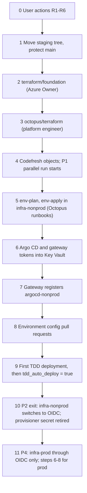

# Bootstrap guide

Ordered steps that take the platform from nothing to automatic TDD deployments, then to prod. Each step names its owner, its inputs, what it creates and how to tell it is done. The design is binding: [design/platform-design.md](../design/platform-design.md) (§5 identities, §7 names, §9 phases, §10 recommendations).

Rules that hold at every step:
- **Prod goes through OIDC only.** The stored `Azure Runtime Provisioner` secret is used by `workorders-infrastructure` runbooks in `infra-nonprod` during phases 1–2 and nowhere else: never in `infra-prod`, the `workorders` project, Codefresh, Argo CD or a cluster (ADR-C10).
- **Git carries no secret.** Tokens and keys go straight into Key Vault or an Octopus sensitive variable. Tokens never pass through pull requests, chat or tickets.
- **Everything else changes by pull request.** The foundation and Octopus Terraform inputs (`foundation.tfvars`, `octopus/terraform/terraform.tfvars`) stay untracked, and the committed `*.tfvars.example` files show their shape. The environment layer's `{nonprod,prod}.tfvars` are the exception, because runbooks read them from Git: non-secret identifiers only (step 2).
- **Nothing here touches the legacy path.** The GitHub Actions → Octopus (legacy space) → Container Apps delivery stays live and unchanged until phase 5.

## Owners

| Owner | Who | Rights used |
|---|---|---|
| User | The account holder who decides the §10 recommendations | GitHub org, Octopus and Codefresh account settings |
| Azure Owner | Human Owner or User Access Administrator, just-in-time through PIM | Role assignments, locks, policy assignments |
| Entra administrator | Human | Groups, app registrations, admin consent |
| Security owner | Member of `@<org>/security-owners` | Reviews `terraform/foundation/**`, `policies/**`, `.gitleaks.toml`; writes Key Vault secrets |
| Platform engineer | Member of `@<org>/platform-owners` and Octopus team `Platform Engineers` (Space Manager) | `octopus/terraform` apply, Codefresh administration, runbook starts, pull requests |
| Octopus | Runbooks `env-plan`, `env-apply`, `env-destroy` | `Azure.LifecycleAccount` for the target infrastructure environment |
| Argo CD | `argocd-nonprod`, `argocd-prod` | Reconciles what `main` holds |
| Release manager | Octopus team `Release Managers` | Deploys releases; first promotions |

## Order at a glance

## 0. User actions R1–R6 (before phase 1)

Owner: **User**. Nothing below starts until these are done or explicitly declined.

| # | Action | Why |
|---|---|---|
| R1 | Install the Claude GitHub App on `clearmeasure-aisf-sample-apps` (at least `basic-environment-octopus-codefresh`) and attach the repo to a session. | The staged tree cannot reach its home, and the integration review cannot run there. |
| R2 | Make the environment repo private or internal. | Push rulesets that restrict file paths need it (E31); host and vault names aid reconnaissance. |
| R3 | Narrow the Octopus Git credential `GitHub clearmeasure-aisf-sample-apps` to `https://github.com/clearmeasure-aisf-sample-apps/basic-environment-octopus-codefresh*`, backed by a machine user in team `platform-bots` (or a GitHub App), 90-day expiry. | Today it writes to every repo in the org; ruleset bypass names teams, not users. |
| R4 | Restrict the Octopus account `Azure Runtime Provisioner` to environment `infra-nonprod`. | A subscription-wide Contributor bearer secret must not reach prod. |
| R5 | Keep Codefresh contexts `azure-runtime-provisioner` and `github-aisf-sample-apps-token`, and the Octopus variable set `GitHub AISF Sample Apps`, attached to nothing. | Branch-controlled YAML could exfiltrate anything attached. |
| R6 | Arrange an Azure Owner (PIM) and an Entra administrator for steps 2 and 10–11. | Contributor cannot create role assignments, locks or policies (E36). |

Decide at the same time, because later steps depend on them: R7 (Octopus license tier), R9 (two Codefresh runtimes), R10 (ACR tokens), R11 (read-only GitHub App for Argo CD), R15 (separate OpenAI keys for CI and TDD), R16 (optional GitHub App for the `platform/tdd` status).

## 1. Move the staging tree and protect `main`

Owner: **Platform engineer**, with the **User** for organization settings. Phase 1.

1. Copy `platform/` from the app checkout to the environment-repo root in one commit; remove `platform/` from the app repo in one commit (R17, ADR-D18).
2. Create teams `platform-owners`, `security-owners` and `platform-bots`; replace `<org>` in `CODEOWNERS`.
3. Add the branch ruleset on `main`: pull request required, code-owner approval required, bypass list = team `platform-bots` only. The required status `codefresh/env-checks` is added in step 4, after the pipeline has reported once.
4. If the repo is private or internal: add the push ruleset that restricts `.octopus/**` on `main` to merged pull requests [VERIFY per-actor semantics, §6.2].

Done when: a test pull request that touches `gitops/workorders/base/` requests review from platform owners, and one that touches `terraform/foundation/` requests security owners.

## 2. Foundation layer

Owner: **Azure Owner** (PIM), with the **Entra administrator**; reviewed by **security owners**. Phase 1.

1. Entra administrator: create the SQL admin groups `<sql-admins-{class}>` and the Argo CD SSO app registration `<argocd-sso-app>` (workload-identity federation preferred, Q15).
2. Azure Owner: fill `terraform/foundation/foundation.tfvars` from `foundation.tfvars.example` (untracked) and apply `terraform/foundation` with local state; then migrate the state to key `foundation.tfstate` in container `tfstate` of `<tfstate-storage-account>` (shared-key access disabled).
3. The apply creates, in `<AZURE_SUBSCRIPTION_ID>`: resource groups `rg-workorders-shared`, `rg-workorders-aks-{nonprod,prod}`, `rg-workorders-{tdd,uat,prod}`; VNets, subnets and private DNS zones; ACR `<acr-name>` with scope maps; Log Analytics `log-workorders`; every UAMI in §5.2; **every role assignment**; the Octopus-issuer federated credentials (issuer `<OCTOPUS_URL>`, no trailing slash); `CanNotDelete` locks on `rg-workorders-prod`, `rg-workorders-aks-prod` and the legacy resource groups; the Azure Policy assignments.
4. Record the outputs (UAMI IDs and client IDs, subnet IDs, private DNS zone IDs, ACR ID, workspace ID, SQL admin group object IDs) as the inputs of the environment layer and of step 8. The `env-*` runbooks read `terraform/environment/#{Environment.Class}.tfvars` from the repo, so these files are created from the `.example` files by pull request and hold non-secret identifiers only; secrets never go in them. Committing them is an open decision recorded in [consistency-notes.md](consistency-notes.md) (R2 makes the repo private first).

Done when: a second `terraform plan` shows no changes, and the locks and role assignments are visible on the resource groups.

## 3. Octopus objects

Owner: **Platform engineer**. Phase 1.

1. Fill `octopus/terraform/terraform.tfvars` from `terraform.tfvars.example` (untracked) with `tdd_auto_deploy = false`, and apply `octopus/terraform` (provider `OctopusDeploy/octopusdeploy` 1.20.0).
2. The apply creates, in `<octopus-space>`: environments `tdd`, `uat`, `prod`, `infra-nonprod`, `infra-prod`; lifecycles `workorders-standard`, `workorders-hotfix`, `workorders-infrastructure`; project group `Work Orders`; projects `workorders` and `workorders-infrastructure`, version-controlled against `<ENV_REPO_URL>` at `.octopus/workorders` and `.octopus/workorders-infrastructure`; channels `Default` and `Hotfix`; feed `acr-workorders` (OIDC through `id-octopus-acr-pull`); accounts `azure-oidc-deploy-{tdd,uat,prod}` and `azure-oidc-env-lifecycle-{nonprod,prod}`; worker pools `k8s-tdd`, `k8s-uat`, `k8s-prod`; library variable sets `WorkOrders Environment` and `WorkOrders Infrastructure`; teams, the user role `CI Release Publisher`, service accounts `svc-codefresh-release` (OIDC identity `codefresh-release-master`) and `svc-argocd-gateway`; freeze `prod-weekend-freeze`.
3. The stored objects are looked up by name, never created: account `Azure Runtime Provisioner`, Git credential `GitHub clearmeasure-aisf-sample-apps`, variable sets `Azure Runtime Provisioning` and `GitHub AISF Sample Apps`.
4. Set `Provisioner.SecretExpiresOn` (ISO date) by pull request to `.octopus/workorders-infrastructure/variables.ocl`.

Done when: both projects load their process, variables and runbooks from `main` without validation errors; the process shows twelve steps; neither stored variable set is included in a project.

## 4. Codefresh objects

Owner: **Platform engineer**. Phase 1 starts when this step completes.

1. Runtimes `<cf-runtime-ci>` and `<cf-runtime-release>` on separate node pools of the runner cluster `<aks-cluster-context>`; the release pool is tainted; neither runs on an app cluster (R9, ADR-D17).
2. Registry integrations `acr-workorders-release`, `acr-workorders-preview` and `acr-platform-ci`, each with a repository-scoped ACR token that expires in 90 days or less (R10). The existing default registry integration's credential is not reused.
3. Contexts: `workorders-ci` (secret: `CI_SQL_SA_PASSWORD`, a throwaway for the service container; `AI_OPENAI_APIKEY`, `AI_OPENAI_URL`, `AI_OPENAI_MODEL`, a CI-only low-budget key per R15) and `workorders-release` (config: `OCTOPUS_URL`, `OCTOPUS_SPACE`, `OCTOPUS_PROJECT=workorders`, `OCTOPUS_SERVICE_ACCOUNT_ID`, `ACR_REGISTRY=<acr-name>.azurecr.io`).
4. Projects `workorders` and `platform-env`; pipelines from their specs with `codefresh create pipeline -f <spec>`: `app:.codefresh/specs/workorders-{ci,release,ci-image}.yml` and `codefresh/specs/platform-env-checks.yml` (`workorders-preview.yml` waits for phase 6).
5. Confirm that `azure-runtime-provisioner` and `github-aisf-sample-apps-token` are attached to no pipeline (R5).
6. Run `workorders/ci-image` once; set `StepImage.CiDotnet` to the resulting `<acr-name>.azurecr.io/platform/ci-dotnet:<ci-image-version>` by pull request.
7. Run a first `workorders/release` build and copy the exact OIDC `sub` claim into the `codefresh-release-master` identity, wildcarding only the user segment [VERIFY]; re-apply `octopus/terraform`.
8. After `platform-env/env-checks` has reported once, add `codefresh/env-checks` as a required status in the `main` ruleset.

Done when: a master merge produces exactly one Octopus release `2.5.<n>` with build information and the `app-commit:` line in its notes; re-running the build creates nothing new; no Octopus API key exists in any pipeline.

## 5. Environment layer in `infra-nonprod`

Owner: **Platform engineer** starts and approves; **Octopus** runs. Phase 2 starts here.

Inputs:
- `Azure.LifecycleAccount` for `infra-nonprod` = `azure-runtime-provisioner` (phases 1–2 only).
- A fresh, short-lived `Octopus.WorkerRegistrationToken`, entered as a sensitive variable just before the run.
- The read-only repo credential for Argo CD (R11), passed once as the bootstrap Terraform variable.

Steps:
1. Run `env-plan` in `infra-nonprod`; review the saved plan artifact.
2. Run `env-apply` in `infra-nonprod`: plan → manual intervention (always) → apply → `configure-db-principals-tdd` and `configure-db-principals-uat` on `k8s-tdd` and `k8s-uat`.
3. The apply creates `aks-workorders-nonprod` (Free tier, workload identity, OIDC issuer, Azure RBAC, local accounts off), the tdd and uat SQL servers and databases, the Key Vaults, App Insights, the workload federated credentials, the Argo CD bootstrap (`argo-cd` and `argocd-apps`, which creates `platform-root`), and the Octopus workers in `octopus-worker-tdd` and `octopus-worker-uat`. It writes `workorders-appinsights-connection-string`, `workorders-sql-migrator-password` and, in tdd, `workorders-sql-acceptance-password`.
4. Security owner: write `workorders-ai-openai-apikey` (the TDD key from R15) and `workorders-api-validation-key` into `<kv-workorders-tdd>` and `<kv-workorders-uat>`, and `argocd-repo-read-credential` into `<kv-workorders-platform-nonprod>` so ESO holds the repo secret after bootstrap.

Done when: `platform-root` is Synced on `argocd-nonprod`; the add-ons are Healthy except the gateway, which waits for step 6; workers appear in pools `k8s-tdd` and `k8s-uat`. `workorders-tdd` and `workorders-uat` stay Degraded until step 9, because `0.0.0-bootstrap` images do not exist.

## 6. Argo CD and gateway tokens into Key Vault

Owner: **Platform engineer**.

1. Sign in to `argocd-nonprod` through SSO and generate an API token for the local account `octopus` (`argocd account generate-token --account octopus`). The account can only `get` applications and logs in `workorders-*/*` and `get` clusters.
2. Store it as `argocd-octopus-gateway-token` in `<kv-workorders-platform-nonprod>`.
3. Create an Octopus access token for `svc-argocd-gateway` and store it as `octopus-gateway-registration-token` in the same vault (rotate every 90 days, Q13).

Done when: ESO shows Secrets `argocd-octopus-token` and `octopus-gateway-registration` synced in namespace `octopus-argocd-gateway`.

## 7. Gateway registration

Owner: **Argo CD** (automatic); the **platform engineer** verifies.

1. The add-on Application `octopus-argocd-gateway` turns Healthy once its secrets exist and registers instance `argocd-nonprod` for environments `tdd` and `uat`.
2. In Octopus, the instance shows as connected, and Applications `workorders-tdd` and `workorders-uat` map to project `workorders` through their `argo.octopus.com/*` annotations.

Done when: Octopus lists both Applications with their live status. A read-only `octopus` account being enough while Trigger sync is off is [VERIFY] (E7).

## 8. Environment configuration by pull request

Owner: **Platform engineer** authors; **platform owners** review.

1. Copy the environment-layer outputs into `gitops/workorders/envs/{tdd,uat}/config/`: UAMI client IDs on ServiceAccounts `ui-server`, `worker`, `workorders-eso`; vault URLs; SQL server and database names in `ConnectionStrings__SqlConnectionString` (starts with `Server=`); hostnames `<tdd-hostname>`, `<uat-hostname>`; the Gateway parent reference.
2. Put the same values into library variable set `WorkOrders Environment` through `octopus/terraform/terraform.tfvars` and re-apply.
3. Keep Worker `replicas: 0` in every overlay until its phase (ADR-D16).

Done when: `platform-env/env-checks` passes on the pull requests; after merge, ExternalSecret `workorders-app` is synced in `workorders-tdd` and `workorders-uat`.

## 9. First TDD deployment, then automatic TDD

Owner: **Release manager** (first deployment); **platform engineer** (auto-deploy switch).

1. Deploy the latest release to `tdd` from Octopus. Watch: `read-deployment-secrets` → `migrate-database` → `update-argo-cd-image-tags` (commit to `gitops/workorders/envs/tdd/kustomization.yaml`, wait for Synced and Healthy) → `verify-version` → `smoke-test` → `acceptance-tests` → `report-commit-status`.
2. Confirm WI-08 (opt-in destructive reset) is merged before the phase-2 exit; until then the acceptance suite's interlocks are the Octopus ones only (ADR-C11).
3. Set `tdd_auto_deploy = true` in `octopus/terraform` by pull request and re-apply.
4. Keep Kyverno in Audit mode in nonprod.

Done when: the next master merge reaches verified TDD with no human action.

## 10. Phase-2 exit: retire the provisioner secret

Owner: **Security owner** and **platform engineer**.

1. Change `Azure.LifecycleAccount` for `infra-nonprod` to `azure-oidc-env-lifecycle-nonprod` by pull request.
2. Run `env-plan` in `infra-nonprod`; it must show no changes.
3. Delete the provisioner's client secret from Entra, from the Octopus account `Azure Runtime Provisioner` and from the Codefresh context `azure-runtime-provisioner` (R4); delete the unattached stores after phase 2 unless other sample apps need them (R5).

Done when: `provisioner-credential-check` has nothing left to check and every runbook authenticates over OIDC.

## 11. Prod (phase 4): OIDC only

Owner: **Azure Owner** confirms locks; **platform engineer** runs; **security owner** reviews.

1. Preconditions: WI-01, WI-02, WI-03, WI-05 and WI-08 merged; the prod Kyverno overlay in Enforce; impersonation and egress hardening decided.
2. `Azure.LifecycleAccount` for `infra-prod` is `azure-oidc-env-lifecycle-prod` from the first run; the stored provisioner is never scoped to `infra-prod` (`tool-boundaries.sh` and `consistency.sh` check it).
3. Run `env-plan`, then `env-apply` in `infra-prod`. No destroy runbook exists for prod.
4. Repeat steps 6–8 for `argocd-prod`, `<kv-workorders-platform-prod>` and `gitops/workorders/envs/prod/config`, with Worker `replicas: 0` until product sign-off.
5. Continue with the cutover checklist in [cutover-and-decommission.md](cutover-and-decommission.md).
