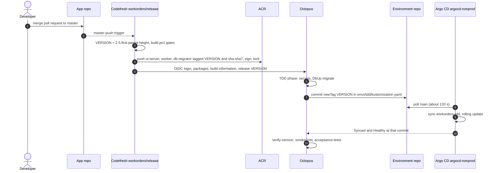

# Lab 18: Follow One Commit to Production

**Curriculum Section:** Sections 06-07 (Operate/Execute & Reporting)
**Estimated Time:** 40 minutes
**Type:** Analyze
**Builds on:** Lab 07 (pull requests), Lab 09 (CI cycle time)

---

## Objective

Trace one merged commit through every handoff of the delivery platform: GitHub → Codefresh → ACR and Octopus → the environment repo → Argo CD → the running pod, then back to the commit. At each handoff, name the tool, the identity it acts as, the artifact it produces and the file that defines the behaviour.

Students hold read-only roles: GitHub, the Codefresh build log, Octopus team `Developers` (view only). No deploy, Argo CD or Azure access is needed. The **offline variant** needs only a checkout of the app repo, with the platform tree at `platform/` (after R17, a checkout of the environment repo, where the same files sit at the root).

## Background

One verb per tool (see [../tool-boundaries.md](../tool-boundaries.md)): Codefresh builds, Octopus releases and deploys by committing tags, Argo CD reconciles. The version string is the thread that ties every artifact together: the same `2.5.<first-parent height>` is the image tag, the Octopus package version, the release number and the value `/_version` reports.



## The handoffs

| # | Handoff | Actor and identity | Artifact | Defined in |
|---|---|---|---|---|
| H1 | Pull request checks | GitHub Actions `build-result` (required); Codefresh `workorders/ci` posts `codefresh/ci` (informational) | Check runs on the PR head | `app:.github/workflows/build.yml`, `app:.codefresh/pipelines/ci.yml` |
| H2 | Version minted | Codefresh `workorders/release` on the release runtime | `VERSION` | `app:.codefresh/scripts/version.sh`, `app:.codefresh/version.env` |
| H3 | Images published | Codefresh, repository-scoped ACR token (`acr-workorders-release`) | `<acr-name>.azurecr.io/workorders/{ui-server,worker,db-migrator}:<VERSION>` and `:sha-<sha7>`, signed, tag-locked | `app:.codefresh/pipelines/release.yml` (`ui_image`, `worker_image`, `migrator_image`, `supply_chain`) |
| H4 | Release created | Codefresh over OIDC as `svc-codefresh-release` | Packages `ChurchBulletin.Database`, `ChurchBulletin.AcceptanceTests`; build information; release `<VERSION>` on channel `Default`, notes starting `app-commit: <sha>` | `release.yml` (`octopus_token` … `octopus_release`); contract §7.7 |
| H5 | TDD deployment starts | Octopus lifecycle `workorders-standard`, phase `TDD` (automatic from phase 2) | Deployment of `<VERSION>` to `tdd` | `octopus/terraform/lifecycles.tf` |
| H6 | Secrets and migration | Octopus on worker pool `k8s-tdd`, account `azure-oidc-deploy-tdd` | DbUp journal rows in the TDD database | `.octopus/workorders/deployment_process.ocl` (`read-deployment-secrets`, `migrate-database`) |
| H7 | Pin commit | Octopus with Git credential `GitHub clearmeasure-aisf-sample-apps` (team `platform-bots`) | One commit on `main` changing two `newTag` lines | `update-argo-cd-image-tags`; `gitops/workorders/envs/tdd/kustomization.yaml` |
| H8 | Reconcile | Argo CD `argocd-nonprod`, Application `workorders-tdd`, read-only repo credential | Rolling update in namespace `workorders-tdd` | `argocd/clusters/nonprod/apps/workorders-tdd.yaml`, `gitops/workorders/base/*.yaml` |
| H9 | Health report | Octopus Argo CD gateway, Argo CD account `octopus` (read-only) | "Argo CD Application is healthy" at the pin commit (timeout 900 s) | `argocd/clusters/nonprod/addons/octopus-argocd-gateway.yaml` |
| H10 | Verification | Octopus on `k8s-tdd` | `verify-version`, `smoke-test`, `acceptance-tests` (TRX artifacts), `report-commit-status` | `deployment_process.ocl` steps 8–12 |

## Steps (online)

### Step 1: Pick a merged commit

Open the app repo's `master` history and pick a recent merge. Record its SHA and the first seven characters.

### Step 2: Compute the version before looking it up

```bash
git fetch --unshallow 2>/dev/null || true   # the checkout may be shallow (F17)
git rev-list --count --first-parent <sha>
cat .codefresh/version.env
```

Predict `VERSION` = `2.5.<count>`. `bash .codefresh/scripts/version.sh --branch master` prints it for `HEAD`.

### Step 3: Find the build of record

In Codefresh, open pipeline `workorders/release` and the build for the SHA. Confirm the exported `VERSION`, the image tags and the `octopus_release` step's output. Compare the build duration with the GitHub `build-linux` job for the same commit.

### Step 4: Open the release in Octopus

Project `workorders` → Releases → `<VERSION>`. Check the channel (`Default`), the package versions (all equal to the release number), the build information (commits `HEAD^1..HEAD`) and the first line of the release notes (`app-commit:`).

### Step 5: Read the TDD deployment

Open the deployment of the release to `tdd`. Note the order of the steps that ran and those that were skipped (prod-only and UAT-only steps). Open the `update-argo-cd-image-tags` log and find the commit it created.

### Step 6: Read the pin commit

In the environment repo, open that commit. Confirm it changes exactly two lines in `gitops/workorders/envs/tdd/kustomization.yaml`:

```diff
-    newTag: "2.5.730"   # written by Octopus only
+    newTag: "2.5.731"   # written by Octopus only
```

(Version numbers are illustrative.) The committer is the machine user in `platform-bots`, the only identity allowed to push to `main` without a pull request.

### Step 7: Close the loop in the app

Open `https://<tdd-hostname>/_version` and the footer of the TDD site. Both show the version; the footer also shows the SHA and environment. Match them against Steps 1–4.

## Offline variant: predict every handoff

Work only from the files. Fill in the **Prediction** column first, then check it against the named file and the answer key.

| # | Question | Prediction | Check in |
|---|---|---|---|
| P1 | For a master commit with first-parent count 731, what is `VERSION`? For a branch commit with count 731 and SHA `a1b2c3d`? | | `app:.codefresh/scripts/version.sh` |
| P2 | Which check must pass before the pull request can merge, and which one is only informational? | | `contracts/platform-contracts.yaml` (`statuses`) |
| P3 | Name the three image repositories and both tags each image gets. | | `contracts/platform-contracts.yaml` (`images`) |
| P4 | Which Octopus project, channel and Git reference does the release use, and why is no Git commit passed? | | §7.7 handoff arguments; ADR-D7 |
| P5 | List the TDD steps in order. Which step would stop the deployment before anything changes in Git? | | `.octopus/workorders/deployment_process.ocl` |
| P6 | Which file and which fields does Octopus change, and what may not change in the same commit? | | `gitops/workorders/envs/tdd/kustomization.yaml`; `scripts/checks/tool-boundaries.sh --audit-bot-commits` |
| P7 | Which Argo CD Application and project pick up the change, from which path, into which namespace? | | `argocd/clusters/nonprod/apps/workorders-tdd.yaml` |
| P8 | Run `kustomize build gitops/workorders/envs/tdd` (from the staged tree). Which exact image reference does the `ui-server` container get? | | Rendered output |
| P9 | Which endpoint do the probes use, and which endpoint does only the smoke step use? Why not the same one? | | `gitops/workorders/base/ui-server.yaml`; ADR-D12 |
| P10 | How does Octopus know Argo CD finished, and how long does it wait? | | `update-argo-cd-image-tags`; `Argo.VerificationTimeoutSeconds` |
| P11 | After acceptance tests pass, what reports back to the app commit, and under which condition? | | `report-commit-status`; `GitHub.StatusEnabled` |

<details>
<summary>Answer key</summary>

- **P1.** `2.5.731`. On a branch: `2.5.731-ci.a1b2c3d`, which is never released.
- **P2.** `build-result` (GitHub Actions) is required; `codefresh/ci` is informational during phases 1–5 (ADR-C6).
- **P3.** `<acr-name>.azurecr.io/workorders/ui-server`, `…/worker`, `…/db-migrator`, each tagged `<VERSION>` and `sha-<sha7>`, both locked; never `latest`.
- **P4.** Project `workorders`, channel `Default`, `GIT_REF: refs/heads/main`. Octopus config-as-code lives in the environment repo, where an app SHA does not resolve; traceability comes from build information and the `app-commit:` line.
- **P5.** `read-deployment-secrets` → `migrate-database` → `update-argo-cd-image-tags` → `verify-version` → `smoke-test` → `acceptance-tests` → `report-commit-status`. A failed `migrate-database` (or secrets read) stops the deployment before the pin commit, so the old version keeps serving.
- **P6.** `gitops/workorders/envs/tdd/kustomization.yaml`, the two `images[].newTag` values. Anything else in a bot commit fails the bot-path audit on `main`.
- **P7.** Application `workorders-tdd`, project `workorders-nonprod`, path `gitops/workorders/envs/tdd`, namespace `workorders-tdd`.
- **P8.** `<acr-name>.azurecr.io/workorders/ui-server:<newTag from the pin file>`; the base declares no tag.
- **P9.** Probes use `/alive` on 8080 (the `self` check only). `/_healthcheck` includes the LLM and `NeedsReboot` checks, so one anonymous request or an Azure OpenAI outage would pull every pod out of service if probes used it.
- **P10.** The step's verification waits until the gateway reports the Application Synced and Healthy at the commit the step created; timeout 900 s, one automatic retry.
- **P11.** `report-commit-status` posts `platform/tdd`, only when `GitHub.StatusEnabled` is `True` (R16), using the SHA from the `app-commit:` line.

</details>

## Expected Outcome

- A completed handoff table for one real commit (online) or for the illustrative commit (offline).
- The ability to answer "what version runs in TDD, who put it there, and from which commit" from Octopus alone.
- Understanding why the version, the image tag, the package version and the release number are one string.

## Discussion

1. Octopus waits for Argo CD's polling (about 120 s) because Trigger sync is off. What does turning it on cost in credentials (E7)?
2. Which single file would a reviewer read to know what runs in TDD right now?
3. Where would a second, conflicting version number come from if Octopus created releases from a feed trigger (incidents EP20, EP21)?
