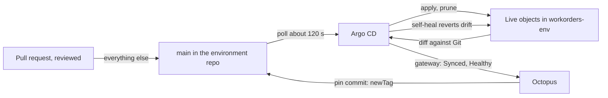

# Lab 21: Drift and Rollback

**Curriculum Section:** Section 06 (Operate/Execute - Recover Quickly)
**Estimated Time:** 40 minutes
**Type:** Experiment
**Builds on:** Lab 10 (stability monitoring), Lab 18 (follow a commit)

---

## Objective

Predict and observe what the platform does when the running state differs from Git (drift), and how a bad release is undone (rollback). For each case, name the tool that detects it, the tool that corrects it, what Git contains afterwards and where the audit trail is.

## Background

- **Git is the truth for Kubernetes.** Every named-environment Application (`workorders-tdd`, `workorders-uat`, `workorders-prod`) syncs automatically with `prune: true` and `selfHeal: true` (ADR-D5). A change made directly in the cluster is reverted; a change merged to `main` is applied.
- **Octopus is the truth for what version runs.** It is the only writer of `images[].newTag` in `gitops/workorders/envs/<env>/kustomization.yaml`. Its deployment history says which release each environment runs, who approved it and when.
- **Rollback is a deployment.** Octopus "redeploy previous release" runs the older release's process again: its migration step has nothing new to run (DbUp is forward-only), its pin commit writes the older tags, and Argo CD rolls the pods back. Argo CD's own rollback is blocked on auto-synced Applications (E40), and self-heal would undo a `kubectl set image`.
- **Break-glass is a reviewed commit.** Emergency changes go through Git, with the procedure in [../runbooks/break-glass.md](../runbooks/break-glass.md); admission exceptions are time-bound `PolicyException` objects behind PIM (ADR-D11).

## Steps (online)

Drills run in `tdd` only, driven by a platform engineer during phase 2 (they are P2 exit drills). Students watch Argo CD with read-only access or the Octopus Live Object Status.

### Step 1: Drift in the cluster

The platform engineer scales `ui-server` in `workorders-tdd` by hand (`kubectl scale deployment/ui-server --replicas=2`). Watch Argo CD mark `workorders-tdd` OutOfSync, then self-heal it back to the replica count in Git. Record the time to correction and where the event appears (Argo CD history; Octopus Live Object Status).

### Step 2: Drift in Git outside Octopus

A pull request that edits `newTag` in `gitops/workorders/envs/tdd/kustomization.yaml` is a break-glass change: it needs platform-owner review, and it makes Git disagree with Octopus's record of what `tdd` runs. Discuss what Octopus shows until the next deployment, and why the bot-path audit does not fire (the author is a person, through a reviewed pull request).

### Step 3: A bad migration

The platform engineer deploys a release whose migration fails in `tdd`. Observe: the deployment stops at `migrate-database`; no pin commit exists; Argo CD has nothing to do; `/_version` still reports the previous version. This is P2 exit drill 3.

### Step 4: Roll back a bad release

The platform engineer deploys a release that passes migration but fails `smoke-test`. Then, in Octopus, **redeploy previous release** to `tdd`. Observe the order: `read-deployment-secrets` → `migrate-database` (no-op) → `update-argo-cd-image-tags` (commits the older tags) → Argo CD rolling update → `verify-version` → `smoke-test` → `acceptance-tests`. Time it; P2 exit drill 5 requires under 15 minutes.

### Step 5: Read the audit trail

For Steps 1–4, find the evidence: Argo CD sync history, the environment-repo commits and their authors, the Octopus deployments and their logs.

## Offline variant: predict every handoff

Work from `argocd/clusters/nonprod/apps/workorders-tdd.yaml`, `gitops/workorders/`, `.octopus/workorders/deployment_process.ocl`, `scripts/checks/tool-boundaries.sh` and `CODEOWNERS`. For each scenario predict: **detected by**, **corrected by**, **Git afterwards**, **audit trail**.

| # | Scenario | Prediction | Check in |
|---|---|---|---|
| D1 | Someone runs `kubectl set image deployment/ui-server ui-server=<acr-name>.azurecr.io/workorders/ui-server:2.5.700` in `workorders-uat`. | | `syncPolicy` of `workorders-uat` |
| D2 | Someone deletes ConfigMap `workorders-config-<hash>` in `workorders-tdd`. | | `prune`, `selfHeal` |
| D3 | A pull request removes the `NetworkPolicy` from `gitops/workorders/base/network.yaml` and is merged. | | `CODEOWNERS`; ADR-D6 |
| D4 | The Octopus machine user pushes a commit to `main` that changes `newTag` and a `replicas` line. | | `tool-boundaries.sh --audit-bot-commits` |
| D5 | An Argo CD user with role `sre-oncall` clicks Rollback on `workorders-tdd`. | | AppProject roles; E40 |
| D6 | Release `2.5.745` fails `smoke-test` in `prod` after its pin commit. What is running, and what does on-call do? | | ADR-D5; §3.2 step 7 |
| D7 | During D6's rollback, which step runs DbUp, and what does it change? | | ADR-C2 |
| D8 | Someone changes a SQL server setting in the Azure portal for `<sql-workorders-uat>`. | | `env-plan` runbook |
| D9 | Someone adds an `argocd-image-updater` annotation to `workorders-prod` in a pull request. | | `tool-boundaries.sh` TB04 |

Answer key

- **D1.** Detected by Argo CD (live differs from Git); corrected by self-heal, which restores the pinned tag. Git is unchanged. Trail: Argo CD history; the Kubernetes audit log names who ran kubectl.
- **D2.** Argo CD recreates the ConfigMap from the generator output in Git (self-heal). Git is unchanged. Pods that need it keep running; new pods start once it exists again.
- **D3.** The merge is the change: platform owners reviewed it (CODEOWNERS on `base/`), and a runtime-behaviour change in `base/` also needs the `all-environments` label. Argo CD prunes the NetworkPolicy in all three environments at once. To roll a change like this through environments, use a component (Lab 19).
- **D4.** The commit lands (the machine user bypasses the ruleset), Argo CD applies it, and the next `platform-env/env-checks` run on `main` fails the bot-path audit and alerts. Correction is a reviewed revert; the incident gets a credential review.
- **D5.** Nothing: `sre-oncall` has `get` and logs only, and Argo CD refuses rollback on auto-synced Applications. Rollback is an Octopus deployment.
- **D6.** The new pods may be running (the Application is healthy, but the app is not). On-call redeploys the previous release in Octopus. Kubernetes never runs anything that Git does not name.
- **D7.** `migrate-database` runs DbUp `update` from the older package: every script is already journaled, so it changes nothing. The older code runs on the newer schema, which is why migrations follow expand/contract.
- **D8.** Argo CD cannot see it. The next `env-plan` in `infra-nonprod` shows the difference; `env-apply` restores the Terraform state, or the change is made permanent through a reviewed pull request to `terraform/environment`.
- **D9.** `platform-env/env-checks` fails on TB04 (no Image Updater), so the pull request cannot merge: the ruleset requires `codefresh/env-checks`.

## Expected Outcome

- A table of drift and rollback cases with detector, corrector, Git state and trail.
- A measured rollback time from the drill (online) or a predicted one with its steps (offline).
- The reflex that rollback is "redeploy previous release" in Octopus, never a cluster command.

## Discussion

1. Why does self-heal make `kubectl` edits useless in named environments, and why is that desirable?
2. What would change if prod used manual sync? Which of the scenarios above would behave differently?
3. How does the bot-path audit compensate for a public repository that cannot use push rulesets (E31)?
