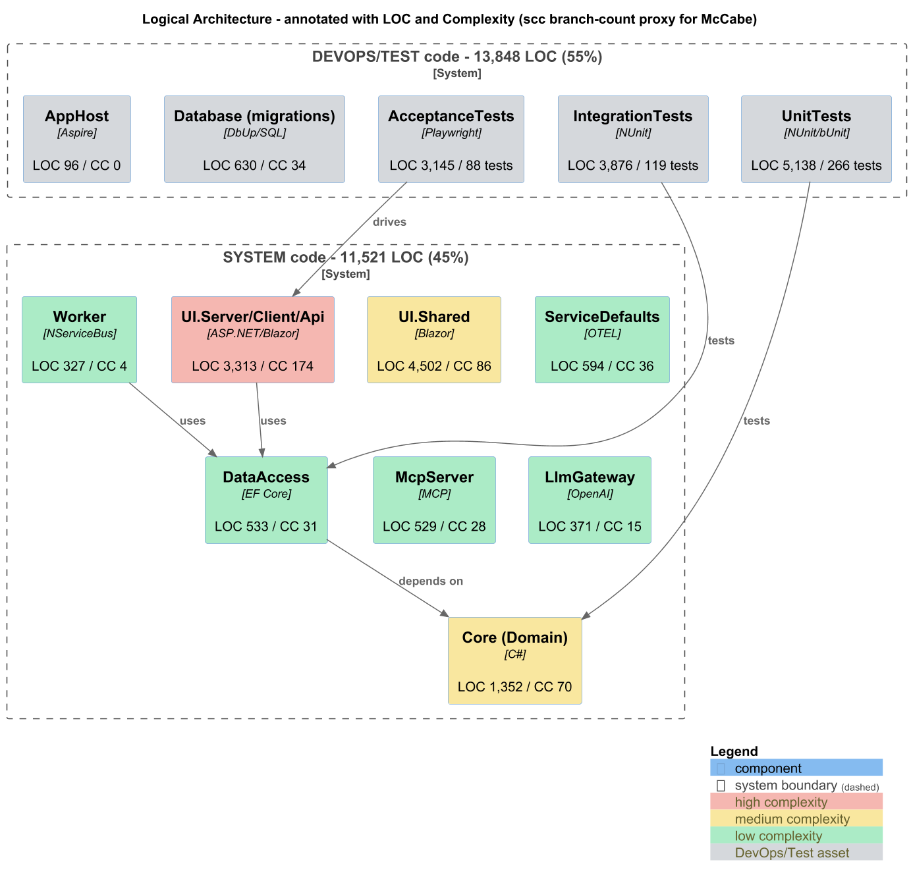
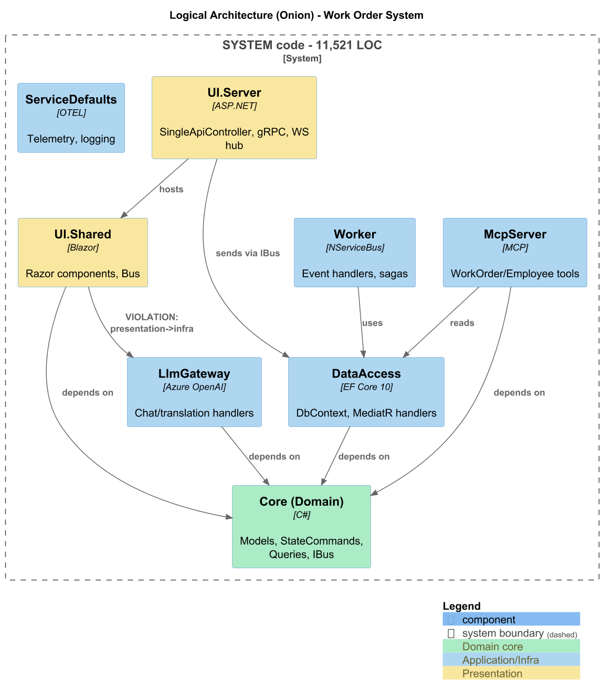
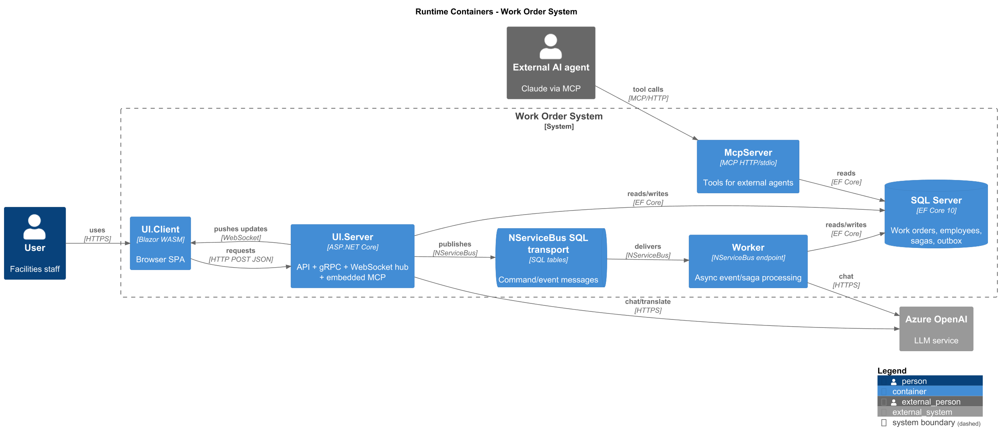
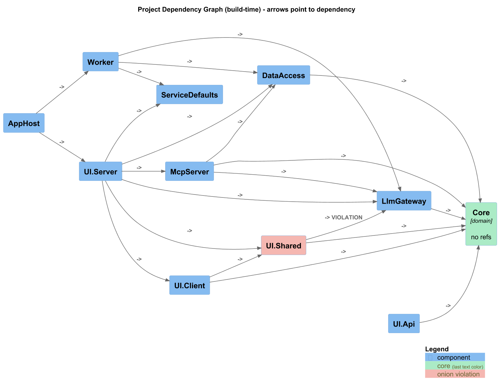
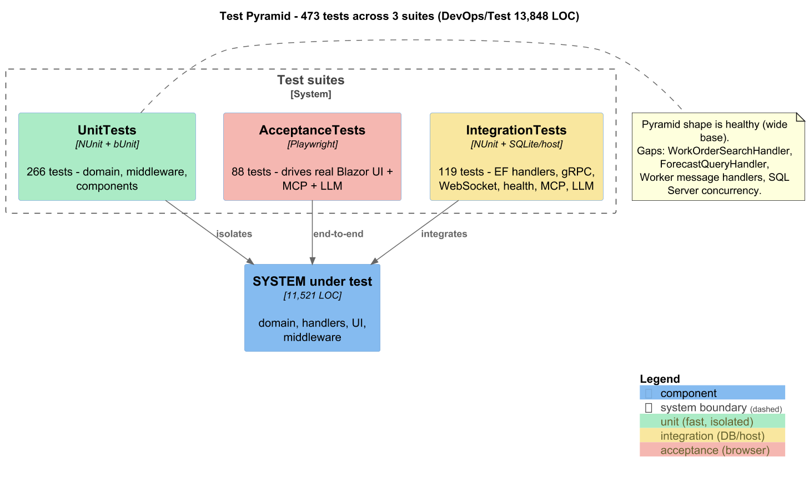
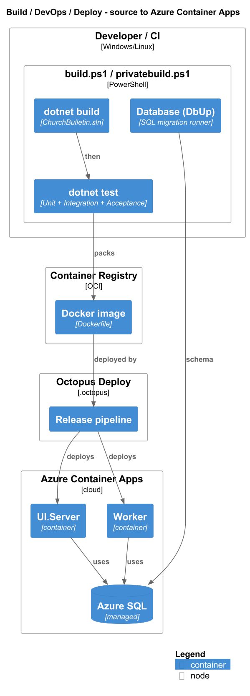

# Codebase Cartography Audit — Work Order System (`bootcamp-palermo-workorders`)

**Audited:** 2026-07-16 · **Solution:** `src/ChurchBulletin.sln` · **Stack:** .NET 10, Onion Architecture, Blazor (WASM + Server), EF Core 10, SQL Server, MediatR/CQRS, NServiceBus, Lamar DI, Azure Container Apps.

This is a self-contained audit: architecture map + measured metrics + function-point size + economic valuation + a principle-linked defect backlog. Every number traces to a tool command; every defect cites `file:line`.

---

## 1. How to reproduce

| Tool | Version | Purpose | Command |
|---|---|---|---|
| scc | 3.4.0 | LOC / complexity | `scc <dirs> --exclude-dir bin,obj,.vs,...` |
| dotnet-script | 1.5.0 | FP + valuation math | `dotnet-script metrics/functionpoints.csx` / `valuation.csx` |
| PlantUML | 1.2024.7 (C4 stdlib) | diagrams | `java -jar plantuml.jar -tpng -o images diagrams/*.puml` |
| grep | — | test-attribute counts | `grep -rE "^\s*\[Test\b" src/<TestProj>` |

Raw tool output is in `metrics/`; diagram sources in `diagrams/`; rendered PNGs in `images/`.

**Exclusions (non-authored code, kept out of every LOC/FP/cost tally):**
- Generated protobuf: `src/UI/Server/Generated/Protos/*.cs` — 1,405 LOC (Workorders.cs alone = 1,248 LOC, complexity 280).
- Coverage reports: `**/coverage.cobertura.xml` (~87k lines), `src/*/coverage.json` (~26k lines).
- `bin/`, `obj/`, `.vs/`, `.learningtransport/`, `TestResults/`, nested clone dirs (`bootcamp-palermo-workorders-fresh`, `-master-fresh`).

---

## 2. Executive summary

**Overall health: good.** This is a disciplined, well-layered Onion/CQRS system with a genuinely healthy test pyramid (266 unit / 119 integration / 88 acceptance = **473 tests**, roughly 1.1× as much test code as system code). It does not exhibit the usual AI-generated pathologies (god classes, copy-paste sprawl, missing tests). The defects found are localized and mostly cheap to fix.

**Systemic issues (3):**
1. **Silent exception swallowing** in 4 infrastructure spots (telemetry writer, translation, MCP tool provider, WebSocket hub) — production failures will be invisible. *Highest-leverage fix.*
2. **One onion violation** — `UI.Shared` (presentation) references `LlmGateway` (infrastructure) directly. Contained, but it is the one wrong-direction arrow.
3. **Magic-number duplication** — field lengths (`4000`, `7`) and JSON options are hardcoded in multiple places (domain + mapping), risking silent desync.

**Single highest-leverage fix:** replace the four empty `catch {}` blocks with structured logging + a failure metric. It is small, low-risk, and removes the biggest production-diagnosability hole.

**Size & value (System, headline):** ~**155 function points**; full-lifecycle replacement cost ≈ **$363k** (Jones 0.32 FP/staff-day, blended-median engineer cost). Coding-centric best case ≈ $39k. See §4.

---

## 3. Architecture

### 3.1 Logical (annotated with LOC + complexity)

*Visually inspected — legible, no clipping/overlap.* The heat map shows complexity concentrates in the presentation tier: **UI.Server/Client/Api** (CC 174) and **UI.Shared** (CC 86) dominate, while the domain **Core** (CC 70) and the application services are individually small. There is no runaway god-component. Note the category split: authored System code (11,521 LOC) is actually *smaller* than the DevOps/Test code (13,848 LOC).

### 3.2 Logical (Onion layering)

*Inspected — legible.* Dependencies flow inward to **Core (Domain)**. DataAccess, LlmGateway, McpServer all depend on Core; UI hosts UI.Shared and sends through `IBus`. The one wrong-direction arrow (`UI.Shared -> LlmGateway`) is labelled as a violation.

### 3.3 Runtime containers

*Inspected — legible.* Four runtime processes: **UI.Server** (ASP.NET — API + gRPC + WebSocket hub + embedded MCP), **Worker** (NServiceBus endpoint, async/saga), **McpServer** (external-agent tools), all over **SQL Server** (also the NServiceBus transport). External: **Azure OpenAI** and external AI agents via MCP.

### 3.4 Dependencies (build-time)

*Inspected — legible.* Core has no references (correct innermost ring). The single onion violation (`UI.Shared -> LlmGateway`, red) is the only wrong-direction edge; no cycles.

### 3.5 Testing

*Inspected — legible.* Healthy pyramid: wide unit base, moderate integration middle, thin acceptance top.

### 3.6 Build / DevOps / Deploy

*Inspected — legible.* `build.ps1` → compile → test → DbUp migration → Docker image → Octopus release → Azure Container Apps (UI.Server + Worker) over Azure SQL.

---

## 4. Inventory & metrics

### 4.1 LOC by category (reconciled)

Σ(components) is reconciled against each subtotal; non-authored code is excluded (§1).

| Category | Component | LOC (code) | Complexity |
|---|---|--:|--:|
| **System** | UI.Shared | 4,502 | 86 |
| | UI (Server/Client/Api, excl. generated) | 3,313 | 174 |
| | Core (Domain) | 1,352 | 70 |
| | ServiceDefaults | 594 | 36 |
| | DataAccess | 533 | 31 |
| | McpServer | 529 | 28 |
| | LlmGateway | 371 | 15 |
| | Worker | 327 | 4 |
| | **System subtotal** | **11,521** | **444** |
| **DevOps/deploy** | Database (DbUp migrations + CLI) | 630 | 34 |
| | Build scripts (PowerShell) + Dockerfile + AppHost | 897 | 148 |
| | **DevOps subtotal** | **1,527** | ~182 |
| **Test** | UnitTests (C#) | 5,138 | 63 |
| | IntegrationTests (C#) | 3,876 | 110 |
| | AcceptanceTests (C#) | 3,145 | 174 |
| | **Test subtotal** | **12,159**¹ | **347** |
| | **GRAND TOTAL (authored)** | **25,207** | |
| **Excluded** | Generated protos + coverage reports | ~114k | — |

¹ Test subtotal is C# only; +162 MSBuild = 12,321 total test LOC. **Reconciliation:** System 11,521 + DevOps 1,527 + Test 12,321 = **25,369** authored LOC. The initial whole-`src` walk reported ~52k — the ~27k gap was phantom LOC from coverage.cobertura.xml/coverage.json artifacts, now attributed and excluded (the #2 output-fidelity trap, caught).

- **Classes (System):** 207 · **Complexity (System C#):** 392 → **avg ~1.9 per class** (very low; no god classes).
- **Complexity note:** scc's "complexity" is a branch-keyword count, used here as a reproducible McCabe proxy (true per-method McCabe was not separately tooled).

### 4.2 Top files by complexity (System)

| File | Code | Complexity |
|---|--:|--:|
| `Core/Import/WorkOrderBulkImportCsvParser.cs` | 158 | 32 |
| `UI/Server/.../ApiKeyAuthenticationMiddleware.cs` | 92 | 22 |
| `ServiceDefaults/LocalTelemetryFileWriter.cs` | 215 | 21 |
| `UI.Shared/Pages/WorkOrderManage.razor.cs` | 163 | 20 |
| `McpServer/Tools/WorkOrderTools.cs` | 185 | 19 |
| `UI/Server/.../IdempotencyMiddleware.cs` | 209 | 17 |
| `UI/Server/.../WorkOrdersBulkImportController.cs` | 107 | 14 |
| `LlmGateway/WorkOrderReformatAgent.cs` | 89 | 12 |
| `UI/Server/Program.cs` | 233 | 11 |
| `Core/Model/WorkOrderStatus.cs` | 109 | 10 |

*(The generated `Workorders.cs` at complexity 280 is excluded as non-authored.)*

### 4.3 Function points (IFPUG + Capers Jones backfiring)

Computed by `metrics/functionpoints.csx` (output embedded verbatim):

### IFPUG function-type table

| Function type | Count | Complexity | Weight | FP |
|---|--:|:--:|--:|--:|
| EI  (External Input) | 11 | average | 4 | 44 |
| EO  (External Output) | 5 | average | 5 | 25 |
| EQ  (External Inquiry) | 8 | average | 4 | 32 |
| ILF (Internal Logical File) | 4 | average | 10 | 40 |
| EIF (External Interface File) | 1 | average | 7 | 7 |
| **UFP total** | | | | **148** |

Basis: **EI** = 6 state transitions + attachment add + CSV bulk import + telemetry ingest + AI chat submit + reformat. **EO** = weather forecast, detailed health report, translation, AI chat response, auto-reformat (all derived). **EQ** = WO-by-number, WO search/spec, WO attachments, employee-all, employee-by-user, 2× diagnostics, MCP reference. **ILF** = WorkOrder(+attachment/status), Employee(+role), Telemetry, NServiceBus saga/outbox — *aggregate roots, not per-table*. **EIF** = Azure OpenAI/LLM read. Data functions (47 FP) < transaction functions (101 FP) → sanity check passes (not table-counting).

### General System Characteristics (VAF)

| # | Characteristic | Rating (0-5) | Justification |
|--:|---|:--:|---|
| 1 | Data communications | 4 | HTTP + WebSocket + gRPC + NServiceBus SQL transport |
| 2 | Distributed processing | 4 | separate Worker endpoint + standalone MCP server + Blazor WASM client |
| 3 | Performance | 2 | output caching + rate limiting present, not perf-critical |
| 4 | Heavily-used configuration | 2 | standard appsettings, no heavy config-driven behavior |
| 5 | Transaction rate | 2 | internal LOB volumes |
| 6 | Online data entry | 4 | interactive Blazor forms are the primary UX |
| 7 | End-user efficiency | 3 | nav rail, dark mode, search, responsive |
| 8 | Online update | 4 | real-time WebSocket state push to clients |
| 9 | Complex processing | 3 | state machine, idempotency, LLM orchestration |
| 10 | Reusability | 3 | onion layers + shared component library |
| 11 | Installation ease | 2 | DbUp migrations + container image |
| 12 | Operational ease | 3 | health checks, OTEL, local telemetry writer |
| 13 | Multiple sites | 1 | single deployment target |
| 14 | Facilitate change | 3 | CQRS + DI decouple change |
| | **Sum GSC** | **40** | VAF = 0.65 + 0.01×40 = **1.05** |

**UFP = 148 · VAF = 1.05 · AFP = 155 FP** (System, IFPUG; AFP carried into Module 12).

### Backfiring (Capers Jones, physical→logical ÷1.35)

**System**

| Language | Physical LOC | LOC/FP (logical) | equiv FP |
|---|--:|--:|--:|
| C# | 6635 | 54 | 91.0 |
| Razor | 1407 | 40 | 26.1 |
| CSS | 2556 | 40 | 47.3 |
| Other(config/proto) | 923 | 40 | 17.1 |
| **Subtotal** | | | **181.5** |

**DevOps/deploy**

| Language | Physical LOC | LOC/FP (logical) | equiv FP |
|---|--:|--:|--:|
| C# | 319 | 54 | 4.4 |
| Powershell | 836 | 40 | 15.5 |
| SQL | 90 | 18 | 3.7 |
| Other(json/msbuild/docker) | 282 | 40 | 5.2 |
| **Subtotal** | | | **28.8** |

**Test**

| Language | Physical LOC | LOC/FP (logical) | equiv FP |
|---|--:|--:|--:|
| C# | 12159 | 54 | 166.8 |
| MSBuild | 162 | 40 | 3.0 |
| **Subtotal** | | | **169.8** |

System backfired = 181.5 FP (sensitivity band 91..272).

### System reconciliation (IFPUG vs backfiring)

- IFPUG UFP = 148; AFP = 155 · Backfired System = 181.5
- Divergence vs UFP = **+22.6% → AGREE (≤30%)**. The modest backfiring-over-IFPUG gap reflects verbose CSS/markup, not hidden functionality.

### FP subtotals + total

| Category | FP | Share |
|---|--:|--:|
| System (IFPUG AFP) | 155 | 44% |
| DevOps/deploy (equiv, backfired) | 29 | 8% |
| Test (equiv, backfired) | 170 | 48% |
| **Total** | **354** | 100% |

System LOC/FP = 11,521 / 155 = **74.3** (vs C# Jones ~54 logical; the difference is physical-vs-logical inflation + markup, not bloat).

### 4.4 Economic valuation

Computed by `metrics/valuation.csx` (output embedded verbatim). Salaries looked up live 2026-07 — BLS median **$133,080**, Glassdoor avg **$122,562**, PayScale **$83,201** (early-career-heavy, down-weighted); blended median base **$120,000** × burden 1.5–1.75.

Blended base $120,000 × burden 1.5–1.75 / 260 = fully-loaded day rate **$692–$808** (mid $750).

### Effort by productivity band (man-days = FP ÷ FP-per-day; ~22 md/month)

| FP/man-day | Level | LOC/day equiv | System md | DevOps md | Test md |
|--:|---|--:|--:|--:|--:|
| 0.32 | Jones full-lifecycle baseline (recommended headline) | 24 | 484 | n/a (in System) | n/a (in System) |
| 0.50 | below baseline (large / high-ceremony) | 37 | 310 | 58 | 340 |
| 1.00 | coding-centric / well-run | 74 | 155 | 29 | 170 |
| 2.00 | high-performing small team | 149 | 78 | 15 | 85 |
| 3.00 | elite / best-in-class | 223 | 52 | 10 | 57 |

### Cost by band (man-days × fully-loaded day rate, mid $750)

| FP/man-day | Level | System $ | DevOps/Test $ | Total $ (coding-centric) |
|--:|---|--:|--:|--:|
| 0.32 | Jones full-lifecycle baseline (recommended headline) | $363k | n/a (in System) | n/a (in System) |
| 0.50 | below baseline (large / high-ceremony) | $232k | $298k | $531k |
| 1.00 | coding-centric / well-run | $116k | $149k | $266k |
| 2.00 | high-performing small team | $58k | $75k | $133k |
| 3.00 | elite / best-in-class | $39k | $50k | $88k |

The Total column is **coding-centric only** (each body of code as a separate build effort); the 0.32 full-lifecycle row's DevOps/Test + Total cells are "n/a (in System)" because Jones' lifecycle rate already includes writing the system's tests.

**Anchors:**
- **Full-lifecycle replacement (headline, System only): $363k** (Jones 0.32 FP/day; includes requirements→design→code→test→docs→PM).
- Coding-centric best case (System, elite 3 FP/day): $39k.
- **Headline range: $39k (elite coding) .. $363k (full-lifecycle).**

**Schedule sanity:** calendar months ≈ FP^0.34 = 155^0.34 ≈ **5.6 months**; full-lifecycle effort 22 staff-months → implied team ≈ **4 people** (plausible).

*Caveat: replacement/build-cost estimate, order-of-magnitude — NOT market value. Maintainability debt (§5) makes changing the code cost more per FP than a clean rebuild.*

**Citations:** Capers Jones, *Software Economics and Function Point Metrics* (IFPUG, 2017) & *Applied Software Measurement, 3rd ed.* (full-lifecycle ≈7 FP/staff-month); Steve McConnell, *Software Estimation: Demystifying the Black Art* (order-of-magnitude productivity spread). Salaries: [BLS Software Developers](https://www.bls.gov/ooh/computer-and-information-technology/software-developers.htm), [PayScale](https://www.payscale.com/research/US/Job=Software_Developer/Salary), [Glassdoor](https://www.glassdoor.com/Salaries/software-developer-salary-SRCH_KO0,18.htm) (accessed 2026-07-16).

---

## 5. Prioritized findings

Each finding once, under its most-specific principle. Full evidence in `metrics/` agent notes.

### [Critical] Silent exception swallowing across infrastructure
- **Principle:** Resilience anti-pattern / inconsistent error handling (Module 7)
- **Locations:** `ServiceDefaults/LocalTelemetryFileWriter.cs:139,155,181,223` · `LlmGateway/TranslationService.cs:34-36` · `McpServer/ToolProvider.cs:59-62` · `UI/Server/Notifications/RealtimeNotificationHub.cs:82-85`
- **Evidence:** bare `catch { /* ignore */ }` / `catch { return text; }` — no log, no metric.
- **Why it hurts:** disk-write, LLM, and WebSocket failures become invisible ghost failures; undiagnosable in production.
- **Fix:** catch specific exceptions, `logger.LogError(ex, ...)`, increment a failure metric; ensure semaphore release in `finally` (ToolProvider).
- **Effort/Risk:** S / low — tests exist around these components.

### [High] Onion violation — UI.Shared → LlmGateway
- **Principle:** Onion Architecture dependency direction (Module 2)
- **Location:** `src/UI.Shared/UI.Shared.csproj:29`
- **Evidence:** presentation project references the infrastructure LLM adapter directly.
- **Why it hurts:** couples the UI component library to the LLM implementation; blocks swapping/abstracting the gateway.
- **Fix:** extract `LlmGateway` public contracts into Core (or an abstractions project); UI.Shared depends on the interface only.
- **Effort/Risk:** M / low.

### [High] Magic-number duplication (field lengths, JSON options)
- **Principle:** DRY / magic number (Module 4)
- **Locations:** `4000` in `Core/Model/WorkOrder.cs:48` + `DataAccess/Mappings/WorkOrderMap.cs:22-23`; `7` in `Core/Services/Impl/WorkOrderNumberGenerator.cs:7` + `WorkOrderMap.cs:20`; `new JsonSerializerOptions { WriteIndented = true }` ×7 in `McpServer/Tools/WorkOrderTools.cs` & `EmployeeTools.cs`.
- **Why it hurts:** schema/domain can silently desync; repeated allocation.
- **Fix:** `WorkOrderConstants` for lengths; one static readonly `JsonSerializerOptions`.
- **Effort/Risk:** S / low.

### [High] Null-check on value type (logic smell)
- **Principle:** Primitive obsession / type safety (Module 1)
- **Location:** `Core/Model/StateCommands/SaveDraftCommand.cs:31` — `WorkOrder.CreatedDate.Equals(null)`.
- **Fix:** `if (WorkOrder.CreatedDate is null)`.
- **Effort/Risk:** S / low.

### [Medium] Contradictory null-handling in smart enum
- **Principle:** Null-safety consistency (Module 1)
- **Location:** `Core/Model/WorkOrderStatus.cs:104-109` — `Array.Find(...)!` null-forgiving *then* `if (match == null)`.
- **Fix:** drop the `!` and keep the guard (or `?? throw`). Standardize `FromCode`/`FromKey`.
- **Effort/Risk:** S / low.

### [Medium] Anemic domain messaging / inconsistent string formatting
- **Principle:** Anemic domain model (Module 5)
- **Locations:** `Core/Model/Employee.cs:48`, `Core/Model/WorkOrder.cs:76`, `DataAccess/Handlers/StateCommandHandler.cs:44` — three different formatting styles for domain messages.
- **Fix:** move message construction into domain methods.
- **Effort/Risk:** M / low.

### [Medium] Fragile manual command registration
- **Principle:** OCP / fragility (Module 1/4)
- **Location:** `Core/Services/Impl/StateCommandList.cs:17-28` — hand-maintained `.Add()` list.
- **Fix:** reflection/DI-based discovery of `IStateCommand`.
- **Effort/Risk:** M / low.

### [Medium] Program.cs mixes concerns
- **Principle:** SRP (Module 1)
- **Location:** `UI/Server/Program.cs` (233 LOC) — middleware + DI + gRPC + NServiceBus + MCP wiring inline.
- **Fix:** extract to `*Extensions` methods; keep Program.cs a thin orchestrator.
- **Effort/Risk:** M / low.

### [Low] Hardcoded RFC URIs / CSS breakpoint / telemetry retention
- **Principle:** Magic string / configuration (Module 4)
- **Locations:** `UI/Server/ProblemDetailsStatusCodePagesExtensions.cs:37-39`; `UI.Shared/MainLayout.razor.cs:13`; `ServiceDefaults/LocalTelemetryFileWriter.cs:210` (`retentionDays = 7`).
- **Fix:** constants / `appsettings.json`.
- **Effort/Risk:** S / low.

---

## 6. Testing assessment

**Pyramid shape: healthy.** 473 tests — Unit 266 (bUnit + NUnit, isolated), Integration 119 (EF via SQLite + WebApplicationFactory hosts, gRPC, WebSocket, health, MCP, LLM), Acceptance 88 (Playwright driving the real Blazor UI + MCP + LLM). Test code (12.3k LOC) ≈ system code (11.5k LOC) — an unusually strong safety net.

**Well covered:** WorkOrder state transitions (unit + integration + acceptance), CSV bulk import, auth/idempotency/rate-limit middleware, MCP tools, LLM gateway, Blazor components.

**Coverage gaps (refactor-safety risks):**
- `WorkOrderSearchHandler` / `WorkOrderSpecificationHandler` — complex LINQ/EF, no isolated unit tests.
- `ForecastQueryHandler` / WeatherForecast — no tests.
- Worker message handlers (`AiBotHandler`, `EventHandler`) — only a tracer-bullet smoke test.
- SQL-Server-specific concurrency/transactions — all integration tests run on in-memory SQLite.
- Speech feature — acceptance-only.

**Refactor-safety verdict:** the Critical/High findings sit in code that *is* covered, so they can be fixed safely now. Before touching search/forecast/worker logic, add **characterization tests** first (flagged in the backlog).

---

## 7. Refactoring backlog (sequenced)

1. **Fix the 4 silent catch blocks** (Critical). Small, covered, immediate production-diagnosability win.
2. **Extract magic-number constants + shared JsonSerializerOptions** (High, DRY). Mechanical.
3. **Fix null-check smells** in `SaveDraftCommand` and `WorkOrderStatus` (High/Medium). Mechanical.
4. **Resolve the onion violation** — extract LlmGateway contracts to Core, repoint UI.Shared (High).
5. **[Characterize first]** Add unit/integration tests for `WorkOrderSearchHandler`, `ForecastQueryHandler`, and Worker handlers — *then* refactor them.
6. **Move domain messaging into the model**; replace manual `StateCommandList` with discovery (Medium).
7. **Split `Program.cs`** into extension methods (Medium).
8. **Externalize hardcoded config** (RFC URIs, CSS breakpoint, telemetry retention) (Low).

---

## Self-check (audit completeness)

- [x] 5-row IFPUG function-type table (§4.3)
- [x] 14-row GSC table + VAF math (§4.3)
- [x] Per-category backfiring tables (§4.3)
- [x] `Σ(components)==subtotal` reconciliation + Excluded bucket (§4.1, footnote ¹)
- [x] Per-band cost table with 0.32 row marked "n/a (in System)" (§4.4)
- [x] System / DevOps-Test / Total for LOC (§4.1), FP (§4.3), cost (§4.4)
- [x] Legibility verdict for each of the 6 PNGs actually opened (§3)
